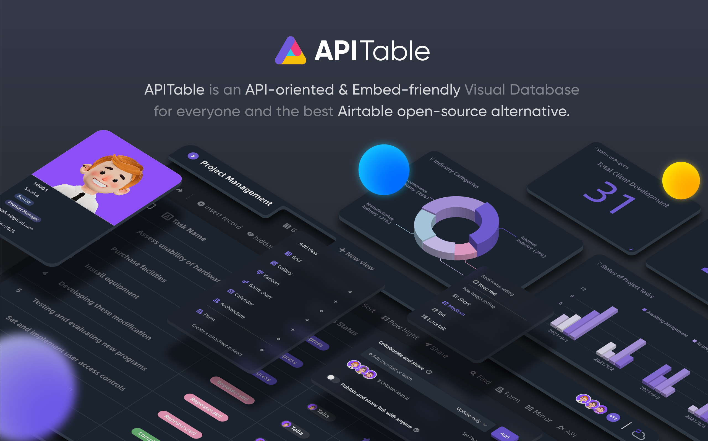
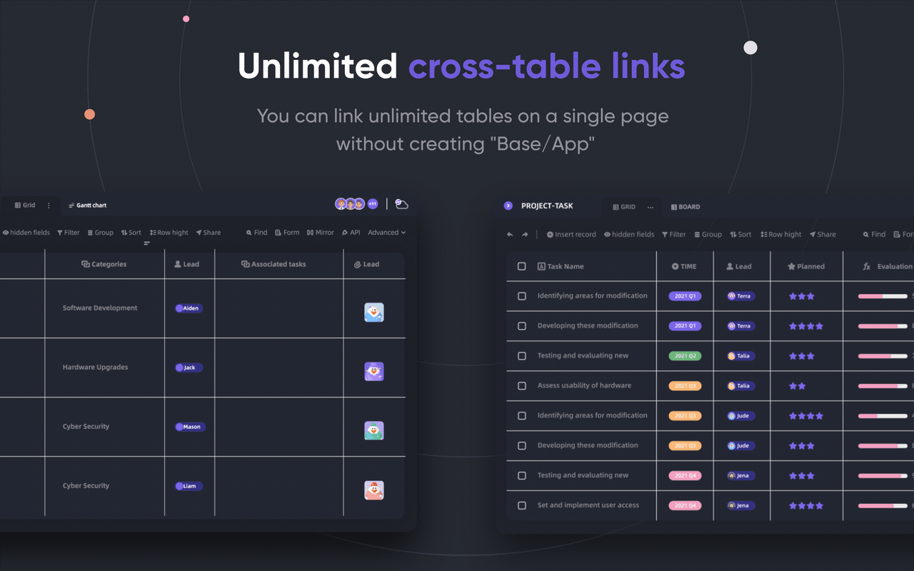
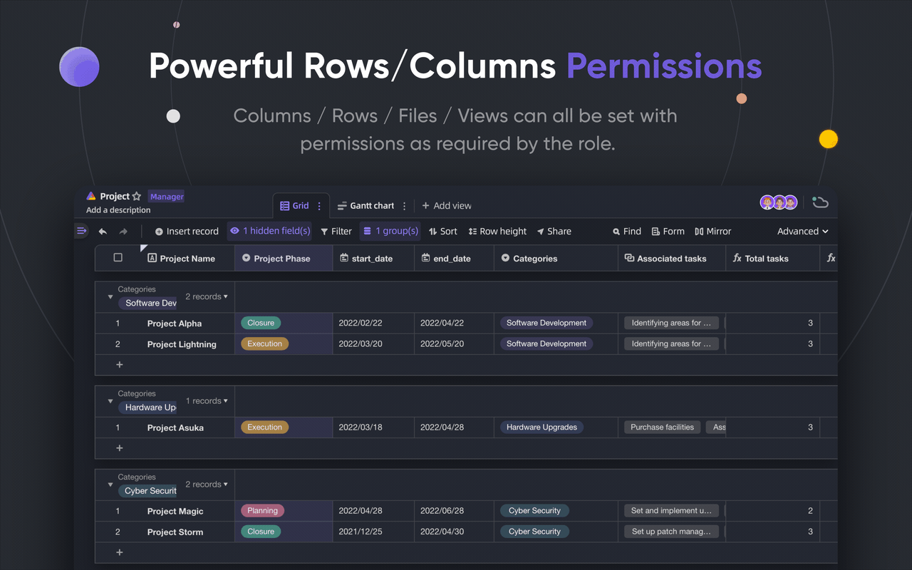
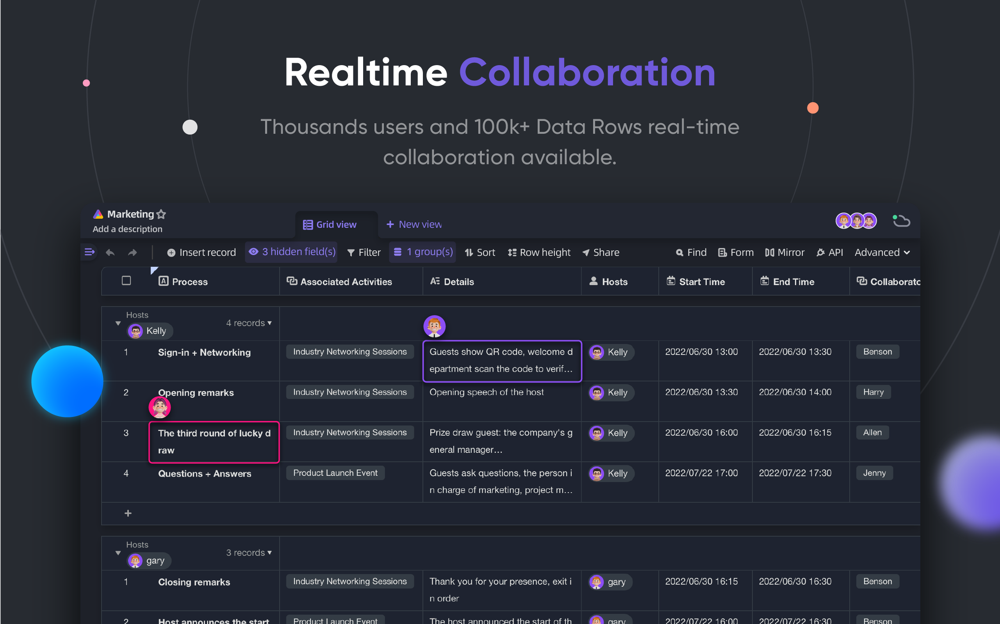
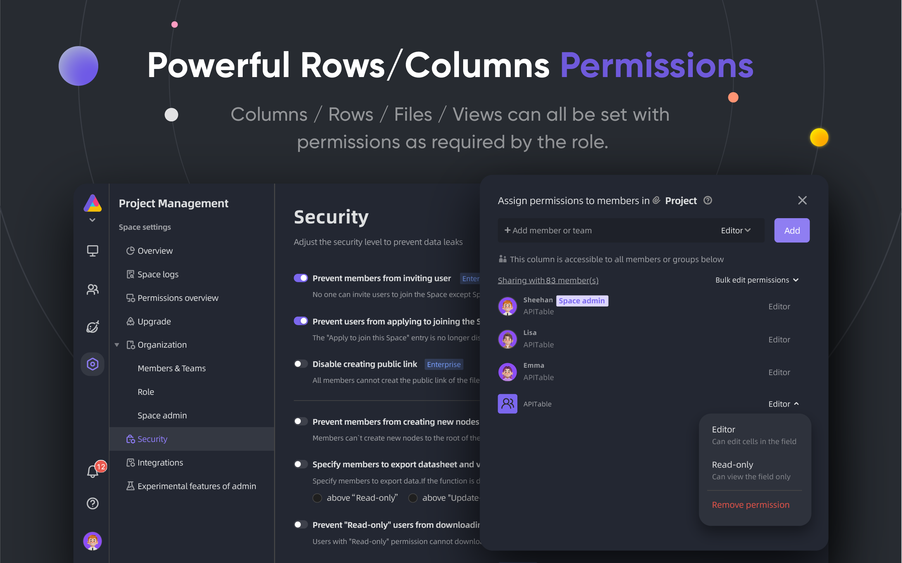
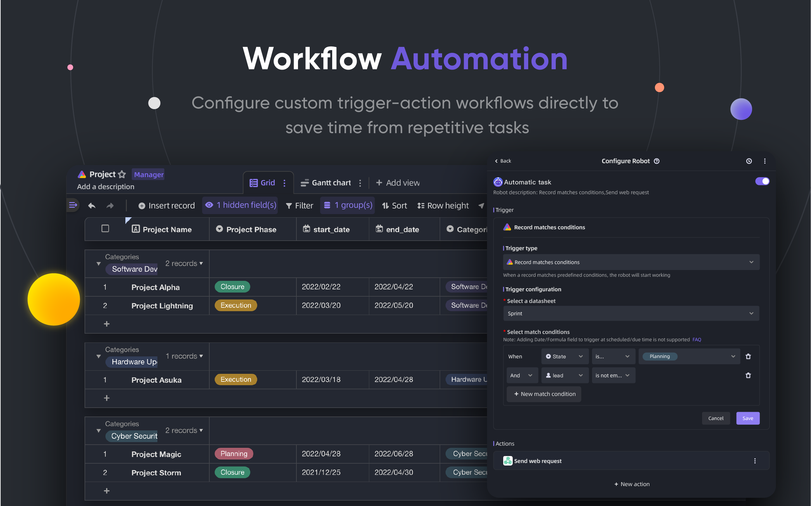
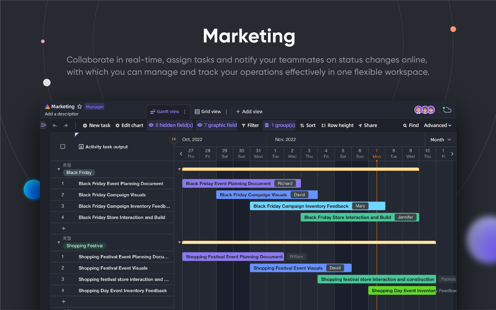
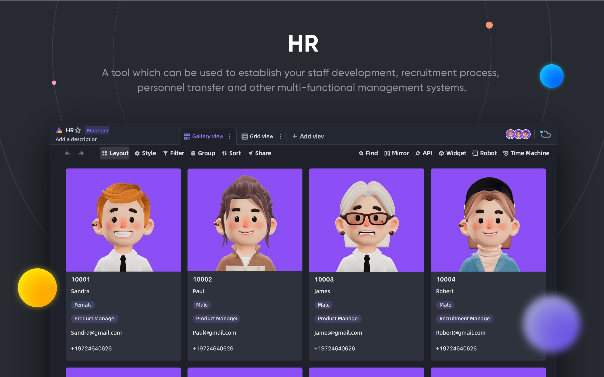
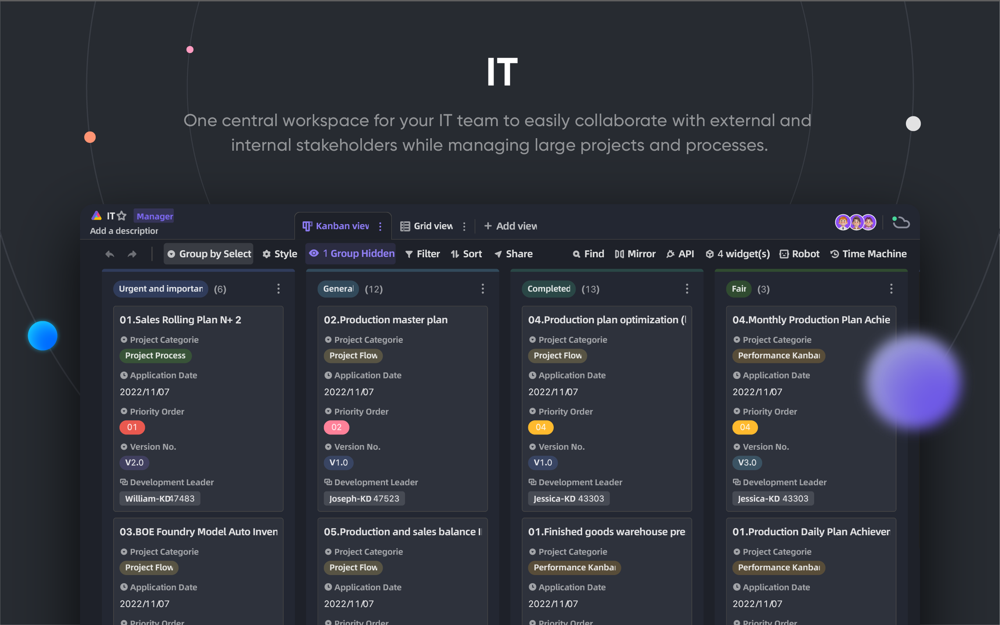

<p align="center">
    <a href="https://apitable.com" target="_blank">
        
    </a>
</p>

<p align="center">
    <!-- Gitpod -->
    <a target="_blank" href="https://gitpod.io/#https://github.com/apitable/apitable">
        
    </a>
    <!-- NodeJS -->
    
    <!-- Java -->
    
    <!-- hub.docker.com-->
    <a target="_blank" href="#installation">
        
    </a>
    <!-- Github Release Latest -->
    <a target="_blank" href="https://github.com/apitable/apitable/releases/latest">
        
    </a>
    <!-- Render -->
    <a target="_blank" href="https://render.com/deploy?repo=https://github.com/apitable/apitable">
        
    </a>
    <br />
    <!-- LICENSE -->
    <a target="_blank" href="https://github.com/apitable/apitable/blob/main/LICENSE">
        
    </a>
    <!-- Discord -->
    <a target="_blank" href="https://discord.gg/TwNb9nfdBU">
        
    </a>
    <!-- Twitter -->
    <a target="_blank" href="https://twitter.com/apitable_com">
        
    </a>
    <!-- Github Action Build-->
    <a target="_blank" href="https://github.com/apitable/apitable/actions/workflows/build.yaml">
        
    </a>
</p>

<p align="center">
  English
  | 
  <a href="docs/readme/fr-FR/README.md">Français</a>
  | 
  <a href="docs/readme/es-ES/README.md">Español</a>
  | 
  <a href="docs/readme/de-DE/README.md">Deutsch</a>
  | 
  <a href="docs/readme/zh-CN/README.md">简体中文</a>
  | 
  <a href="docs/readme/zh-HK/README.md">繁體中文</a>
  | 
  <a href="docs/readme/ja-JP/README.md">日本語</a>
</p>

## ✨ Quick Start

> APITable is currently a `Work In Progress`.
>
> We will publish the first release in late February 2023.
>
> Join [Discord](https://discord.gg/TwNb9nfdBU) or [Twitter](https://twitter.com/apitable_com) to keep in touch.

<!-- If you just want try out APITable[^info], using our hosted version at [apitable.com](https://apitable.com). -->

If you just want to try out APITable[^info], click here for [⚡️Gitpod Online Demo](https://gitpod.io/#https://github.com/apitable/apitable).

If you want to install APITable in your local or cloud computing environment, see [💾 Installation](#installation)

If you want to set up your local development environment, read our [🧑‍💻 Developer Guide](./docs/contribute/developer-guide.md)

## 🔥 Features

<table>
  
  <tr>
    <th>
      <a href="#">Realtime Collaboration</a>
    </th>
    <th>
      <a href="#">Automatic Form</a>
    </th>

  </tr>

   <tr>
    <td width="50%">
      <a href="#">
        
      </a>
    </td>
    <td width="50%">
        <a href="#">
            
        </a>
    </td>
  </tr>

  <tr>
    <th>
      <a href="#">API-first Panel</a>
    </th>
    <th>
      <a href="#">Unlimited cross-table links</a>
    </th>
</tr>

 <tr>
    <td width="50%">
        <a href="#">
            
        </a>
    </td>
    <td width="50%">
      <a href="#">
        
      </a>
    </td>
 </tr>

 <tr>
    <th>
      <a href="#">Powerful Rows/Columns Permissions</a>
    </th>
    <th>
      <a href="#">Embed</a>
    </th>
  </tr>

 <tr>
    <td width="50%">
        <a href="#">
            
        </a>
    </td>
    <td width="50%">
        <a href="#">
            
        </a>
    </td>
  </tr>

</table>

APITable provides a range of amazing features, from the personal to the enterprise.

- Advanced technology stack and open-source
  - `Realtime collaboration` allows multiple users to edit together in real time, or simultaneously with the `Operational Transformation (OT)` Algorithm.
  - Extremely smooth, user-friendly, super-fast database-spreadsheet interface in `<canvas> Rendering Engine`.
  - Database native architecture: Changeset / Operation / Action / Snapshot and so on.
  - **100k+** data rows with real-time collaboration.
  - Full-stack API access, from `Data` to `Metadata`.
  - One-direction / Bi-direction Table Link and `Infinite Cross Links`
  - Community-friendly programming languages and framework, TypeScript ([NextJS](https://nextjs.org/) + [NestJS](https://nestjs.com/)) and Java ([Spring Boot](https://spring.io/projects/spring-boot))
- Beautiful and Rich Database-Spreadsheet UI
  - `CRUD`: Create, Read, Update, Delete the Tables, Columns, and Rows
  - `Fields Operations`: sort, filter, grouping, hide/unhide, height setting.
  - `Space based`: Use separated workspaces in place of App/Base-based structure, make unlimited tables link together possible.
  - `Dark mode` and theme customization available.
  - `7 View Types`: Grid View (Datasheet) / Gallery View / Mindmap View / Kanban View / Full-Feature Gantt View / Calendar View
  - One-click API Panel
- Batteries included
  - Built-in 10+ official templates.
  - Robot Automation and customization available.
  - BI dashboard
  - One-click auto-generated form
  - Shareable and embeddable page.
  - Multi-language support.
  - Integration with n8n.io / Zapier / Appsmith... and more.
- Excellent extensibility
  - Extensible `Widget System` with over 20 officials open-source widgets.
  - Customizable Graph & Chart & Dashboard
  - Customizable Data Column Types
  - Customizable Formulas
  - Customizable Automation Robot Actions.
- Enterprise-grade permissions
  - `Mirror`, turn a View into a mirror to implement Row Permission.
  - Activate `Column Permission` through a very simple operation.
  - Folders / Sub-Folders / Files Permission.
  - Tree structure folders and customizable node (file);
  - Team Management & Organization Structure.
- Enterprise features:
  - SAML
  - Single-Sign-On (SSO)
  - Audit
  - Database Auto Backup
  - Data Exporter
  - Watermark
- ....

With extensible widgets and plugins, you can add more features.

## 💥 Use Cases

Why you must know APITable for your next software?

- As super management software
  - Flexible Project Management & Tasks / Issues Management.
  - Marketing Lead Management.
  - Most flexible and connectable CRM.
  - Flexible Business Intelligence (BI).
  - People-Friendly Forms and Surveys
  - Flexible ERP.
  - Low-code and no-code platform.
  - ...and more, APITable puts 1000 softwares in your pocket.
- As a visual database infrastructure
  - **Embed** APITable into your own software UIs.
  - Visual Database with REST API.
  - Admin dashboard.
  - Central configuration management.
  - All-in-one enterprise database that **connect all** your software.
  - ...and more, APITable connects everything.
- Also, it is open source and extensible

## 💞 API-oriented

#### API UI Panel

Clicking the `API` button in the right corner will show the API Panel

#### SQL-like query

APITable will provides a Datasheet Query Language (DQL) to query your database-spreadsheet contents.

## 💝 Embed-friendly

#### Share and Embed

Share your datasheet table or folder.
Embed them by copying and pasting HTML scripts.

#### Enterprise-ready Embedding

[APITable.com](https://apitable.com) provides more Enterprise-ready Embedding features for securities.

## Installation

Make sure you have `docker` & `curl` installed locally.

If you computer has installed Docker Machine, open your terminal and run this:

```
curl https://apitable.github.io/install.sh | bash
```

Then open [https://localhost:80](https://localhost:80) in your browser to visit it. (default username `admin@apitable.com` and password `Apitable2022`)

If you want to set up your local development environment, read our [🧑‍💻 Developer Guide](./docs/contribute/developer-guide.md)

## 🧑‍💻 Contributing

Welcome, and thank you for your interest in contributing to APITable!

In addition to writing code, there are many ways for you to contribue.

You can contribute as following:
- Join and modify translations in our [Crowdin Translation Project](https://crowdin.com/project/apitablecode/invite?h=f48bc26f9eb188dcd92d5eb4a66f2c1f1555185)
- Create [Issues](https://github.com/apitable/apitable/issues/new/choose)
- Follow our [Twitter](https://twitter.com/apitable_com)
- Create [Documentation](./docs)
- [Contributing Code](./docs/contribute/developer-guide.md)


You can read this repository’s [Contributing Guidelines](./CONTRIBUTING.md) to learn how to contribute.

Here's a quick guide to help you contribute to APITable.


### Development environment

Learn how to set up your local environment, go to our [Developer Guide](./docs/contribute/developer-guide.md).

### Git workflow basic

Here's a general APITable git workflow:

1. Create an issue and describe features you want -> [APITable issues](https://github.com/apitable/apitable/issues)
2. Fork this project -> [Fork APITable project](https://github.com/apitable/apitable/fork)
3. Create your feature branch (`git checkout -b my-new-feature`)
4. Commit your changes (`git commit -am 'Add some features'`)
5. Publish the branch (`git push origin my-new-feature`)
6. Create a new Pull Request -> [Create pull request across forks](https://github.com/apitable/apitable/compare)

### Work conventions

APITable use these common conventions:

- What's our Git branching model? [Gitflow](https://nvie.com/posts/a-successful-git-branching-model/)
- How to collaborate on your fork projects? [Github Flow](https://docs.github.com/en/get-started/quickstart/github-flow)
- How to write good commit message? [Conventional Commits](https://www.conventionalcommits.org/)
- What's our changelog format? [Keep Changelog](https://keepachangelog.com/en/1.0.0/)
- How to versioning and tagging? [Semantic Versioning](https://semver.org/)
- What is the Java Coding Guideline? [Java Coding Guideline](https://google.github.io/styleguide/javaguide.html) | [Intellij IDEA Plugin](https://plugins.jetbrains.com/plugin/8527)
- What is the TypeScript Coding Guideline? -> [TypeScript Style Guide](https://google.github.io/styleguide/tsguide.html) | [ESLint](https://www.npmjs.com/package/@typescript-eslint/eslint-plugin)

### Documentations

- [Help Center](https://help.apitable.com/)
- [👩‍💻 Developer Center](https://developers.apitable.com/)
  - [🪡 REST API Docs](https://developers.apitable.com/api/introduction/)
  - Widget SDK (Coming soon...)
  - Scripting (Coming soon...)

## 🛣 Roadmap

### Future Features

- Heavy-code Interface Builder
- Embbedable 3rd party documentation components
- SQL-like Domain-Specific Languages
- As an IdP
- Advanced automation robot
- Web 3 features
- ...

### Hosted and Enterprise versions offer advanced features

- As an IdP;
- SAML
- Single-Sign-On
- Audit
- Database Backup
- Integrate with ChatGPT, Zapier, Slack, Google Workspace……
- Watermark

For more information, please contact us at <support@apitable.com>.

## 👫 Get Involved

### 🌏 Why we create APITable and open-source?

- We believe that `Database is the cornerstone` of all the software.
- We believe that making a `Visual Database with rich and easy user interface for everyone` can reduce the difficulty of software industry and increase the world's digitalization adoption.
- We believe that open-sourcing `APITable` work can `Push Human Beings Forward`.

### We are hiring remotely!

We always search for good talents for APITable:

- **Full-stack developer**: You have experience with React, NestJS, TypeScript, Spring Boot, Java, Terraform. And you like to write high quality code with clear documentation and unit tests.
- **Back-end developer**: You have experience with NestJS, TypeScript, Spring Boot, Java, SQL, Kubernetes, Terraform. And you like to write high quality code with clear documentation and unit tests.
- **Front-end developer**: You have experience with React, NextJS, TypeScript, WebPack. And you like to write high quality code with clear documentation and unit tests.

Regardless of time and conditions, if you want to get involved to the team of APITable, do not hesitate and send your CV to <talent@apitable.com>.

## 📺 Screenshot

<p align="center">
    
</p>
<p align="center">
    
</p>
<p align="center">
    
</p>
<p align="center">
    
</p>
<p align="center">
    
</p>
<p align="center">
    
</p>
<p align="center">
    
</p>
<p align="center">
    
</p>
<p align="center">
    
</p>
<p align="center">
    
</p>

## 🥰 License

> This repository contains the source code for the Open Source edition of APITable, released under the AGPL.
>
> If you'd like to run your own copy of APITable or contribute to development then this is the place for you.
>
> See [LICENSING](./LICENSING.md) for details.
>
> If you want to use APITable online then you don't need to run this code, we offer a hosted version of the app at [APITable.com](https://apitable.com) which optimized for global accelerator.

<br/>

[^info]: Licensed with AGPL-3.0. Designed by [APITable Ltd](https://apitable.com).
