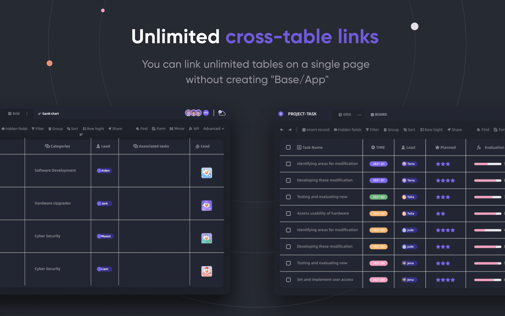
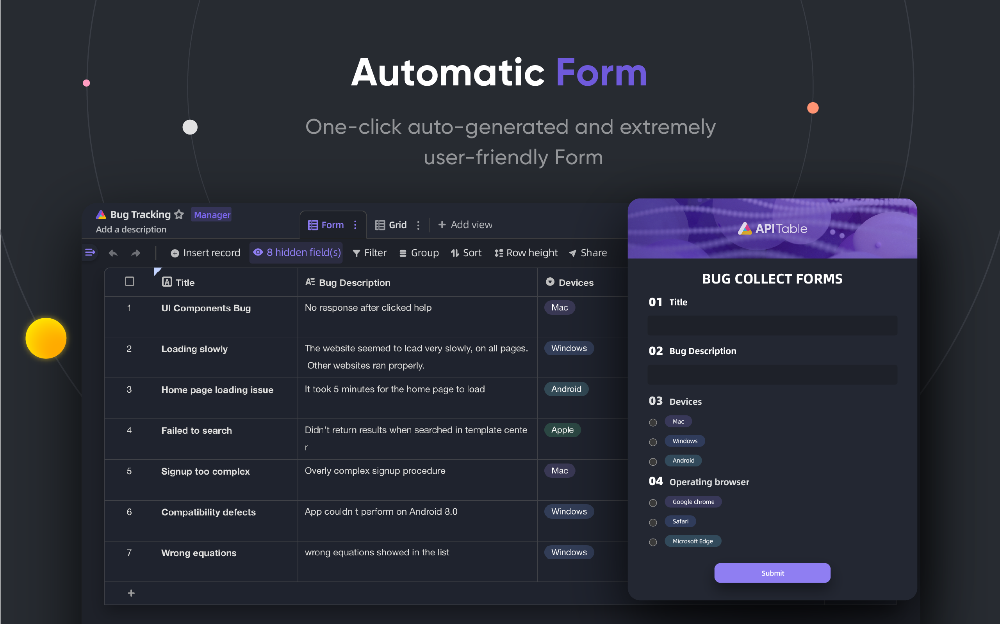
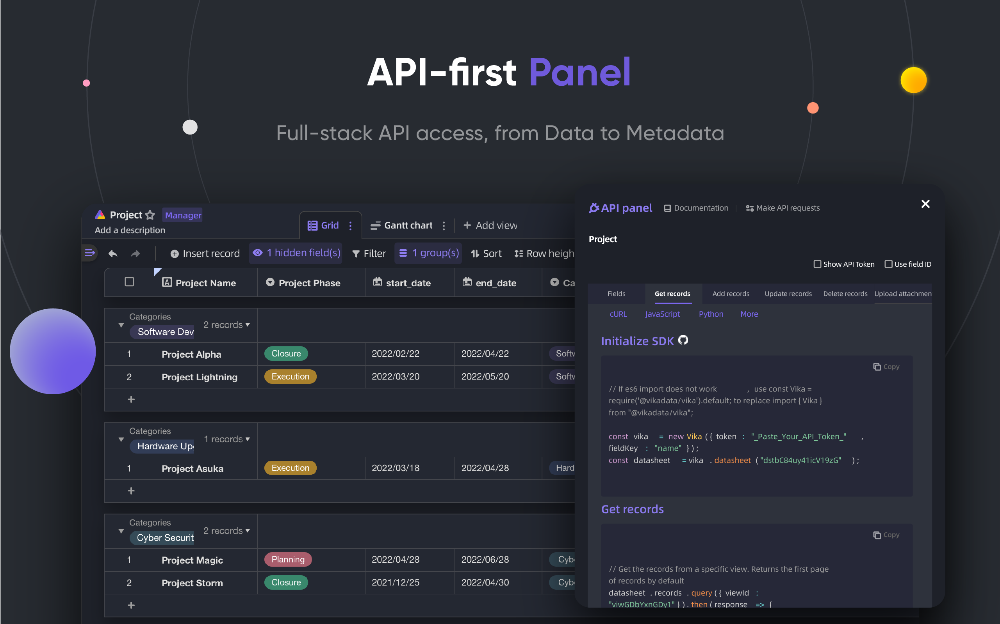
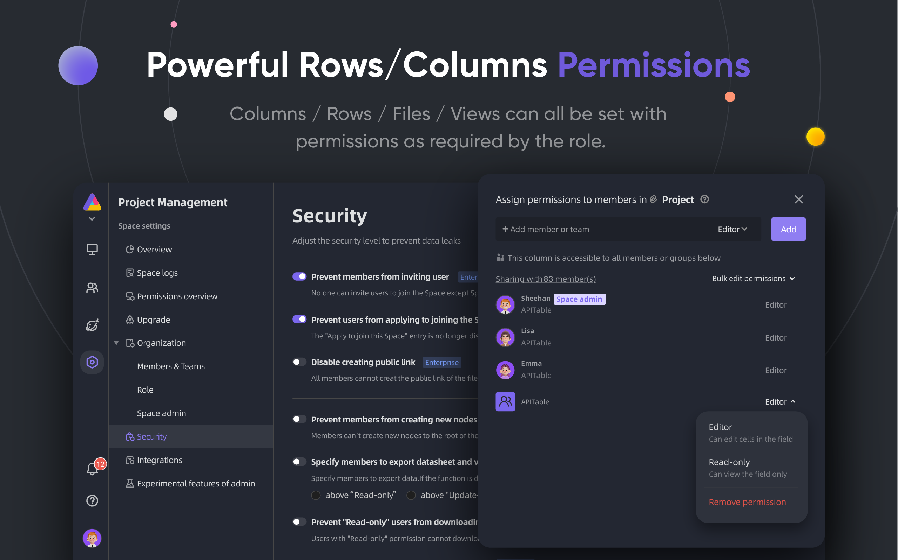
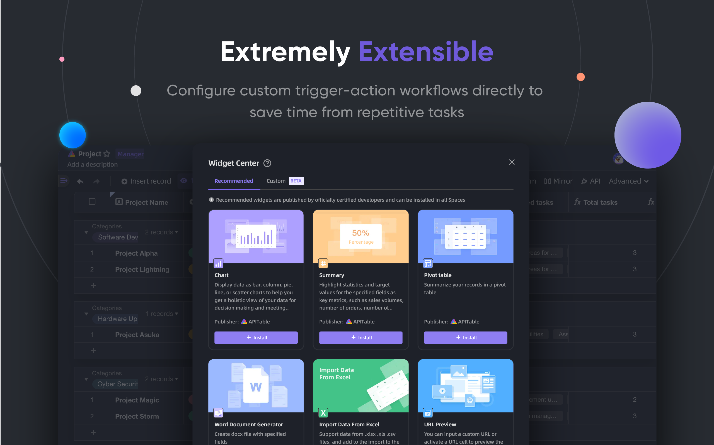
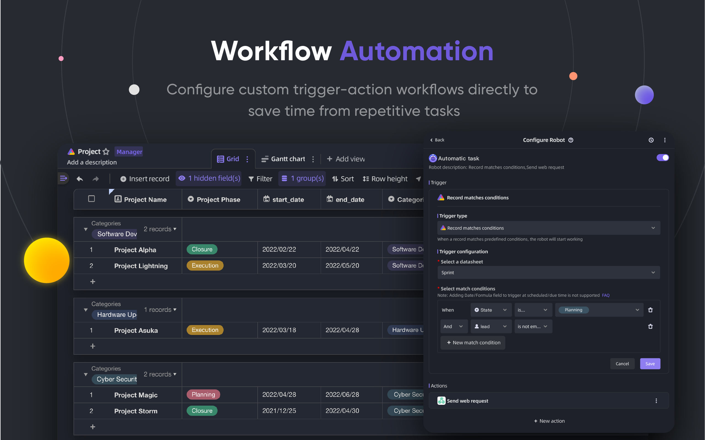
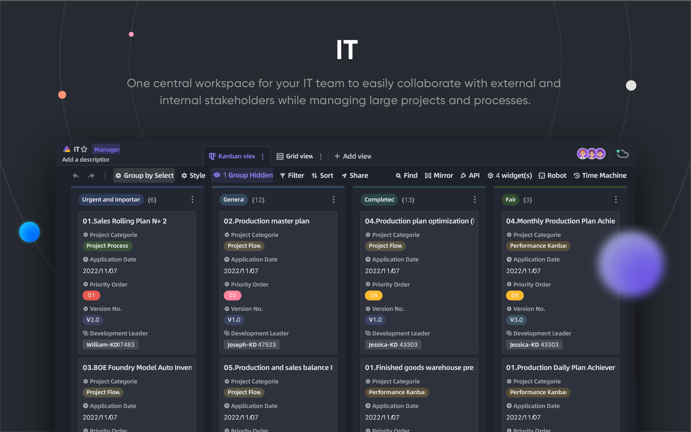

<p align="center">
    <a href="https://apitable.com" target="_blank">
        
    </a>
</p>

<p align="center">
    <!-- Gitpod -->
    <a target="_blank" href="https://gitpod.io/#https://github.com/apitable/apitable">
        
    </a>
    <!-- NodeJS -->
    
    <!-- Java -->
    
    <!-- hub.docker.com-->
    <a target="_blank" href="#installation">
        
    </a>
    <!-- Github Release Latest -->
    <a target="_blank" href="https://github.com/apitable/apitable/releases/latest">
        
    </a>
    <!-- Deploy to DO -->
    <a target="_blank" href="https://cloud.digitalocean.com/apps/new?repo=https://github.com/apitable/apitable/tree/develop&refcode=3fe758500293">
        
    </a>
    <br />
    <!-- LICENSE -->
    <a target="_blank" href="https://github.com/apitable/apitable/blob/main/LICENSE">
        
    </a>
    <!-- Discord -->
    <a target="_blank" href="https://discord.gg/TwNb9nfdBU">
        
    </a>
    <!-- Twitter -->
    <a target="_blank" href="https://twitter.com/apitable_com">
        
    </a>
    <!-- Github Action Build-->
    <a target="_blank" href="https://github.com/apitable/apitable/actions/workflows/build.yaml">
        
    </a>
</p>

<p align="center">
  <a href="README.md">English</a>
  | 
  <a href="docs/readme/fr-FR/README.md">Français</a>
  | 
  <a href="docs/readme/es-ES/README.md">Español</a>
  | 
  <a href="docs/readme/de-DE/README.md">Deutsch</a>
  | 
  简体中文
  | 
  <a href="docs/readme/zh-HK/README.md">繁體中文</a>
  | 
  <a href="docs/readme/ja-JP/README.md">日本語</a>
</p>

## ✨ 快速开始

> APITable 目前正在 `积极开发中`。
> 
> 我们将在 2023 年 2 月下旬公布第一份发行版本。
> 
> 加入 [Discord](https://discord.gg/TwNb9nfdBU) 或 [Twitter](https://twitter.com/apitable_com) 保持联系。<!-- If you just want try out APITable\[^info], using our hosted version at [apitable.com\](https://apitable.com). -->如果您只是想尝试APITable[^info], 点击这里 [⚡️Gitpod 在线 Demo](https://gitpod.io/#https://github.com/apitable/apitable).

如果您想要在本地或云端计算环境中安装 APITable ，请参阅 [💾 安装](#安装)

如果你想要设置你的本地开发环境，请阅读我们的 [🧑‍💻 开发者指南 ](./docs/contribute/developer-guide.md)

## 🔥 功能特性

<table>
  
  <tr>
    <th>
      <a href="#">实时协作</a>
    </th>
    <th>
      <a href="#">神奇表单</a>
    </th>

  </tr>

   <tr>
    <td width="50%">
      <a href="#">
        
      </a>
    </td>
    <td width="50%">
        <a href="#">
            
        </a>
    </td>
  </tr>

  <tr>
    <th>
      <a href="#">API 优先的面板</a>
    </th>
    <th>
      <a href="#">无限跨表关联</a>
    </th>
</tr>

 <tr>
    <td width="50%">
        <a href="#">
            
        </a>
    </td>
    <td width="50%">
      <a href="#">
        
      </a>
    </td>
 </tr>

 <tr>
    <th>
      <a href="#">强大的行/列权限</a>
    </th>
    <th>
      <a href="#">内嵌</a>
    </th>
  </tr>

 <tr>
    <td width="50%">
        <a href="#">
            
        </a>
    </td>
    <td width="50%">
        <a href="#">
            
        </a>
    </td>
  </tr>

</table>

APITable 提供了一系列令人惊奇的功能，从个人到企业。

- 先进的技术栈并开源
  - `实时协作` 允许多个用户实时或与 `操作转换(OT)` 算法同时进行编辑。
  - 使用 `canvas` 渲染的极其流畅、用户友好、极其快速的数据库-电子表格界面。
  - 数据库本地架构：变更集/操作/动作/快照等等。
  - 实时协作 **100k+** 数据行
  - 从 `数据(Data)` 到 `元数据(MetaData)` 的全栈式API访问。
  - 单向/双向表链接和 `无限交叉链接`
  - 社区友好的编程语言和框架，TypeScript ([NextJS](https://nextjs.org/) + [NestJS](https://nestjs.com/)) 和 Java ([Spring Boot](https://spring.io/projects/spring-boot))
- 美观和功能齐全的多维表格UI界面
  - `CRUD`: 创建、浏览、更新、删除表、列和行
  - `字段操作`: 排序、过滤、分组、隐藏/取消隐藏、高度设置。
  - `基于空间(Space)`：使用分离的工作空间来代替基于 App/Base 的结构，使无限的表格连接成为可能。
  - `暗色模式` 和主题定制。
  - `7 种视图类型`: 网格视图(Datasheet) / 图库视图 / 脑图视图/ 看板视图 / 全功能网格视图 / 日历视图
  - 一键式 API 面板
- 装备齐全
  - 内置的 10+ 个官方模板
  - 机器人自动化和自定义配置
  - 商业化智能(BI)仪表板
  - 一键式自动生成表单
  - 可共享和嵌入的页面
  - 多语言支持
  - 集成 n8n.io / Zapier / Appsmith... 及更多
- 卓越的扩展性
  - 超过 20 个官方开源组件，以及可扩展的 `组件系统`
  - 可自定义的图表 & 仪表板
  - 可自定义的数据列类型
  - 可自定义的公式
  - 可自定义的自动化机器人行为
- 企业级权限
  - `镜像`, 将视图变成镜像以实现行权限
  - 通过非常简单的操作激活 `列权限`
  - 文件夹/子文件夹/文件权限
  - 树结构文件夹和可自定义的节点（文件）
  - 团队管理 & 组织架构
- 企业级应用功能
  - SAML
  - 单点登录（SSO）
  - 审计
  - 数据库自动备份
  - 数据导出
  - 水印
- ....

使用可扩展的组件和插件，您可以添加更多功能。

## 💥 应用场景

为什么你必须知道 APITable 并作为你的下一个软件？

- 作为超级管理软件
  - 灵活的项目管理 & 任务/问题管理
  - 营销潜在客户管理。
  - 最灵活和可连接的 CRM
  - 灵活的 BI 图表系统
  - 便于人们使用的表格和调查表
  - 灵活的 ERP
  - 低代码和无代码平台。
  - ...及更多, APITable 将 1000 个软件放入您的口袋中。
- 作为一个可视化数据库基础设施
  - 将 APITable **嵌入** 到你自己的软件 UI 中
  - 带有 REST API 的可视化数据库
  - 管理员仪表板
  - 集中管理配置
  - 多合一的企业数据库，**连接你的所有** 软件
  - ...及更多, APITable 连接一切
- 此外，它是开源和可扩展的

## 💞 面向 API

#### API 面板

点击右角的 `API` 按钮将显示 API 面板

#### SQL式查询

APITable 将提供一个数据表查询语言(DQL)来查询您的数据库电子表格内容。

## 💝 嵌入友好

#### 分享和嵌入

分享您的数据表或文件夹。通过复制和粘贴 HTML 脚本嵌入它们。

#### 企业可用的嵌入

[APITable.com](https://apitable.com) 为证券业提供更多企业可用的嵌入功能。

## 安装

请确保您已在本地安装 `docker` & `curl` 。

如果您的计算机安装了 Docker ，打开您的终端并这样运行：

```
curl https://apitable.github.io/install.sh | bash
```

然后在您的浏览器中打开 [http://localhost:80](http://localhost:80) 访问它。

如果你想要设置你的本地开发环境，请阅读我们的 [🧑‍💻 开发者指南 ](./docs/contribute/developer-guide.md)

## 🧑‍💻 贡献

欢迎并感谢您为 APITable 作出贡献！

除了编写代码，您还有许多方法可以帮助 APITable 项目的茁壮成长。

你可以通过如下方式给项目提供帮助:

- 加入 [Crowdin Translation Project](https://crowdin.com/project/apitablecode/invite?h=f48bc26f9eb188dcd92d5eb4a66f2c1f1555185) ，帮助我们进行翻译
- 创建新 [Issues](https://github.com/apitable/apitable/issues/new/choose) 来反馈 BUG 或者优秀想法
- 关注我们的 [Twitter](https://twitter.com/apitable_com) 账号
- 完善、增添项目的 [Documentation](./docs) 
- 当然还有无限欢迎的 [Contributing Code](./docs/contribute/developer-guide.md)

更多详情，请查看 [贡献指南](./CONTRIBUTING.md) 。

这是一份入门指南，让您快速了解如何为 APITable 的茁壮成长贡献力量。

### 开发环境

在我们的 [开发者指南](./docs/contribute/developer-guide.md) 中学习如何设置您的本地开发环境。

### Git 工作流基础

下面是通用的 APITable 工作流：

1. 创建一个问题并描述您想要的功能 -> [APITable 问题](https://github.com/apitable/apitable/issues)
2. 派生此项目 -> [Fork APITable 项目](https://github.com/apitable/apitable/fork)
3. 创建您的功能分支(`git checkout -b my-new-feature`)
4. 提交您的更改(`git commit -am 'Add some features'`)
5. 推送分支 (`git push origin my-new-feature`)
6. 创建新的拉取请求 -> [通过派生创建拉取请求](https://github.com/apitable/apitable/compare)

### 工作约定

APITable 可适用这些通用的约定：

- 我们的 Git 分支模型是什么？ [Gitflow](https://nvie.com/posts/a-successful-git-branching-model/)
- 如何在派生项目上进行合作？ [Github Flow](https://docs.github.com/en/get-started/quickstart/github-flow)
- 如何写入好的提交消息？ [Conventional Commits](https://www.conventionalcommits.org/)
- 我们的更新日志格式是什么？ [Keep Changelog](https://keepachangelog.com/en/1.0.0/)
- 如何进行版本控制和标记？ [语义化版本控制](https://semver.org/)
- Java 编码准则是什么？ [Java 编码准则](https://github.com/alibaba/Alibaba-Java-Coding-Guidelines) | [Intellij IDEA 插件](https://plugins.jetbrains.com/plugin/10046-alibaba-java-coding-guidelines)
- TypeScript 编码准则是什么？ -> [TypeScript 风格指南](https://google.github.io/styleguide/tsguide.html) | [ESLint](https://www.npmjs.com/package/@typescript-eslint/eslint-plugin)

### 文档

- [帮助中心](https://help.apitable.com/)
- [👩‍💻 开发者中心](https://developers.apitable.com/)
  - [REST API 文档](https://developers.apitable.com/api/introduction/)
  - 小部件 SDK （即将到来...）
  - 脚本（即将到来...）

## 🛣 规划路线

### 未来的功能

- 重代码界面生成器
- 可嵌入的第三方文档组件
- 类似 SQL 的 DSL
- 作为一个 IdP
- Web 3 功能
- ...

### 托管服务版和企业版提供高级功能

- 作为一个 IdP
- SAML
- 单点登录
- 审计
- 数据库备份
- 水印

欲了解更多信息，请通过 <support@apitable.com> 联系我们。

## 👫 参与进来

### 🌏 我们为什么要创建 APITable 并开源？

- 我们认为 `数据库是所有软件的基石`。
- 我们相信，为每个人制作一个具有丰富和简单用户界面的`可视化数据库`，可以降低软件行业的难度，提高世界数字化的应用。
- 我们相信开源 `APITable` 可以 `推动人类前进`

### 我们正在招聘远程工作的开发者！

我们一直在为 APITable 寻找优秀人才：

- **全栈开发者**: 有 React、NextJS、TypeScript、Spring Boot、Java、Terraform 的工作经验。并喜欢写高质量的代码，带有清晰的文档和单元测试。
- **后端开发者**: 有 NestJS、TypeScript、Spring Boot、Java、SQL、Kubernetes、Terraform 的工作经验。并喜欢写高质量的代码，带有清晰的文档和单元测试。
- **前端开发者**: 有 React、NextJS、TypeScript、WebPack 的工作经验。并喜欢写高质量的代码，带有清晰的文档和单元测试。

无论时间和条件如何，如果你想要加入 APITable 团队，请不要犹豫，将您的简历发送到 <talent@apitable.com>。

## 📺 截图

<p align="center">
    
</p>
<p align="center">
    
</p>
<p align="center">
    
</p>
<p align="center">
    
</p>
<p align="center">
    
</p>
<p align="center">
    
</p>
<p align="center">
    
</p>
<p align="center">
    
</p>
<p align="center">
    
</p>
<p align="center">
    
</p>

## 🥰 许可协议


> 此仓库包含在 AGPL 下发布的 Open Source 版本的 APITable源代码。
> 
> 如果你想运行你自己的 APITable 副本或对发展作出贡献，那这里就是你的地方。
> 
> 详情请参阅 [LICENSING](./LICENSING.md)
> 
> 如果您想要在线使用 APITable ，那么您不需要运行此代码。 我们在 [APITable 上提供一个托管的应用版本](https://apitable.com) 适合全球加速。

<br/>


[^info]:    
    使用AGPL-3.0授权。 由 [APITable Ltd](https://apitable.com)设计。
