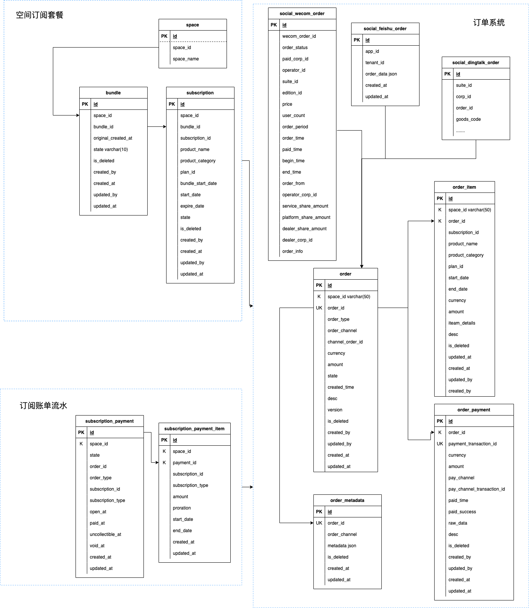

= 订阅计费系统

== 名词解释

=== 基础相关

* *audit* 审计，所有订阅相关的记录变更都应有审计记录，方便记录账单流水记录

=== 产品相关

* *product category* 产品类型
* *product channel* 产品渠道
* *product* 产品
* *plan* 产品方案
* *feature* 方案的功能规格集合
* *function* 功能点
* *price* 方案价目

=== 订阅相关

* *bundle* 订阅捆绑包，订阅的集合，包含一个基础的产品和多个附加产品的订阅,以便一个订阅上的特定操作（取消、更改计划）可能会对同一订阅集合中的其他订阅产生影响，另外，还可以订阅转移给其他租户
* *subscription* 订阅，可以是基础类型的产品计划，也可以是附加产品类型的订阅，还添加了其他计费信息，例如计费开始和结束的日期
* *entitlement* 订阅权益，即完成订阅后最终提供给用户的服务，它提供了以下问题的答案：用户是否允许（有权）在给定时间使用此服务或产品？它提供有关该服务开始、结束或暂停和恢复的日期的信息，以及有关服务或产品类型的详细信息

=== 计费相关

* *order* 订单，通常订阅是由一个完整的订单交易而成
* *order metadata* 订单自定义属性，订单存在一些不确定性的自定义属性值存储，也即是K-V存储结构
* *order item* 订单条目，订单可以合并基础产品和附加产品到一起提供购买，比如用户可以同时购买白银和容量、用量
* *order payment* 订单支付，通常订单的支付方式是由不同的渠道支付完成的，受第三方支付平台的限制，生成唯一支付交易号提交给支付渠道并完成支付
* *order channel* 订单渠道，订单来自不同渠道的订单，比如飞书、钉钉、企微、自营

=== 支付相关

* *transaction* 交易
* *pay channel* 支付渠道
* *pay channel transaction id* 支付渠道交易号
* *pay notification* 支付回调通知

== 数据库设计模型

下面是数据库设计预览图，生成图片而成，也许不是最新的，最新的请打开link:billing.drawio[数据库UML设计]

== 逻辑

从数据库设计层面，一共分三大模块

=== 空间订阅状态

=== 账单中心

=== 订阅流水

== 订阅场景

=== 新购

=== 按方案标价购买

=== 升级

=== 差价升级
*差价计算公式*: 新方案价格 - (旧方案总天数 - 旧方案已用天数) / 旧方案总天数 * 旧方案价格

=== 到期激活
`目前未支持`

=== 续订

=== 规则
* 延长方案期限

=== 退订

== TestCase

=== User Stories

==== 1. 自营商店

==== 1.1 Feature: 首次付费购买订阅
描述

===== 1.1.1 Scenario: 以前没购买过，小明付费购买了订阅
描述

==== 1.2 订阅到期后继续购买
描述

==== 2. 飞书商店

==== 3. 钉钉商店

==== 4. 企微商店

