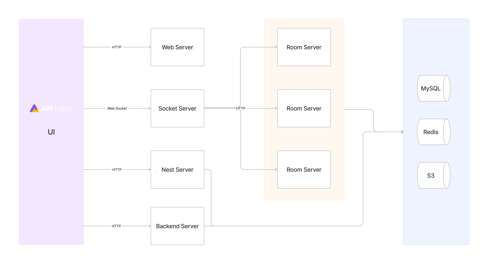

# Understand APITable - Architecture Overview

APITable is conceptually composed of two parts: workbench and datasheet.

The workbench maintains the nodes, organizations, and users' data, providing SSO, Audit, Scheduler, Permission services, etc.

The datasheet provides real-time collaboration for multiple collaborators to operate the datasheets at the same time. What is noteworthy is that there is a component library called Core which is developed with Redux. The core library contains OT calculation and can be used in both the front-end and back-end. 

A more concrete diagram can be seen below:

- `UI`: provides extremely smooth, user-friendly, super-fast database-spreadsheet interface in <canvas> Rendering Engine
- `Web Server`: build supercharged, SEO-friendly, and extremely user-facing static website and web application by using `Nextjs`
- `Backend Server`: handles HTTP requests about nodes, users, organizations, etc.
- `Socket Server`: establishes a long connection with clients through the WebSocket protocol, allowing for two-way communication and real-time collaboration, notifications, and other features
- `Room Server`: handles operations(`OTJSON`) of datasheets, communicates with `Socket Server` through gRPC, and also provides APIs for developers
- `Nest Server`: handles HTTP GET requests about datasheets, records, views, etc.
- `MySQL`: stores persistent data, such as datasheets, records, views, etc.
- `Redis`: stores cache, such as log-in session, hot data, etc.
- `S3`: stores uploaded files