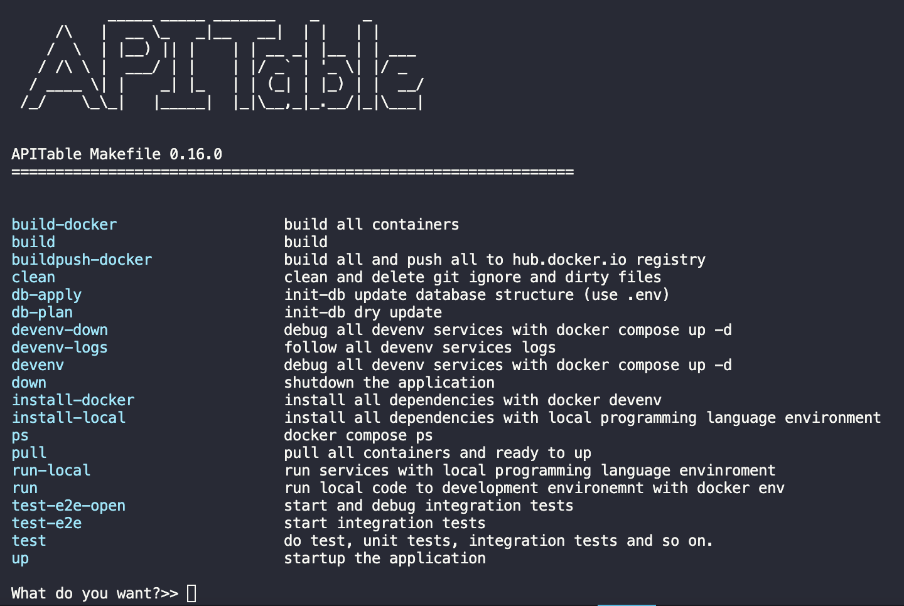
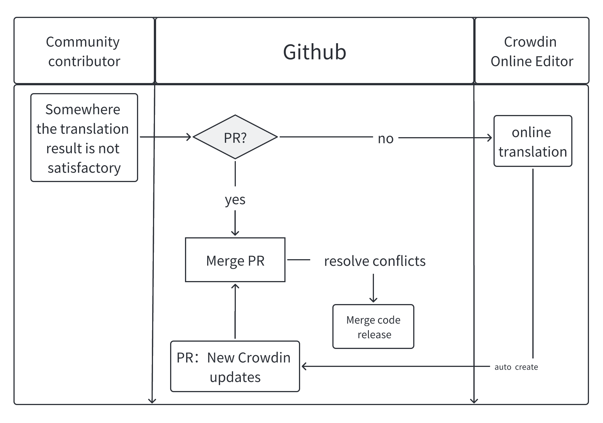

# Developer Guide

This guide helps you get started developing APITable.

## Dependencies

Before you start contributing to APITable, make sure you have the following tools and programming languages installed.

Required tools:

- `git`
- [docker](https://docs.docker.com/engine/install/)
- [docker-compose v2](https://docs.docker.com/engine/install/)
- `make`

Required programming languages:

- Nodejs 16.15
- Java 8
- Rust (nightly)
- Python 3.7 or above
- A proper C/C++ compiler toolchain, e.g. GCC 4.8 or above, Clang 3.5 or above.

The following subsections show the recommended way to install these dependencies. Note that on MacOS some libraries are also required, see the MacOS subsection for more information.

### Programming Languages

If you are using MacOS or Linux.
We recommend `sdkman` and `nvm` for managing the versions of Java and NodeJS respectively.

```bash
# quick install nvm
curl -o- https://raw.githubusercontent.com/nvm-sh/nvm/v0.39.2/install.sh | bash
# quick install sdkman
curl -s "https://get.sdkman.io" | bash
# install nodejs 
nvm install 16.15.0 && nvm use 16.15.0 && corepack enable
# install java development kit
sdk env install
# install rust toolchain
curl -sSf https://sh.rustup.rs | sh -s -- --default-toolchain nightly --profile minimal -y && source "$HOME/.cargo/env"
```

On MacOS and Linux, Python is usually pre-installed, but its version may not meet the requirement. You can run `python --version` to check out the version of the built-in Python, if it is below 3.7, see below for the commands to install the required Python version on various systems.

### MacOS

We recommend using [Homebrew](https://brew.sh/) for installing any missing dependencies:

```bash
## necessary required
brew install git
brew install --cask docker
brew install make
brew install pkg-config cairo pango libpng jpeg giflib librsvg pixman
brew install gcc
brew install python3
```

### Linux

On CentOS / RHEL or RHEL-based Linux distributions, use `yum`:

```bash
sudo yum install git
# This will install GCC toolchain and Make
sudo yum groupinstall 'Development Tools'
sudo yum install python3
```

On Ubuntu / Debian or Debian-based Linux distributions, use `apt`:

```bash
sudo apt update
sudo apt install git
# This will install GCC toolchain and Make
sudo apt install build-essential
sudo apt install python3
```

On ArchLinux or Arch-based Linux distributions, use `pacman`:

```bash
sudo pacman -Syyu git base-devel python3
```


### Windows

If you are running APITable on Windows 10/11, we recommend installing [Docker Desktop on Windows](https://docs.docker.com/desktop/install/windows-install/), [Ubuntu on WSL](https://ubuntu.com/wsl) and [Windows Terminal](https://aka.ms/terminal),
You can learn more about Windows Subsystem for Linux (WSL) in [the official site](https://learn.microsoft.com/en-us/windows/wsl).

Install missing dependencies on Ubuntu using `apt`:

```bash
sudo apt update
sudo apt install git
# This will install GCC toolchain and Make
sudo apt install build-essential
sudo apt install python3
```


## What build tools do we use?

We use `make` as our centric build tool entry that drives other build tools like `gradle` / `npm` / `yarn`.

So you can just enter `make` command and see all build commands:

```bash
make
```




## How to start the development environment?

APITable consists of 3 processes:

1. backend-server
2. room-server
3. web-server

To start the development environment locally, run these commands:

```bash
# start databases in dockers
make dataenv 

# install dependencies
make install 

#start backend-server
make run # enter 1  

# and then switch to a new terminal
# start room-server
make run # enter 2

# and then switch to a new terminal
# start web-server
make run # enter 3

```


## What IDE should you use?

We recommend you use `Visual Studio Code` or `Intellij IDEA` for your IDE.

APITable have prepared these two IDE's debug configs.

Just open APITable's root directory with IDE.


## How to contribute to translations?

We have two ways to improve the translation of APITable:

1. You can modify the markdown files in source code and create a PR directly
2. Join our [Crowdin](https://crowdin.com/project/apitablecom) to find the `strings` to modify

Also, for the text of the UI, you can change the `strings` in code files directly, they are located at（Different languages correspond to different language files）:

1. packages/l10n/base/strings.zh-HK.json
2. packages/l10n/base/strings.ja-JP.json
3. ...

In the collaboration of multilingual translation, we follow the following process:



## How to configure the SMTP server?

By default, APITable doesn't configure the SMTP server, which means you cannot invite users since it require the email sending feature.

It is needed to modify `.env` configuration using self email, and restart backend server.

```
MAIL_ENABLED=true
MAIL_HOST=smtp.xxx.com
MAIL_PASSWORD=your_email_password
MAIL_PORT=465
MAIL_SSL_ENABLE=true
MAIL_TYPE=smtp
MAIL_USERNAME=your_email
```

In addition, some mailboxes need to be enabled in the background to use smtp.
For details, you can search for xxx mailbox smtp tutorial.


## Performance problem under macOS M1 docker run?

## Where is the API documentation?

You can access the API documentation by starting a local server:

1. The documentation address for the Backend server is: http://localhost:8081/api/v1/doc.html

2. The documentation address for the Room server is: http://localhost:3333/nest/v1/docs

If you are interested in cloud service API interfaces, you can also directly access the online API documentation at https://developers.apitable.com/api/introduction.

## How to set the limitation of widget quantity in dashboard? (30 by default)

This can be achieved by setting the `DSB_WIDGET_MAX_COUNT` parameter in the `.env` file.

## Can I increase request rate limit of the API? (5 by default)

In the `.env.default` file of `room-server`, there are two parameters that can adjust request frequency:

1. You can set `LIMIT_POINTS` and `LIMIT_DURATION` to indicate the number of requests that can be made in a unit time period. Where LIMIT_POINTS is the number of times and LIMIT_DURATION is the duration, measured in seconds.

2. You can set the parameter `LIMIT_WHITE_LIST` to set a separate request frequency for specific users. Its value is a JSON string, and its structure can refer to `Map<string, IBaseRateLimiter>`.

## How to increase the number of records inserted per API call? (10 by default)

This can be achieved by setting the `API_MAX_MODIFY_RECORD_COUNTS` parameter in the `.env.default` file of `room-server`.


## How to upgrade to the newest release version?


## How to change the default 80 port?
Configuration properties in  the `.env` file can also be overridden  by specifying them env vars `NGINX_HTTP_PORT`

For example. It would be set as NGINX_HTTP_PORT=8080

## How to add supported Languages?

To add a new language to APITable, follow these steps:

1. Determine the code of the language to be added, for example `uk-UA`.
2. Add new language files in the `packages/l10n/base/` directory. For example, create a file named `strings.uk-UA.json`.
3. List the value keys for translation in the new language file, following the format of strings.en-US.json.
4. Add the language item in `packages/l10n/base/language.manifest.json`.
    ```json
    {
      "en-US": "English",
      "uk-UA": "українська",
      "zh-CN": "简体中文"
    }
    ```
5. Once the translation is complete, execute the command: `make l10n-apitable-ce`.

By following these steps, you can easily add support for new languages to your project.
