<p align="center">
    <a href="https://apitable.com" target="_blank">
        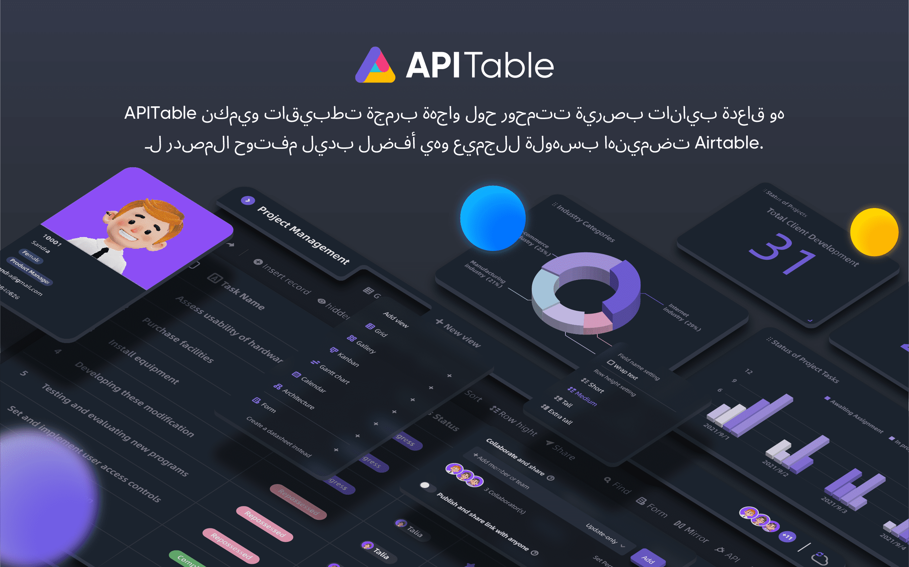
    </a>
</p>

<p align="center">
    <!-- Gitpod -->
    <a target="_blank" href="https://gitpod.io/#https://github.com/apitable/apitable">
        
    </a>
    <!-- NodeJS -->
    
    <!-- Java -->
    
    <!-- hub.docker.com-->
    <a target="_blank" href="#تثبيت">
        
    </a>
    <!-- Github Release Latest -->
    <a target="_blank" href="https://github.com/apitable/apitable/releases/latest">
        
    </a>
    <!-- Render -->
    <a target="_blank" href="https://render.com/deploy?repo=https://github.com/apitable/apitable">
        
    </a>
    <br />
    <!-- LICENSE -->
    <a target="_blank" href="https://github.com/apitable/apitable/blob/main/LICENSE">
        
    </a>
    <!-- Discord -->
    <a target="_blank" href="https://discord.gg/zYWYTHXR4f">
        
    </a>
    <!-- Twitter -->
    <a target="_blank" href="https://twitter.com/apitable_com">
        
    </a>
    <!-- Github Action Build-->
    <a target="_blank" href="https://github.com/apitable/apitable/actions/workflows/build.yaml">
        
    </a>
    <!-- Better Uptime-->
    <a target="_blank" href="https://apitable.betteruptime.com/">
        
    </a>
</p>

<p align="center">
  <a href="../../../README.md">English</a>
  | 
  <a href="../fr-FR/README.md">Français</a>
  | 
  <a href="../es-ES/README.md">Español</a>
  | 
  <a href="../de-DE/README.md">Deutsch</a>
  | 
  <a href="../zh-CN/README.md">简体中文</a>
  | 
  <a href="../zh-HK/README.md">繁體中文</a>
  | 
  <a href="../ja-JP/README.md">日本語</a>
</p>

## ✨ بداية سريعة

إذا كنت ترغب فقط في تجربة APITable [^info] ، فاستخدم الإصدار المستضاف على السحابة على [ apitable.com ](https://apitable.com).

إذا كنت ترغب في عرض هذا المشروع مفتوح المصدر القابل للتطبيق ، فانقر هنا للحصول على [ ⚡️Gitpod Online Demo ](https://gitpod.io/#https://github.com/apitable/apitable).

إذا كنت ترغب في تثبيت APITable في بيئة الحوسبة المحلية أو السحابية، انظر [💾 Ininstallation](#تثبيت)

إذا كنت ترغب في إعداد بيئة التنمية المحلية الخاصة بك، اقرأ دليل المطور [🧑<unk> :laptop_computer](./docs/contribute/developer-guide.md)

انضم إلى [ديسكورد](https://discord.gg/TwNb9nfdBU) أو [تويتر](https://twitter.com/apitable_com) للإبقاء على اتصال.
## ميزات 🔥

<table>
  
  <tr>
    <th>
      <a href="#">التعاون في الوقت الحقيقي</a>
    </th>
    <th>
      <a href="#">النموذج التلقائي</a>
    </th>

  </tr>

   <tr>
    <td width="50%">
      <a href="#">
        
      </a>
    </td>
    <td width="50%">
        <a href="#">
            
        </a>
    </td>
  </tr>

  <tr>
    <th>
      <a href="#">لوحة API-أولا</a>
    </th>
    <th>
      <a href="#">روابط غير محدودة متداخلة</a>
    </th>
</tr>

 <tr>
    <td width="50%">
        <a href="#">
            
        </a>
    </td>
    <td width="50%">
      <a href="#">
        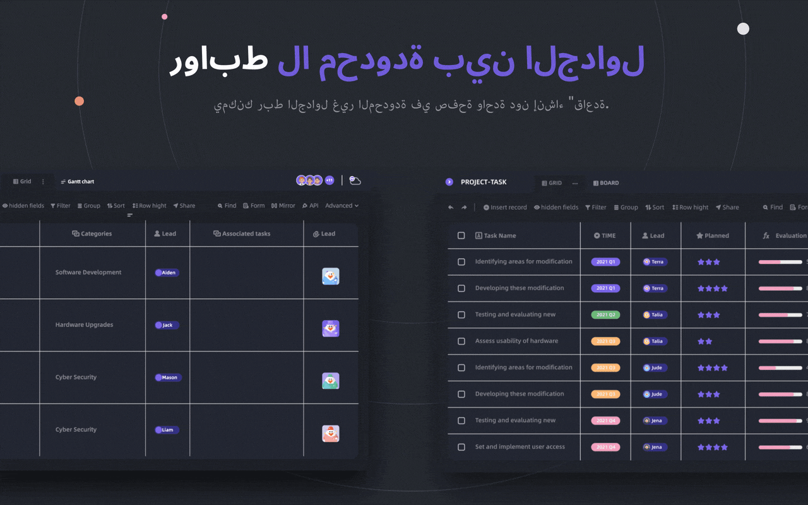
      </a>
    </td>
 </tr>

 <tr>
    <th>
      <a href="#">أذونات الصفوف القوية / الأضافات</a>
    </th>
    <th>
      <a href="#">Embed</a>
    </th>
  </tr>

 <tr>
    <td width="50%">
        <a href="#">
            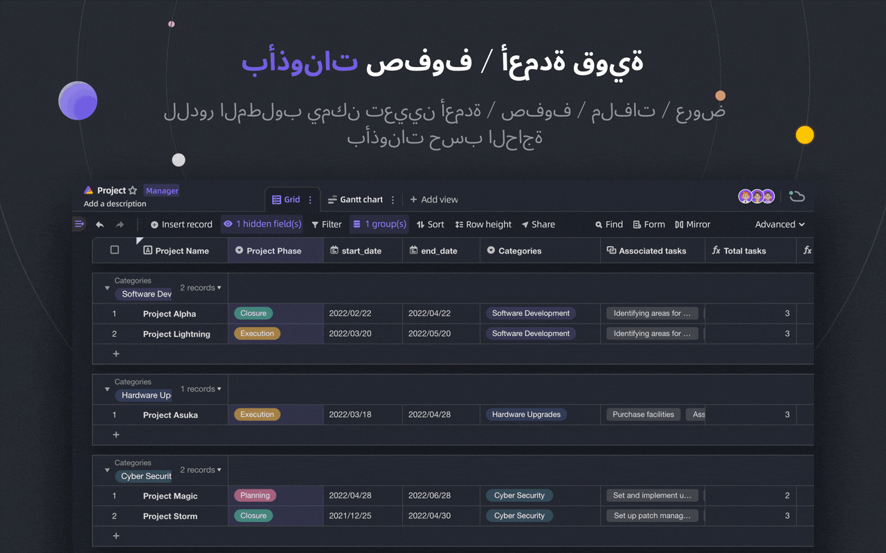
        </a>
    </td>
    <td width="50%">
        <a href="#">
            
        </a>
    </td>
  </tr>

</table>

APITable يوفر مجموعة من الميزات المذهلة، من الشخصية إلى المؤسسة.

- تكدس التكنولوجيا المتقدمة ومفتوح المصدر
  - `التعاون في الوقت الحقيقي` يسمح للمستخدمين المتعددين بالتحرير معا في الوقت الحقيقي، أو في وقت واحد مع `خوارزمية التحول التشغيلي`.
  - بسلاسة شديدة، وسهولة الاستخدام وسرعة فائقة على واجهة جدول بيانات في `<canvas> محرك تقديم`.
  - قاعدة البيانات المعمارية الأصلية: تغيير/تشغيل / إجراء / لقطة و هكذا.
  - **100k+** صفوف البيانات مع التعاون في الوقت الحقيقي.
  - الوصول إلى واجهة برمجة التطبيقات الكاملة، من `بيانات` إلى `بيانات التعريف`.
  - اتجاه واحد / رابط جدول الاتجاه الثنائي و `روابط متداخلة لا نهائية`
  - لغات البرمجة الملائمة للمجتمع و إطار, TypeScript ([NextJS](https://nextjs.org/) + [NestJS](https://nestjs.com/)) و Java ([حذاء الربيع](https://spring.io/projects/spring-boot)).
- واجهة المستخدم لقاعدة البيانات الغنية الجميلة
  - `CRUD`: إنشاء، قراءة، تحديث، حذف الجداول، الأعمدة، والصفوف
  - `عمليات الحقول`: الفرز، الفلتر، التجميع، الإخفاء/الفحص، إعداد الطول.
  - `المساحة المبنية على`: استخدام مساحات العمل المنفصلة بدلا من البنية القائمة على التطبيق/القاعدة، يجعل ربط الجداول غير محدودة معا ممكنة.
  - `الوضع المظلم` وتخصيص الموضوع متوفر.
  - `7 أنواع العرض`: عرض الشبكة (Datasheet) / معرض الصور / عرض Mindmap / عرض Kanban / عرض كامل الميزات / عرض التقويم
  - لوحة API بنقرة واحدة
- تشمل البطاريات
  - قوالب رسمية مدمجة في 10+.
  - الروبوت الآلي والتخصيص المتاح.
  - لوحة تحكم BI
  - نموذج تم إنشاؤه تلقائياً بنقرة واحدة
  - صفحة قابلة للمشاركة وقابلة للدمج.
  - دعم متعدد اللغات.
  - التكامل مع n8n.io / Zapier / Appsmith... وأكثر من ذلك.
- الامتداد الممتاز
  - موسع `نظام القطعة` مع أكثر من 20 أداة مفتوحة المصدر.
  - الرسم البياني & الرسم البياني & لوحة التحكم
  - أنواع أعمدة البيانات القابلة للتخصيص
  - صيغ قابلة للتخصيص
  - إجراءات الروبوت الآلي القابلة للتخصيص.
- أذونات درجة المؤسسة
  - `مرآة`، تحويل العرض إلى مرآة لتنفيذ أذونات الصف.
  - تنشيط إذن العمود `` من خلال عملية بسيطة جدا.
  - المجلدات / المجلدات الفرعية / أذونات الملفات.
  - مجلدات بنية الشجرة و العقدة القابلة للتخصيص (ملف)؛
  - إدارة الفريق & هيكل المؤسسة.
- ميزات المؤسسة:
  - SAML
  - تسجيل دخول أحادي (SSO)
  - مراجعة
  - النسخ الاحتياطي التلقائي لقاعدة البيانات
  - Data Exporter
  - العلامة المائية
- ....

مع الأدوات والإضافات القابلة للتمديد، يمكنك إضافة المزيد من الميزات.

## 💥 استخدام الحالات

لماذا يجب أن تعرف APITable لبرنامجك القادم؟

- كبرنامج رائع للإدارة
  - إدارة المشاريع المرنة & المهام / المشاكل.
  - إدارة قيادة التسويق.
  - Most flexible and connectable CRM.
  - • الاستخبارات التجارية المرنة.
  - People-Friendly Forms and Surveys
  - Flexible ERP.
  - رمز منخفض ومنصة بدون رموز.
  - ...وأكثر من ذلك، APITable يضع 1000 برنامج في جيبك.
- كبنية أساسية مرئية لقواعد البيانات
  - **تضمين** APITable في واجهة المستخدم الخاصة بك.
  - قاعدة بيانات مرئية مع REST API.
  - لوحة تحكم المدير.
  - إدارة التكوين المركزي.
  - قاعدة بيانات المؤسسة التي **توصيل كل** برنامجك.
  - ...وأكثر من ذلك، APITable يربط كل شيء.
- كما أنه مفتوح المصدر وقابل للتوسع

## 💞 API-oriented

#### API UI Panel

النقر على زر `API` في الزاوية اليمنى سيظهر لوحة API

#### استعلام مثل SQL

سيوفر APITable لغة استعلام لوحة البيانات (DQL) للاستعلام عن محتويات جدول البيانات الخاص بك.

## 💝 مضمن صديق

#### شارك و تضمّن

شارك جدول أو مجلد ورقة البيانات الخاصة بك. أدمجهم عن طريق نسخ ولصق البرامج النصية HTML.

#### Enterprise-ready Embedding

[APITable.com](https://apitable.com) يوفر المزيد من ميزات Enterprise-ready Embedding للأوراق المالية.

## تثبيت

قبل ان تبدأ:
* مضيف به [ docker ](https://docs.docker.com/engine/install/) و [ docker-compose v2 ](https://docs.docker.com/engine/install/) مثبت.
* يوصى باستخدام 4 وحدات معالجة مركزية / ذاكرة وصول عشوائي سعة 8 جيجابايت أو أكثر.
* قذيفة bash مع أدوات مساعدة أساسية مثل curl مثبتة.
* صور حاوية arm64 الأصلية (apple silicon) ليست جاهزة بعد وقد تسبب أداءً سيئًا.

لتثبيت apitable باستخدام docker compose ، افتح Terminal وقم بتشغيل هذا:

```
curl https://apitable.github.io/install.sh | bash
```

ثم افتح [ http://localhost:80](http://localhost:80) في متصفحك لزيارته.

نحن أيضًا نقدم صورة كل في واحد استنادًا إلى [pm2](https://pm2.keymetrics.io/) للغرض التجريبي أو الاختباري (غير موصى به للمؤسسة أو لاستخدام الإنتاج):

```bash
sudo docker run -d -v ${PWD}/.data:/apitable -p 80:80 --name apitable apitable/all-in-one:latest
```

تبعاً لبيئتك، قد تحتاج إلى الانتظار عدة دقائق حتى تبدأ جميع الخدمات. هذه الصورة هي amd64 (x86_64) فقط، قد تواجه أداء سيئ للغاية على الدروع 64 أو السيليكون التفاح.

إذا كنت ترغب في إعداد بيئة التطوير المحلية الخاصة بك ، فاقرأ [ 🧑‍💻 Developer Guide ](./docs/contribute/developer-guide.md)

## 💻 المساهمة

مرحبا، وشكرا لاهتمامك بالمساهمة في APITable!

هناك العديد من الطرق التي يمكن أن تساهم بها، بما يتجاوز كتابة الكود.

يمكنك المساهمة على النحو التالي:
- انضم إلى الترجمات وعدّلها في [ مشروع Crowdin للترجمة ](https://crowdin.com/project/apitablecode/invite?h=f48bc26f9eb188dcd92d5eb4a66f2c1f1555185)
- https://github.com/apitable/apitable/issues/new/choose
- تابعنا على [ Twitter ](https://twitter.com/apitable_com)
- Create [Documentation](./docs)
- [رمز المساهمة](./docs/contribute/developer-guide.md)


من قبيل ما يلي:
- Join [Crowdin Translation Project](https://crowdin.com/project/apitablecom/invite?h=4a985ea532a01d973acc03f2f1c960951693577)
- إنشاء [مشكلات](https://github.com/apitable/apitable/issues/new/choose)
- تابعنا على [ Twitter ](https://twitter.com/apitable_com)
- إنشاء [مستندات](./docs)
- [رمز المساهمة](./docs/contribute/developer-guide.md)


يمكنك قراءة هذا المستودع [إرشادات المساهمة](./CONTRIBUTING.md) لتعلم كيفية المساهمة.

إليك دليل سريع لمساعدتك في المساهمة في APITable


### البيئة الإنمائية

تعرف على كيفية إعداد بيئتك المحلية ، انتقل إلى [ دليل المطور ](./docs/contribute/developer-guide.md).

### سير عمل Git الأساسي

Here's a general APITable git workflow:

1. إنشاء مشكلة ووصف الميزات التي تريدها -> [مشاكل APITable](https://github.com/apitable/apitable/issues)
2. اشترك في هذا المشروع -> [مشروع Fork APITable](https://github.com/apitable/apitable/fork)
3. إنشاء فرع الميزة الخاص بك (`git Checout -b my-new-feat`)
4. قم بالتغييرات الخاصة بك (`git obligation -am 'إضافة بعض الميزات'`)
5. نشر الفرع (`git push الأصل my-new-feat`)
6. إنشاء طلب سحب جديد -> [إنشاء طلب سحب عبر الشوكات](https://github.com/apitable/apitable/compare)

### اتفاقيات العمل

يستخدم APITable هذه الاتفاقيات المشتركة:

- ما هو نموذج فروع Git لدينا؟ [Gitflow](https://nvie.com/posts/a-successful-git-branching-model/)
- كيف يمكن التعاون على مشاريع الشوك؟ [Github Flow](https://docs.github.com/en/get-started/quickstart/github-flow)
- كيفية كتابة رسالة الالتزام الجيدة؟ [القوات التقليدية](https://www.conventionalcommits.org/)
- ما هو تنسيق سجل التغيير؟ [احتفظ بالتغييرات](https://keepachangelog.com/en/1.0.0/)
- كيفية الإصدار و الوسم؟ [الإصدار السامي](https://semver.org/)
- ما هو دليل برمجة جافا؟ [Java Coding Guidelin](https://github.com/alibaba/Alibaba-Java-Coding-Guidelines)
- ما هو دليل برمجة TypeScript Ccolining؟ -> [دليل نمط النص النصي](https://google.github.io/styleguide/tsguide.html)
- ما هو دليل برمجة الروستين؟ -> [تطبيق إرشادات API](https://rust-lang.github.io/api-guidelines/about.html)

### الوثائق

- [مركز المساعدة](https://help.apitable.com/)
- [👩‍💻 مركز المطور](https://developers.apitable.com/)
  - [<unk> مستندات REST API](https://developers.apitable.com/api/introduction/)
  - [أداة SDK](https://developers.apitable.com/widget/introduction/)
  - [Scripting Widget](https://developers.apitable.com/script/introduction/)
- [Design System](https://figma.com/@apitable)

## 🛣 خارطة الطريق

يرجى الرجوع إلى [خريطة الطريق لـ APITable](https://apitable.com/roadmap)

### ميزات المستقبل

- منشئ الواجهة برموز ثقيلة
- مكونات توثيق الطرف الثالث القابلة للنسر
- SQL-like Domain-Specific Languages
- As an IdP
- روبوت أتمتة متقدم
- ميزات ويب 3
- ...

### الإصدارات المستضافة والمؤسسة تقدم ميزات متقدمة

- As an IdP;
- SAML
- تسجيل دخول أحادي
- مراجعة
- النسخ الاحتياطي لقاعدة البيانات
- تكامل مع ChatGPT و Zapier و Slack و Google Workspace ……
- العلامة المائية

For more information on our product, including enterprise self-hosted license, please contact us at <support@apitable.com> or [book a demo](https://apitable.com/share/shrdaGGppsfg3pjQLXALG?fldy5ZmHYGZx2=salesteam@apitable.com).

## 👫 اشترك

### :globe_showing_Asi-Australia: لماذا نقوم بإنشاء APITable ومفتوح المصدر؟

- نحن نعتقد أن قاعدة البيانات `هي حجر الزاوية` لكل البرمجيات.
- نعتقد أن إنشاء `قاعدة بيانات مرئية مع واجهة مستخدم غنية وسهلة للجميع` يمكن أن يقلل من صعوبة صناعة البرمجيات ويزيد من اعتماد رقمنة العالم.
- نحن نعتقد أن استخدام المصدر المفتوح `APITable` يمكن `دفع البشر إلى الأمام`.

### We are hiring remotely!

نحن دائما نبحث عن مواهب جيدة لتطبيق APITable:

- **المطور الخلفي**: لديك تجربة مع NestJS, TypeScript, Spring Boot, Java, SQL, Kubernetes, Terraform. وتحب كتابة كود عالي الجودة مع وثائق واضحة واختبارات وحدة.
- **مطور المكدس الكامل**: لديك تجربة مع React. NestJS, TypeScript, Spring Boot, Java, Terraform. And you like to write high quality code with clear documentation and unit tests.
- **مطور النهاية الأمامية**: لديك تجربة مع React. NextJS, TypeScript, WebPack. And you like to write high quality code with clear documentation and unit tests.

بغض النظر عن الوقت والشروط، إذا كنت ترغب في المشاركة في فريق APITable، لا تتردد في إرسال السيرة الذاتية الخاصة بك إلى talent@apitable .

## 📺 Screenshot

<p align="center">
    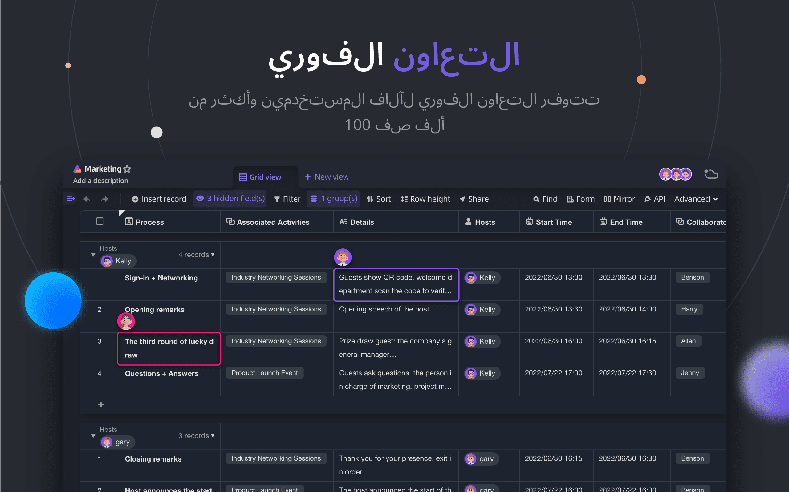
</p>
<p align="center">
    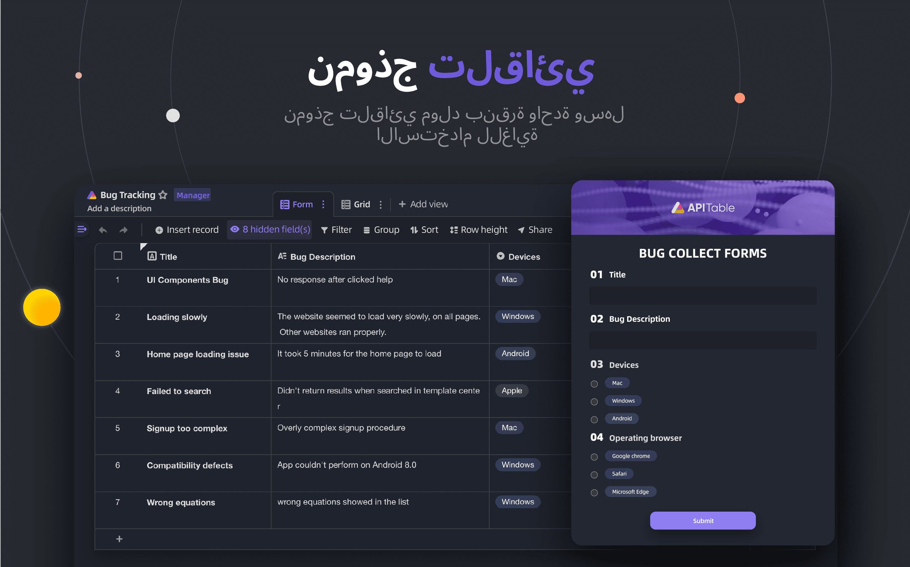
</p>
<p align="center">
    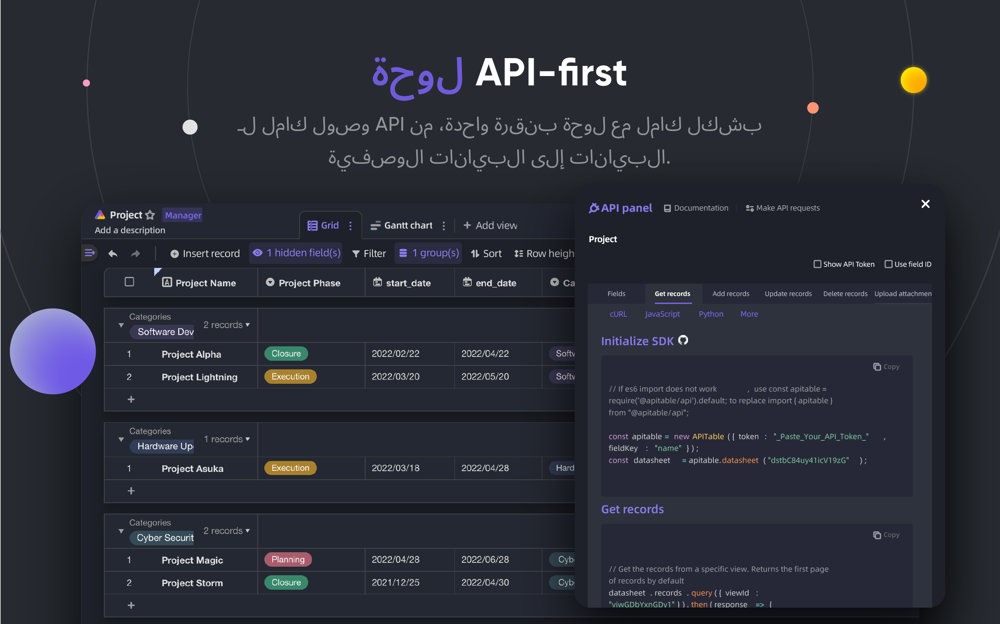
</p>
<p align="center">
    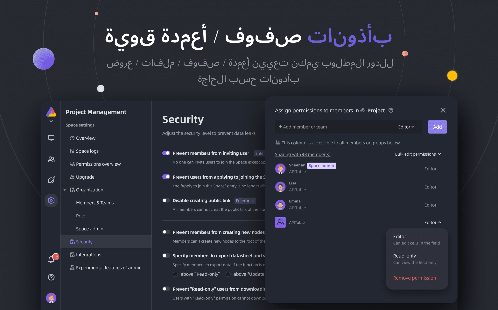
</p>
<p align="center">
    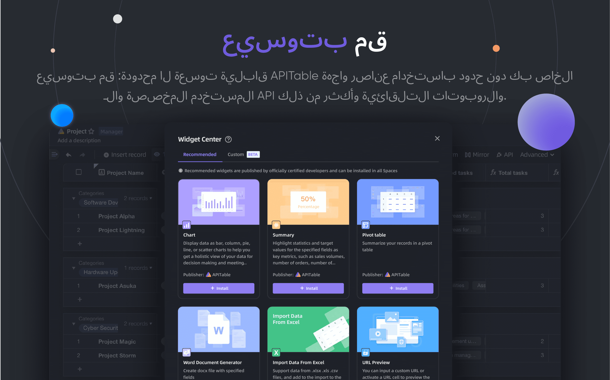
</p>
<p align="center">
    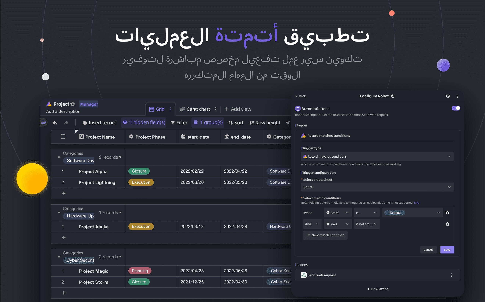
</p>
<p align="center">
    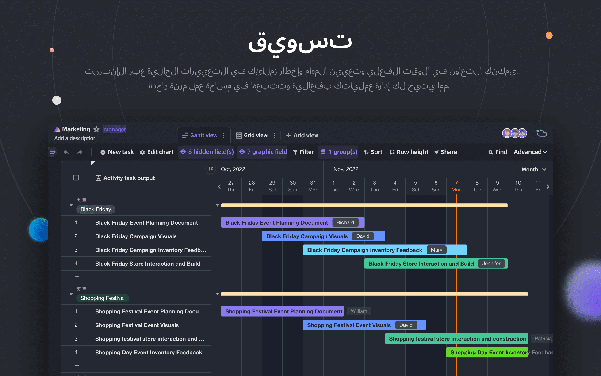
</p>
<p align="center">
    
</p>
<p align="center">
    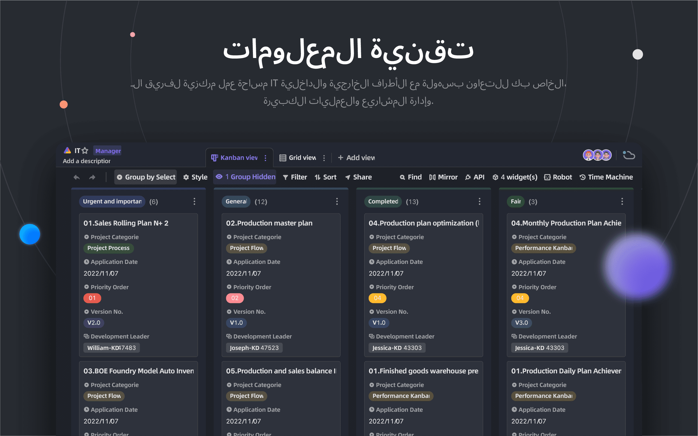
</p>
<p align="center">
    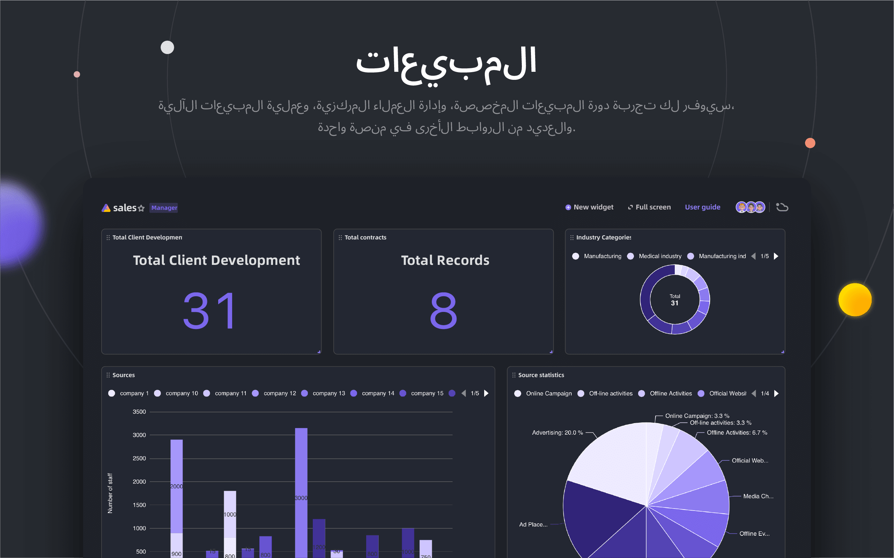
</p>

## 🥰 ترخيص

> يحتوي هذا المستودع على رمز مصدر الطبعة المفتوحة المصدر من APITabl، التي صدرت تحت AGPL.
> 
> إذا كنت ترغب في تشغيل نسختك الخاصة من APITable أو المساهمة في التطوير، فهذا هو المكان بالنسبة لك.
> 
> راجع [LICENSING](./LICENSING.md) للحصول على التفاصيل.
> 
> إذا كنت ترغب في استخدام APITable عبر الإنترنت فأنت لست بحاجة إلى تشغيل هذا الكود، نحن نقدم نسخة مستضافة من التطبيق في [APITabl. م](https://apitable.com) الذي تم تحسينه للمسرع العالمي.

<br/>

[^info]: مرخص بواسطة AGPL-3.0. مصممة بواسطة [APITable Ltd](https://apitable.com).
