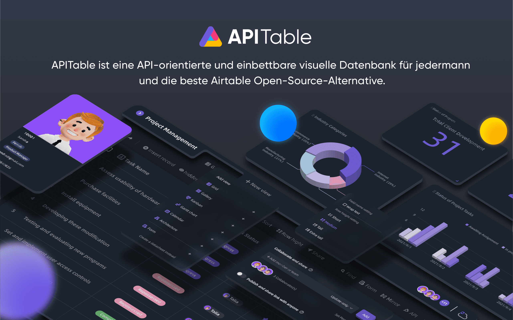
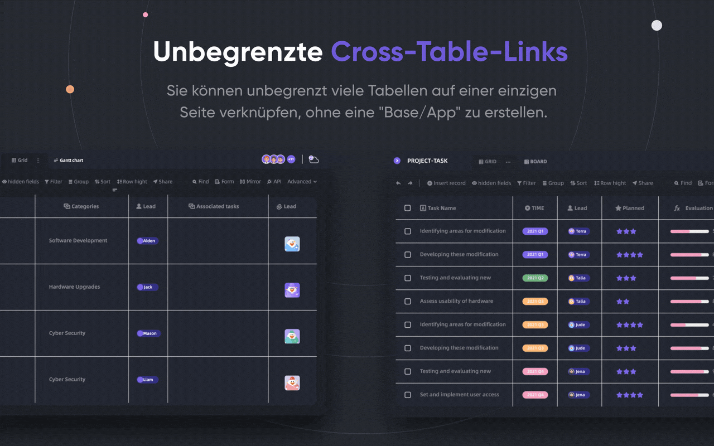
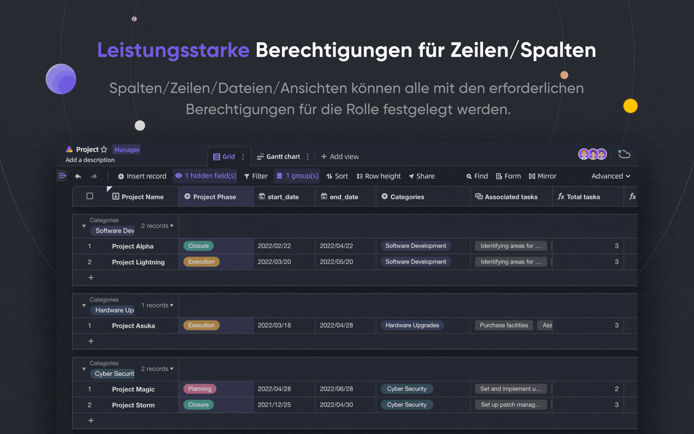
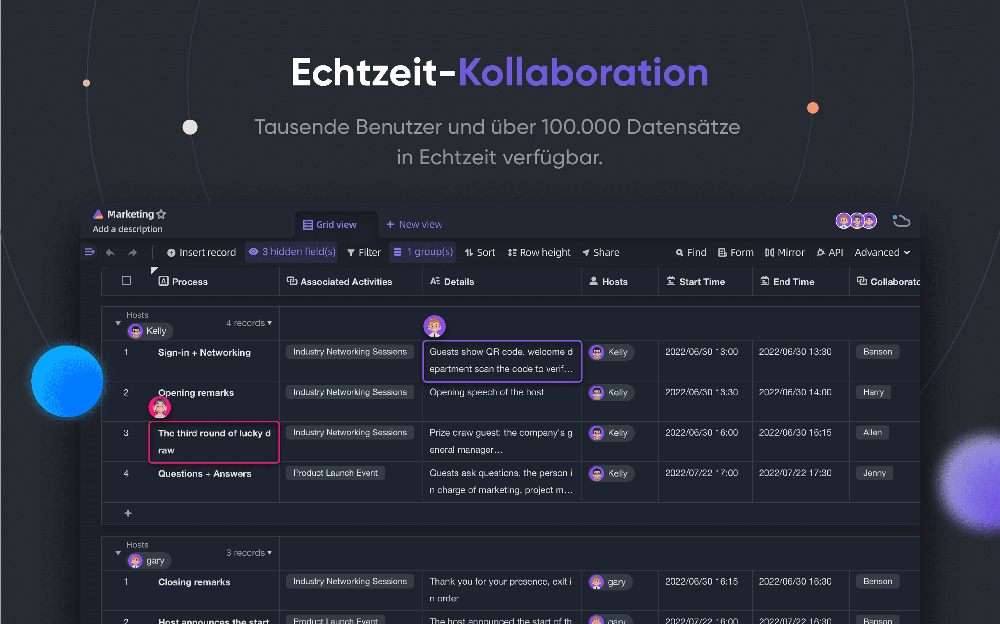
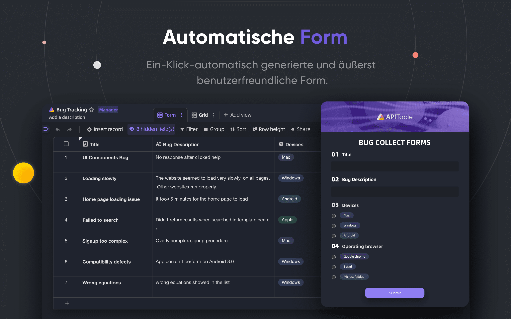
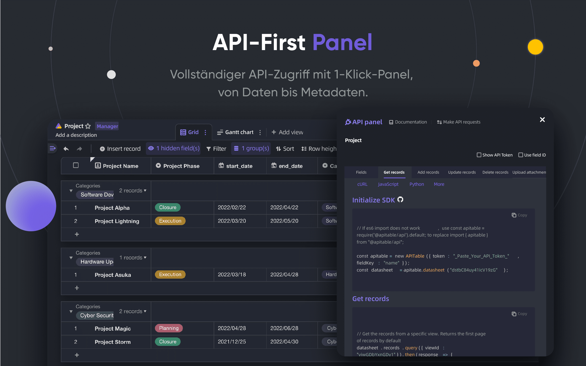
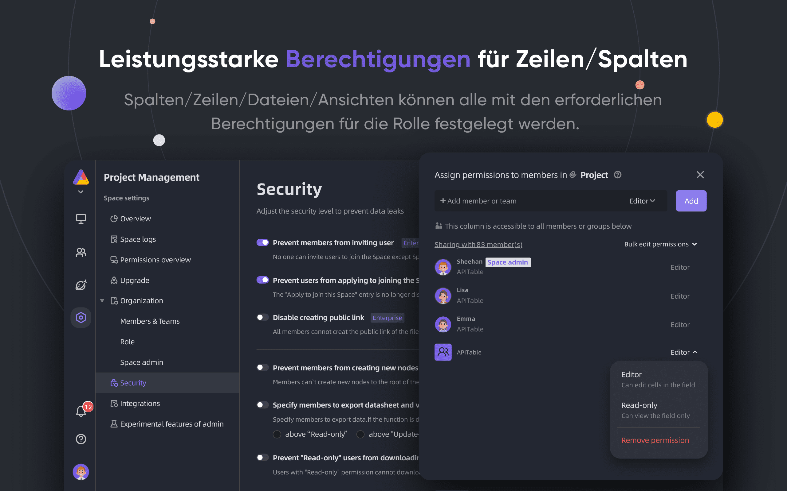
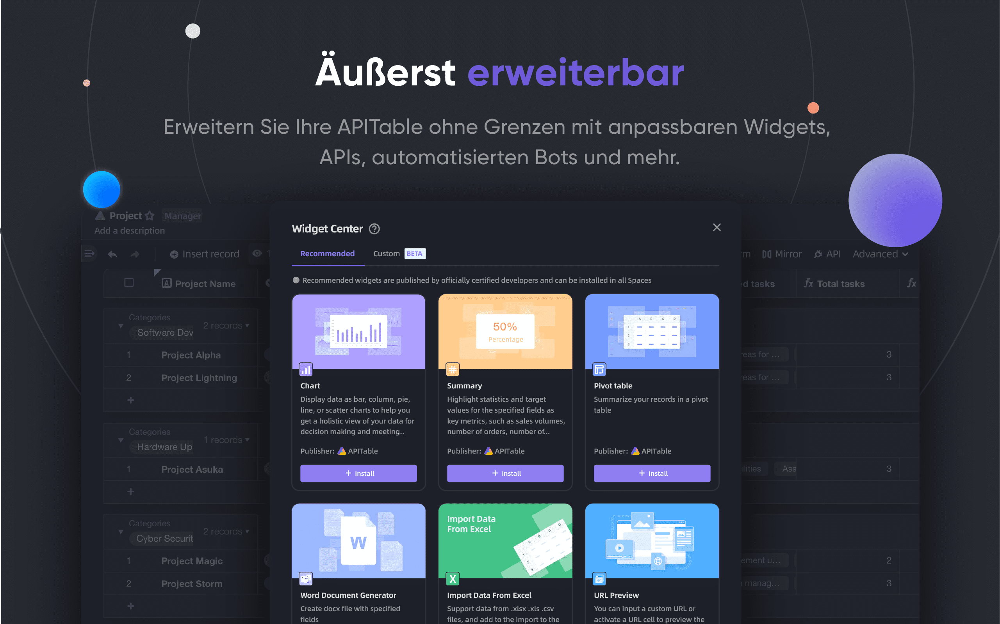
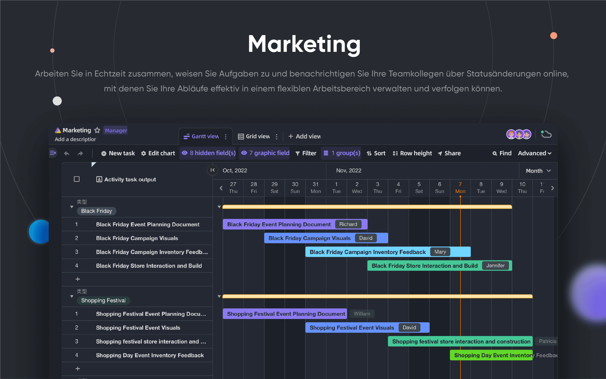

<p align="center">
    <a href="https://apitable.com" target="_blank">
        
    </a>
</p>

<p align="center">
    <!-- Gitpod -->
    <a target="_blank" href="https://gitpod.io/#https://github.com/apitable/apitable">
        
    </a>
    <!-- NodeJS -->
    
    <!-- Java -->
    
    <!-- hub.docker.com-->
    <a target="_blank" href="#installation">
        
    </a>
    <!-- Github Release Latest -->
    <a target="_blank" href="https://github.com/apitable/apitable/releases/latest">
        
    </a>
    <!-- Render -->
    <a target="_blank" href="https://render.com/deploy?repo=https://github.com/apitable/apitable">
        
    </a>
    <br />
    <!-- LICENSE -->
    <a target="_blank" href="https://github.com/apitable/apitable/blob/main/LICENSE">
        
    </a>
    <!-- Discord -->
    <a target="_blank" href="https://discord.gg/zYWYTHXR4f">
        
    </a>
    <!-- Twitter -->
    <a target="_blank" href="https://twitter.com/apitable_com">
        
    </a>
    <!-- Github Action Build-->
    <a target="_blank" href="https://github.com/apitable/apitable/actions/workflows/build.yaml">
        
    </a>
    <!-- Better Uptime-->
    <a target="_blank" href="https://apitable.betteruptime.com/">
        
    </a>
</p>

<p align="center">
  <a href="../../../README.md">English</a>
  | 
  <a href="../fr-FR/README.md">Français</a>
  | 
  <a href="../es-ES/README.md">Español</a>
  | 
  Deutsch
  | 
  <a href="../zh-CN/README.md">简体中文</a>
  | 
  <a href="../zh-HK/README.md">繁體中文</a>
  | 
  <a href="../ja-JP/README.md">日本語</a>
</p>

## ✨ Schnellstart

Wenn Sie APITable[^info] nur ausprobieren möchten, verwenden Sie unsere Cloud-basierte Version unter [apitable.com](https://apitable.com).

Wenn Sie dieses APITable Open-Source-Projekt ausprobieren möchten, klicken Sie hier für [⚡️Gitpod Online Demo](https://gitpod.io/#https://github.com/apitable/apitable).

Wenn Sie APITable in Ihrer lokalen oder Cloud-Rechenumgebung installieren möchten, lesen Sie [💾 Installation](#installation)

Wenn Sie Ihre lokale Entwicklungsumgebung einrichten möchten, lesen Sie unseren [🧑‍💻 Developer Guide](./docs/contribute/developer-guide.md)

Trete [Discord](https://discord.gg/TwNb9nfdBU) oder [Twitter](https://twitter.com/apitable_com) bei, um in Kontakt zu bleiben.
## 🔥 Funktionen

<table>
  
  <tr>
    <th>
      <a href="#">Echtzeit-Zusammenarbeit</a>
    </th>
    <th>
      <a href="#">Automatisches Formular</a>
    </th>

  </tr>

   <tr>
    <td width="50%">
      <a href="#">
        
      </a>
    </td>
    <td width="50%">
        <a href="#">
            
        </a>
    </td>
  </tr>

  <tr>
    <th>
      <a href="#">API-First-Panel</a>
    </th>
    <th>
      <a href="#">Unbegrenzte Kreuz-Tabellen-Links</a>
    </th>
</tr>

 <tr>
    <td width="50%">
        <a href="#">
            
        </a>
    </td>
    <td width="50%">
      <a href="#">
        
      </a>
    </td>
 </tr>

 <tr>
    <th>
      <a href="#">Mächtige Zeilen/Spaltenberechtigungen</a>
    </th>
    <th>
      <a href="#">Einbetten</a>
    </th>
  </tr>

 <tr>
    <td width="50%">
        <a href="#">
            
        </a>
    </td>
    <td width="50%">
        <a href="#">
            
        </a>
    </td>
  </tr>

</table>

APITable bietet eine Reihe von erstaunlichen Funktionen, von der persönlichen bis zum Unternehmen.

- Fortschrittlicher Technologie-Stack und Open-Source
  - `Echtzeit-Zusammenarbeit` ermöglicht es mehreren Benutzern, in Echtzeit oder gleichzeitig mit dem `Operational Transformation (OT)` Algorithmus zu bearbeiten.
  - Äußerst glatte, benutzerfreundliche, superschnelle Datenbank-Tabellenkalkulationsschnittstelle in `<canvas> Rendering Engine`.
  - Datenbank native Architektur: Changeset / Operation / Aktion / Schnappschuss und so weiter.
  - **100k+** Datenzeilen mit Echtzeit-Kollaboration.
  - Vollständiger API-Zugriff, von `Daten` bis `Metadaten`.
  - Ein-Richtung / Bi-Richtung Tabellenlink und `Infinite Cross Links`
  - Community-freundliche Programmiersprachen und -Framework, TypeScript ([NextJS](https://nextjs.org/) + [NestJS](https://nestjs.com/)) und Java ([Spring Boot](https://spring.io/projects/spring-boot)).
- Schöne und reiche Datenbank-Tabellenkalkulation
  - `CRUD`: Erstellen, lesen, aktualisieren, die Tabellen, Spalten und Zeilen löschen
  - `Feldoperationen`: Sortieren, filtern, gruppieren, verstecken/unverstecken, Höheneinstellung einstellen.
  - `Leerzeichen basierend`: Verwenden Sie getrennte Arbeitsbereiche anstelle von App/Base-basierter Struktur, um unbegrenzte Tabellen miteinander zu verknüpfen.
  - `Dunkler Modus` und Theme-Anpassung verfügbar.
  - `7 Ansichtsarten`: Rasteransicht (Datenblatt) / Gallerieansicht / Mindmap-Ansicht / Kanban-Ansicht / Gantt-Ansicht voll / Kalenderansicht
  - Ein-Klick-API-Panel
- Batterien enthalten
  - Integrierte 10+ offizielle Vorlagen.
  - Roboterautomatisierung und -anpassung verfügbar.
  - BI-Dashboard
  - Ein-Klick-automatisch generiertes Formular
  - Teilbare und einbettbare Seite.
  - Mehrsprachige Unterstützung.
  - Integration mit n8n.io / Zapier / Appsmith... und mehr.
- Exzellente Erweiterbarkeit
  - Erweiterbares `Widget-System` mit über 20 offiziellen Open-Source-Widgets.
  - Anpassbares Diagramm & Diagramm & Dashboard
  - Anpassbare Datentypen
  - Anpassbare Formeln
  - Anpassbare Roboteraktionen für Automatisierung.
- Enterprise-Grade-Berechtigungen
  - `Spiegeln`, verwandeln Sie einen View in einen Spiegel, um Zeilenrechte zu implementieren.
  - `Spaltenberechtigung` durch eine sehr einfache Operation aktivieren.
  - Ordner / Unterordner / Dateiberechtigung.
  - Baumstrukturordner und anpassbare Knoten (Datei);
  - Team Management & Organisation Struktur.
- Enterprise-Funktionen:
  - SAML
  - Einmal-Sign-On (SSO)
  - Audit
  - Datenbank Auto-Sicherung
  - Datenexporteur
  - Wasserzeichen
- ....

Mit erweiterbaren Widgets und Plugins können Sie weitere Funktionen hinzufügen.

## 💥 Fälle verwenden

Warum müssen Sie APITable für Ihre nächste Software kennen?

- Als Super-Management-Software
  - Flexibles Projektmanagement & Aufgaben / Problemmanagement.
  - Marketing Lead Management.
  - Die meisten flexiblen und verbindbaren CRM.
  - Flexible Business Intelligence (BI).
  - Personen-freundliche Formulare und Umfragen
  - Flexible ERP.
  - Low-Code und No-Code-Plattform.
  - ...und mehr, APITable stellt 1000 Software in Ihre Tasche.
- Als visuelle Datenbank-Infrastruktur
  - **Einbetten** APITable in Ihre eigene Software UIs.
  - Visuelle Datenbank mit REST-API.
  - Admin-Dashboard.
  - Zentrale Konfigurationsverwaltung.
  - All-in-One-Unternehmensdatenbank, die **alle** Ihre Software miteinander verbindet.
  - ...und mehr, APITable verbindet alles.
- Auch ist es Open Source und erweiterbar

## 💞 API-orientiert

#### API UI Panel

Wenn Sie auf die `API` Taste in der rechten Ecke klicken, wird das API Panel angezeigt

#### SQL-ähnliche Abfrage

APITable stellt eine Datasheet Query Language (DQL) zur Verfügung, um die Inhalte Ihrer Datenbanktabellenkalkulation abzufragen.

## 💝 Einbett-freundlich

#### Teilen und einbinden

Teilen Sie Ihre Tabelle oder Ihren Ordner. Einbetten durch Kopieren und Einfügen von HTML-Skripten.

#### unternehmensfertige Einbettung

[APITable.com](https://apitable.com) bietet weitere unternehmensfertige Einbettungsfunktionen für Wertpapiere.

## Installation

Bevor Sie beginnen:
* Ein Host mit installiertem Docker und docker-compose v2.
* 4 CPUs/8GB RAM oder mehr werden empfohlen.
* Eine Bash-Shell mit grundlegenden Dienstprogrammen wie curl installiert.
* Native arm64 (apple silicon) Container-Images sind noch nicht fertig und können zu schlechter Leistung führen.

Um apitable mit docker compose zu installieren, öffnen Sie Ihr Terminal und führen Sie dies aus:

```
curl https://apitable.github.io/install.sh | bash
```

Öffne dann [http://localhost:80](http://localhost:80) in deinem Browser, um ihn zu besuchen.

Wir bieten auch ein All-In-One-Bild basierend auf [pm2](https://pm2.keymetrics.io/) für Demo oder Testzwecke (nicht empfohlen für Unternehmen oder Produktionsnutzung):

```bash
sudo docker run -d -v ${PWD}/.data:/apitable -p 80:80 --name apitable apitable/all-in-one:latest
```

Abhängig von Ihrer Umgebung müssen Sie eventuell mehrere Minuten warten, bis alle Dienste gestartet werden. Dieses Bild ist nur amd64 (x86_64) und auf arm64 oder Apfelsilicons kann es zu schlechten Leistungen kommen.

Wenn Sie Ihre lokale Entwicklungsumgebung einrichten möchten, lesen Sie unseren [🧑Entwicklerhandbuch](./docs/contribute/developer-guide.md)

## 💻 Mitwirken

Herzlich willkommen und vielen Dank für Ihr Interesse an APITable!

Es gibt viele Möglichkeiten, einen Beitrag zu leisten, abgesehen vom Schreiben von Code.

Sie können wie folgt beitragen:
- An unserem [Crowdin Translation Project](https://crowdin.com/project/apitablecode/invite?h=f48bc26f9eb188dcd92d5eb4a66f2c1f1555185) teilnehmen und Übersetzungen ändern
- https://github.com/apitable/apitable/issues/new/choose
- Unserem [Twitter](https://twitter.com/apitable_com) folgen
- [Dokumentation](./docs) erstellen
- [Code beisteuern](./docs/contribute/developer-guide.md)


So wie folgendermaßen:
- Join [Crowdin Translation Project](https://crowdin.com/project/apitablecom/invite?h=4a985ea532a01d973acc03f2f1c960951693577)
- [Tickets](https://github.com/apitable/apitable/issues/new/choose) erstellen
- Unserem [Twitter](https://twitter.com/apitable_com) folgen
- [Dokumentation](./docs) erstellen
- [Code beisteuern](./docs/contribute/developer-guide.md)


Lesen Sie die Richtlinien für die Mitarbeit an diesem Repository, um zu erfahren, wie Sie beitragen können.

Hier ist eine kurze Anleitung, die Ihnen hilft, zu APITable beizutragen.


### Entwicklungsumgebung

Um zu erfahren, wie Sie Ihre lokale Umgebung einrichten, besuchen Sie unsere [Entwicklerhandbuch](./docs/contribute/developer-guide.md).

### Git Workflow einfach

Hier ist ein allgemeiner APITable Git Workflow:

1. Erstellen Sie ein Problem und beschreiben Sie die gewünschten Funktionen -> [APITable Issues](https://github.com/apitable/apitable/issues)
2. Dieses Projekt forken -> [APITable Projekt Fork](https://github.com/apitable/apitable/fork)
3. Erstelle deinen Feature-Branch (`git checkout -b my-new-feature`)
4. Commit your changes (`git commit -am 'Add some features'`)
5. Veröffentlichen des Zweiges (`git Push-Ursprung my-new-Feature`)
6. Neuen Pull-Request erstellen -> [Pull-Request über Gabeln erstellen](https://github.com/apitable/apitable/compare)

### Arbeitskonventionen

APITable use these common convention:

- Was ist unser Git-Branching-Modell? [Gitflow](https://nvie.com/posts/a-successful-git-branching-model/)
- Wie kann ich an Ihren Fork-Projekten arbeiten? [Github Flow](https://docs.github.com/en/get-started/quickstart/github-flow)
- Wie kann ich eine gute Commit-Nachricht schreiben? [Herkömmliche Commits](https://www.conventionalcommits.org/)
- Was ist unser Changelog-Format? [Changelog beibehalten](https://keepachangelog.com/en/1.0.0/)
- Wie kann ich versionieren und taggingen? [Semantische Versionierung](https://semver.org/)
- Was ist die Java Coding Guideline? [Java Coding Guideline](https://github.com/alibaba/Alibaba-Java-Coding-Guidelines) | [Intellij IDEA Plugin](https://plugins.jetbrains.com/plugin/10046-alibaba-java-coding-guidelines)
- Was ist die TypeScript Coding Guideline? -> [TypeScript Style Guide](https://google.github.io/styleguide/tsguide.html) | [ESLint](https://www.npmjs.com/package/@typescript-eslint/eslint-plugin)

### Dokumentationen

- [Hilfe-Center](https://help.apitable.com/)
- [👩‍💻 Entwicklerzentrum](https://developers.apitable.com/)
  - [REST API Docs](https://developers.apitable.com/api/introduction/)
  - [Widget SDK](https://developers.apitable.com/widget/introduction/)
  - [Scripting Widget](https://developers.apitable.com/script/introduction/)
- [Design System](https://figma.com/@apitable)

## 🛣 Roadmap

Bitte beachten Sie die [Roadmap von APITable](https://apitable.com/roadmap)

### Zukünftige Funktionen

- Heavy-Code Interface Builder
- Embbedbare Dokumentations-Komponenten von Drittanbietern
- SQL-ähnliche Domain-spezifische Sprachen
- Als IdP
- Fortschrittlicher Automatisierungsroboter
- Web 3 Funktionen
- ...

### Gehostete und Enterprise-Versionen bieten erweiterte Funktionen

- Als IdP;
- SAML
- Einmal-Sign-An
- Audit
- Datenbanksicherung
- Integrieren Sie mit ChatGPT, Zapier, Slack, Google Workspace......
- Watermark

For more information on our product, including enterprise self-hosted license, please contact us at <support@apitable.com> or [book a demo](https://apitable.com/share/shrdaGGppsfg3pjQLXALG?fldy5ZmHYGZx2=salesteam@apitable.com).

## 👫 Beteiligt werden

### 🌏 Warum erstellen wir APITable und Open-Source?

- Wir glauben, dass die `-Datenbank der Eckpfeiler` aller Software ist.
- Wir glauben, dass die Erstellung einer `Visuellen Datenbank mit einer reichen und einfachen Benutzeroberfläche für jeden` die Schwierigkeiten der Softwareindustrie verringern und die weltweite Digitalisierung erhöhen kann.
- Wir glauben, dass Open-Sourcing `APITable` Arbeit `Push Human Seinen Weiterleitung` ermöglichen kann.

### Wir stellen aus der Ferne!

Wir suchen immer nach guten Talenten für APITable:

- **Vollstack-Entwickler**: Sie haben Erfahrung mit React, NestJS, TypeScript, Spring Boot, Java, Terraform. Und Sie schreiben gerne qualitativ hochwertigen Code mit klaren Dokumentationen und Unit-Tests.
- **Back-End-Entwickler**: Sie haben Erfahrung mit NestJS, TypeScript, Spring Boot, Java, SQL, Kubernetes, Terraform. Und Sie schreiben gerne qualitativ hochwertigen Code mit klaren Dokumentationen und Unit-Tests.
- **Front-End-Entwickler**: Sie haben Erfahrung mit React, NextJS, TypeScript, WebPack. And you like to write high quality code with clear documentation and unit tests.

Unabhängig von Zeit und Bedingungen, wenn Sie sich an das APITable-Team beteiligen möchten zögern Sie nicht und senden Sie Ihren Lebenslauf an [talent@apitable. om](mailto:talent@apitable.com).

## 📺 Screenshot

<p align="center">
    
</p>
<p align="center">
    
</p>
<p align="center">
    
</p>
<p align="center">
    
</p>
<p align="center">
    
</p>
<p align="center">
    
</p>
<p align="center">
    
</p>
<p align="center">
    
</p>
<p align="center">
    
</p>
<p align="center">
    
</p>

## 🥰 Lizenz

> Dieses Repository enthält den Quellcode für die Open Source Edition von APITable, veröffentlicht unter der AGPL.
> 
> Wenn Sie Ihre eigene Version von APITable betreiben oder zur Entwicklung beitragen möchten, dann ist dies der richtige Ort für Sie.
> 
> Siehe [LICENSING](./LICENSING.md) für Details.
> 
> Wenn Sie APITable online verwenden möchten, müssen Sie diesen Code nicht ausführen wir bieten eine gehostete Version der App unter [APITable an. om](https://apitable.com) die für den globalen Beschleuniger optimiert wurde.

<br/>

[^info]: Lizenziert mit AGPL-3.0. Entworfen von [APITable Ltd](https://apitable.com).
