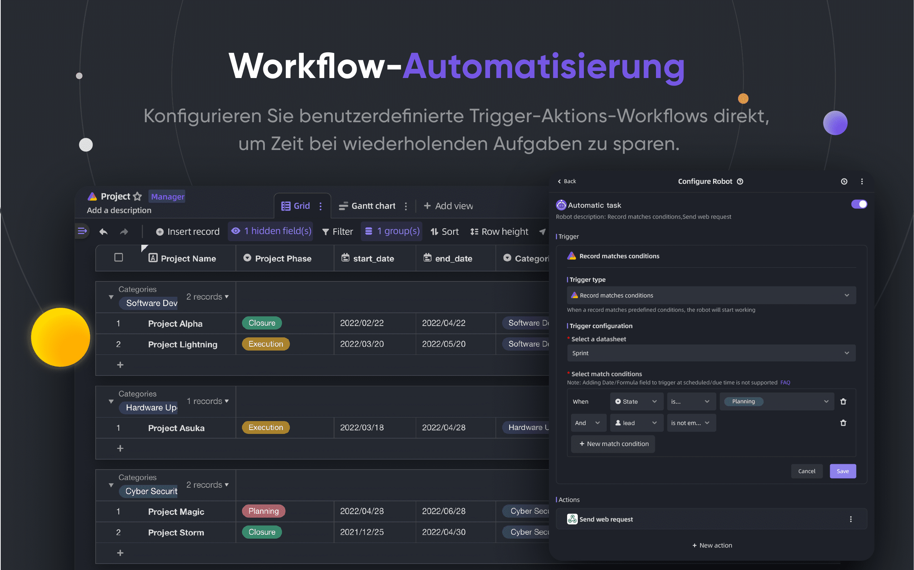

<p align="center">
    <a href="https://apitable.com" target="_blank">
        
    </a>
</p>

<p align="center">
    <!-- Gitpod -->
    <a target="_blank" href="https://gitpod.io/#https://github.com/apitable/apitable">
        
    </a>
    <!-- NodeJS -->
    
    <!-- Java -->
    
    <!-- hub.docker.com-->
    <a target="_blank" href="#installation">
        
    </a>
    <!-- Github Release Latest -->
    <a target="_blank" href="https://github.com/apitable/apitable/releases/latest">
        
    </a>
    <!-- Render -->
    <a target="_blank" href="https://render.com/deploy?repo=https://github.com/apitable/apitable">
        
    </a>
    <br />
    <!-- LICENSE -->
    <a target="_blank" href="https://github.com/apitable/apitable/blob/main/LICENSE">
        
    </a>
    <!-- Discord -->
    <a target="_blank" href="https://discord.gg/TwNb9nfdBU">
        
    </a>
    <!-- Twitter -->
    <a target="_blank" href="https://twitter.com/apitable_com">
        
    </a>
    <!-- Github Action Build-->
    <a target="_blank" href="https://github.com/apitable/apitable/actions/workflows/build.yaml">
        
    </a>
</p>

<p align="center">
  English
  | 
  <a href="docs/readme/fr-FR/README.md">Français</a>
  | 
  <a href="docs/readme/es-ES/README.md">Español</a>
  | 
  <a href="docs/readme/de-DE/README.md">Deutsch</a>
  | 
  <a href="docs/readme/zh-CN/README.md">简体中文</a>
  | 
  <a href="docs/readme/zh-HK/README.md">繁體中文</a>
  | 
  <a href="docs/readme/ja-JP/README.md">日本語</a>
</p>

## ✨ Schnellstart

> APITable ist derzeit eine `Arbeit in Bearbeitung`.
> 
> Wir werden die erste Veröffentlichung Ende Januar 2023 veröffentlichen.
> 
> Trete [Discord](https://discord.gg/TwNb9nfdBU) oder [Twitter](https://twitter.com/apitable_com) bei, um in Kontakt zu bleiben.<!-- If you just want try out APITable\[^info], using our hosted version at [apitable.com\](https://apitable.com). -->Wenn Sie nur APITable[^info]ausprobieren möchten, klicken Sie hier für [⚡Gitpod Online Demo](https://gitpod.io/#https://github.com/apitable/apitable).

Wenn Sie APITable in Ihrer lokalen oder Cloud-Rechenumgebung installieren möchten, lesen Sie [💾 Installation](#installation)

Wenn Sie Ihre lokale Entwicklungsumgebung einrichten möchten, lesen Sie unseren [🧑<unk> 💻 Developer Guide](./docs/contribute/developer-guide.md)

## 🔥 Funktionen

<table>
  
  <tr>
    <th>
      <a href="#">Echtzeit-Zusammenarbeit</a>
    </th>
    <th>
      <a href="#">Automatisches Formular</a>
    </th>

  </tr>

   <tr>
    <td width="50%">
      <a href="#">
        
      </a>
    </td>
    <td width="50%">
        <a href="#">
            
        </a>
    </td>
  </tr>

  <tr>
    <th>
      <a href="#">API-First-Panel</a>
    </th>
    <th>
      <a href="#">Unbegrenzte Kreuz-Tabellen-Links</a>
    </th>
</tr>

 <tr>
    <td width="50%">
        <a href="#">
            
        </a>
    </td>
    <td width="50%">
      <a href="#">
        
      </a>
    </td>
 </tr>

 <tr>
    <th>
      <a href="#">Mächtige Zeilen/Spaltenberechtigungen</a>
    </th>
    <th>
      <a href="#">Einbetten</a>
    </th>
  </tr>

 <tr>
    <td width="50%">
        <a href="#">
            
        </a>
    </td>
    <td width="50%">
        <a href="#">
            
        </a>
    </td>
  </tr>

</table>

APITable bietet eine Reihe von erstaunlichen Funktionen, von der persönlichen bis zum Unternehmen.

- Erweiterter Technologie-Stack und Open-Source
  - `Echtzeit-Zusammenarbeit` ermöglicht es mehreren Benutzern, in Echtzeit oder gleichzeitig mit dem `Operational Transformation (OT)` Algorithmus zu bearbeiten.
  - Äußerst glatte, benutzerfreundliche, superschnelle Datenbank-Tabellenkalkulationsschnittstelle in `<canvas> Rendering Engine`.
  - Datenbank native Architektur: Changeset / Operation / Aktion / Schnappschuss und so weiter.
  - **100k+** Datenzeilen mit Echtzeit-Kollaboration.
  - Vollständiger API-Zugriff, von `Daten` bis `Metadaten`.
  - Ein-Richtung / Bi-Richtung Tabellenlink und `Infinite Cross Links`
  - Community-freundliche Programmiersprachen und -Framework, TypeScript ([NextJS](https://nextjs.org/) + [NestJS](https://nestjs.com/)) und Java ([Spring Boot](https://spring.io/projects/spring-boot))
- Schöne und reiche Datenbank-Tabellenkalkulation
  - `CRUD`: Erstellen, lesen, aktualisieren, die Tabellen, Spalten und Zeilen löschen
  - `Feldoperationen`: Sortieren, filtern, gruppieren, verstecken/unverstecken, Höheneinstellung einstellen.
  - `Leerzeichen basierend`: Verwenden Sie getrennte Arbeitsbereiche anstelle von App/Base-basierter Struktur, um unbegrenzte Tabellen miteinander zu verknüpfen.
  - `Dunkler Modus` und Theme-Anpassung verfügbar.
  - `7 Ansichtsarten`: Rasteransicht (Datenblatt) / Gallerieansicht / Mindmap-Ansicht / Kanban-Ansicht / Gantt-Ansicht voll / Kalenderansicht
  - Ein-Klick-API-Panel
- Batterien enthalten
  - Integrierte 10+ offizielle Vorlagen.
  - Roboterautomatisierung und -anpassung verfügbar.
  - BI-Dashboard
  - Ein-Klick-automatisch generiertes Formular
  - Teilbare und einbettbare Seite.
  - Mehrsprachige Unterstützung.
  - Integration mit n8n.io / Zapier / Appsmith... und mehr.
- Exzellente Erweiterbarkeit
  - Erweiterbares `Widget-System` mit über 20 offiziellen Open-Source-Widgets.
  - Anpassbares Diagramm & Diagramm & Dashboard
  - Anpassbare Datentypen
  - Anpassbare Formeln
  - Anpassbare Roboteraktionen für Automatisierung.
- Enterprise-Grade-Berechtigungen
  - `Spiegeln`, verwandeln Sie einen View in einen Spiegel, um Zeilenrechte zu implementieren.
  - `Spaltenberechtigung` durch eine sehr einfache Operation aktivieren.
  - Ordner / Unterordner / Dateiberechtigung.
  - Baumstrukturordner und anpassbare Knoten (Datei);
  - Team Management & Organisation Struktur.
- Enterprise-Funktionen:
  - SAML
  - Einmal-Sign-On (SSO)
  - Audit
  - Datenbank Auto-Sicherung
  - Datenexporteur
  - Wasserzeichen
- ....

Mit erweiterbaren Widgets und Plugins können Sie weitere Funktionen hinzufügen.

## 💥 Fälle verwenden

Warum müssen Sie APITable für Ihre nächste Software kennen?

- Als Super-Management-Software
  - Flexibles Projektmanagement & Aufgaben / Problemmanagement.
  - Marketing Lead Management.
  - Die meisten flexiblen und verbindbaren CRM.
  - Flexible Business Intelligence (BI).
  - Personen-freundliche Formulare und Umfragen
  - Flexible ERP.
  - Low-Code und No-Code-Plattform.
  - ...und mehr, APITable stellt 1000 Software in Ihre Tasche.
- Als visuelle Datenbank-Infrastruktur
  - **Einbetten** APITable in Ihre eigene Software UIs.
  - Visuelle Datenbank mit REST-API.
  - Admin-Dashboard.
  - Zentrale Konfigurationsverwaltung.
  - All-in-one enterprise database that **connect all** your software.
  - ...und mehr, APITable verbindet alles.
- Auch ist es Open Source und erweiterbar

## 💞 API-orientiert

#### API UI Panel

Wenn Sie auf die `API` Taste in der rechten Ecke klicken, wird das API Panel angezeigt

#### SQL-ähnliche Abfrage

APITable stellt eine Datasheet Query Language (DQL) zur Verfügung, um die Inhalte Ihrer Datenbanktabellenkalkulation abzufragen.

## 💝 Einbett-freundlich

#### Teilen und einbinden

Teilen Sie Ihre Tabelle oder Ihren Ordner. Einbetten durch Kopieren und Einfügen von HTML-Skripten.

#### unternehmensfertige Einbettung

[APITable.com](https://apitable.com) bietet weitere unternehmensfertige Einbettungsfunktionen für Wertpapiere.

## Installation

Stellen Sie sicher, dass Sie den `Docker` & `curl` lokal installiert haben.

Wenn Sie Docker Machine installiert haben, öffnen Sie Ihr Terminal und führen Sie es aus:

```
curl https://apitable.github.io/install.sh | bash
```

Öffne dann [https://localhost:80](https://localhost:80) in deinem Browser, um ihn zu besuchen. (Standardname `admin@apitable.com` und Passwort `Apitable2022`)

Wenn Sie Ihre lokale Entwicklungsumgebung einrichten möchten, lesen Sie unseren [🧑<unk> 💻 Developer Guide](./docs/contribute/developer-guide.md)

## 💻 Mitwirken

Herzlich willkommen und vielen Dank für Ihr Interesse an APITable!

Es gibt viele Möglichkeiten, einen Beitrag zu leisten, abgesehen vom Schreiben von Code.

You can read this repository’s [Contributing Guidelines](./CONTRIBUTING.md) to learn how to contribute.

Hier ist eine kurze Anleitung, die Ihnen hilft, zu APITable beizutragen.

### Entwicklungsumgebung

Erfahren Sie, wie Sie Ihre lokale Umgebung einrichten, in unserem [Entwicklerhandbuch](./docs/contribute/developer-guide.md).

### Git Workflow einfach

Hier ist ein allgemeiner APITable Git Workflow:

1. Erstellen Sie ein Problem und beschreiben Sie die gewünschten Funktionen -> [APITable Issues](https://github.com/apitable/apitable/issues)
2. Dieses Projekt forken -> [APITable Projekt Fork](https://github.com/apitable/apitable/fork)
3. Erstelle deinen Feature-Branch (`git checkout -b my-new-feature`)
4. Commit your changes (`git commit -am 'Add some features'`)
5. Veröffentlichen des Zweiges (`git Push-Ursprung my-new-Feature`)
6. Neuen Pull-Request erstellen -> [Pull-Request über Gabeln erstellen](https://github.com/apitable/apitable/compare)

### Arbeitskonventionen

APITable use these common convention:

- Was ist unser Git-Branching-Modell? [Gitflow](https://nvie.com/posts/a-successful-git-branching-model/)
- Wie kann ich an Ihren Fork-Projekten arbeiten? [Github Flow](https://docs.github.com/en/get-started/quickstart/github-flow)
- Wie kann ich eine gute Commit-Nachricht schreiben? [Herkömmliche Commits](https://www.conventionalcommits.org/)
- Was ist unser Changelog-Format? [Changelog beibehalten](https://keepachangelog.com/en/1.0.0/)
- Wie kann ich versionieren und taggingen? [Semantische Versionierung](https://semver.org/)
- Was ist die Java Coding Guideline? [Java Coding Guideline](https://github.com/alibaba/Alibaba-Java-Coding-Guidelines) | [Intellij IDEA Plugin](https://plugins.jetbrains.com/plugin/10046-alibaba-java-coding-guidelines)
- Was ist die TypeScript Coding Guideline? -> [TypeScript Style Guide](https://google.github.io/styleguide/tsguide.html) | [ESLint](https://www.npmjs.com/package/@typescript-eslint/eslint-plugin)

### Dokumentationen

- [Hilfe-Center](https://help.apitable.com/)
- [👩‍💻 Entwicklerzentrum](https://developers.apitable.com/)
  - [REST API Docs](https://developers.apitable.com/api/introduction/)
  - Widget SDK (Kommt bald...)
  - Skripting (Kommt bald...)

## :Autobahn: Fahrplan

### Zukünftige Funktionen

- Heavy-Code Interface Builder
- Embbedbare Dokumentations-Komponenten von Drittanbietern
- SQL-ähnliche Domain-spezifische Sprachen
- Als IdP
- Web 3 Funktionen
- ...

### Gehostete und Enterprise-Versionen bieten erweiterte Funktionen

- Als IdP;
- SAML
- Einmal-Sign-An
- Audit
- Datenbanksicherung
- Wasserzeichen

Für weitere Informationen kontaktieren Sie uns bitte unter <support@apitable.com>.

## 👫 Beteiligt werden

### 🌏 Warum erstellen wir APITable und Open-Source?

- Wir glauben, dass die `-Datenbank der Eckpfeiler` aller Software ist.
- Wir glauben, dass die Erstellung einer `Visuellen Datenbank mit einer reichen und einfachen Benutzeroberfläche für jeden` die Schwierigkeiten der Softwareindustrie verringern und die weltweite Digitalisierung erhöhen kann.
- Wir glauben, dass Open-Sourcing `APITable` Arbeit `Push Human Seinen Weiterleitung` ermöglichen kann.

### Wir stellen aus der Ferne!

Wir suchen immer nach guten Talenten für APITable:

- **Vollstack-Entwickler**: Sie haben Erfahrung mit React, NestJS, TypeScript, Spring Boot, Java, Terraform. Und Sie schreiben gerne qualitativ hochwertigen Code mit klaren Dokumentationen und Unit-Tests.
- **Back-End-Entwickler**: Sie haben Erfahrung mit NestJS, TypeScript, Spring Boot, Java, SQL, Kubernetes, Terraform. Und Sie schreiben gerne qualitativ hochwertigen Code mit klaren Dokumentationen und Unit-Tests.
- **Front-End-Entwickler**: Sie haben Erfahrung mit React, NextJS, TypeScript, WebPack. Und Sie schreiben gerne qualitativ hochwertigen Code mit klaren Dokumentationen und Unit-Tests.

Unabhängig von Zeit und Bedingungen, wenn Sie sich an das APITable-Team beteiligen möchten zögern Sie nicht und senden Sie Ihren Lebenslauf an [talent@apitable. om](mailto:talent@apitable.com).

## 📺 Screenshot

<p align="center">
    
</p>
<p align="center">
    
</p>
<p align="center">
    
</p>
<p align="center">
    
</p>
<p align="center">
    
</p>
<p align="center">
    
</p>
<p align="center">
    
</p>
<p align="center">
    
</p>
<p align="center">
    
</p>
<p align="center">
    
</p>

## 🥰 Lizenz

> Dieses Repository enthält den Quellcode für die Open Source Edition von APITable, veröffentlicht unter der AGPL.
> 
> Wenn Sie Ihre eigene Version von APITable betreiben oder zur Entwicklung beitragen möchten, dann ist dies der richtige Ort für Sie.
> 
> Siehe [LICENSING](./LICENSING.md) für Details.
> 
> Wenn Sie APITable online verwenden möchten, müssen Sie diesen Code nicht ausführen wir bieten eine gehostete Version der App unter [APITable an. om](https://apitable.com) die für den globalen Beschleuniger optimiert wurde.

<br/>

[^info]: Lizenziert mit AGPL-3.0. Entworfen von [APITable Ltd](https://apitable.com).
