<p align="center">
    <a href="https://apitable.com" target="_blank">
        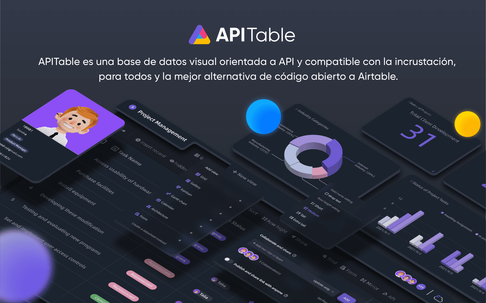
    </a>
</p>

<p align="center">
    <!-- Gitpod -->
    <a target="_blank" href="https://gitpod.io/#https://github.com/apitable/apitable">
        
    </a>
    <!-- NodeJS -->
    
    <!-- Java -->
    
    <!-- hub.docker.com-->
    <a target="_blank" href="#Instalación">
        
    </a>
    <!-- Github Release Latest -->
    <a target="_blank" href="https://github.com/apitable/apitable/releases/latest">
        
    </a>
    <!-- Render -->
    <a target="_blank" href="https://render.com/deploy?repo=https://github.com/apitable/apitable">
        
    </a>
    <br />
    <!-- LICENSE -->
    <a target="_blank" href="https://github.com/apitable/apitable/blob/main/LICENSE">
        
    </a>
    <!-- Discord -->
    <a target="_blank" href="https://discord.gg/zYWYTHXR4f">
        
    </a>
    <!-- Twitter -->
    <a target="_blank" href="https://twitter.com/apitable_com">
        
    </a>
    <!-- Github Action Build-->
    <a target="_blank" href="https://github.com/apitable/apitable/actions/workflows/build.yaml">
        
    </a>
    <!-- Better Uptime-->
    <a target="_blank" href="https://apitable.betteruptime.com/">
        
    </a>
</p>

<p align="center">
  <a href="../../../README.md">English</a>
  | 
  <a href="../fr-FR/README.md">Français</a>
  | 
  Español
  | 
  <a href="../de-DE/README.md">Deutsch</a>
  | 
  <a href="../zh-CN/README.md">简体中文</a>
  | 
  <a href="../zh-HK/README.md">繁體中文</a>
  | 
  <a href="../ja-JP/README.md">日本語</a>
</p>

## ✨ Inicio Rápido

Si solo quieres probar APITable [^info], utiliza nuestra versión alojada en la nube en apitable.com.

Si quieres demostrar este proyecto de código abierto de APITable, haz clic aquí para la demo en línea de [⚡️Gitpod](https://gitpod.io/#https://github.com/apitable/apitable).

Si quieres instalar APITable en tu entorno local o en la nube, consulta [💾 Instalación](#Instalación)

Si quieres configurar tu entorno de desarrollo local, lee nuestra guía de [🧑● 💻 Developer Guide](./docs/contribute/developer-guide.md)

Únete a [Discord](https://discord.gg/TwNb9nfdBU) o [Twitter](https://twitter.com/apitable_com) para estar en contacto.
## 🔥 Características

<table>
  
  <tr>
    <th>
      <a href="#">Colaboración en tiempo real</a>
    </th>
    <th>
      <a href="#">Formulario automático</a>
    </th>

  </tr>

   <tr>
    <td width="50%">
      <a href="#">
        
      </a>
    </td>
    <td width="50%">
        <a href="#">
            
        </a>
    </td>
  </tr>

  <tr>
    <th>
      <a href="#">Primer Panel de API</a>
    </th>
    <th>
      <a href="#">Enlaces ilimitados de tabla cruzada</a>
    </th>
</tr>

 <tr>
    <td width="50%">
        <a href="#">
            
        </a>
    </td>
    <td width="50%">
      <a href="#">
        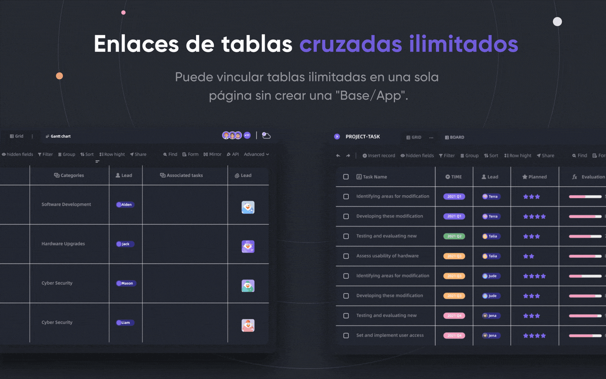
      </a>
    </td>
 </tr>

 <tr>
    <th>
      <a href="#">Permisos de poderosas filas/columnas</a>
    </th>
    <th>
      <a href="#">Embed</a>
    </th>
  </tr>

 <tr>
    <td width="50%">
        <a href="#">
            
        </a>
    </td>
    <td width="50%">
        <a href="#">
            
        </a>
    </td>
  </tr>

</table>

APITable proporciona una amplia gama de características increíbles, desde lo personal hasta la empresa.

- Pila de tecnología avanzada y código abierto
  - `La colaboración en tiempo real` permite a varios usuarios editar juntos en tiempo real, o simultáneamente con el algoritmo `Transformación operacional (OT)`.
  - Interfaz de base de datos-hoja de cálculo extremadamente suave, fácil de usar y súper rápida en el motor de renderizado de `canvas`.
  - Arquitectura nativa de base de datos: Cambios / Operación / Acción / Instantánea y así sucesivamente.
  - **100k+** filas de datos con colaboración en tiempo real.
  - Acceso completo a la API, desde `Datos` hasta `Metadatos`.
  - Vínculo de tabla de una dirección / Bi-dirección y `Enlaces cruzados infinitos`
  - Lenguajes de programación y marco amigables con la comunidad TypeScript ([NextJS](https://nextjs.org/) + [NestJS](https://nestjs.com/)) y Java ([Spring Boot](https://spring.io/projects/spring-boot)).
- Bonito y rico Database-Hoja de cálculo UI
  - `CRUD`: Crear, leer, actualizar, eliminar las tablas, columnas y filas
  - `Operaciones de campos`: ordenar, filtro, agrupar, ocultar/desocultar, ajuste de altura.
  - `Espacio basado en`: Utilice espacios de trabajo separados en lugar de la estructura basada en la aplicación/Base, haga posible el enlace de tablas ilimitadas.
  - `Modo oscuro` y personalización del tema disponible.
  - `7 tipos de vista`: vista en cuadrícula (hoja de datos) / Vista de galería / Mapa mental / vista Kanban / Vista completa de Gantt / Vista de calendario
  - Panel de API en un clic
- Baterías incluidas
  - Plantillas oficiales incorporadas en 10 o más.
  - Automatización de robot y personalización disponibles.
  - Panel de BI
  - Formulario generado por un solo clic
  - Página compartible e incrustable.
  - Soporte múltiple.
  - Integración con n8n.io / Zapier / Appsmith... y más.
- Excelente extensibilidad
  - Extensible `Widget System` con más de 20 oficiales widgets de código abierto.
  - Gráfico personalizable & Gráfico & Panel de control
  - Tipos de columnas de datos personalizables
  - Fórmulas personalizables
  - Acciones de Robot de Automatización personalizables.
- Permisos de grado empresarial
  - `Mirror`, convierte una vista en una réplica para implementar el permiso de fila.
  - Activa `Permiso de Columna` a través de una operación muy simple.
  - Carpetas / Subcarpetas / Permiso de archivos.
  - Carpetas de estructura de árbol y nodo personalizable (archivo);
  - Gestión de equipos & Estructura de la organización.
- Características de la empresa:
  - SAML
  - Inicio de sesión único (SST)
  - Auditoría
  - Copia de seguridad automática de la base de datos
  - Exportador de datos
  - Marca de agua
- ....

Con widgets y plugins extensibles, puedes añadir más características.

## 💥 Usar Casos

¿Por qué debe conocer APITable para su próximo software?

- Como software de supergestión
  - Gestión de proyectos flexible & Tareas / Gestión de incidencias.
  - Gestión de Líder de Mercadeo.
  - CRM más flexible y conectable.
  - Inteligencia de Negocio Flexible (BI).
  - Formularios y encuestas amigables con las personas
  - ERP flexible.
  - Plataforma de código bajo y sin código.
  - ...y más, APITable pone 1000 programas en su bolsillo.
- Como infraestructura de base de datos visual
  - **Inserte** APITable en sus propias interfaces de software.
  - Base de datos visual con REST API.
  - Panel de administración.
  - Gestión central de la configuración.
  - Base de datos todo en uno que **conecte todo** su software.
  - ...y más, APITable conecta todo.
- También, es de código abierto y extensible

## :✫ ving_hearts: orientado a API

#### API UI Panel

Al hacer clic en el botón `API` en la esquina derecha se mostrará el Panel de la API

#### Consulta similar a SQL

APITable proporcionará un lenguaje de consulta (DQL) en la hoja de datos para consultar el contenido de su hoja de cálculo.

## 💝 amigable con el incrustado

#### Compartir e integrar

Comparte tu tabla o carpeta de la hoja de datos. Los inserte copiando y pegando scripts HTML.

#### Enterprise-ready Embedding

[APITable.com](https://apitable.com) proporciona más características de Incrustación listas para empresas para valores.

## Instalación

Antes de comenzar:
* Se requiere un anfitrión con Docker y Docker Compose v2 instalado.
* Se recomienda tener al menos 4 CPUs/8GB de RAM.
* Se requiere una shell bash con utilidades básicas como curl instaladas.
* Las imágenes de contenedor nativas arm64 (Apple Silicon) aún no están listas y pueden causar un mal rendimiento.

Para instalar apitable usando docker-compose, abra su terminal y ejecute lo siguiente:

```
curl https://apitable.github.io/install.sh | bash
```

Luego abre [http://localhost:80](http://localhost:80) en tu navegador para visitarlo.

También proporcionamos una imagen todo en uno basada en [pm2](https://pm2.keymetrics.io/) para propósitos de demostración o prueba (no recomendada para uso empresarial o producción):

```bash
sudo docker run -d -v ${PWD}/.data:/apitable -p 80:80 --name apitable apitable/all-in-one:latest
```

Dependiendo de su entorno, puede que necesite esperar varios minutos para que todos los servicios comiencen. Esta imagen es sólo amd64 (x86_64), puede encontrarse con un rendimiento bastante malo en arm64 o silicón de manzana.

Si quieres configurar tu entorno de desarrollo local, lee nuestra [🧑● 💻 Developer Guide](./docs/contribute/developer-guide.md)

## 🧑 💻 Contribuyendo

Bienvenido, y gracias por su interés en contribuir a APITable!

Además de escribir código, hay muchas formas en las que puedes contribuir.

Puedes contribuir de la siguiente manera:
- Unirte y modificar traducciones en nuestro proyecto de traducción de [Crowdin](https://crowdin.com/project/apitablecode/invite?h=f48bc26f9eb188dcd92d5eb4a66f2c1f1555185)
- Crear [problemas](https://github.com/apitable/apitable/issues/new/choose)
- Seguir nuestro [Twitter](https://twitter.com/apitable_com)
- Crear [documentación](./docs)
- [Contribuir con código](./docs/contribute/developer-guide.md)


Tal como lo siguiente:
- Join [Crowdin Translation Project](https://crowdin.com/project/apitablecom/invite?h=4a985ea532a01d973acc03f2f1c960951693577)
- Crear [issues](https://github.com/apitable/apitable/issues/new/choose)
- Seguir nuestro [Twitter](https://twitter.com/apitable_com)
- Crear [documentación](./docs)
- [Contribuir con código](./docs/contribute/developer-guide.md)


Puede leer las [Directrices de contribución](./CONTRIBUTING.md) de este repositorio para aprender a contribuir.

Aquí hay una guía rápida para ayudarte a contribuir a APITable.


### Medio ambiente de desarrollo

Aprende cómo configurar tu entorno local, visita nuestra [Guía del Desarrollador](./docs/contribute/developer-guide.md).

### Flujo de trabajo Git básico

Aquí hay un flujo de trabajo general APITable git:

1. Cree un problema y describa las características que desea -> [problemas APITables](https://github.com/apitable/apitable/issues)
2. Fork este proyecto -> [Fork proyecto APITable](https://github.com/apitable/apitable/fork)
3. Crea tu rama de características (`git checkout -b my-new-feature`)
4. Comprueba tus cambios (`git commit -am 'Añadir algunas características'`)
5. Publica la rama (`git push origin my-new-feature`)
6. Crear una nueva Pull Request -> [Crear pull request a través de bifurcaciones](https://github.com/apitable/apitable/compare)

### Convenciones de trabajo

Utilizar estas convenciones comunes:

- What's our Git branching model? ¿Cuál es nuestro modelo de sucursal Git? [Gitflow](https://nvie.com/posts/a-successful-git-branching-model/)
- How to collaborate on your fork projects? ¿Cómo colaborar en sus proyectos de bifurcación? [Github Flow](https://docs.github.com/en/get-started/quickstart/github-flow)
- How to write good commit message? ¿Cómo escribir un buen mensaje de confirmación? [Compromisos convencionales](https://www.conventionalcommits.org/)
- What's our changelog format? ¿Cuál es nuestro formato de registro de cambios? [Mantener el registro de cambios](https://keepachangelog.com/en/1.0.0/)
- ¿Cómo versionar y etiquetar? [Versionado semántico](https://semver.org/) [Semantic Versioning](https://semver.org/)
- ¿Qué es la guía de código de Java? [Guía de código Java](https://github.com/alibaba/Alibaba-Java-Coding-Guidelines) | [Plugin Intellij IDEA](https://plugins.jetbrains.com/plugin/10046-alibaba-java-coding-guidelines) ¿Qué es la guía de código de Java? [Guía de código Java](https://google.github.io/styleguide/javaguide.html) | [Plugin Intellij IDEA](https://plugins.jetbrains.com/plugin/8527)
- What is the TypeScript Coding Guideline? ¿Qué es la guía de código de TypeScript? -> [Guía de estilo de TypeScript](https://google.github.io/styleguide/tsguide.html) | [ESLint](https://www.npmjs.com/package/@typescript-eslint/eslint-plugin)

### Documentaciones

- [Centro de ayuda](https://help.apitable.com/)
- [👩‍💻 Centro de Desarrolladores](https://developers.apitable.com/)
  - [► Documentos de API REST](https://developers.apitable.com/api/introduction/)
  - [SDK del Widget](https://developers.apitable.com/widget/introduction/)
  - [Scripting Widget](https://developers.apitable.com/script/introduction/)
- [Design System](https://figma.com/@apitable)

## 🛣 Roadmap

Por favor, consulte el mapa de ruta [de APITable](https://apitable.com/roadmap)

### Características futuras

- Constructor de Interfaz de código pesado
- Componentes de documentación de terceros incrustables
- Idiomas específicos del dominio de SQL
- Como IdP
- Robot de automatización avanzado
- Características Web 3
- ...

### Las versiones Hosted y Enterprise ofrecen características avanzadas

- As an IdP;
- SAML
- Single-Sign-On
- Auditoría
- Copia de seguridad de base de datos
- Integración con ChatGPT, Zapier, Slack, Google Workspace...
- Marca de agua

For more information on our product, including enterprise self-hosted license, please contact us at <support@apitable.com> or [book a demo](https://apitable.com/share/shrdaGGppsfg3pjQLXALG?fldy5ZmHYGZx2=salesteam@apitable.com).

## 👫 Participar

### 🌏 Why we create APITable and open-source?

- Creemos que `la base de datos es la piedra angular` de todo el software.
- Creemos que crear una base de datos visual `con una interfaz de usuario rica y fácil para todos` puede reducir la dificultad de la industria de software e incrementar la adopción de digitalización en el mundo.
- Creemos que el trabajo `APITable` puede `Empujar Seres Humanos hacia adelante`.

### ¡Estamos contratando de forma remota!

Siempre buscamos buenos talentos para APITable:

- **Desarrollador Full-stack**: Tienes experiencia con React, NestJS, TypeScript, Spring Boot, Java, Terraform. Y le gusta escribir código de alta calidad con documentación clara y pruebas unitarias.
- **Desarrollador back-end**: Tiene experiencia con NestJS, TypeScript, Spring Boot, Java, SQL, Kubernetes, Terraform. Y le gusta escribir código de alta calidad con documentación clara y pruebas unitarias.
- **Desarrollador front-end**: Tiene experiencia con React, NextJS, TypeScript, WebPack. And you like to write high quality code with clear documentation and unit tests.

Independientemente del tiempo y condiciones, si desea involucrarse en el equipo de APITable, no dudes en enviar tu CV a [talent@apitable. om](mailto:talent@apitable.com).

## 📺 Captura de pantalla

<p align="center">
    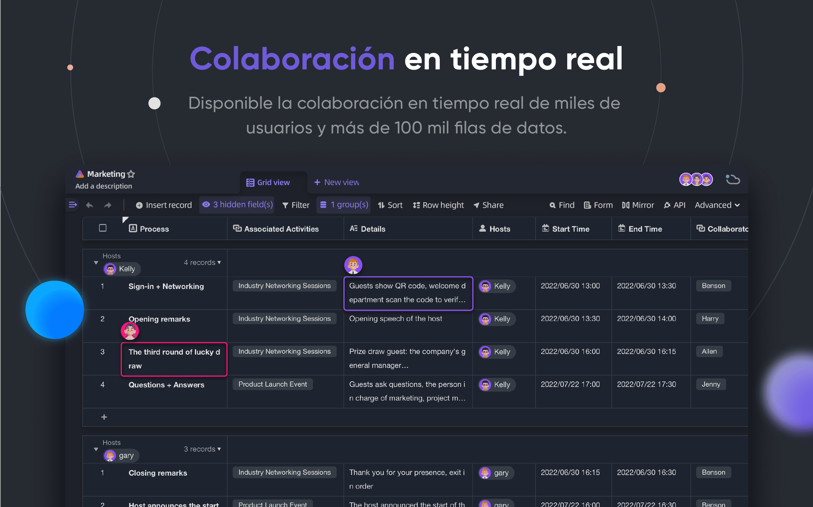
</p>
<p align="center">
    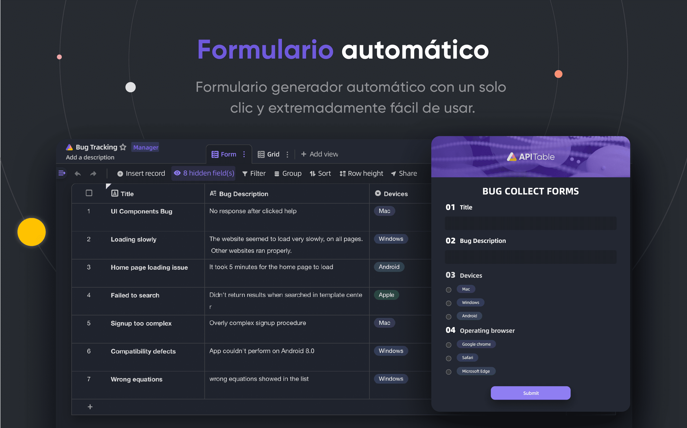
</p>
<p align="center">
    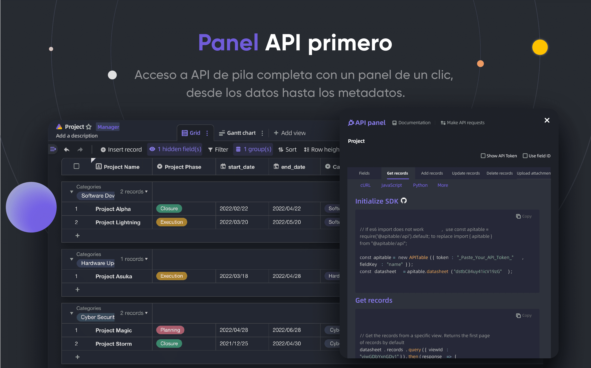
</p>
<p align="center">
    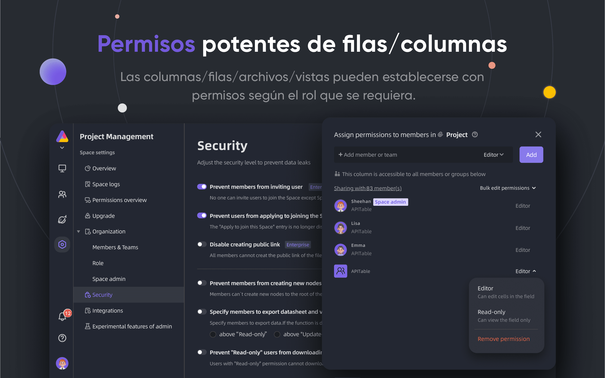
</p>
<p align="center">
    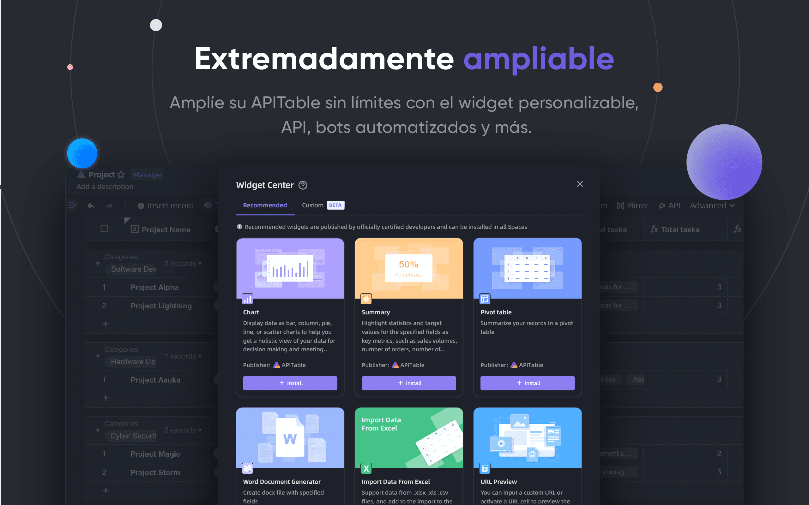
</p>
<p align="center">
    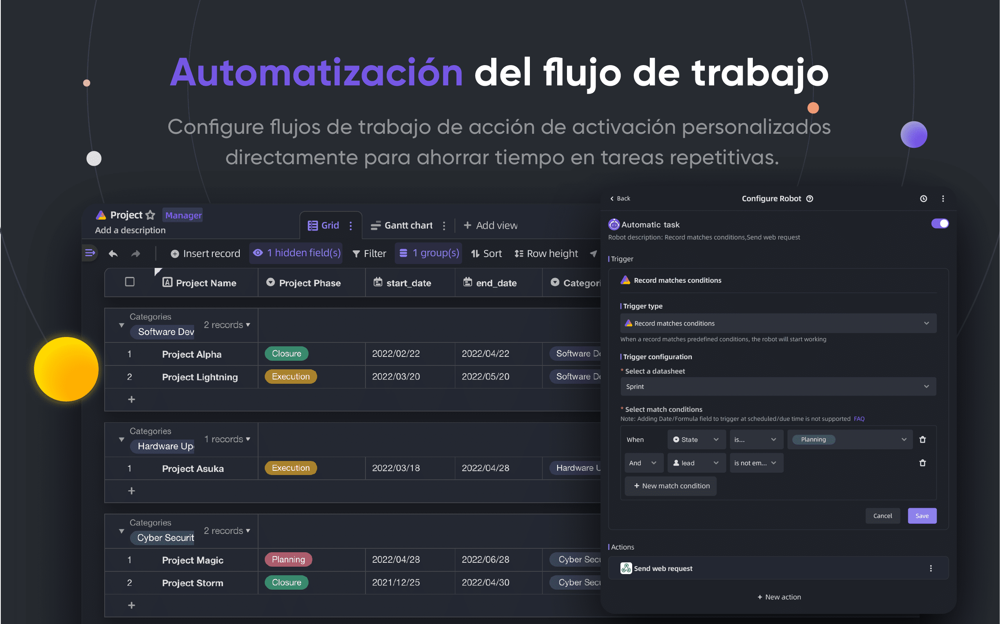
</p>
<p align="center">
    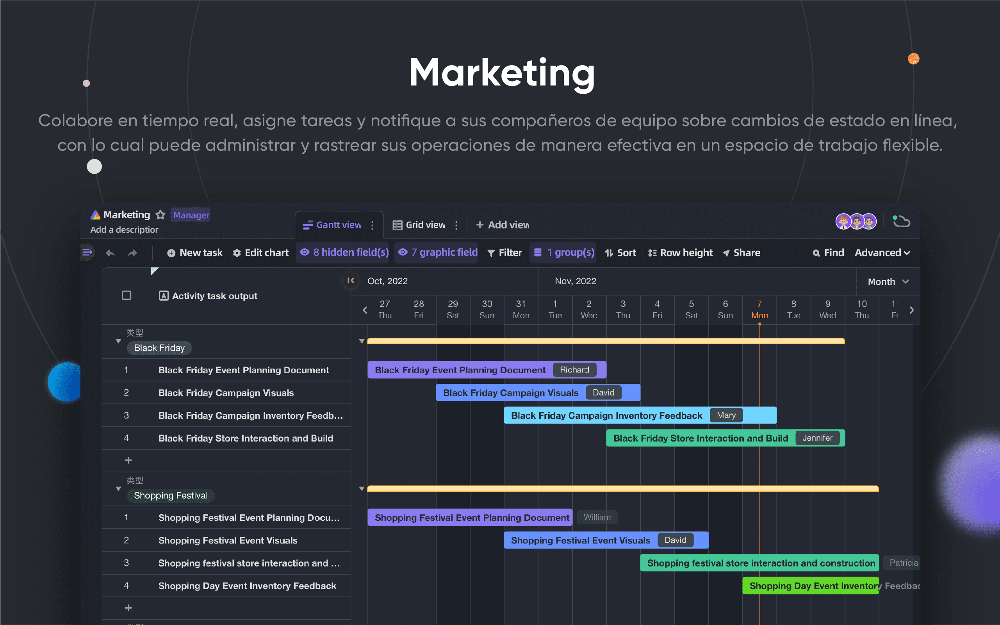
</p>
<p align="center">
    
</p>
<p align="center">
    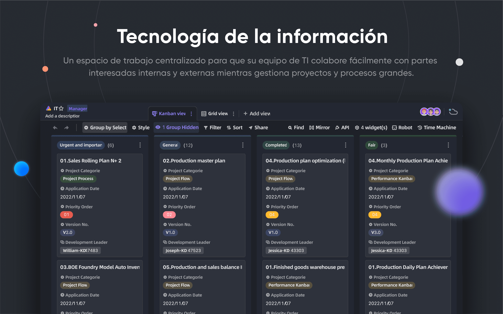
</p>
<p align="center">
    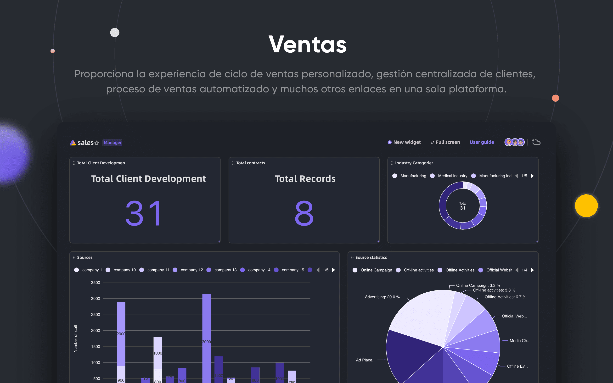
</p>

## 🥰 Licencia

> Este repositorio contiene el código fuente para la edición de código abierto de APITable, publicado bajo el AGPL.
> 
> Si quieres ejecutar tu propia copia de APITable o contribuir al desarrollo, entonces este es el lugar para ti.
> 
> Vea [LICENSACIÓN](./LICENSING.md) para más detalles.
> 
> Si quieres usar APITable en línea, entonces no necesitas ejecutar este código, ofrecemos una versión alojada de la aplicación en [APITable. om](https://apitable.com) que optimizó para el acelerador global.

<br/>

[^info]: Licenciado con AGPL-3.0. Diseñado por [APITable Ltd](https://apitable.com).
