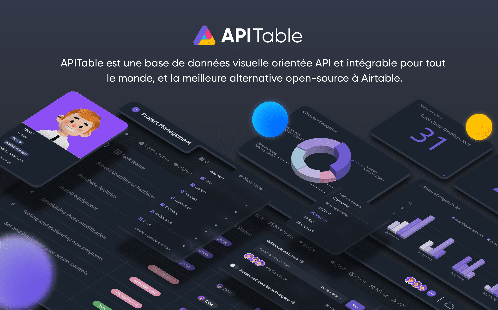
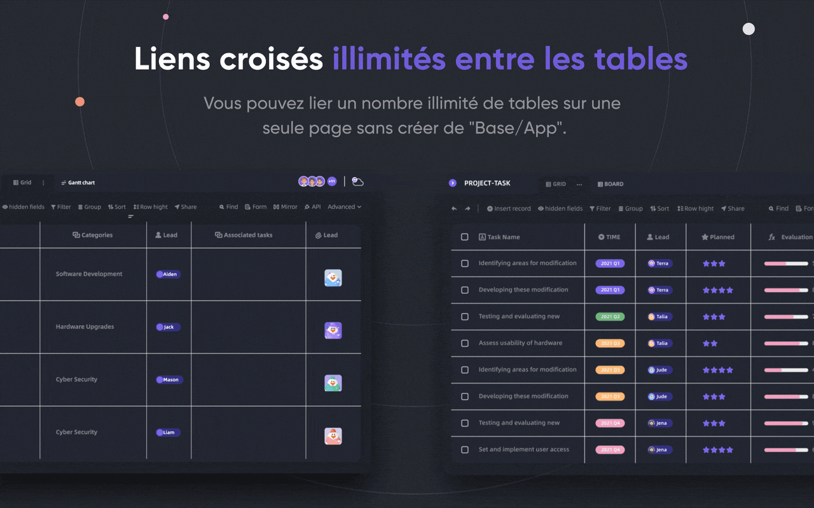
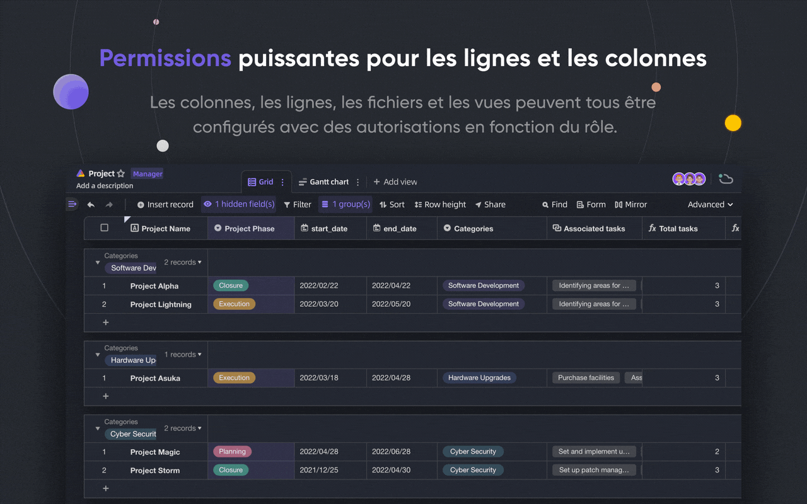
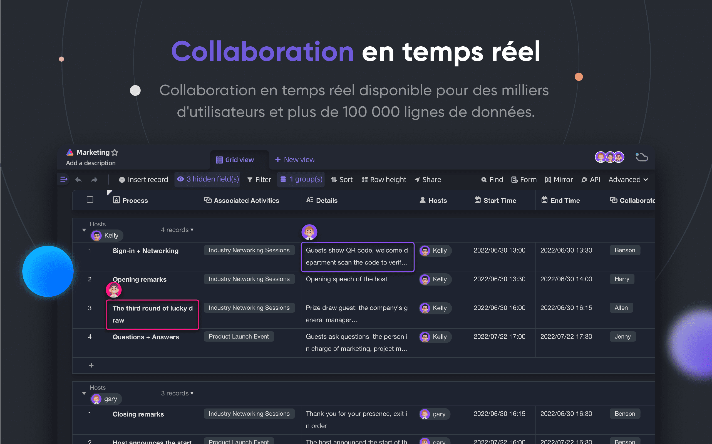
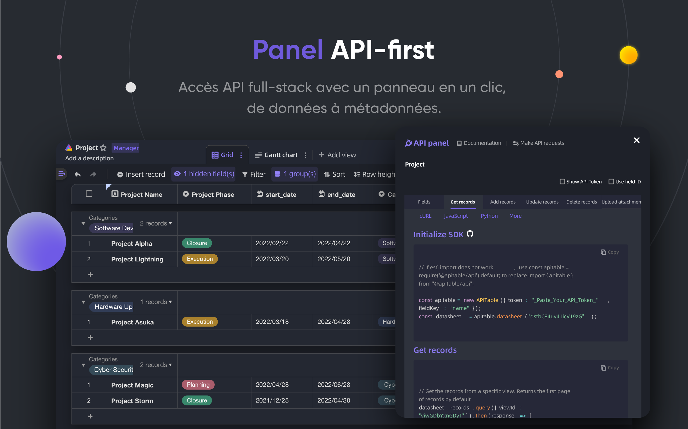
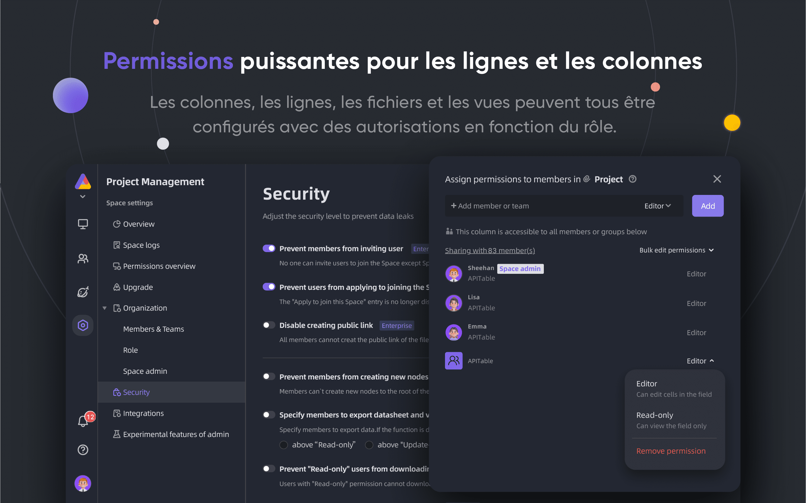
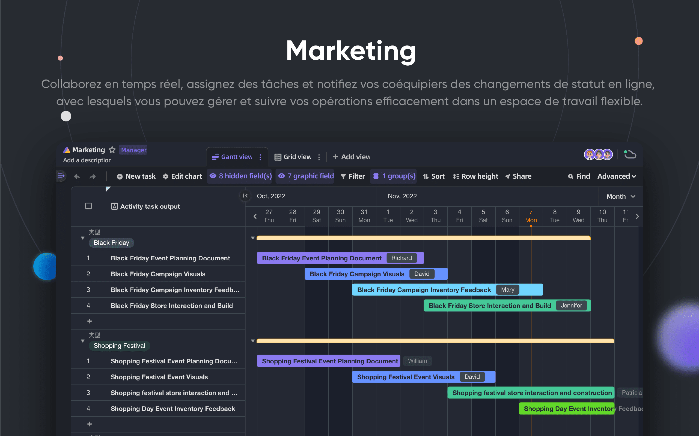
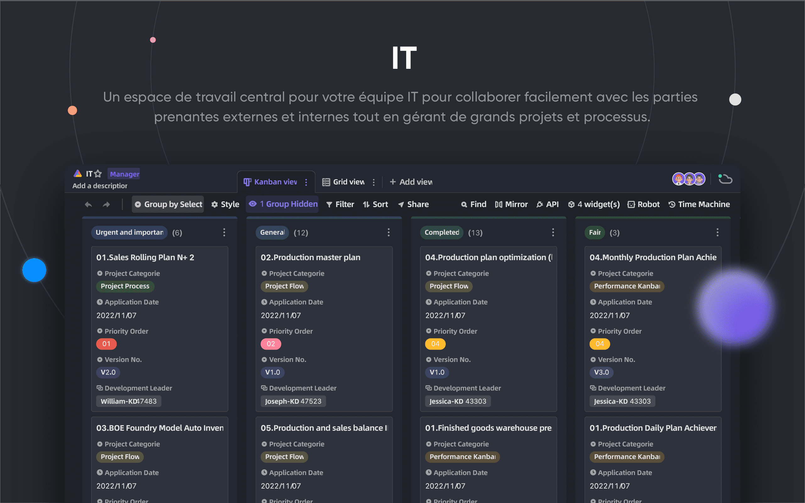
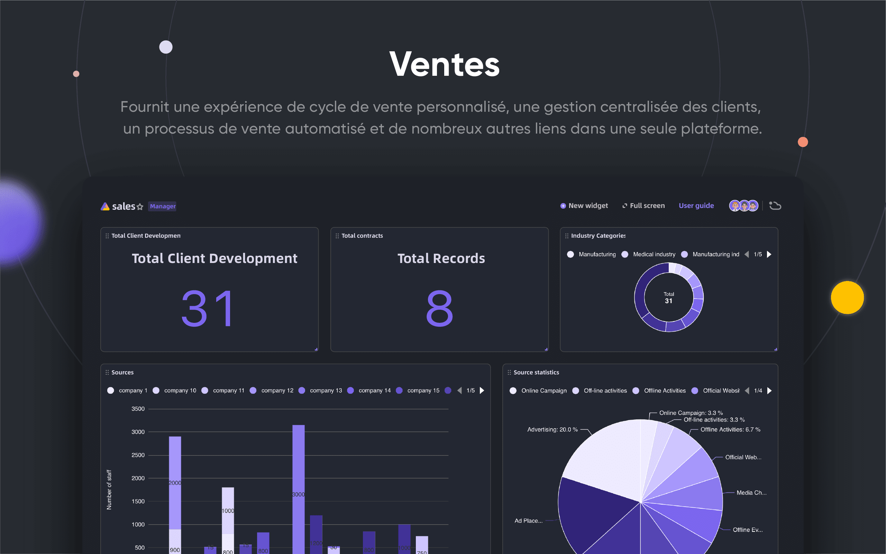

<p align="center">
    <a href="https://apitable.com" target="_blank">
        
    </a>
</p>

<p align="center">
    <!-- Gitpod -->
    <a target="_blank" href="https://gitpod.io/#https://github.com/apitable/apitable">
        
    </a>
    <!-- NodeJS -->
    
    <!-- Java -->
    
    <!-- hub.docker.com-->
    <a target="_blank" href="#installation">
        
    </a>
    <!-- Github Release Latest -->
    <a target="_blank" href="https://github.com/apitable/apitable/releases/latest">
        
    </a>
    <!-- Render -->
    <a target="_blank" href="https://render.com/deploy?repo=https://github.com/apitable/apitable">
        
    </a>
    <br />
    <!-- LICENSE -->
    <a target="_blank" href="https://github.com/apitable/apitable/blob/main/LICENSE">
        
    </a>
    <!-- Discord -->
    <a target="_blank" href="https://discord.gg/zYWYTHXR4f">
        
    </a>
    <!-- Twitter -->
    <a target="_blank" href="https://twitter.com/apitable_com">
        
    </a>
    <!-- Github Action Build-->
    <a target="_blank" href="https://github.com/apitable/apitable/actions/workflows/build.yaml">
        
    </a>
    <!-- Better Uptime-->
    <a target="_blank" href="https://apitable.betteruptime.com/">
        
    </a>
</p>

<p align="center">
  <a href="../../../README.md">English</a>
  | 
  Français
  | 
  <a href="../es-ES/README.md">Español</a>
  | 
  <a href="../de-DE/README.md">Deutsch</a>
  | 
  <a href="../zh-CN/README.md">简体中文</a>
  | 
  <a href="../zh-HK/README.md">繁體中文</a>
  | 
  <a href="../ja-JP/README.md">日本語</a>
</p>

## ✨ Démarrage rapide

Si vous souhaitez simplement essayer APITable1, utilisez notre version hébergée sur le cloud à apitable.com.

If you want to demo this APITable open-source project, click here for [⚡️Gitpod Online Demo](https://gitpod.io/#https://github.com/apitable/apitable).

Si vous voulez installer APITable dans votre environnement de calcul local ou cloud, voir [💾 Installation](#installation)

Si vous voulez configurer votre environnement de développement local, lisez notre [🧑Developer Guide](./docs/contribute/developer-guide.md)

Rejoignez [Discord](https://discord.gg/TwNb9nfdBU) ou [Twitter](https://twitter.com/apitable_com) pour rester en contact.
## 🔥 Fonctionnalités

<table>
  
  <tr>
    <th>
      <a href="#">Collaboration en temps réel</a>
    </th>
    <th>
      <a href="#">Formulaire automatique</a>
    </th>

  </tr>

   <tr>
    <td width="50%">
      <a href="#">
        
      </a>
    </td>
    <td width="50%">
        <a href="#">
            
        </a>
    </td>
  </tr>

  <tr>
    <th>
      <a href="#">Premier panneau d'API</a>
    </th>
    <th>
      <a href="#">Liens de table croisée illimités</a>
    </th>
</tr>

 <tr>
    <td width="50%">
        <a href="#">
            
        </a>
    </td>
    <td width="50%">
      <a href="#">
        
      </a>
    </td>
 </tr>

 <tr>
    <th>
      <a href="#">Autorisations puissantes/colonnes</a>
    </th>
    <th>
      <a href="#">Embed</a>
    </th>
  </tr>

 <tr>
    <td width="50%">
        <a href="#">
            
        </a>
    </td>
    <td width="50%">
        <a href="#">
            
        </a>
    </td>
  </tr>

</table>

APITable offre une gamme de fonctionnalités étonnantes, du personnel à l'entreprise.

- Pile de technologie avancée et open-source
  - `La collaboration en temps réel` permet à plusieurs utilisateurs d'éditer ensemble en temps réel, ou simultanément avec l'Algorithme `Transformation Opérationnelle (OT)`.
  - Interface de feuille de calcul de base de données extrêmement lisse, conviviale et super rapide dans `<canvas> Moteur de rendu`.
  - Architecture native de la base de données: Changeset / Opération / Action / Snapshot et ainsi de suite.
  - **100k+** lignes de données avec collaboration en temps réel.
  - Accès à l'API Full-stack, de `Data` à `Métadonnées`.
  - Lien de table direction / Bi-direction et `Liens Croisés infinis`
  - langages de programmation et cadre conviviaux, TypeScript ([NextJS](https://nextjs.org/) + [NestJS](https://nestjs.com/)) et Java ([Spring Boot](https://spring.io/projects/spring-boot)).
- Feuille de calcul de la base de données magnifique et riche
  - `CRUD`: créer, lire, mettre à jour, supprimer les tableaux, colonnes et lignes
  - `Opérations de champs`: tri, filtre, regroupement, masquer/démasquer, réglage de hauteur.
  - `Basé sur l'espace`: Utilisez des espaces de travail séparés à la place de la structure basée sur l'application/Base, rendant possible la liaison illimitée de tableaux.
  - `Mode sombre` et la personnalisation du thème disponible.
  - `7 Types de vues`: Vue en grille (Datasheet) / Galerie Vue / Vue Mindmap / Vue Kanban / Vue en pleine fonctionnalité Gantt Vue / Vue calendrier
  - Panneau API en un clic
- Batteries incluses
  - Modèles officiels intégrés à plus de 10 modèles.
  - Robot Automation et personnalisation disponibles.
  - Tableau de bord BI
  - Formulaire généré automatiquement en un clic
  - Page partageable et intégrable.
  - Prise en charge multi-langues.
  - Intégration avec n8n.io / Zapier / Appsmith... et plus.
- Excellente extensibilité
  - Extensible `Widget System` avec plus de 20 fonctionnaires widgets open-source.
  - Graphique personnalisable & Graphique & Tableau de bord
  - Types de colonnes de données personnalisables
  - Formulaires personnalisables
  - Actions personnalisables des robots d'automatisation.
- Autorisations pour les entreprises
  - `Miroir`, transformer une vue en miroir pour implémenter la permission de la ligne.
  - Activez `Autorisation de Colonnes` grâce à une opération très simple.
  - Dossiers / Sous-dossiers / Autorisations de fichiers.
  - Dossiers de structure d'arborescence et noeud personnalisable (fichier);
  - Gestion d'équipe & Structure d'organisation.
- Fonctionnalités de l'entreprise:
  - SAML
  - Single Sign-On (SSO)
  - Audit
  - Sauvegarde automatique de la base de données
  - Exportateur de données
  - Watermark
- ....

Avec des widgets extensibles et des plugins, vous pouvez ajouter plus de fonctionnalités.

## 💥 Cas d'utilisation

Pourquoi vous devez connaître APITable pour votre prochain logiciel ?

- En tant que super logiciel de gestion
  - Gestion de projet flexible & Tâches / Gestion des problèmes.
  - Gestion des Responsables Marketing.
  - CRM le plus flexible et connectable.
  - Flexible Business Intelligence (BI).
  - Enquêtes et formulaires conviviaux
  - ERP flexible.
  - Plateforme de code bas et sans code.
  - ...et plus, APITable met 1000 logiciels dans votre poche.
- En tant qu'infrastructure de base de données visuelle
  - **Intégrez** APITable à vos propres interfaces utilisateur logicielles.
  - Base de données visuelle avec API REST.
  - Tableau de bord de l'administration.
  - Gestion de la configuration centrale.
  - Base de données d'entreprise tout-en-un qui **connecte tous vos logiciels**.
  - ...et plus, APITable relie tout.
- En outre, il est open source et extensible

## 💞 orienté API

#### API UI Panel

Cliquer sur le bouton `API` dans le coin droit affichera le panneau API

#### Requête similaire à SQL

APITable fournira un langage de requête de feuilles de données (DQL) pour interroger le contenu de votre feuille de calcul de la base de données.

## 💝 amical

#### Partagez et intégrez

Partagez votre table ou dossier de fiches techniques. Intégrez-les en copiant et collant des scripts HTML.

#### Embedding prêt pour les entreprises

[APITable.com](https://apitable.com) fournit plus de fonctionnalités d'Embedding pour les valeurs mobilières prêtes à l'entreprise.

## Installation

Avant de commencer :
* Un hôte avec docker et docker-compose v2 installés.
* 4 CPUs/8GB RAM ou plus sont recommandés.
* Un shell bash avec des utilitaires de base comme curl installés.
* Les images de conteneurs natives arm64 (apple silicon) ne sont pas encore prêtes et peuvent entraîner de mauvaises performances.

Pour installer apitable en utilisant docker compose, ouvrez votre terminal et exécutez ceci:

```
curl https://apitable.github.io/install.sh | bash
```

Puis ouvrez [http://localhost:80](http://localhost:80) dans votre navigateur pour le visiter.

Nous fournissons également une image tout-en-un basée sur [pm2](https://pm2.keymetrics.io/) à des fins de démonstration ou de test (non recommandé pour les entreprises ou les utilisations de production):

```bash
sudo docker run -d -v ${PWD}/.data:/apitable -p 80:80 --name apitable apitable/all-in-one:latest
```

Selon votre environnement, vous devrez peut-être attendre plusieurs minutes pour que tous les services soient lancés. Cette image est amd64 (x86_64) seulement, vous pouvez rencontrer de très mauvaises performances sur arm64 ou le silicium pomme.

Si vous voulez configurer votre environnement de développement local, lisez notre [🧑Developer Guide](./docs/contribute/developer-guide.md)

## 💻 Contribution

Bienvenue, et merci de votre intérêt à contribuer à APITable!

Il y a de nombreuses façons de contribuer, au-delà de l'écriture de code.

Vous pouvez contribuer de la manière suivante :
- Rejoindre et modifier les traductions dans notre projet de traduction [Crowdin](https://crowdin.com/project/apitablecode/invite?h=f48bc26f9eb188dcd92d5eb4a66f2c1f1555185)
- https://github.com/apitable/apitable/issues/new/choose
- Suivre notre [Twitter](https://twitter.com/apitable_com)
- Créer de la [documentation](./docs)
- [Contribuer au code](./docs/contribute/developer-guide.md)


Such as the following:
- Join [Crowdin Translation Project](https://crowdin.com/project/apitablecom/invite?h=4a985ea532a01d973acc03f2f1c960951693577)
- https://github.com/apitable/apitable/issues/new/choose
- Suivre notre [Twitter](https://twitter.com/apitable_com)
- Créer de la [documentation](./docs)
- [Contribuer au code](./docs/contribute/developer-guide.md)


Vous pouvez lire les [directives de contribution de ce dépôt](./CONTRIBUTING.md) pour apprendre comment contribuer.

Voici un guide rapide pour vous aider à contribuer à APITable.


### Environnement de développement

Pour savoir comment configurer votre environnement local, consultez notre  [Developer Guide](./docs/contribute/developer-guide.md).

### Git workflow basique

Voici un flux de travail général APITable git :

1. Créez un problème et décrivez les fonctionnalités que vous souhaitez -> [Problèmes APITables](https://github.com/apitable/apitable/issues)
2. Fork this project -> [Fork APITable project](https://github.com/apitable/apitable/fork)
3. Créez votre branche de fonctionnalité (`git checkout -b mon-nouvelle fonctionnalité`)
4. Commettre vos modifications (`git commit -am 'Ajouter quelques fonctionnalités'`)
5. Publier la branche (`git push origine mon-nouveau-fonctionnalité`)
6. Créer une nouvelle Pull Request -> [Créer une pull request à travers les forks](https://github.com/apitable/apitable/compare)

### Conventions professionnelles

Utilisez ces conventions communes APITables :

- Quel est notre modèle de branchement Git ? [Gitflow](https://nvie.com/posts/a-successful-git-branching-model/)
- Comment collaborer à vos projets de fork ? [Github Flow](https://docs.github.com/en/get-started/quickstart/github-flow)
- Comment écrire un bon message de commit ? [Commits conventionnels](https://www.conventionalcommits.org/)
- Quel est notre format de changelog ? [Garder le changelog](https://keepachangelog.com/en/1.0.0/)
- Comment versionner et étiqueter ? [Versioning sémantique](https://semver.org/)
- Qu'est-ce que la directive de codage Java ? [Règles de codage Java](https://github.com/alibaba/Alibaba-Java-Coding-Guidelines) | [Plugin Intellij IDEA](https://plugins.jetbrains.com/plugin/10046-alibaba-java-coding-guidelines)
- Qu'est-ce que les règles de codage TypeScript ? -> [Guide de style TypeScript](https://google.github.io/styleguide/tsguide.html) | [ESLint](https://www.npmjs.com/package/@typescript-eslint/eslint-plugin)

### Documentations

- [Centre d'aide](https://help.apitable.com/)
- [👩‍💻 Centre de développement](https://developers.apitable.com/)
  - [<unk> Docs REST API](https://developers.apitable.com/api/introduction/)
  - [SDK du widget](https://developers.apitable.com/widget/introduction/)
  - [Scripting Widget](https://developers.apitable.com/script/introduction/)
- [Design System](https://figma.com/@apitable)

## 🛣 Feuille de route

Veuillez vous référer à la [Feuille de route de l'APITable](https://apitable.com/roadmap)

### Fonctionnalités futures

- Constructeur d'interface de code lourd
- Composants de documentation de tiers incorporables
- Langues spécifiques au domaine de type SQL
- En tant qu'IdP
- Robot d'automatisation avancé
- Fonctionnalités Web 3
- ...

### Les versions hébergées et Entreprise offrent des fonctionnalités avancées

- En tant qu'IdP ;
- SAML
- Single-Sign-On
- Audit
- Sauvegarde de la base de données
- Intégrer avec ChatGPT, Zapier, Slack, Google Workspace......
- Watermark

For more information on our product, including enterprise self-hosted license, please contact us at <support@apitable.com> or [book a demo](https://apitable.com/share/shrdaGGppsfg3pjQLXALG?fldy5ZmHYGZx2=salesteam@apitable.com).

## 👫 Get Involved

### 🌏 Pourquoi créer APITable et open-source?

- Nous croyons que la `base de données est la pierre angulaire` de tout le logiciel.
- Nous pensons que faire une base de données visuelle `avec une interface utilisateur riche et facile pour tout le monde` peut réduire la difficulté de l'industrie du logiciel et augmenter l'adoption de la numérisation dans le monde.
- Nous pensons que le travail open-sourcing `APITable` peut `pousser les êtres humains vers l'avant`.

### Nous embauchons à distance !

Nous recherchons toujours de bons talents pour APITables :

- **Développeur Full-stack**: Vous avez de l'expérience avec React, NestJS, TypeScript, Spring Boot, Java, Terraform. Et vous aimez écrire du code de haute qualité avec une documentation claire et des tests unitaires.
- **Développeur Back-end**: Vous avez de l'expérience avec NestJS, TypeScript, Spring Boot, Java, SQL, Kubernetes, Terraform. Et vous aimez écrire du code de haute qualité avec une documentation claire et des tests unitaires.
- **Développeur Front-end**: Vous avez de l'expérience avec React, NextJS, TypeScript, WebPack. And you like to write high quality code with clear documentation and unit tests.

Indépendamment du temps et des conditions, si vous voulez vous impliquer dans l'équipe d'APITable, n'hésitez pas et envoyez votre CV à [talent@apitable. om](mailto:talent@apitable.com).

## 📺 Capture d'écran

<p align="center">
    
</p>
<p align="center">
    
</p>
<p align="center">
    
</p>
<p align="center">
    
</p>
<p align="center">
    
</p>
<p align="center">
    
</p>
<p align="center">
    
</p>
<p align="center">
    
</p>
<p align="center">
    
</p>
<p align="center">
    
</p>

## 🥰 Licence

> Ce dépôt contient le code source de l'édition Open Source d'APITable, publiée sous l'AGPL.
> 
> Si vous voulez faire tourner votre propre copie d'APITable ou contribuer au développement, alors c'est l'endroit pour vous.
> 
> Voir [LICENCE](./LICENSING.md) pour plus de détails.
> 
> Si vous voulez utiliser APITable en ligne alors vous n'avez pas besoin d'exécuter ce code, nous offrons une version hébergée de l'application à [APITable. om](https://apitable.com) qui a optimisé pour l'accélération globale.

<br/>

[^info]: Licensed with AGPL-3.0. Designed by [APITable Ltd](https://apitable.com).
