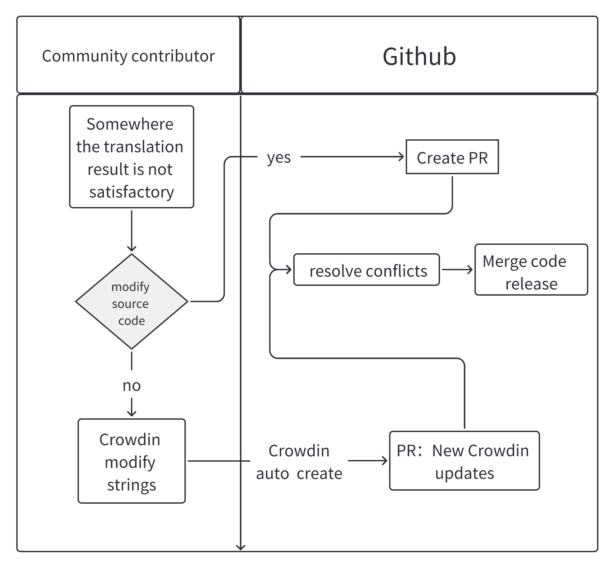

# Guide du développeur

Ce guide vous aide à démarrer le développement d'APITable.

## Dépendances

Before you start contributing to APITable, make sure you have the following tools and programming languages installed.

Required tools:

- `git`
- [docker](https://docs.docker.com/engine/install/)
- [docker-compose v2](https://docs.docker.com/engine/install/)
- `make`

Required programming languages:

- Nodejs 16.15
- Java 8
- Rust (nightly)
- Python 3.7 or above
- A proper C/C++ compiler toolchain, e.g. GCC 4.8 or above, Clang 3.5 or above.

The following subsections show the recommended way to install these dependencies. Note that on MacOS some libraries are also required, see the MacOS subsection for more information.

### Programming Languages

If you are using MacOS or Linux. We recommend `sdkman` and `nvm` for managing the versions of Java and NodeJS respectively.

```bash
# installation rapide nvm
curl -o- https://raw.githubusercontent.com/nvm-sh/nvm/v0.39.2/install.sh | frapper
# sdkman d'installation rapide
curl -s "https://get.sdkman.io" | frapper
# installer nodejs
nvm install 16.15.0 && nvm use 16.15.0 && corepack enable
# installer le kit de développement java
installation de l'env du SDK
# installer la chaîne d'outils de rouille
curl -sSf https://sh.rustup.rs | sh -s -- --default-toolchain nightly --profile minimal -y && source "$HOME/.cargo/env"
```

On MacOS and Linux, Python is usually pre-installed, but its version may not meet the requirement. You can run `python --version` to check out the version of the built-in Python, if it is below 3.7, see below for the commands to install the required Python version on various systems.

### MacOS

Nous vous recommandons d'utiliser [Homebrew](https://brew.sh/) pour installer les dépendances manquantes :

```bash
## necessary required
brew install git
brew install --cask docker
brew install make
brew install pkg-config cairo pango libpng jpeg giflib librsvg pixman
brew install gcc
brew install python3
```

### Linux

On CentOS / RHEL or RHEL-based Linux distributions, use `yum`:

```bash
sudo yum install git
# This will install GCC toolchain and Make
sudo yum groupinstall 'Development Tools'
sudo yum install python3
```

On Ubuntu / Debian or Debian-based Linux distributions, use `apt`:

```bash
sudo apt update
sudo apt install git
# This will install GCC toolchain and Make
sudo apt install build-essential
sudo apt install python3
```

On ArchLinux or Arch-based Linux distributions, use `pacman`:

```bash
sudo pacman -Syyu git base-devel python3
```


### Les fenêtres

Si vous exécutez APITable sur Windows 10/11, nous vous recommandons d'installer [Docker Desktop sur Windows](https://docs.docker.com/desktop/install/windows-install/), \[Ubuntu sur WSL\](https:/ /ubuntu.com/wsl) et [Terminal Windows](https://aka.ms/terminal), Vous pouvez en savoir plus sur le sous-système Windows pour Linux (WSL) sur [le site officiel](https://learn.microsoft.com/en-us/windows/wsl).

Installez les dépendances manquantes sur Ubuntu en utilisant `apt` :

```bash
sudo apt update
sudo apt install git
# This will install GCC toolchain and Make
sudo apt install build-essential
sudo apt install python3
```


## What build tools do we use?

We use `make` as our centric build tool entry that drives other build tools like `gradle` / `npm` / `yarn`.

So you can just enter `make` command and see all build commands:

```bash
make
```


## How to start the development environment?

APITable se compose de 3 processus :

1. backend-server
2. room-server
3. web-server

Pour démarrer l'environnement de développement localement, exécutez ces commandes :

```bash
# démarrer les bases de données dans dockers
make dataenv 

# install dependencies
make install 

#start backend-server
make run # enter 1  

# puis basculer vers un nouveau terminal
# start room-server
make run # enter 2

# and then switch to a new terminal
# start web-server
make run # enter 3

```


## Quel IDE devez-vous utiliser ?

Nous vous recommandons d'utiliser `Visual Studio Code` ou `Intellij IDEA` pour votre IDE.

APITable a préparé les configurations de débogage de ces deux IDE.

Ouvrez simplement le répertoire racine d'APITable avec IDE.


## How to contribute to translations?

Nous avons deux façons d'améliorer la traduction de APITable :

1. Vous pouvez modifier les fichiers markdown dans le code source et créer une PR directement
2. Join our [Crowdin](https://crowdin.com/project/apitablecom) to find the `strings` to modify

Also, for the text of the UI, you can change the `strings` in code files directly, they are located at（Different languages correspond to different language files）:

1. packages/l10n/base/strings.zh-HK.json
2. packages/l10n/base/strings.ja-JP.json
3. ...

Dans la collaboration de la traduction multilingue, nous suivons le processus suivant :



## Comment configurer le serveur SMTP ?

Par défaut, APITable ne configure pas le serveur SMTP, ce qui signifie que vous ne pouvez pas inviter d'utilisateurs car il nécessite la fonctionnalité d'envoi d'e-mails.

Il est nécessaire de modifier la configuration `.env` à l'aide de l'email et de redémarrer le serveur backend.

```
MAIL_ENABLED=vrai
MAIL_HOST=smtp.xxx.com
MAIL_PASSWORD=votre_email_mot de passe
MAIL_PORT=465
MAIL_SSL_ENABLE=vrai
MAIL_TYPE=smtp
MAIL_USERNAME=votre_email
```

De plus, certaines boîtes aux lettres doivent être activées en arrière-plan pour utiliser smtp. Pour plus de détails, vous pouvez rechercher le didacticiel smtp de la boîte aux lettres xxx.


## Problème de performances sous macOS M1 docker run ?

## Où est la documentation de l'API ?

Vous pouvez accéder à la documentation de l'API en démarrant un serveur local :

1. L'adresse de la documentation du backend-server est : http://localhost:8081/api/v1/doc.html

2. L'adresse de documentation pour le room-server est :http://localhost:3333/nest/v1/docs

Si vous êtes intéressé par les interfaces API des services cloud, vous pouvez également accéder directement à la documentation API en ligne à l'adresse https://developers.apitable.com/api/introduction.

## Comment définir la limitation de la quantité de widgets dans le tableau de bord ? (30 par défaut)

Ceci peut être réalisé en définissant le paramètre `DSB_WIDGET_MAX_COUNT` dans le fichier `.env`.

## Puis-je augmenter la limite du taux de requêtes de l'API ? (5 par défaut)

Dans le fichier `.env.default` de `room-server`, il y a deux paramètres qui peuvent ajuster la fréquence des requêtes :

1. Vous pouvez définir `LIMIT_POINTS` et `LIMIT_DURATION` pour indiquer le nombre de demandes pouvant être effectuées dans une période unitaire. Où LIMIT_POINTS est le nombre de fois et LIMIT_DURATION est la durée, mesurée en secondes.

2. Vous pouvez définir le paramètre `LIMIT_WHITE_LIST` pour définir une fréquence de demande distincte pour des utilisateurs spécifiques. Sa valeur est une chaîne JSON et sa structure peut faire référence à `Map<string, IBaseRateLimiter>`.

## Comment augmenter le nombre d'enregistrements insérés par appel API ? (10 par défaut)

Ceci peut être réalisé en définissant le paramètre `API_MAX_MODIFY_RECORD_COUNTS` dans le fichier `.env.default` de `room-server`.


## Comment mettre à niveau vers la dernière version ?


## Comment changer le port 80 par défaut ?
Les propriétés de configuration dans le fichier `.env` peuvent également être remplacées en les spécifiant env vars `NGINX_HTTP_PORT`

Par exemple. Il serait défini comme NGINX_HTTP_PORT=8080

## How to add supported Languages?

To add a new language to APITable, follow these steps:

1. Determine the code of the language to be added, for example `uk-UA`.
2. Add new language files in the `packages/l10n/base/` directory. For example, create a file named `strings.uk-UA.json`.
3. List the value keys for translation in the new language file, following the format of strings.en-US.json.
4. Add the language item in `packages/l10n/base/language.manifest.json`.
    ```json
    {
      "en-US": "English",
      "uk-UA": "українська",
      "zh-CN": "简体中文"
    }
    ```
5. Once the translation is complete, execute the command: `make l10n-apitable-ce`.

By following these steps, you can easily add support for new languages to your project.
