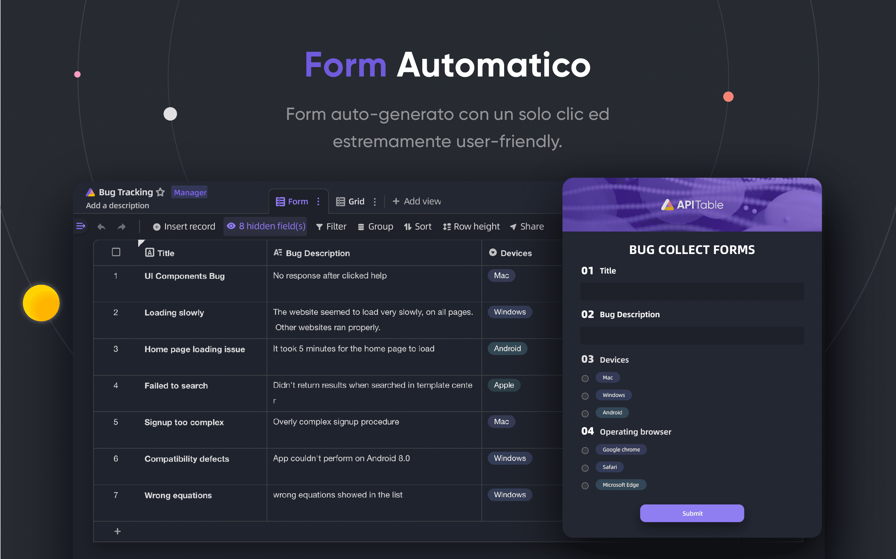
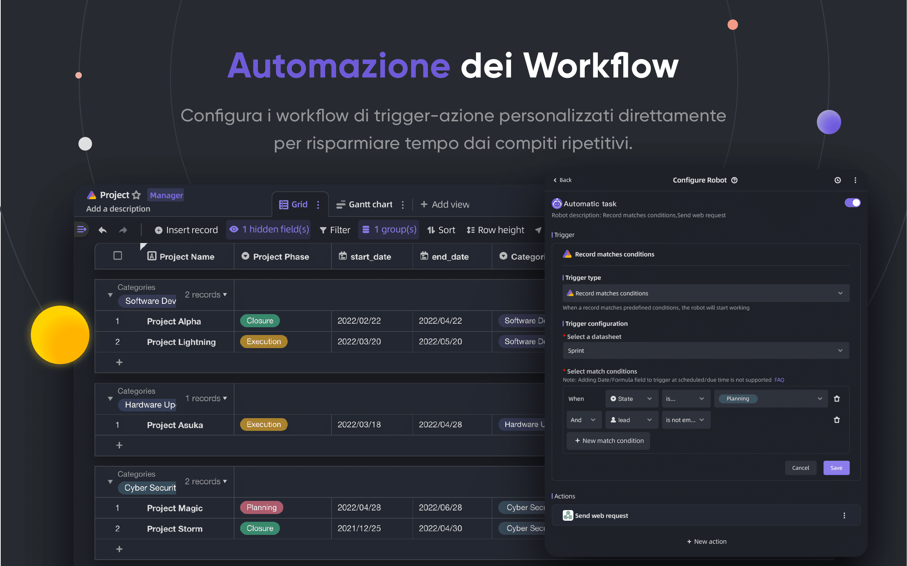

<p align="center">
    <a href="https://apitable.com" target="_blank">
        
    </a>
</p>

<p align="center">
    <!-- Gitpod -->
    <a target="_blank" href="https://gitpod.io/#https://github.com/apitable/apitable">
        
    </a>
    <!-- NodeJS -->
    
    <!-- Java -->
    
    <!-- hub.docker.com-->
    <a target="_blank" href="#Installazione">
        
    </a>
    <!-- Github Release Latest -->
    <a target="_blank" href="https://github.com/apitable/apitable/releases/latest">
        
    </a>
    <!-- Render -->
    <a target="_blank" href="https://render.com/deploy?repo=https://github.com/apitable/apitable">
        
    </a>
    <br />
    <!-- LICENSE -->
    <a target="_blank" href="https://github.com/apitable/apitable/blob/main/LICENSE">
        
    </a>
    <!-- Discord -->
    <a target="_blank" href="https://discord.gg/zYWYTHXR4f">
        
    </a>
    <!-- Twitter -->
    <a target="_blank" href="https://twitter.com/apitable_com">
        
    </a>
    <!-- Github Action Build-->
    <a target="_blank" href="https://github.com/apitable/apitable/actions/workflows/build.yaml">
        
    </a>
    <!-- Better Uptime-->
    <a target="_blank" href="https://apitable.betteruptime.com/">
        
    </a>
</p>

<p align="center">
  <a href="../../../README.md">English</a>
  | 
  <a href="../fr-FR/README.md">Français</a>
  | 
  <a href="../es-ES/README.md">Español</a>
  | 
  <a href="../de-DE/README.md">Deutsch</a>
  | 
  <a href="../zh-CN/README.md">简体中文</a>
  | 
  <a href="../zh-HK/README.md">繁體中文</a>
  | 
  <a href="../ja-JP/README.md">日本語</a>
</p>

## ✨ Introduzione rapida

Se vuoi solo provare API Table[^info], usa la versione ospitata sul cloud sul sito: [apitable.com](https://apitable.com).

Se vuoi provare questo progetto open-source APITable, clicca qui per [⚡️Gitpod Online Demo](https://gitpod.io/#https://github.com/apitable/apitable).

Se vuoi installare APITable in locale o in un ambiente di cloud computing, guarda [💾 Installazione](#Installazione)

Se si vuole configurare l'ambiente di sviluppo locale, leggi la nostra ì [🧑‍💻 Guida per sviluppatori](./docs/contribute/developer-guide.md)

Unisciti a [Discord](https://discord.gg/TwNb9nfdBU) o [Twitter](https://twitter.com/apitable_com) per restare in contatto.
## 🔥 Funzionalità

<table>
  
  <tr>
    <th>
      <a href="#">Collaborazione In Tempo Reale</a>
    </th>
    <th>
      <a href="#">Moduli automatici</a>
    </th>

  </tr>

   <tr>
    <td width="50%">
      <a href="#">
        
      </a>
    </td>
    <td width="50%">
        <a href="#">
            
        </a>
    </td>
  </tr>

  <tr>
    <th>
      <a href="#">Pannello API-first</a>
    </th>
    <th>
      <a href="#">Unlimited cross-table links</a>
    </th>
</tr>

 <tr>
    <td width="50%">
        <a href="#">
            
        </a>
    </td>
    <td width="50%">
      <a href="#">
        
      </a>
    </td>
 </tr>

 <tr>
    <th>
      <a href="#">Permessi potenti per righe e colonne</a>
    </th>
    <th>
      <a href="#">Incorporato</a>
    </th>
  </tr>

 <tr>
    <td width="50%">
        <a href="#">
            
        </a>
    </td>
    <td width="50%">
        <a href="#">
            
        </a>
    </td>
  </tr>

</table>

APITable offre una serie di funzioni sorprendenti, da quelle personali a quelle aziendali.

- Stack tecnologico avanzato e open-source
  - La collaborazione in tempo reale consente a più utenti di modificare insieme in tempo reale o contemporaneamente con l'algoritmo di trasformazione operativa (OT).
  - Interfaccia database-foglio di calcolo estremamente fluida, facile da usare e superveloce nel motore di rendering canvas.
  - Architettura nativa del database: Changeset / Operation / Action / Snapshot e così via.
  - Oltre 100k righe di dati con collaborazione in tempo reale.
  - Accesso API full-stack, dai dati ai metadati.
  - Collegamento tra tabelle a una o due direzioni e collegamenti incrociati infiniti.
  - Linguaggi di programmazione e framework compatibili con la community, TypeScript ([NextJS](https://nextjs.org/) + [NestJS](https://nestjs.com/)) e Java ([Spring Boot](https://spring.io/projects/spring-boot)).
- Bella e ricca interfaccia database-foglio di calcolo
  - CRUD: Creazione, lettura, aggiornamento, cancellazione di tabelle, colonne e righe
  - Operazioni sui campi: ordinamento, filtro, raggruppamento, nascondimento, impostazione dell'altezza.
  - Basato sullo spazio: Utilizzo di spazi di lavoro separati al posto della struttura basata su App/Base, possibilità di collegare tra loro un numero illimitato di tabelle.
  - Modalità scura e personalizzazione del tema disponibili.
  - 7 tipi di visualizzazione: Vista griglia (foglio dati) / Vista galleria / Vista mappa mentale / Vista Kanban / Vista Gantt completa / Vista calendario
  - Pannello API con un solo clic
- Batterie incluse
  - 10+ modelli ufficiali integrati.
  - Automazione robot e personalizzazione disponibili.
  - Cruscotto BI
  - Modulo generato automaticamente con un solo clic
  - Pagina condivisibile e incorporabile.
  - Supporto multilingue.
  - Integrazione con n8n.io / Zapier / Appsmith... e altro ancora.
- Eccellente estensibilità
  - Sistema di widget estensibile con oltre 20 widget open-source ufficiali.
  - Grafici, diagrammi e cruscotti personalizzabili
  - Tipi di colonne di dati personalizzabili
  - Formule personalizzabili
  - Azioni del robot di automazione personalizzabili.
- Autorizzazioni di livello aziendale
  - Specchio, trasformate una vista in uno specchio per implementare l'autorizzazione di riga.
  - Attivate i permessi di colonna con un'operazione molto semplice.
  - Permessi per cartelle / sottocartelle / file.
  - Struttura ad albero delle cartelle e nodo (file) personalizzabile;
  - Gestione dei team e struttura organizzativa.
- Caratteristiche aziendali:
  - SAML
  - Accesso singolo (SSO)
  - Audit
  - Backup automatico del database
  - Esportatore di dati
  - Watermark
- ....

Grazie ai widget e ai plugin estensibili, è possibile aggiungere altre funzionalità.

## 💥 Casi d'uso

Perché dovete conoscere APITable per il vostro prossimo software?

- Come super software di gestione
  - Gestione flessibile dei progetti e dei compiti / problemi.
  - Gestione dei lead di marketing.
  - Il CRM più flessibile e collegabile.
  - Business Intelligence (BI) flessibile.
  - People-Friendly Forms and Surveys
  - ERP flessibile.
  - Piattaforma low-code e no-code.
  - ... e altro ancora, APITable mette 1000 software in tasca.
- Come infrastruttura di database visuale
  - **Embed** APITable into your own software UIs.
  - Database visivo con API REST.
  - Cruscotto amministrativo.
  - Gestione centrale della configurazione.
  - Database aziendale all-in-one che collega tutti i vostri software.
  - ... e altro ancora, APITable collega tutto.
- Inoltre, è open source ed estensibile.

## 💞 Orientato alle API

#### Pannello API UI

Facendo clic sul pulsante API nell'angolo destro viene visualizzato il pannello API.

#### Query di tipo SQL

APITable fornisce un Datasheet Query Language (DQL) per interrogare i contenuti del database/foglio di calcolo.

## 💝 Facile da incorporare

#### Condividere e incorporare

Condividete la tabella o la cartella del vostro foglio dati. Incorporateli copiando e incollando gli script HTML.

#### Incorporamento pronto per l'impresa

APITable.com offre ulteriori funzionalità di incorporamento per i titoli.

## Installazione

Prima di iniziare:
* Un host con [docke](https://docs.docker.com/engine/install/) e [docker-compose](https://docs.docker.com/engine/install/) v2 installati.
* Si consigliano 4 CPU/8 GB di RAM o più.
* Una shell bash con utility di base come curl installate.
* Le immagini native dei contenitori arm64 (apple silicon) non sono ancora pronte e potrebbero causare prestazioni scadenti.

Per installare apitable usando docker compose, aprire il terminale ed eseguire questo comando:

```
curl https://apitable.github.io/install.sh | bash
```

Quindi apri [http://localhost:80](http://localhost:80) nel tuo browser per visitarlo.

We also provide an all-in-one image based on [pm2](https://pm2.keymetrics.io/) for demo or testing purpose (not recommended for enterprise or production usage):

```bash
sudo docker run -d -v ${PWD}/.data:/apitable -p 80:80 --name apitable apitable/all-in-one:latest
```

Depending on your environment, you may need to wait several minutes for all the services to start. This image is amd64 (x86_64) only, you may encounter pretty bad performance on arm64 or apple silicon.

Se volete configurare il vostro ambiente di sviluppo locale, leggete il nostro articolo [ 🧑‍💻 Guida allo sviluppo](./docs/contribute/developer-guide.md)

## 🧑‍💻 Contribuire

Benvenuti e grazie per il vostro interesse a contribuire ad APITable!

In addition to writing code, there are many ways for you to contribute.

Potete contribuire come segue:
- Partecipare e modificare le traduzioni nel nostro sito [Progetto di traduzione di Crowdin](https://crowdin.com/project/apitablecode/invite?h=f48bc26f9eb188dcd92d5eb4a66f2c1f1555185)
- Create [Issues](https://github.com/apitable/apitable/issues/new/choose)
- Follow our [Twitter](https://twitter.com/apitable_com)
- Create [Documentation](./docs)
- [Contributing Code](./docs/contribute/developer-guide.md)


Such as the following:
- Join [Crowdin Translation Project](https://crowdin.com/project/apitablecom/invite?h=4a985ea532a01d973acc03f2f1c960951693577)
- Create [Issues](https://github.com/apitable/apitable/issues/new/choose)
- Follow our [Twitter](https://twitter.com/apitable_com)
- Create [Documentation](./docs)
- [Contributing Code](./docs/contribute/developer-guide.md)


Per sapere come contribuire, è possibile leggere le Linee guida per la contribuzione di questo repository.

Ecco una guida rapida per aiutarvi a contribuire ad APITable.


### Ambiente di sviluppo

Per sapere come configurare il proprio ambiente locale, consultare la nostra Guida per gli sviluppatori.

### Flusso di lavoro Git di base

Ecco un flusso di lavoro git generale per APITable:

1. Creare un problema e descrivere le caratteristiche desiderate -> [Problemi di APITable](https://github.com/apitable/apitable/issues)
2. Fornire questo progetto -> [Fornire il progetto APITable](https://github.com/apitable/apitable/fork)
3. Creare il ramo delle funzionalità (git checkout -b my-new-feature)
4. Eseguire il commit delle modifiche (git commit -am 'Add some features')
5. Pubblicare il ramo (git push origin my-new-feature)
6. Creare una nuova richiesta di pull -> [Creare una richiesta di pull attraverso i fork](https://github.com/apitable/apitable/compare)

### Convenzioni di lavoro

APITable utilizza queste convenzioni comuni:

- Qual è il nostro modello di ramificazione Git? [Gitflow](https://nvie.com/posts/a-successful-git-branching-model/)
- Come collaborare ai progetti dei fork? [Github Flow](https://docs.github.com/en/get-started/quickstart/github-flow)
- Come scrivere un buon messaggio di commit? [Impegni convenzionali](https://www.conventionalcommits.org/)
- Qual è il formato del nostro changelog? [Mantenere il changelog](https://keepachangelog.com/en/1.0.0/)
- Come si fa il versioning e il tagging? [Versione semantica](https://semver.org/)
- Cos'è la Java Coding Guideline? [Java Coding Guideline](https://google.github.io/styleguide/javaguide.html) | [Intellij IDEA Plugin](https://plugins.jetbrains.com/plugin/8527)
- Cos'è la linea guida per la codifica di TypeScript? -> [TypeScript Style Guide](https://google.github.io/styleguide/tsguide.html) | [ESLint](https://www.npmjs.com/package/@typescript-eslint/eslint-plugin)

### Documentazione

- [Centro assistenza](https://help.apitable.com/)
- [👩‍💻Centro sviluppatori](https://developers.apitable.com/)
  - [🪡 Documenti API REST](https://developers.apitable.com/api/introduction/)
  - [SDK Widget](https://developers.apitable.com/widget/introduction/)
  - [Scripting Widget](https://developers.apitable.com/script/introduction/)
- [Design System](https://figma.com/@apitable)

## 🛣 Roadmap

Fare riferimento alla [Roadmap of APITable](https://apitable.com/roadmap)

### Caratteristiche future

- Costruttore di interfacce a codice pesante
- Embeddable 3rd party documentation components
- Linguaggi specifici per il dominio simili a SQL
- Come IdP
- Robot di automazione avanzato
- Caratteristiche di Web 3
- ...

### Le versioni Hosted ed Enterprise offrono funzionalità avanzate

- Come IdP;
- SAML
- Firma singola
- Audit
- Backup del database
- Integrazione con ChatGPT, Zapier, Slack, Google Workspace......
- Watermark

For more information on our product, including enterprise self-hosted license, please contact us at <support@apitable.com> or [book a demo](https://apitable.com/share/shrdaGGppsfg3pjQLXALG?fldy5ZmHYGZx2=salesteam@apitable.com).

## 👫 Partecipa

### 🌏 Perché abbiamo creato APITable e open-source?

- Crediamo che il database sia la pietra angolare di tutti i software.
- Crediamo che la creazione di un database visuale con un'interfaccia utente ricca e semplice per tutti possa ridurre le difficoltà dell'industria del software e aumentare l'adozione della digitalizzazione nel mondo.
- Crediamo che l'open-sourcing del lavoro di APITable possa far progredire gli esseri umani.

### Stiamo assumendo da remoto!

Siamo sempre alla ricerca di buoni talenti per APITable:

- Sviluppatore full-stack: Hai esperienza con React, NestJS, TypeScript, Spring Boot, Java, Terraform. E vi piace scrivere codice di alta qualità con una documentazione chiara e test unitari.
- Sviluppatore back-end: Hai esperienza con NestJS, TypeScript, Spring Boot, Java, SQL, Kubernetes, Terraform. E ti piace scrivere codice di alta qualità con una documentazione chiara e test unitari.
- Sviluppatore front-end: Hai esperienza con React, NextJS, TypeScript, WebPack. And you like to write high quality code with clear documentation and unit tests.

Indipendentemente dal tempo e dalle condizioni, se vuoi essere coinvolto nel team di APITable, non esitare e invia il tuo CV a talent@apitable.com.

## 📺 Screenshot

<p align="center">
    
</p>
<p align="center">
    
</p>
<p align="center">
    
</p>
<p align="center">
    
</p>
<p align="center">
    
</p>
<p align="center">
    
</p>
<p align="center">
    
</p>
<p align="center">
    
</p>
<p align="center">
    
</p>
<p align="center">
    
</p>

## 🥰 Licenza

> Questo repository contiene il codice sorgente dell'edizione Open Source di APITable, rilasciato sotto licenza AGPL.
> 
> Se si desidera eseguire la propria copia di APITable o contribuire allo sviluppo, questo è il posto giusto.
> 
> Per i dettagli, vedere  [LICENZA](./LICENSING.md).
> 
> Se si desidera utilizzare APITable online, non è necessario eseguire questo codice; offriamo una versione ospitata dell'applicazione su [APITable.com](https://apitable.com), ottimizzata per l'acceleratore globale.

<br/>

[^info]: Licenza AGPL-3.0. Progettato da [APITable Ltd.](https://apitable.com).
