<p align="center">
    <a href="https://apitable.com" target="_blank">
        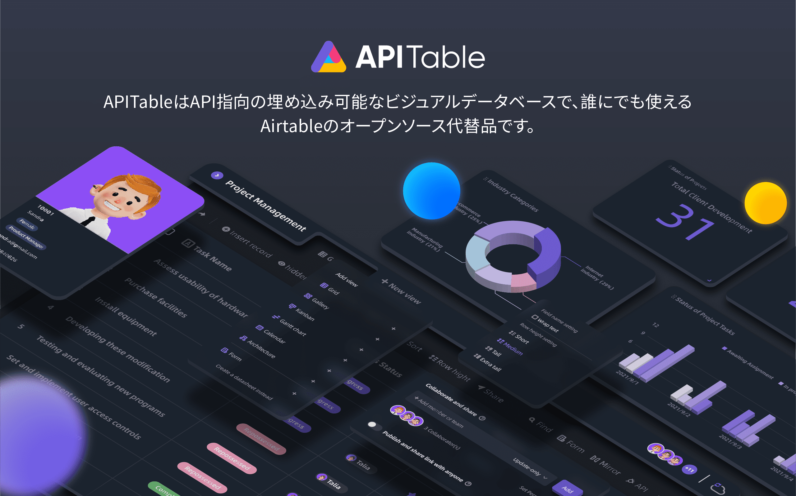
    </a>
</p>

<p align="center">
    <!-- Gitpod -->
    <a target="_blank" href="https://gitpod.io/#https://github.com/apitable/apitable">
        
    </a>
    <!-- NodeJS -->
    
    <!-- Java -->
    
    <!-- hub.docker.com-->
    <a target="_blank" href="#installation">
        
    </a>
    <!-- Github Release Latest -->
    <a target="_blank" href="https://github.com/apitable/apitable/releases/latest">
        
    </a>
    <!-- Render -->
    <a target="_blank" href="https://render.com/deploy?repo=https://github.com/apitable/apitable">
        
    </a>
    <br />
    <!-- LICENSE -->
    <a target="_blank" href="https://github.com/apitable/apitable/blob/main/LICENSE">
        
    </a>
    <!-- Discord -->
    <a target="_blank" href="https://discord.gg/TwNb9nfdBU">
        
    </a>
    <!-- Twitter -->
    <a target="_blank" href="https://twitter.com/apitable_com">
        
    </a>
    <!-- Github Action Build-->
    <a target="_blank" href="https://github.com/apitable/apitable/actions/workflows/build.yaml">
        
    </a>
</p>

<p align="center">
  English
  | 
  <a href="docs/readme/fr-FR/README.md">Français</a>
  | 
  <a href="docs/readme/es-ES/README.md">Español</a>
  | 
  <a href="docs/readme/de-DE/README.md">Deutsch</a>
  | 
  <a href="docs/readme/zh-CN/README.md">简体中文</a>
  | 
  <a href="docs/readme/zh-HK/README.md">繁體中文</a>
  | 
  <a href="docs/readme/ja-JP/README.md">日本語</a>
</p>

## ✨ クイックスタート

> APITableは現在 `作業中`です。
> 
> 最初のリリースは2023年1月下旬に公開されます。
> 
> [Discord](https://discord.gg/TwNb9nfdBU) や [Twitter](https://twitter.com/apitable_com) に参加して連絡を取り合いましょう。<!-- If you just want try out APITable\[^info], using our hosted version at [apitable.com\](https://apitable.com). -->APITable[^info]を試してみたい場合は、 [⚡Gitpod Online Demo](https://gitpod.io/#https://github.com/apitable/apitable) をクリックしてください。

ローカルまたはクラウドコンピューティング環境にAPITableをインストールしたい場合は、 [💾 インストール](#installation) を参照してください。

ローカルの開発環境を設定したい場合は、 [🧑<unk> 💻 開発者ガイド](./docs/contribute/developer-guide.md) をご覧ください。

## 🔥 機能

<table>
  
  <tr>
    <th>
      <a href="#">リアルタイムでのコラボレーション</a>
    </th>
    <th>
      <a href="#">自動フォーム</a>
    </th>

  </tr>

   <tr>
    <td width="50%">
      <a href="#">
        
      </a>
    </td>
    <td width="50%">
        <a href="#">
            
        </a>
    </td>
  </tr>

  <tr>
    <th>
      <a href="#">API第1パネル</a>
    </th>
    <th>
      <a href="#">無制限のクロステーブルリンク</a>
    </th>
</tr>

 <tr>
    <td width="50%">
        <a href="#">
            
        </a>
    </td>
    <td width="50%">
      <a href="#">
        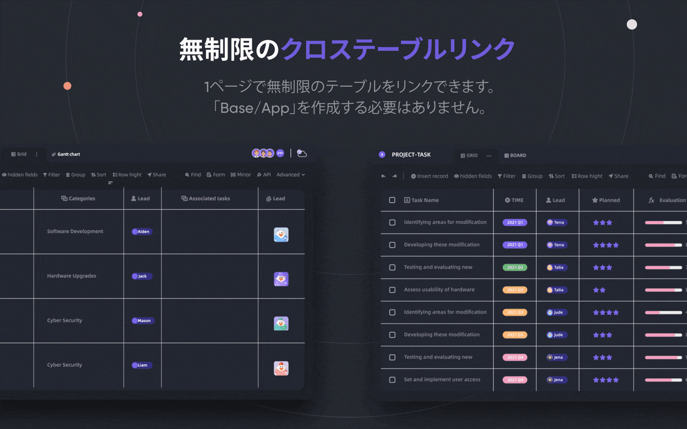
      </a>
    </td>
 </tr>

 <tr>
    <th>
      <a href="#">強力な行/列の権限</a>
    </th>
    <th>
      <a href="#">埋め込み</a>
    </th>
  </tr>

 <tr>
    <td width="50%">
        <a href="#">
            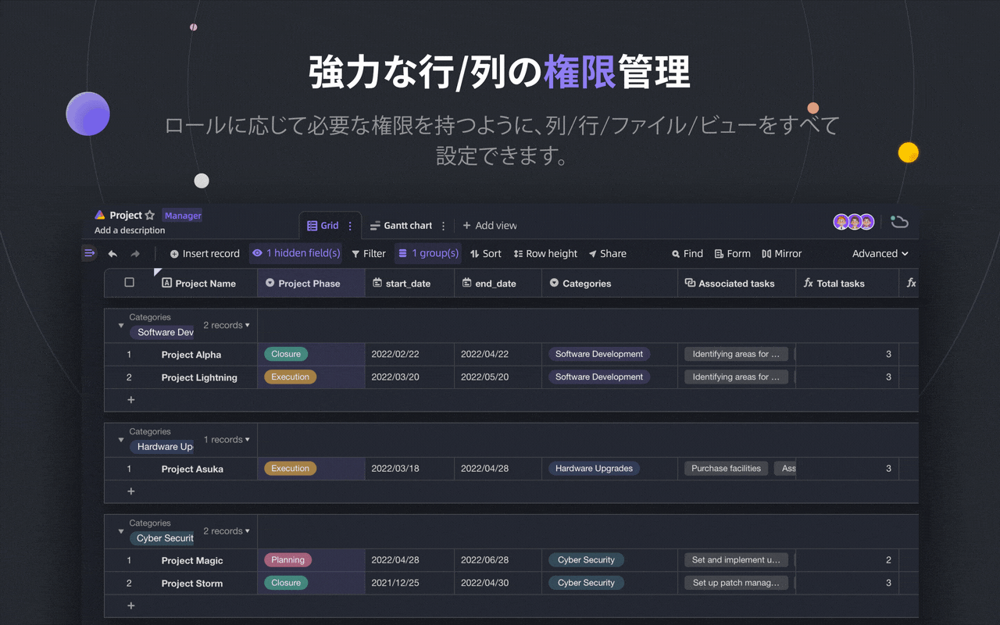
        </a>
    </td>
    <td width="50%">
        <a href="#">
            
        </a>
    </td>
  </tr>

</table>

APITableは、個人から企業まで、さまざまな素晴らしい機能を提供します。

- 高度なテクノロジースタックとオープンソース
  - `リアルタイムコラボレーション` では、複数のユーザーがリアルタイムで、または `運用変換(OT)` アルゴリズムと同時に編集することができます。
  - `<canvas> レンダリングエンジン` で、非常にスムーズで使いやすく、超高速なデータベース表計算インターフェイス。
  - データベースネイティブアーキテクチャ:Changeset / Operation / Action / Snapshotなど。
  - **リアルタイムのコラボレーションによる100k+** データ行。
  - `データ` から `メタデータ` まで、フルスタック API アクセス。
  - 一方向/双方向テーブルリンクと `無限クロスリンク`
  - コミュニティに優しいプログラミング言語とフレームワーク, TypeScript ([NextJS](https://nextjs.org/) + [NestJS](https://nestjs.com/)) and Java ([Spring Boot](https://spring.io/projects/spring-boot))
- 美しくリッチなデータベース表計算用UI
  - `CRUD`: 作成、読み込み、更新、テーブル、列、行の削除
  - `フィールド操作`: ソート、フィルター、グループ化、非表示/非表示、高さ設定。
  - `Space based`: アプリ/ベース構造の代わりに、分離されたワークスペースを使用し、テーブルを無制限にリンクできるようにします。
  - `ダークモード` とテーマのカスタマイズが可能です。
  - `7 種類のビュータイプ`: グリッドビュー (データシート) / ギャラリービュー / マインドマップビュー / カンバンビュー / フル機能 ガントビュー / カレンダー ビュー
  - ワンクリックAPIパネル
- バッテリーが付属しています
  - 10以上の公式テンプレートを内蔵しています。
  - ロボットの自動化と利用可能なカスタマイズ。
  - BI ダッシュボード
  - ワンクリック自動生成フォーム
  - 共有可能で埋め込み可能なページ
  - 多言語対応。
  - n8n.io / Zapier / Appsmith...などとの統合。
- 優れた拡張
  - 20名以上の職員のオープンソースウィジェットを備えた拡張可能な `ウィジェット システム`。
  - カスタマイズ可能なグラフ & チャート & ダッシュボード
  - カスタマイズ可能なデータ列のタイプ
  - カスタマイズ可能な数式
  - カスタマイズ可能な自動化ロボットアクション。
- エンタープライズグレードの権限
  - `ミラー`, ビューをミラーにして、Row Permissionを実装する。
  - 非常に簡単な操作で `列権限` を有効にします。
  - フォルダ/サブフォルダー / ファイルのパーミッション。
  - ツリー構造フォルダとカスタマイズ可能なノード (ファイル);
  - チーム管理 & 組織構造
- エンタープライズ機能：
  - SAML
  - シングルサインオン(SSO)
  - Audit
  - データベースの自動バックアップ
  - データエクスポート
  - ウォーターマーク
- ....

拡張可能なウィジェットとプラグインを使用すると、さらに機能を追加できます。

## 💥 ユース・ケース

次のソフトウェアでAPITableを知る必要があるのはなぜですか?

- スーパーマネージメントソフトウェアとして
  - 柔軟なプロジェクト管理 & タスク/課題管理
  - マーケティングリード管理
  - 最も柔軟で接続可能なCRM。
  - 柔軟なビジネスインテリジェンス(BI)。
  - 人気のフォームと調査
  - 柔軟なERP。
  - ローコードとノーコードプラットフォーム。
  - ...その他、APITable はあなたのポケットに 1000 ソフトウェアを入れています。
- 視覚データベースのインフラストラクチャとして
  - **ご自身のソフトウェアUIに** APITableを埋め込む。
  - REST API を使用したビジュアルデータベース。
  - 管理ダッシュボード
  - 中央の構成管理
  - すべてのソフトウェアを **** 接続するオールインワンエンタープライズデータベース
  - ...その他、APITableはすべてを接続します。
- また、オープンソースで拡張可能

## 💞 API 指定

#### API UI Panel

右隅にある `API` ボタンをクリックすると、API パネル が表示されます。

#### SQL-like query

APITableは、データベースのスプレッドシートの内容を照会するためのDatasheet Query Language(DQL)を提供します。

## 💝 フレンドリーな

#### 共有して埋め込み

データシートのテーブルまたはフォルダを共有します。 HTMLスクリプトをコピーして貼り付けることで埋め込みます。

#### エンタープライズ対応の埋め込み

[APITable.com](https://apitable.com) は、より多くのエンタープライズ対応の組み込み機能をセキュリティに提供します。

## インストール

ローカルに `docker` & `curl` がインストールされていることを確認してください。

Docker Machineがインストールされている場合は、ターミナルを開いて以下を実行してください。

```
curl https://apitable.github.io/install.sh | bash
```

ブラウザで [https://localhost:80](https://localhost:80) を開きます。 (デフォルトのユーザー名 `admin@apitable.com` とパスワード `Apitable2022`)

ローカルの開発環境を設定したい場合は、 [🧑<unk> 💻 開発者ガイド](./docs/contribute/developer-guide.md) をご覧ください。

## 🧑<unk> 💻 コントリビュート

APITableに貢献していただき、ありがとうございます！

コードを書く以外にも、貢献できる方法はたくさんあります。

このリポジトリの [コントリビューションガイドライン](./CONTRIBUTING.md) を読んで、コントリビューションの方法を学ぶことができます。

APITableに貢献するためのクイックガイドはこちらです。

### 開発環境

ローカル環境の設定方法については、 [開発者ガイド](./docs/contribute/developer-guide.md) をご覧ください。

### Git ワークフロー 基本

一般的な APITable git ワークフローは次のとおりです。

1. 課題を作成し、必要な機能を記述してください -> [APITableの問題](https://github.com/apitable/apitable/issues)
2. Fork this project -> [Fork APITable project](https://github.com/apitable/apitable/fork)
3. フィーチャーブランチを作成する (`git checkout -b my-new-feature`)
4. 変更をコミットする (`git commit -am '機能を追加'`)
5. ブランチを公開する (`git push origin my-new-feature`)
6. 新しいプルリクエストを作成する -> [フォーク間でプルリクエストを作成します](https://github.com/apitable/apitable/compare)

### 作業条件

これらの一般的な規約を使用できます。

- Gitのブランチモデルは何ですか？ [Gitflow](https://nvie.com/posts/a-successful-git-branching-model/)
- フォークプロジェクトでコラボレーションする方法は? [Github Flow](https://docs.github.com/en/get-started/quickstart/github-flow)
- 良いコミットメッセージを書く方法は? [従来のコミット](https://www.conventionalcommits.org/)
- 更新履歴のフォーマットは何ですか? [変更履歴を保持](https://keepachangelog.com/en/1.0.0/)
- バージョン管理とタグ付け方法は? [セマンティックバージョン](https://semver.org/)
- Javaコーディングガイドラインとは何ですか? [Java Coding Guideline](https://github.com/alibaba/Alibaba-Java-Coding-Guidelines) | [Intellij IDEA プラグイン](https://plugins.jetbrains.com/plugin/10046-alibaba-java-coding-guidelines)
- TypeScript コーディングガイドラインとは何ですか? -> [TypeScript Style Guide](https://google.github.io/styleguide/tsguide.html) | [ESLint](https://www.npmjs.com/package/@typescript-eslint/eslint-plugin)

### 文書

- [ヘルプセンター](https://help.apitable.com/)
- [👩‍💻 開発者センター](https://developers.apitable.com/)
  - [<unk> REST API ドキュメント](https://developers.apitable.com/api/introduction/)
  - ウィジェット SDK (近日公開予定...)
  - スクリプト (近日公開...)

## 🛣 Roadmap

### 今後の機能

- ヘビーコードインターフェースビルダー
- 埋め込み可能なサードパーティ製ドキュメントコンポーネント
- SQLのようなドメイン固有の言語
- IdPとして
- Web 3の機能
- ...

### Hosted and Enterpriseのバージョンは高度な機能を提供します

- IDPとして;
- SAML
- シングルサインオン
- Audit
- データベースバックアップ
- ウォーターマーク

詳細については、 <support@apitable.com> までご連絡ください。

## 👫 参加する

### 🌏 なぜAPITableでオープンソースを作るのですか?

- 我々は、 `データベースがすべてのソフトウェアの礎石` であると信じています。
- We believe that making a `Visual Database with rich and easy user interface for everyone` can reduce the difficulty of software industry and increase the world's digitalization adoption.
- 私たちは、オープンソーシング `APITable` が `Push Human Beings Forward`を行うことができると信じています。

### 私たちはリモートで雇用しています!

私たちは常にAPITableのために良い才能を探しています:

- **Full-stack 開発者**: React, NestJS, TypeScript, Spring Boot, Java, Terraformの経験があります。 そして、明確なドキュメントと単体テストで高品質のコードを書くのが好きです。
- **バックエンド開発者**: NestJS, TypeScript, Spring Boot, Java, SQL, Kubernetes, Terraformの経験があります。 そして、明確なドキュメントと単体テストで高品質のコードを書くのが好きです。
- **フロントエンド開発者**: React, NextJS, TypeScript, WebPackの経験があります。 そして、明確なドキュメントと単体テストで高品質のコードを書くのが好きです。

Regardless of time and conditions, if you want to get involved to the team of APITable, do not hesitate and send your CV to <talent@apitable.com>.

## 📺 スクリーンショット

<p align="center">
    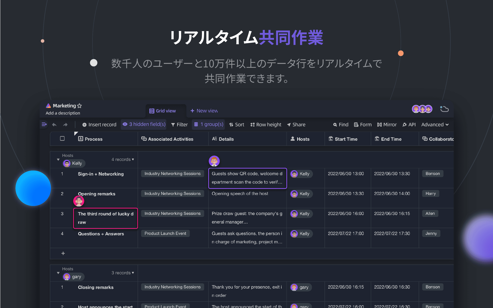
</p>
<p align="center">
    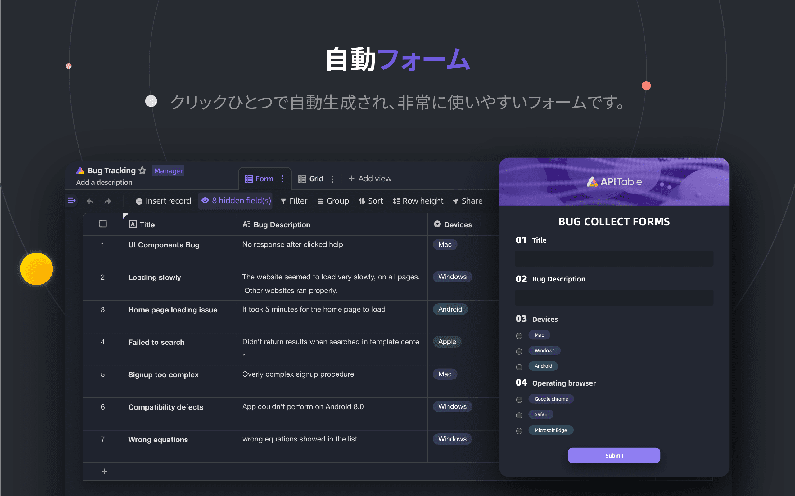
</p>
<p align="center">
    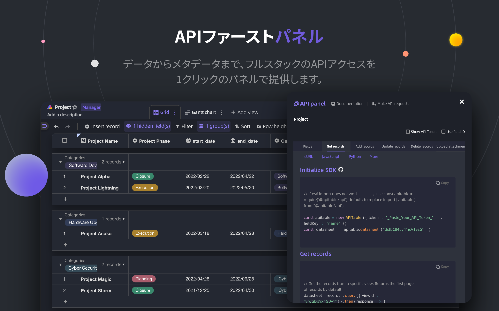
</p>
<p align="center">
    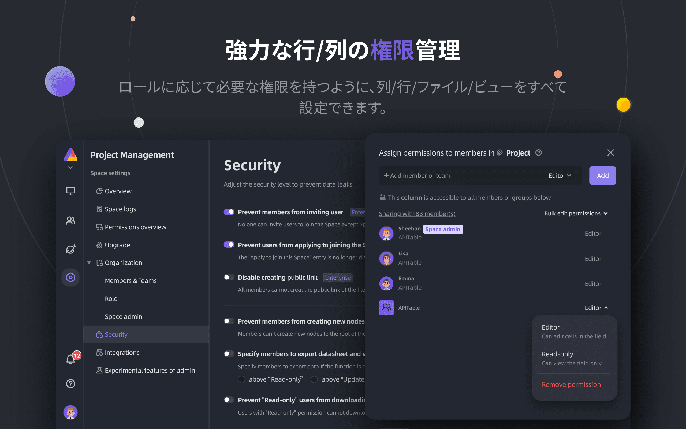
</p>
<p align="center">
    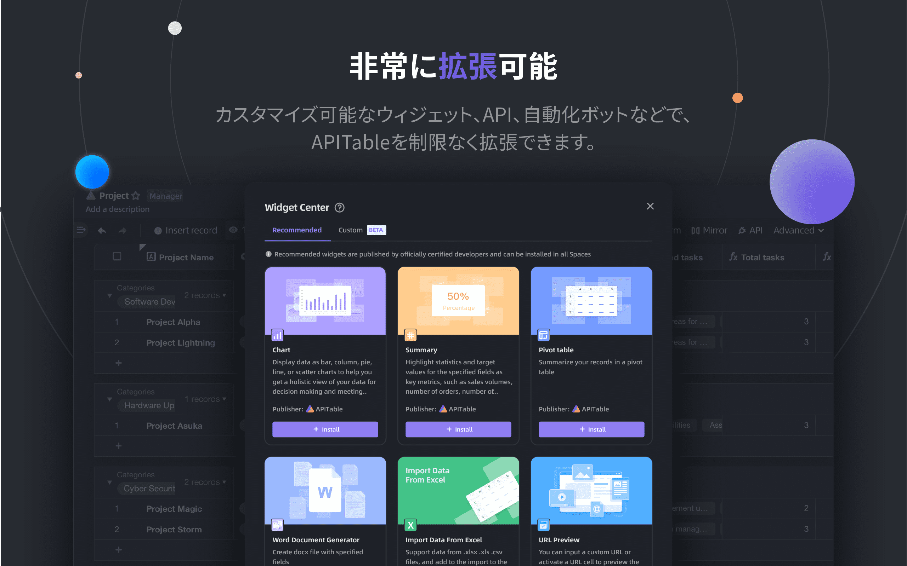
</p>
<p align="center">
    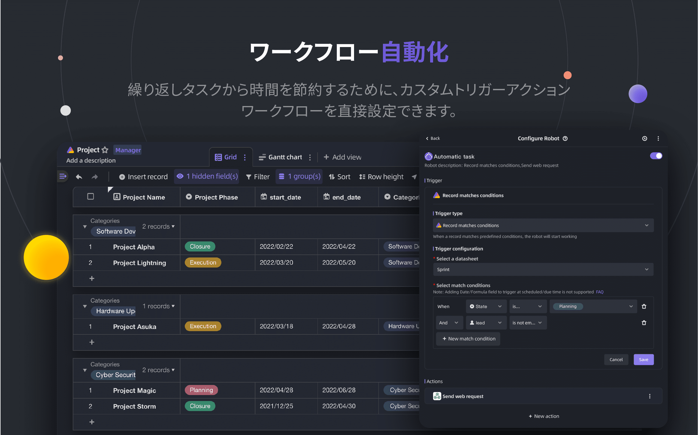
</p>
<p align="center">
    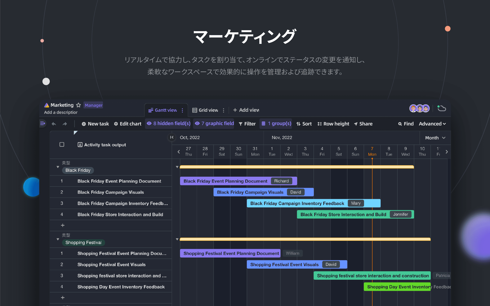
</p>
<p align="center">
    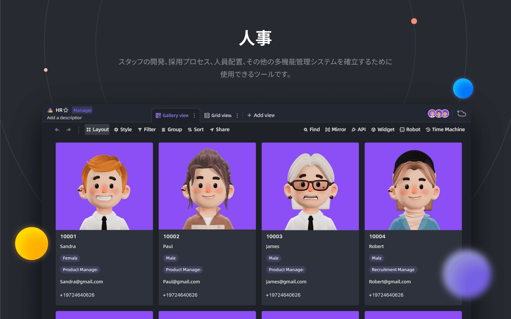
</p>
<p align="center">
    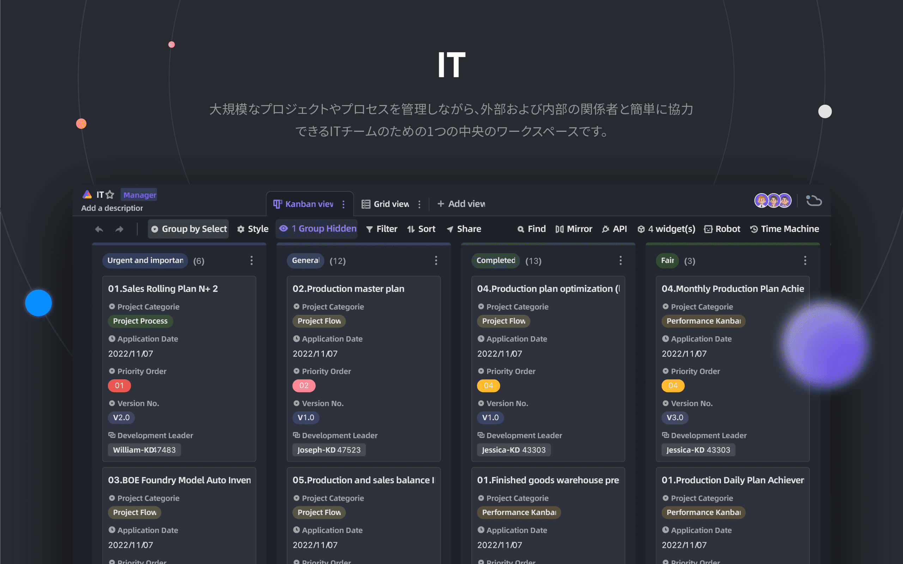
</p>
<p align="center">
    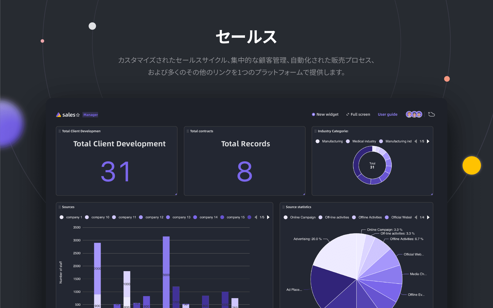
</p>

## 🥰 ライセンス

> このリポジトリには、AGPL に基づいてリリースされた APITable の Open Source エディションのソースコードが含まれています。
> 
> あなた自身のAPITableのコピーを実行したい場合、または開発に貢献したい場合は、これはあなたのための場所です。
> 
> 詳細は [ライセンス](./LICENSING.md) を参照してください。
> 
> If you want to use APITable online then you don't need to run this code, we offer a hosted version of the app at [APITable.com](https://apitable.com) which optimized for global accelerator.

<br/>

[^info]: AGPL-3.0 でライセンスされます。 [APITable Ltd](https://apitable.com).
