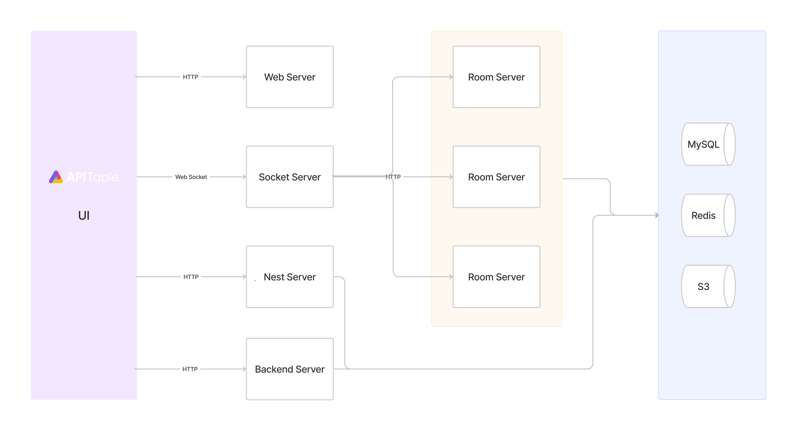

# APITableのアーキテクチャ概要を理解する

APITableは、概念的にはワークベンチとデータシートの2つの部分から構成されます。

ワークベンチはノード、組織、ユーザーのデータを維持し、SSO、監査、スケジューラ、権限サービスなどを提供します。

データシートは、複数の共同作業者が同時にデータシートを操作できるリアルタイムコラボレーションを提供します。 注目すべきは、Reduxで開発されたCoreと呼ばれるコンポーネントライブラリがあることです。 CoreライブラリにはOT計算が含まれており、フロントエンドとバックエンドの両方で使用できます。

より具体的な図は以下の通りです：

- `UI`: 極めてスムーズでユーザーフレンドリーな、超高速のデータベーススプレッドシートインターフェースを提供します。 <canvas> レンダリングエンジン：
- `Web Server`: `Nextjs`を使用して、超高速でSEO対応の静的ウェブサイトとウェブアプリケーションを構築します。
- `Backend Server`: ノード、ユーザー、組織などに関するHTTPリクエストを処理します。
- `Socket Server`: WebSocketプロトコルを介してクライアントと長期的な接続を確立し、双方向通信やリアルタイムコラボレーション、通知などの機能を提供します。
- `Room Server`: データシートの操作（`OTJSON`）を処理し、`Socket Server`とgRPCを介して通信し、また開発者向けのAPIも提供します。
- `Nest Server`: データシート、レコード、ビューなどに関するHTTP GETリクエストを処理します。
- `MySQL`: データシート、レコード、ビューなどの永続的なデータを保存します。
- `Redis`: ログインセッション、ホットデータなどのキャッシュを保存します。
- `S3`: アップロードされたファイルを保存します。