<p align="center">
    <a href="https://apitable.com" target="_blank">
        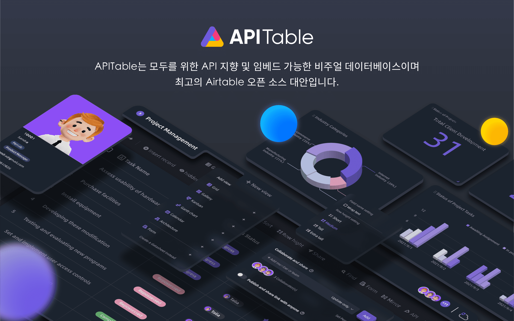
    </a>
</p>

<p align="center">
    <!-- Gitpod -->
    <a target="_blank" href="https://gitpod.io/#https://github.com/apitable/apitable">
        
    </a>
    <!-- NodeJS -->
    
    <!-- Java -->
    
    <!-- hub.docker.com-->
    <a target="_blank" href="#설치">
        
    </a>
    <!-- Github Release Latest -->
    <a target="_blank" href="https://github.com/apitable/apitable/releases/latest">
        
    </a>
    <!-- Render -->
    <a target="_blank" href="https://render.com/deploy?repo=https://github.com/apitable/apitable">
        
    </a>
    <br />
    <!-- LICENSE -->
    <a target="_blank" href="https://github.com/apitable/apitable/blob/main/LICENSE">
        
    </a>
    <!-- Discord -->
    <a target="_blank" href="https://discord.gg/zYWYTHXR4f">
        
    </a>
    <!-- Twitter -->
    <a target="_blank" href="https://twitter.com/apitable_com">
        
    </a>
    <!-- Github Action Build-->
    <a target="_blank" href="https://github.com/apitable/apitable/actions/workflows/build.yaml">
        
    </a>
    <!-- Better Uptime-->
    <a target="_blank" href="https://apitable.betteruptime.com/">
        
    </a>
</p>

<p align="center">
  <a href="../../../README.md">English</a>
  | 
  <a href="../fr-FR/README.md">Français</a>
  | 
  <a href="../es-ES/README.md">Español</a>
  | 
  <a href="../de-DE/README.md">Deutsch</a>
  | 
  <a href="../zh-CN/README.md">简体中文</a>
  | 
  <a href="../zh-HK/README.md">繁體中文</a>
  | 
  <a href="../ja-JP/README.md">日本語</a>
</p>

## ✨ 빠른 시작

만약 APITable 을 시험해보고 싶다면, 클라우드 호스팅 버전인 [apitable.com](https://apitable.com) 을 사용하세요.

만약 APITable 오픈소스 프로젝트를 데모해보고 싶다면, [⚡️Gitpod Online Demo](https://gitpod.io/#https://github.com/apitable/apitable) 에서 확인하세요.

만약 로컬 또는 클라우드 컴퓨팅 환경에 APITable을 설치하고 싶다면, 💾 [설치를](#설치) 참고하세요.

만약 로컬 개발 환경을 설정하고 싶다면, [🧑‍💻개발자가이드를](./docs/contribute/developer-guide.md) 읽으세요.

[Discord](https://discord.gg/TwNb9nfdBU) 또는 [Twitter](https://twitter.com/apitable_com)에 가입하여 최신 소식을 받아보세요.
## 🔥 기능

<table>
  
  <tr>
    <th>
      <a href="#">실시간 협업</a>
    </th>
    <th>
      <a href="#">자동 양식</a>
    </th>

  </tr>

   <tr>
    <td width="50%">
      <a href="#">
        
      </a>
    </td>
    <td width="50%">
        <a href="#">
            
        </a>
    </td>
  </tr>

  <tr>
    <th>
      <a href="#">API-First 패널</a>
    </th>
    <th>
      <a href="#">무제한 교차 테이블 링크</a>
    </th>
</tr>

 <tr>
    <td width="50%">
        <a href="#">
            
        </a>
    </td>
    <td width="50%">
      <a href="#">
        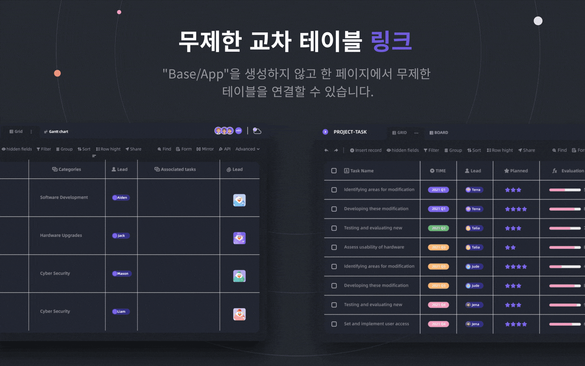
      </a>
    </td>
 </tr>

 <tr>
    <th>
      <a href="#">강력한 행/열 권한</a>
    </th>
    <th>
      <a href="#">임베드</a>
    </th>
  </tr>

 <tr>
    <td width="50%">
        <a href="#">
            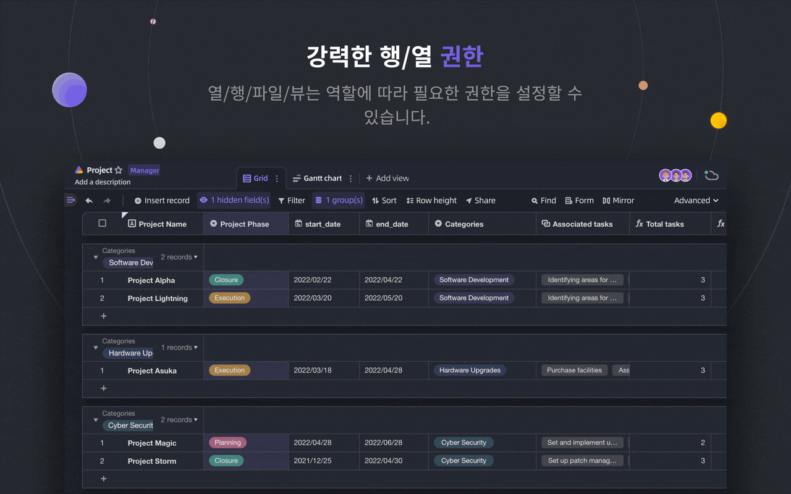
        </a>
    </td>
    <td width="50%">
        <a href="#">
            
        </a>
    </td>
  </tr>

</table>

APITable은 개인부터 기업까지 다양한 기능을 제공합니다.

- 고급 기술 스택 및 오픈소스
  - 실시간 협업: 동시에 여러 사용자가 실시간으로 편집 가능, 또는 동시에 작업할 수 있는 OT(Operational Transformation) 알고리즘 사용
  - canvas 렌더링 엔진에서 매우 부드럽고 사용자 친화적인 초고속 데이터베이스 스프레드시트 인터페이스
  - 데이터베이스 네이티브 아키텍처: Changeset/Operation/Action/Snapshot 등
  - **100k+** data rows with real-time collaboration.
  - 데이터부터 메타데이터까지 모두에 대한 Full-stack API 액세스
  - 단방향/양방향 테이블 링크 및 무한 교차 링크
  - TypeScript(NextJS + NestJS) 및 Java(Spring Boot) 와 같은 커뮤니티 친화적인 프로그래밍 언어 및 프레임워크 사용
- 아름다운 및 풍부한 데이터베이스 스프레드시트 UI
  - CRUD: 테이블, 열 및 행 생성, 읽기, 업데이트, 삭제
  - 필드 작업: 정렬, 필터링, 그룹화, 숨기기/표시, 높이 설정 등
  - 공간 기반: 앱/베이스 기반 구조 대신 별도의 작업 영역을 사용하여 무제한 테이블 링크 가능
  - 다크 모드 및 테마 사용 가능
  - `7개의 뷰 타입`: 그리드 뷰 (데이터 시트) / 갤러리 뷰 / 마인드맵 뷰 / 칸반 뷰 / 풀 기능 간트 뷰 / 캘린더 뷰
  - 원클릭 API 패널
- 배터리 포함
  - 10개 이상의 공식 템플릿이 내장되어 있습니다.
  - 로봇 자동화 및 사용자 정의 가능
  - BI 대시 보드
  - 원클릭 자동 생성 양식
  - 공유 가능하고 임베드 가능한 페이지
  - 다국어 지원
  - n8n.io / Zapier / Appsmith 등과의 통합 등 더 많은 기능 제공
- 뛰어난 확장성
  - 20개 이상의 공식 오픈 소스 위젯을 포함한 확장 가능한 `위젯 시스템`
  - 사용자 정의 가능한 그래프 및 차트 및 대시 보드
  - 사용자 정의 가능한 데이터 열 유형
  - 사용자 정의 가능한 수식
  - 사용자 정의 가능한 자동화 로봇 동작
- 기업급 권한
  - `Mirror`, 행 권한 구현을 위해 뷰를 미러로 전환
  - 매우 간단한 조작을 통해 `Column Permission` 활성화
  - 폴더 / 하위 폴더 / 파일 권한
  - 트리 구조 폴더 및 사용자 정의 노드 (파일)
  - 팀 관리 및 조직 구조
- 기업용 기능
  - SAML
  - Single-Sign-On (SSO)
  - Audit
  - 데이터베이스 자동 백업
  - 데이터 내보내기
  - 워터 마크
- ....

확장 가능한 위젯 및 플러그인을 사용하여 더 많은 기능을 추가할 수 있습니다.

## 💥 사용 사례

APITable을 알아야하는 이유는 무엇인가요?

- 슈퍼 매니지먼트 소프트웨어로서
  - 유연한 프로젝트 관리 및 작업 / 문제 관리.
  - 마케팅 리드 관리.
  - 가장 유연하고 연결 가능한 CRM.
  - 유연한 비즈니스 인텔리전스 (BI).
  - 사용자 친화적인 양식 및 설문 조사
  - 유연한 ERP.
  - 로우코드 및 노코드 플랫폼.
  - ... 그리고 더 많은 것, APITable은 당신의 포켓에 1000개의 소프트웨어를 담습니다.
- 시각적인 데이터베이스 인프라로서
  - APITable을 자신의 소프트웨어 UI에 삽입합니다.
  - REST API와 함께 시각적인 데이터베이스.
  - 관리 대시보드.
  - 중앙 구성 관리.
  - 모든 소프트웨어를 연결하는 올인원 엔터프라이즈 데이터베이스.
  - ... 그리고 더 많은 것, APITable은 모든 것을 연결합니다.
- 또한, 오픈 소스이며 확장 가능합니다.

## 💞 API 지향

#### API UI 패널

오른쪽 모서리에 있는 API 버튼을 클릭하면 API 패널이 표시됩니다.

#### SQL과 유사한 쿼리

APITable은 데이터베이스 스프레드시트 내용을 쿼리하기 위한 데이터 시트 쿼리 언어(DQL)를 제공합니다.

## 💝 Embed-friendly

#### 공유 및 임베드

데이터 시트 테이블이나 폴더를. 공유하고 HTML 스크립트를 복사하여 붙여넣어 임베드할 수 있습니다.

#### Enterprise-ready Embedding

APITable.com은 보안에 더 적합한 기업용 임베드 기능을 제공합니다.

## 설치

시작하기 전에:
* A host with [docker](https://docs.docker.com/engine/install/) and [docker-compose v2](https://docs.docker.com/engine/install/) installed.
* 4개의 CPU/8GB 이상의 RAM을 권장합니다.
* curl과 같은 기본 유틸리티가 설치된 bash 쉘이 필요합니다.
* Native arm64 (애플 실리콘) 컨테이너 이미지는 아직 준비되지 않았으며 성능 문제가 발생할 수 있습니다.

도커 컴포즈를 사용하여 apitable을 설치하려면 터미널을 열고 다음을 실행하십시오:

```
curl https://apitable.github.io/install.sh | bash
```

그런 다음 브라우저에서 http://localhost:80을 열어 방문하십시오.

또한 데모 또는 테스트 목적으로 [pm2](https://pm2.keymetrics.io/) 기반의 올인원 이미지를 제공합니다(엔터프라이즈 또는 프로덕션 용도로는 권장되지 않음).

```bash
sudo docker run -d -v ${PWD}/.data:/apitable -p 80:80 --name apitable apitable/all-in-one:latest
```

환경에 따라 모든 서비스가 시작되는 데 몇 분 정도 기다려야 할 수 있습니다. 이 이미지는 amd64(x86_64) 전용이며 arm64 또는 애플 실리콘에서 성능이 상당히 저하될 수 있습니다.

로컬 개발 환경을 설정하려면 🧑💻 개발자 가이드를 읽으십시오.

## 🧑‍💻 기여하기

APITable에 기여해주신 것에 감사드립니다!

코드 작성 외에도 기여할 수 있는 다양한 방법이 있습니다.

아래와 같이 기여할 수 있습니다:
- 우리의 [Crowdin 번역 프로젝트](https://crowdin.com/project/apitablecode/invite?h=f48bc26f9eb188dcd92d5eb4a66f2c1f1555185)에 참여하여 번역 수정
- [Issue](https://github.com/apitable/apitable/issues/new/choose)를 생성
- 우리의 [Twitter](https://twitter.com/apitable_com)를 팔로우
- [문서](./docs) 작성
- [코드 기여](./docs/contribute/developer-guide.md)


Such as the following:
- Join [Crowdin Translation Project](https://crowdin.com/project/apitablecom/invite?h=4a985ea532a01d973acc03f2f1c960951693577)
- [Issue](https://github.com/apitable/apitable/issues/new/choose)를 생성
- 우리의 [Twitter](https://twitter.com/apitable_com)를 팔로우
- [문서](./docs) 작성
- [코드 기여](./docs/contribute/developer-guide.md)


기여하는 방법에 대해 알아보려면 이 저장소의 [Contributing Guidelines](./CONTRIBUTING.md)을 읽어보세요.

아래는 APITable에 기여하는 방법을 안내하는 빠른 가이드입니다.


### 개발 환경

로컬 환경을 설정하는 방법을 알아보려면 [Developer Guide](./docs/contribute/developer-guide.md)를 참조하세요.

### Git 워크플로우 기본

APITable의 일반적인 Git 워크플로우는 다음과 같습니다:

1. 원하는 기능을 설명하는 이슈를 작성합니다 -> [APITable issues](https://github.com/apitable/apitable/issues)
2. 프로젝트를 포크합니다 -> [Fork APITable project](https://github.com/apitable/apitable/fork)
3. 기능 브랜치를 생성합니다 (`git checkout -b my-new-feature`)
4. 변경 사항을 커밋합니다 (`git commit -am 'Add some features'`)
5. 브랜치를 게시합니다 (`git push origin my-new-feature`)
6. 새로운 풀 리퀘스트를 만듭니다 -> [Create pull request across forks](https://github.com/apitable/apitable/compare)

### 작업 규칙

APITable은 다음과 같은 공통 규칙을 사용합니다:

- Git 브랜칭 모델은 무엇인가요? [Gitflow](https://nvie.com/posts/a-successful-git-branching-model/)
- 포크 프로젝트에서 어떻게 협업하나요? [Github Flow](https://docs.github.com/en/get-started/quickstart/github-flow)
- 좋은 커밋 메시지는 어떻게 작성하나요? [Conventional Commits](https://www.conventionalcommits.org/)
- 변경 로그 형식은 무엇인가요? [Keep Changelog](https://keepachangelog.com/en/1.0.0/)
- 버전 관리와 태그는 어떻게 하나요? [Semantic Versioning](https://semver.org/)
- 자바 코딩 가이드라인은 무엇인가요? [Java Coding Guideline](https://google.github.io/styleguide/javaguide.html) | [Intellij IDEA Plugin](https://plugins.jetbrains.com/plugin/8527)
- 타입스크립트 코딩 가이드라인은 무엇인가요? -> [TypeScript Style Guide](https://google.github.io/styleguide/tsguide.html) | [ESLint](https://www.npmjs.com/package/@typescript-eslint/eslint-plugin)

### 문서화

- [도움말 센터](https://help.apitable.com/)
- [👩‍💻 개발자 센터](https://developers.apitable.com/)
  - [🪡 REST API 문서](https://developers.apitable.com/api/introduction/)
  - [SDK 받기](https://developers.apitable.com/widget/introduction/)
  - [Scripting Widget](https://developers.apitable.com/script/introduction/)
- [Design System](https://figma.com/@apitable)

## 🛣 Roadmap

Consulte la [hoja de ruta de APITable](https://apitable.com/roadmap)

### 미래 기능

- Heavy-code 인터페이스 빌더
- 임베디드 가능한 3rd party 문서 구성 요소
- SQL과 유사한 도메인 특화 언어
- IdP로서
- 고급 자동화 로봇
- Web 3 기능
- ...

### 호스팅 및 엔터프라이즈 버전에서 고급 기능 제공

- IdP로서;
- SAML
- Single-Sign-On
- Audit
- 데이터베이스 백업
- ChatGPT, Zapier, Slack, Google Workspace와 통합...
- 워터마크

For more information on our product, including enterprise self-hosted license, please contact us at <support@apitable.com> or [book a demo](https://apitable.com/share/shrdaGGppsfg3pjQLXALG?fldy5ZmHYGZx2=salesteam@apitable.com).

## 👫 참여하세요

### 🌏 APITable을 왜 만들었고 오픈 소스인 이유?

- 우리는 데이터베이스가 모든 소프트웨어의 기반임을 믿습니다.
- 우리는 모두를 위한 직관적인 비주얼 데이터베이스를 만들어 소프트웨어 산업의 어려움을 줄이고 세계적인 디지털화 수용률을 높일 수 있다고 믿습니다.
- 우리는 APITable 작업을 오픈 소스로 공개함으로써 인류를 앞으로 나아가게 할 수 있다고 믿습니다.

### 원격으로 채용 중입니다!

우리는 언제나 APITable을 위한 좋은 인재를 찾고 있습니다:

- **Full-stack developer**: You have experience with React, NestJS, TypeScript, Spring Boot, Java, Terraform. And you like to write high quality code with clear documentation and unit tests.
- **Back-end developer**: You have experience with NestJS, TypeScript, Spring Boot, Java, SQL, Kubernetes, Terraform. And you like to write high quality code with clear documentation and unit tests.
- **Front-end developer**: You have experience with React, NextJS, TypeScript, WebPack. And you like to write high quality code with clear documentation and unit tests.

시간과 조건에 상관없이 APITable 팀에 참여하고 싶다면 언제든지 talent@apitable.com으로 이력서를 보내주십시오.

## 📺 스크린샷

<p align="center">
    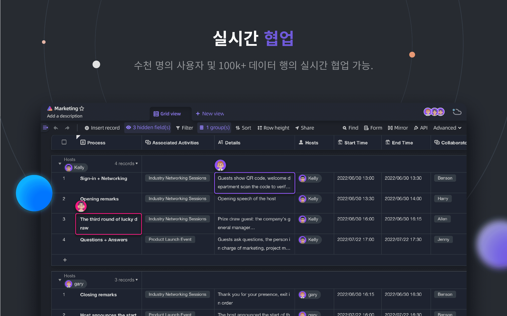
</p>
<p align="center">
    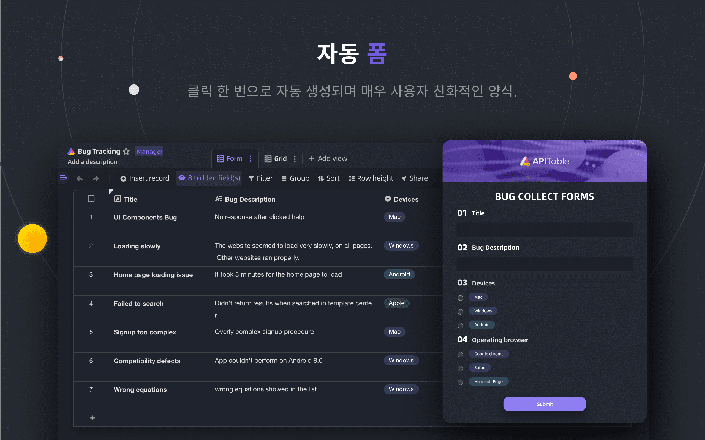
</p>
<p align="center">
    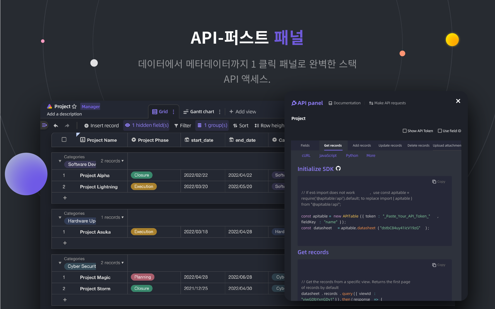
</p>
<p align="center">
    
</p>
<p align="center">
    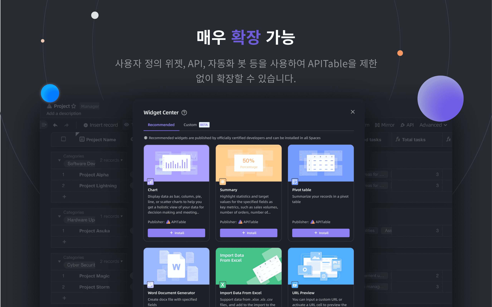
</p>
<p align="center">
    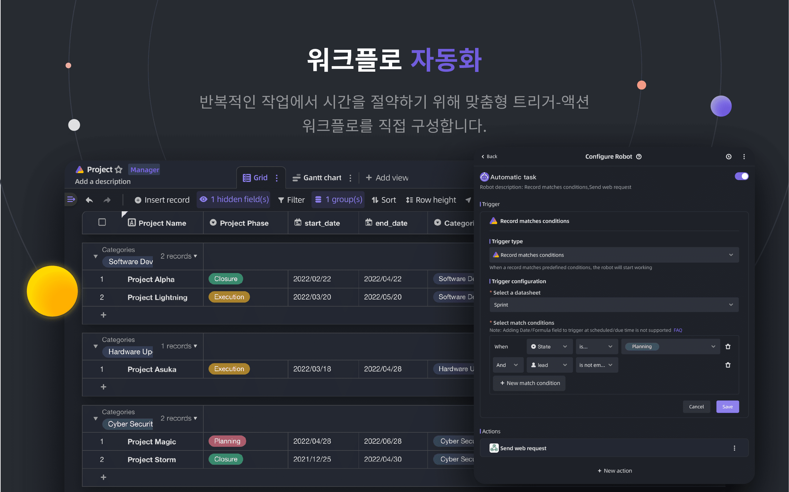
</p>
<p align="center">
    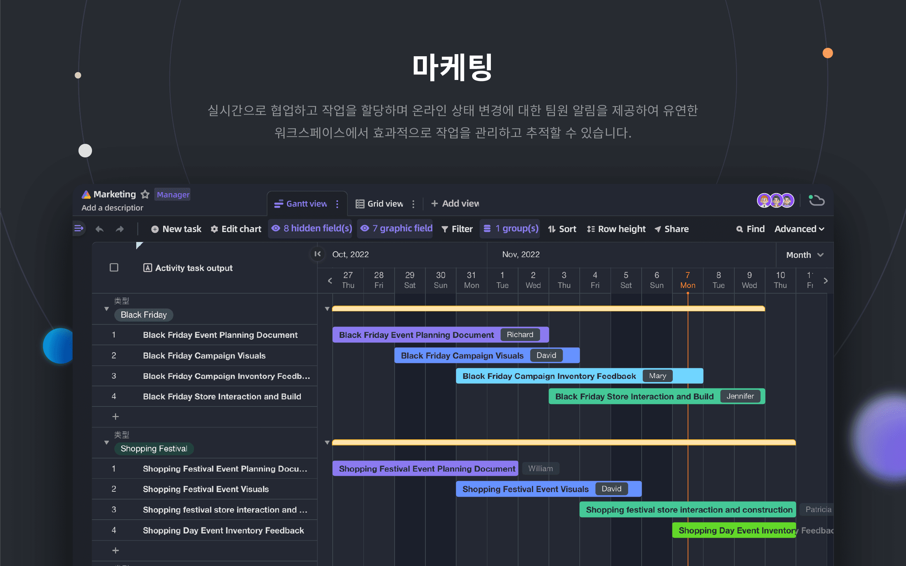
</p>
<p align="center">
    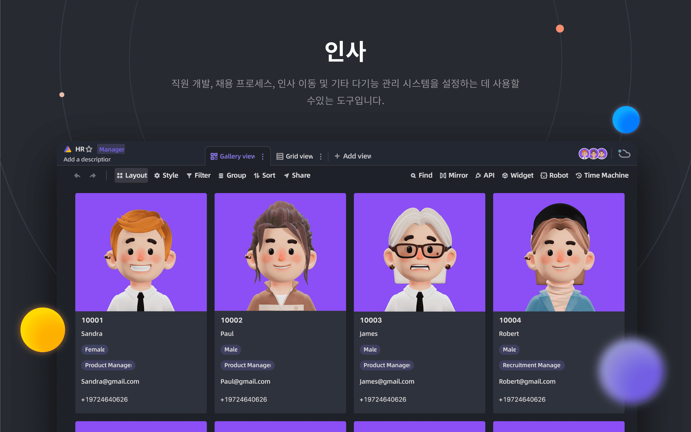
</p>
<p align="center">
    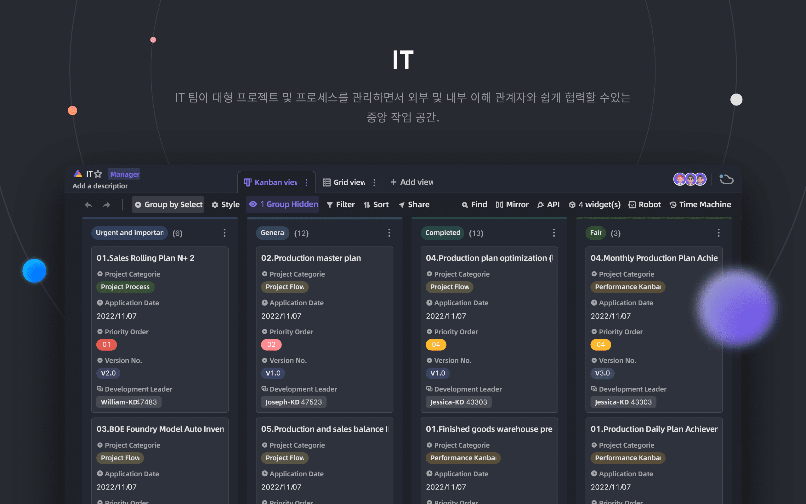
</p>
<p align="center">
    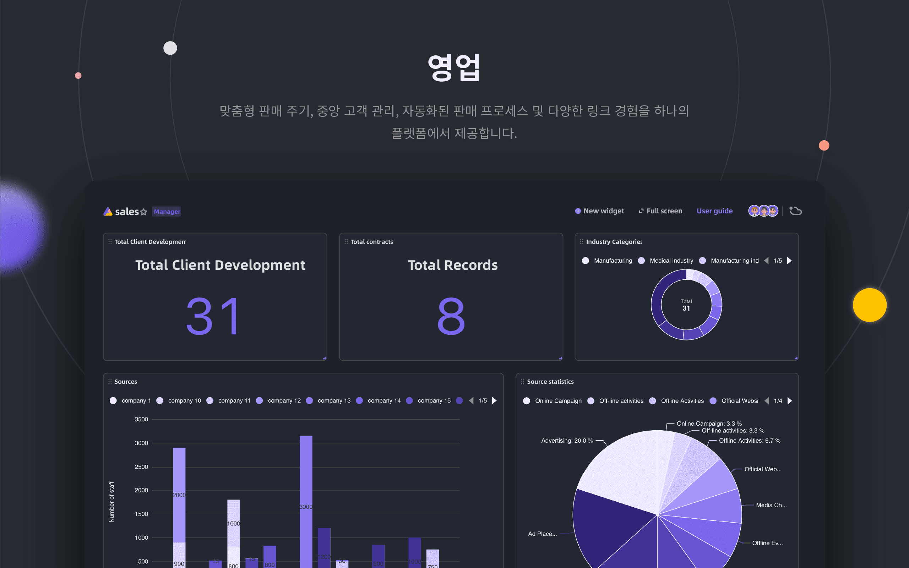
</p>

## 🥰 라이선스

> 이 저장소는 AGPL에 따라 공개된 APITable의 오픈 소스 버전의 소스 코드를 포함하고 있습니다.
> 
> 자체 APITable을 실행하거나 개발에 기여하려면 이곳이 최적의 장소입니다.
> 
> 자세한 내용은 [LICENSING](./LICENSING.md)을 참조하십시오.
> 
> 온라인으로 APITable을 사용하려면 이 코드를 실행할 필요가 없습니다. 전 세계 가속화를 위해 최적화된 [APITable.com](https://apitable.com)의 호스팅 버전을 제공합니다.

<br/>

[^info]: Licensed with AGPL-3.0. Designed by [APITable Ltd](https://apitable.com).
