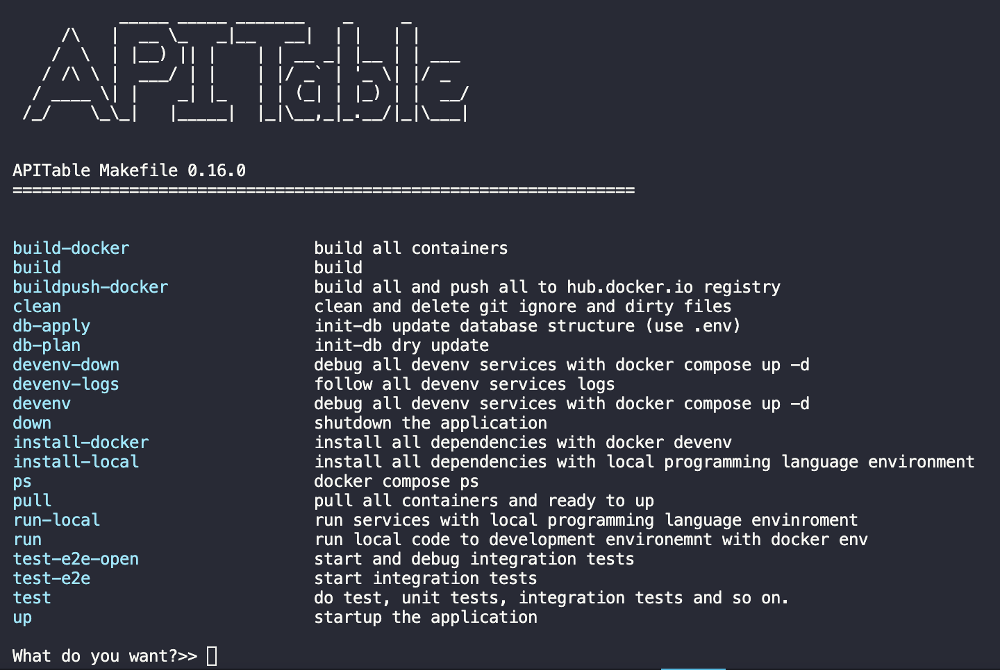

# 개발자 가이드

이 가이드는 APITable 개발을 시작하는 데 도움이 됩니다.

## 종속성

개발자 환경을 설정하기 전에 다음 종속 요소와 프로그래밍 언어가 설치되어 있는지 확인하세요:

- `git`
- [docker](https://docs.docker.com/engine/install/)
- [docker-compose v2](https://docs.docker.com/engine/install/)
- `make`


### 프로그래밍 언어

macOS 또는 Linux를 사용하는 경우. SDK 관리자 sdkman과 nvm으로 프로그래밍 언어를 설치하는 것을 권장합니다.

```bash
# quick install nvm
curl -o- https://raw.githubusercontent.com/nvm-sh/nvm/v0.39.2/install.sh | bash
# quick install sdkman
curl -s "https://get.sdkman.io" | bash
# install nodejs 
nvm install 16.15.0 && nvm use 16.15.0 && corepack enable
# install java development kit
sdk env install
# install rust toolchain
curl -sSf https://sh.rustup.rs | sh -s -- --default-toolchain nightly --profile minimal -y && source "$HOME/.cargo/env"
```

### macOS

We recommend using [Homebrew](https://brew.sh/) for installing any missing dependencies:

```bash
## necessary required
brew install git
brew install --cask docker
brew install make
brew install pkg-config cairo pango libpng jpeg giflib librsvg pixman
```

### Linux

CentOS/RHEL 또는 기타 Linux 배포판에서 yum을 사용하여

```bash
sudo yum install git
sudo yum install make
```

Ubuntu/Debian 또는 기타 Linux 배포판에서 apt을 사용하여

```bash
sudo apt update
sudo apt install git
sudo apt install make
```


### Windows

Windows 10/11에서 APITable을 실행하는 경우 Windows에 Docker Desktop, WSL에 Ubuntu 및 Windows 터미널을 설치하는 것이 좋으며, 공식 사이트에서 WSL(Windows 서브 시스템 for Linux)에 대해 자세히 알아볼 수 있습니다.

Install missing dependencies on Ubuntu using `apt`:

```bash
sudo apt update
sudo apt install git
sudo apt install make
```


## 우리가 사용하는 빌드 도구는 무엇입니까?

우리는 make를 중심 빌드 도구 항목으로 사용하여 gradle / npm / yarn과 같은 다른 빌드 도구를 구동합니다.

따라서 make 명령만 입력하면 모든 빌드 명령어를 볼 수 있습니다:

```bash
make
```




## 개발 환경 시작?

에이피테이블은 3개의 프로세스로 구성됩니다

1. backend-server
2. room-server
3. web-server

개발 환경을 로컬에서 시작하려면 다음 명령을 실행합니다:

```bash
# start databases in dockers
make dataenv 

# install dependencies
make install 

#start backend-server
make run # enter 1  

# and then switch to a new terminal
# start room-server
make run # enter 2

# and then switch to a new terminal
# start socket-server
make run # enter 3  

# and then switch to a new terminal
# start web-server
make run # enter 4

```


## 어떤 IDE를 사용해야 합니까?

IDE는 Visual Studio Code 또는 Intellij IDEA를 사용하는 것을 권장합니다.

APITable은 이 두 가지 IDE의 디버그 구성을 준비했습니다.

IDE로 APITable의 루트 디렉토리를 열기만 하면 됩니다.


## 번역에 기여하는 방법?

APITable의 번역을 개선하는 두 가지 방법이 있습니다.

1. 소스 코드에서 마크다운 파일을 수정하여 직접 PR을 생성할 수 있습니다.
2. Join our [Crowdin](https://crowdin.com/project/apitablecom) to find the `strings` to modify

Also, for the text of the UI, you can change the `strings` in code files directly, they are located at（Different languages correspond to different language files）:

1. packages/l10n/base/strings.zh-HK.json
2. packages/l10n/base/strings.ja-JP.json
3. ...

다국어 번역 협력에서 우리는 다음 프로세스를 따릅니다.


## SMTP 서버를 구성하는 방법은 무엇입니까?

기본적으로 APITable은 SMTP 서버를 구성하지 않습니다. 즉, 이메일 전송 기능이 필요하므로 사용자를 초대할 수 없습니다.

자체 이메일을 사용하여 `.env` 구성을 수정하고 백엔드 서버를 다시 시작해야 합니다.

```
MAIL_ENABLED=true
MAIL_HOST=smtp.xxx.com
MAIL_PASSWORD=your_email_password
MAIL_PORT=465
MAIL_SSL_ENABLE=true
MAIL_TYPE=smtp
MAIL_USERNAME=your_email
```

또한 일부 사서함은 smtp를 사용하려면 백그라운드에서 활성화해야 합니다. 자세한 내용은 xxx 사서함 smtp 자습서를 검색할 수 있습니다.


## macOS M1 도커 실행 시 성능 문제가 있습니까?

## 개발자 문서는 어디에 있습니까?

로컬 서버를 시작하여 API 문서에 액세스할 수 있습니다:

1. Backend server 의 문서 주소는 다음과 같습니다: http://localhost:8081/api/v1/doc.html

2. room-server 의 문서 주소는 다음과 같습니다. http://localhost:3333/nest/v1/docs

클라우드 서비스 API 인터페이스에 관심이 있는 경우 다음에서 온라인 API 설명서에 직접 액세스할 수도 있습니다 https://developers.apitable.com/api/introduction.

## 대시보드에서 위젯 수량 제한을 설정하는 방법은 무엇입니까? (기본적으로 30개)

`.env` 파일에서 `DSB_WIDGET_MAX_COUNT` 매개변수를 설정하면 됩니다.

## API의 요청 속도 제한을 늘릴 수 있습니까? (기본적으로 5개)

`room-server`의 `.env.default` 파일에는 요청 빈도를 조정할 수 있는 두 개의 매개변수가 있습니다.

1. `LIMIT_POINTS` 및 `LIMIT_DURATION`을 설정하여 단위 기간 동안 수행할 수 있는 요청 수를 나타낼 수 있습니다. 여기서 LIMIT_POINTS는 횟수이고 LIMIT_DURATION은 초 단위로 측정된 기간입니다.

2. `LIMIT_WHITE_LIST` 매개변수를 설정하여 특정 사용자에 대해 별도의 요청 빈도를 설정할 수 있습니다. 해당 값은 JSON 문자열이며 해당 구조는 `Map<string, IBaseRateLimiter>`을 참조할 수 있습니다.

## API 호출당 삽입되는 레코드 수를 늘리는 방법은 무엇입니까? (기본적으로 10개)

`room-server`의 `.env.default` 파일에서 `API_MAX_MODIFY_RECORD_COUNTS` 매개변수를 설정하면 됩니다.


## 최신 릴리스 버전으로 업그레이드하는 방법은 무엇입니까?


## 기본 80 포트를 변경하는 방법은 무엇입니까?
`.env` 파일의 구성 속성은 env vars `NGINX_HTTP_PORT`를 지정하여 재정의할 수도 있습니다.

For example. 예: NGINX_HTTP_PORT=8080으로 설정됩니다.

## How to add supported Languages?

To add a new language to APITable, follow these steps:

1. Determine the code of the language to be added, for example `uk-UA`.
2. Add new language files in the `packages/l10n/base/` directory. For example, create a file named `strings.uk-UA.json`.
3. List the value keys for translation in the new language file, following the format of strings.en-US.json.
4. Add the language item in `packages/l10n/base/language.manifest.json`.
    ```json
    {
      "en-US": "English",
      "uk-UA": "українська",
      "zh-CN": "简体中文"
    }
    ```
5. Once the translation is complete, execute the command: `make l10n-apitable-ce`.

By following these steps, you can easily add support for new languages to your project.
