<p align="center">
    <a href="https://apitable.com" target="_blank">
        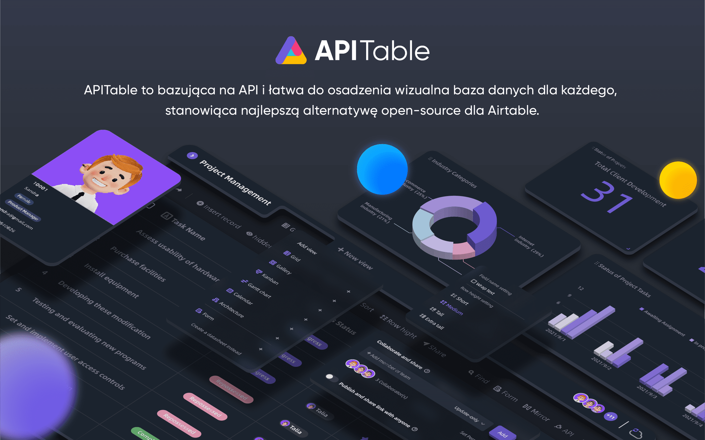
    </a>
</p>

<p align="center">
    <!-- Gitpod -->
    <a target="_blank" href="https://gitpod.io/#https://github.com/apitable/apitable">
        
    </a>
    <!-- NodeJS -->
    
    <!-- Java -->
    
    <!-- hub.docker.com-->
    <a target="_blank" href="#Instalacja">
        
    </a>
    <!-- Github Release Latest -->
    <a target="_blank" href="https://github.com/apitable/apitable/releases/latest">
        
    </a>
    <!-- Render -->
    <a target="_blank" href="https://render.com/deploy?repo=https://github.com/apitable/apitable">
        
    </a>
    <br />
    <!-- LICENSE -->
    <a target="_blank" href="https://github.com/apitable/apitable/blob/main/LICENSE">
        
    </a>
    <!-- Discord -->
    <a target="_blank" href="https://discord.gg/TwNb9nfdBU">
        
    </a>
    <!-- Twitter -->
    <a target="_blank" href="https://twitter.com/apitable_com">
        
    </a>
    <!-- Github Action Build-->
    <a target="_blank" href="https://github.com/apitable/apitable/actions/workflows/build.yaml">
        
    </a>
    <!-- Better Uptime-->
    <a target="_blank" href="https://apitable.betteruptime.com/">
        
    </a>
</p>

<p align="center">
  <a href="../../../README.md">English</a>
  | 
  Polski
  | 
  <a href="../fr-FR/README.md">Français</a>
  | 
  <a href="../es-ES/README.md">Español</a>
  | 
  <a href="../de-DE/README.md">Deutsch</a>
  | 
  <a href="../zh-CN/README.md">简体中文</a>
  | 
  <a href="../zh-HK/README.md">繁體中文</a>
  | 
  <a href="../ja-JP/README.md">日本語</a>
</p>

## ✨ Szybki start

Jeśli chcesz tylko wypróbować <sup id="fnref:info"><a href="#fn:info" class="footnote-ref">APITable1</a></sup>, użyj naszej wersji w chmurze pod adresem [apitable.com](https://apitable.com).

Jeśli chcesz zademonstrować ten projekt APITable o otwartym kodzie źródłowym, kliknij tutaj, aby zobaczyć [⚡️Gitpod Online Demo](https://gitpod.io/#https://github.com/apitable/apitable).

Jeśli chcesz zainstalować APITable w środowisku lokalnym lub w chmurze, to sprawdź: [💾 Instalacja](#Instalacja)

Jeśli chcesz skonfigurować lokalne środowisko programistyczne, przeczytaj nasz [🧑‍💻 Poradnik Developera](./docs/contribute/developer-guide.md)

Porozmawiaj z nami na [Discordzie](https://discord.gg/TwNb9nfdBU); śledź naszego [Twittera](https://twitter.com/apitable_com).
## 🔥Funkcjonalności

<table>
  
  <tr>
    <th>
      <a href="#">Współpraca w czasie rzeczywistym</a>
    </th>
    <th>
      <a href="#">Formularze automatyczne</a>
    </th>

  </tr>

   <tr>
    <td width="50%">
      <a href="#">
        
      </a>
    </td>
    <td width="50%">
        <a href="#">
            
        </a>
    </td>
  </tr>

  <tr>
    <th>
      <a href="#">Panel zaprojektowany z naciskiem na API</a>
    </th>
    <th>
      <a href="#">Nieograniczone połączenia między tabelami</a>
    </th>
</tr>

 <tr>
    <td width="50%">
        <a href="#">
            
        </a>
    </td>
    <td width="50%">
      <a href="#">
        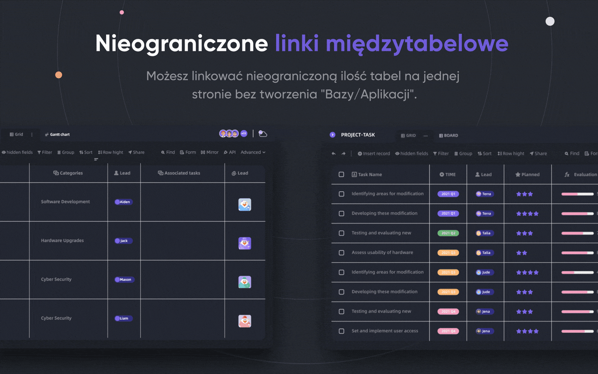
      </a>
    </td>
 </tr>

 <tr>
    <th>
      <a href="#">Szczegółowa kontrola uprawnień na poziomie wiersza/kolumny</a>
    </th>
    <th>
      <a href="#">Treść gotowa do osadzenia</a>
    </th>
  </tr>

 <tr>
    <td width="50%">
        <a href="#">
            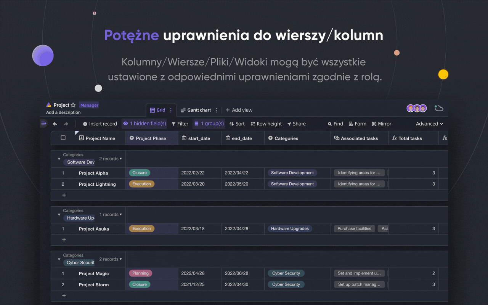
        </a>
    </td>
    <td width="50%">
        <a href="#">
            
        </a>
    </td>
  </tr>

</table>

APITable zapewnia szereg unikatowych funkcjonalności przydatnych do użytkowników prywatnych oraz instytucji.

- Zaawansowane technologie i otwartoźródłowy kod
  - Współpraca w czasie rzeczywistym pozwala wielu użytkownikom edytować razem w czasie rzeczywistym lub jednocześnie z Algorytmem Transformacji Operacyjnej (OT).
  - Niezwykle płynny, przyjazny dla użytkownika, superszybki interfejs baza danych-arkusz w canvas Rendering Engine.
  - Architektura natywna dla bazy danych: Changeset / Operation / Action / Snapshot i tak dalej.
  - 100k+ wierszy danych ze współpracą w czasie rzeczywistym.
  - Pełny dostęp do API, od danych do metadanych.
  - Jednokierunkowe / dwukierunkowe łączenie tabel i nieskończone łączenie krzyżowe.
  - Community-friendly programming languages and framework, TypeScript ([NextJS](https://nextjs.org/) + [NestJS](https://nestjs.com/)) and Java ([Spring Boot](https://spring.io/projects/spring-boot)).
- Piękny i bogaty interfejs bazy danych i arkusza kalkulacyjnego
  - `CRUD`: Tworzenie, odczyt, aktualizacja, usuwanie tabel, kolumn i wierszy
  - `Operacje na polach`: sortowanie, filtrowanie, grupowanie, ukrywanie/odkrywanie, ustawianie wysokości.
  - Oparte na przestrzeni: Użyj oddzielonych przestrzeni roboczych w miejsce struktury opartej na aplikacji / bazie, umożliwiają nieograniczone łączenie tabel.
  - Tryb ciemny i dostosowanie motywu dostępne.
  - 7 typów widoku: Grid View (Datasheet) / Gallery View / Mindmap View / Kanban View / Full-Feature Gantt View / Calendar View.
  - Panel API jednym kliknięciem
- Baterie w zestawie
  - Wbudowane 10+ oficjalnych szablonów.
  - Dostępna automatyzacja robota i dostosowanie do potrzeb klienta.
  - Panel Business Intelligence
  - Automatycznie generowany formularz jednym kliknięciem
  - Możliwość udostępnienia i osadzenia strony
  - Wsparcie dla wielu języków
  - Integracja z n8n.io / Zapier / Appsmith... i nie tylko.
- Doskonała rozciągliwość
  - Rozszerzalny system widgetów z ponad 20 urzędnikami open-source widgetów
  - Możliwość dostosowania wykresów, diagramów i pulpitów nawigacyjnych
  - Dostosowywane typy kolumn danych
  - Dostosowywane formuły
  - Dostosowywane akcje robotów automatyzujących
- Uprawnienia klasy korporacyjnej
  - Lustro - zmień widok w lustro, aby wdrożyć uprawnienia do wierszy
  - Aktywuj uprawnienia dla kolumn poprzez bardzo prostą operację
  - Uprawnienia folderów / podfolderów / plików
  - Foldery w strukturze drzewa i konfigurowalny węzeł (plik)
  - Zarządzanie zespołem i struktura organizacji
- Funkcje Enterprise:
  - SAML
  - Single-Sign-On (SSO)
  - Audyt
  - Baza danych Auto Backup
  - Eksporter danych
  - Znak wodny
- ....

За допомогою розширюваних віджетів та плагінів ви можете додати більше функцій.

## 💥Приклади використання

Чому ви повинні знати APITable для вашого наступного програмного забезпечення?

- Як програмне забезпечення для управління
  - Гнучке управління проектами та управління завданнями / проблемами
  - Управління маркетинговими лідами
  - Найбільш гнучка і підключається CRM
  - Гнучка бізнес-аналітика (BI)
  - Зручні форми та опитування
  - Elastyczny ERP
  - Platforma low-code i no-code
  - ...i więcej, APITable umieszcza 1000 softów w Twojej kieszeni.
- Jako wizualna infrastruktura bazy danych
  - Osadź APITable w swoich własnych interfejsach oprogramowania
  - Wizualna baza danych z REST API
  - Pulpit administratora
  - Centralne zarządzanie konfiguracją
  - Wszystko w jednym - baza danych przedsiębiorstwa, która łączy wszystkie Twoje programy
  - ...i więcej, APITable łączy wszystko
- Ponadto, jest open source i jest rozszerzalny

## 💞 API-oriented

#### Panel API UI

Kliknięcie przycisku `API` w prawym rogu spowoduje wyświetlenie panelu API

#### Zapytanie podobne do SQL

APITable udostępnia język zapytań Datasheet Query Language (DQL), który umożliwia odpytywanie zawartości arkuszy danych.

## 💝 Embed-friendly

#### Udostępnianie i osadzanie

Udostępnij swoją tabelę lub folder z danymi. Osadzaj je poprzez kopiowanie i wklejanie skryptów HTML.

#### Osadzanie dla przedsiębiorstw

[APITable.com](https://apitable.com) zapewnia więcej funkcji Enterprise-ready Embedding dla papierów wartościowych.

## Instalacja

Zanim zaczniesz:
* Host z zainstalowanym [dockerem](https://docs.docker.com/engine/install/) i [docker-compose v2](https://docs.docker.com/engine/install/).
* Zalecane są 4 procesory/8GB RAM lub więcej.
* Powłoka bash z zainstalowanymi podstawowymi narzędziami jak curl.
* Natywne obrazy kontenerów arm64 (apple silicon) nie są jeszcze gotowe i mogą powodować złą wydajność.

Aby zainstalować apitable używając docker compose, otwórz terminal i uruchom to:

```
curl https://apitable.github.io/install.sh | bash
```

Następnie otwórz http://localhost:80 w przeglądarce, aby go odwiedzić.

We also provide an all-in-one image based on [pm2](https://pm2.keymetrics.io/) for demo or testing purpose (not recommended for enterprise or production usage):

```bash
sudo docker run -d -v ${PWD}/.data:/apitable -p 80:80 --name apitable apitable/all-in-one:latest
```

Depending on your environment, you may need to wait several minutes for all the services to start. This image is amd64 (x86_64) only, you may encounter pretty bad performance on arm64 or apple silicon.

Jeśli chcesz skonfigurować swoje lokalne środowisko programistyczne, przeczytaj nasz [🧑‍💻 Developer Guide](./docs/contribute/developer-guide.md)

## 🧑‍💻 Współtworzenie

Witamy i dziękujemy za zainteresowanie współtworzeniem APITable!

In addition to writing code, there are many ways for you to contribute.

Możesz wnieść swój wkład w następujący sposób:
- Dołącz i modyfikuj tłumaczenia w naszym projekcie [Crowdin Translation Project](https://crowdin.com/project/apitablecode/invite?h=f48bc26f9eb188dcd92d5eb4a66f2c1f1555185)
- Create [Issues](https://github.com/apitable/apitable/issues/new/choose)
- Follow our [Twitter](https://twitter.com/apitable_com)
- Create [Documentation](./docs)
- [Contributing Code](./docs/contribute/developer-guide.md)


Such as the following:
- Join [Crowdin Translation Project](https://crowdin.com/project/apitablecode/invite?h=f48bc26f9eb188dcd92d5eb4a66f2c1f1555185)
- Create [Issues](https://github.com/apitable/apitable/issues/new/choose)
- Follow our [Twitter](https://twitter.com/apitable_com)
- Create [Documentation](./docs)
- [Contributing Code](./docs/contribute/developer-guide.md)


Aby dowiedzieć się, jak wnosić swój wkład, możesz przeczytać Wytyczne dotyczące wnoszenia kodu do tego repozytorium.

Oto krótki przewodnik, który pomoże Ci w tworzeniu kodu w APITable.


### Środowisko programistyczne

Dowiedz się jak skonfigurować swoje lokalne środowisko, [przejdź do naszego Przewodnika dla programistów](./docs/contribute/developer-guide.md).

### Podstawowy przepływ pracy Git

Oto ogólny przepływ pracy z APITable w Gicie:

1. Utwórz sprawę i opisz cechy, które chcesz -> [Sprawy APITable](https://github.com/apitable/apitable/issues)
2. Rozwidlenie tego projektu -> [Rozwidlenie projektu APITable](https://github.com/apitable/apitable/fork)
3. Utwórz swoją gałąź cech (`git checkout -b my-new-feature`)
4. Zaangażuj swoje zmiany (`git commit -am 'Add some features'`)
5. Opublikuj oddział (`git push origin my-new-feature`)
6. Utwórz nowy Pull Request -> [Utwórz pull request w całym forku](https://github.com/apitable/apitable/compare)

### Konwencje pracy

APITable używa tych wspólnych konwencji:

- Jaki jest nasz model rozgałęziania Git? [Gitflow](https://nvie.com/posts/a-successful-git-branching-model/)
- Jak współpracować nad projektami z forka? [Github Flow](https://docs.github.com/en/get-started/quickstart/github-flow)
- Jak napisać dobrą wiadomość commit? [Konwencjonalne zobowiązania](https://www.conventionalcommits.org/)
- Jaki jest nasz format changelogu? [Zachowaj Changelog](https://keepachangelog.com/en/1.0.0/)
- Jak wersjonować i tagować?  [Semantyczne wersjonowanie](https://semver.org/)
- Czym są wytyczne dotyczące kodowania w Javie? [Java Coding Guideline](https://google.github.io/styleguide/javaguide.html) | [Intellij IDEA Plugin](https://plugins.jetbrains.com/plugin/8527)
- Czym są wytyczne dotyczące kodowania TypeScript? -> [TypeScript Style Guide](https://google.github.io/styleguide/tsguide.html) | [ESLint](https://www.npmjs.com/package/@typescript-eslint/eslint-plugin)
- Co to jest przegląd architektury? -> [Zrozumieć APITable - Przegląd Architektury](./docs/contribute/architecute-overview.md)

### Dokumentacje

- [Centrum pomocy](https://help.apitable.com/)
- [👩‍💻 Centrum programistów](https://developers.apitable.com/)
  - [🪡 Dokumenty REST API](https://developers.apitable.com/api/introduction/)
  - [Pobierz SDK](https://developers.apitable.com/widget/introduction/)
  - [Scripting Widget](https://developers.apitable.com/script/introduction/)

## 🛣 Mapa drogowa

Proszę zapoznać się z [mapą drogową APITable](https://apitable.com/roadmap)

### Przyszłe funkcje

- Konstruktor interfejsów o dużej zawartości kodu
- Embeddable 3rd party documentation components
- Języki dziedzinowe podobne do SQL
- Jako IdP
- Zaawansowany robot automatyzujący
- Cechy Web 3
- ...

### Wersje Hosted i Enterprise oferują zaawansowane funkcje

- Jako IdP
- SAML
- Single-Sign-On
- Audyt
- Kopia zapasowa bazy danych
- Integracja z ChatGPT, Zapier, Slack, Google Workspace......
- Znak wodny

Aby uzyskać więcej informacji, skontaktuj się z nami pod adresem <support@apitable.com>.

## 👫 Zaangażuj się

### 🌏 Dlaczego tworzymy APITable i open-source?

- Wierzymy, że Baza Danych jest podstawą każdego oprogramowania.
- Wierzymy, że stworzenie wizualnej bazy danych z bogatym i łatwym interfejsem użytkownika dla każdego może zmniejszyć trudności w branży oprogramowania i zwiększyć światową adopcję cyfryzacji.
- Wierzymy, że open-sourcingowa praca APITable może pchnąć człowieka do przodu.

### Zatrudniamy zdalnie!

Zawsze szukamy dobrych talentów dla APITable:

- **Full-stack developer:**Masz doświadczenie z React, NestJS, TypeScript, Spring Boot, Java, Terraform. I lubisz pisać wysokiej jakości kod z przejrzystą dokumentacją i testami jednostkowymi.
- **Back-end developer**:Masz doświadczenie z NestJS, TypeScript, Spring Boot, Java, SQL, Kubernetes, Terraform. I lubisz pisać wysokiej jakości kod z przejrzystą dokumentacją i testami jednostkowymi.
- **Front-end developer:** Masz doświadczenie z React, NextJS, TypeScript, WebPack. I lubisz pisać wysokiej jakości kod z przejrzystą dokumentacją i testami jednostkowymi.

Niezależnie od czasu i warunków, jeśli chcesz zaangażować się do zespołu APITable, nie zwlekaj i wyślij swoje CV na adres <talent@apitable.com>.

## 📺 Screenshot

<p align="center">
    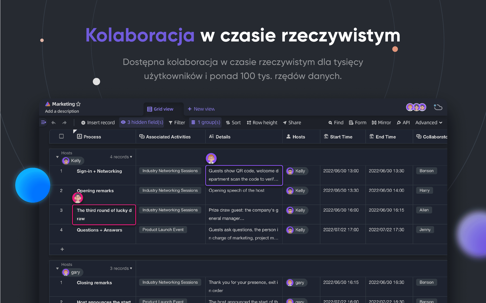
</p>
<p align="center">
    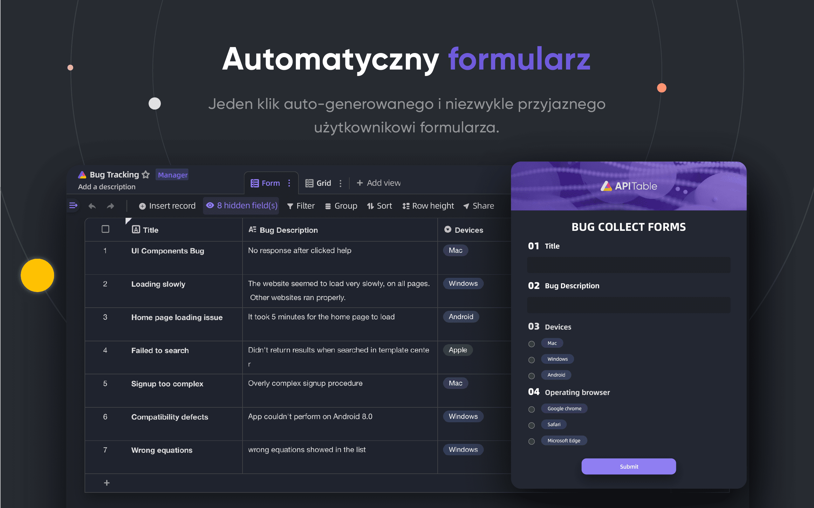
</p>
<p align="center">
    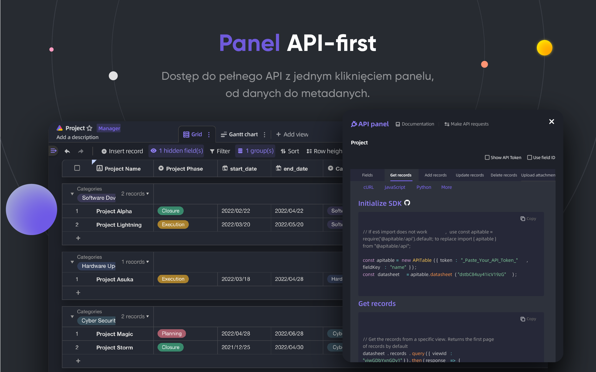
</p>
<p align="center">
    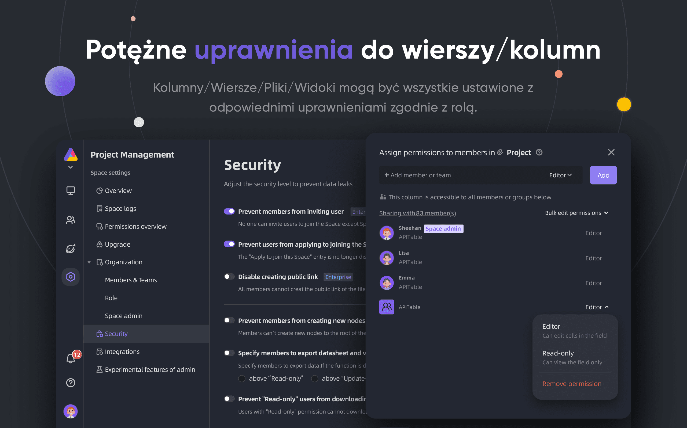
</p>
<p align="center">
    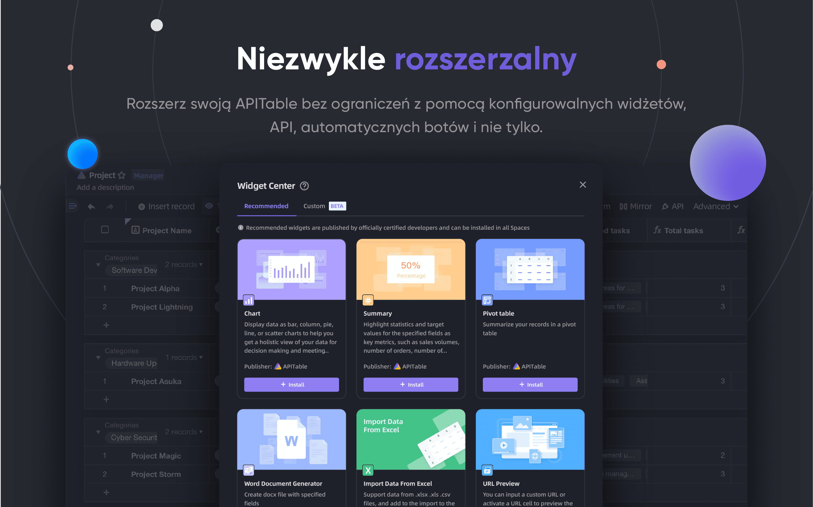
</p>
<p align="center">
    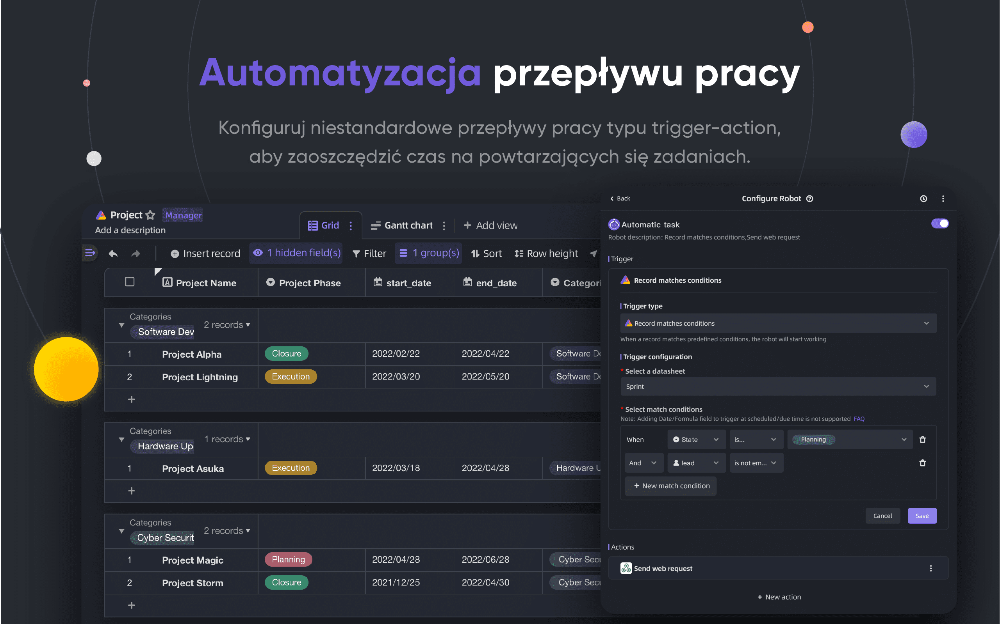
</p>
<p align="center">
    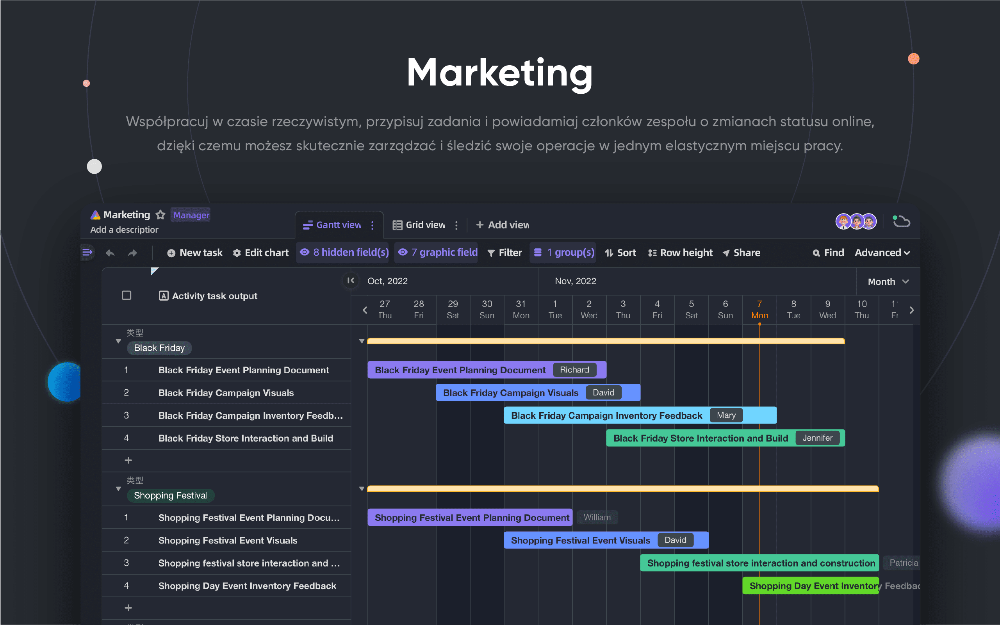
</p>
<p align="center">
    
</p>
<p align="center">
    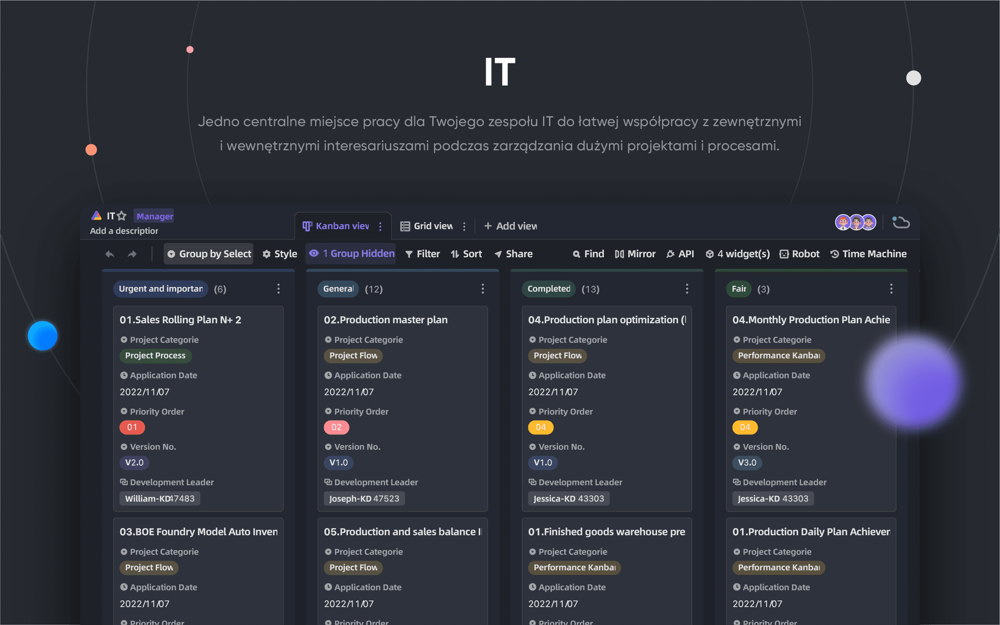
</p>
<p align="center">
    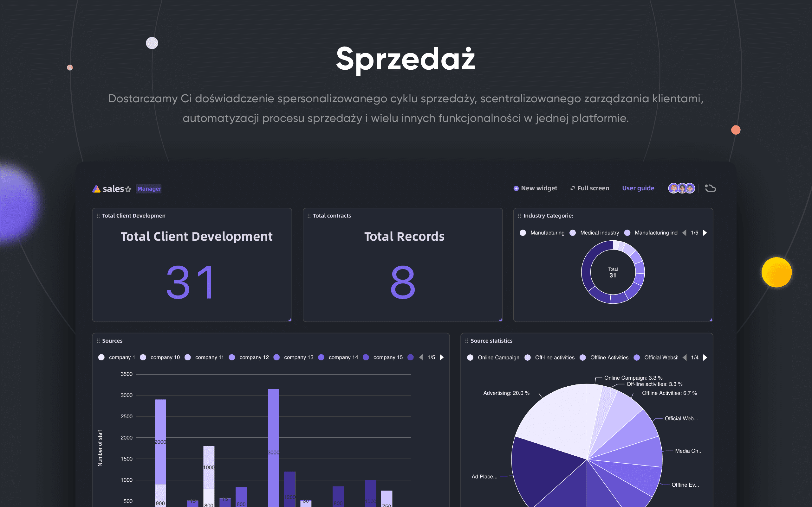
</p>

## 🥰 Licencja

> To repozytorium zawiera kod źródłowy otwartego wydania APITable, wydanego na licencji AGPL.
> 
> Jeśli chciałbyś uruchomić własną kopię APITable lub przyczynić się do jej rozwoju, to jest to miejsce dla Ciebie.
> 
> Zobacz [LICENCJA](./LICENSING.md) po szczegóły.
> 
> Jeśli chcesz używać APITable online, nie musisz uruchamiać tego kodu, oferujemy hostowaną wersję aplikacji na APITable.com, która jest zoptymalizowana pod kątem globalnego akceleratora.

<br/>

[^info]: Licencjonowane z AGPL-3.0. Zaprojektowane przez [APITable Ltd.](https://apitable.com).
