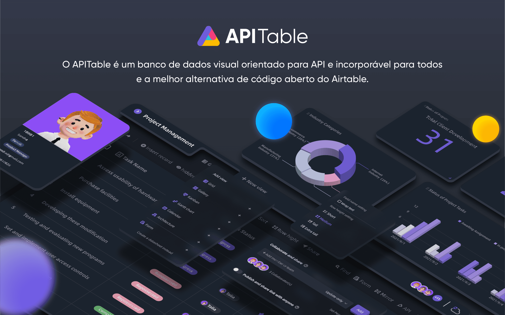
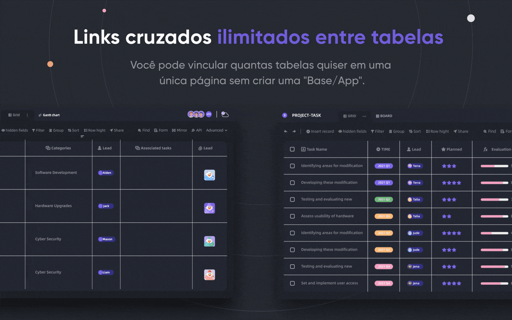
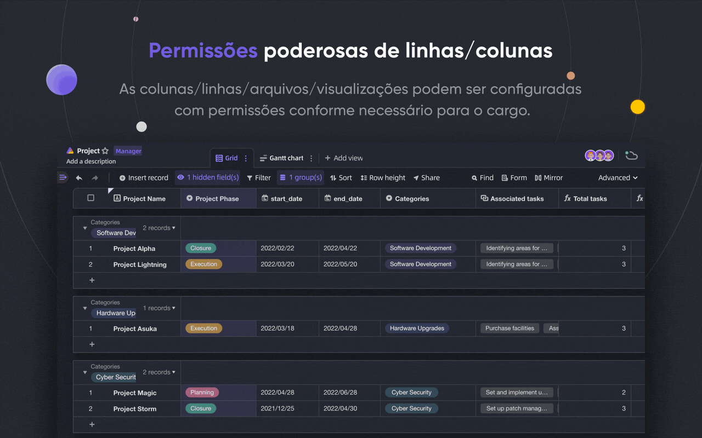
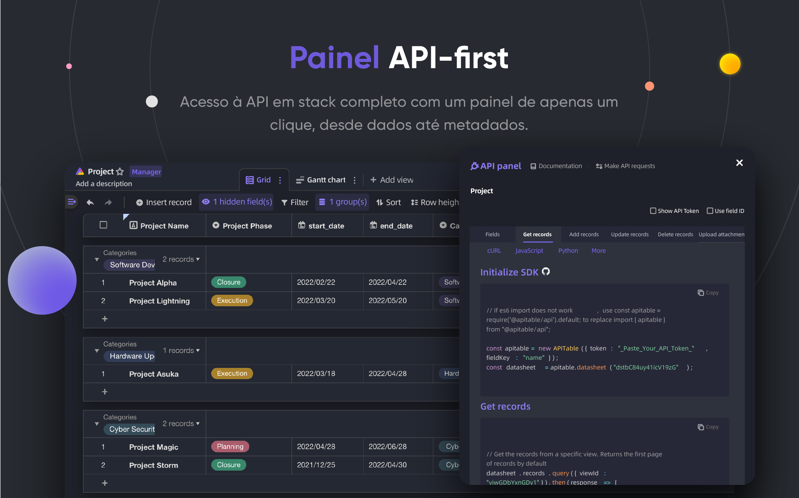
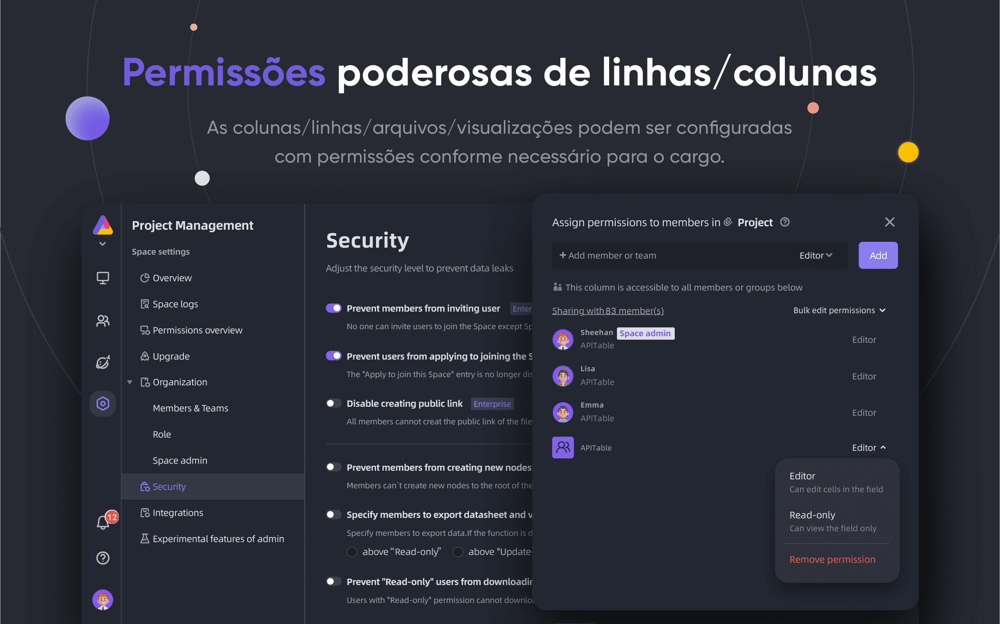
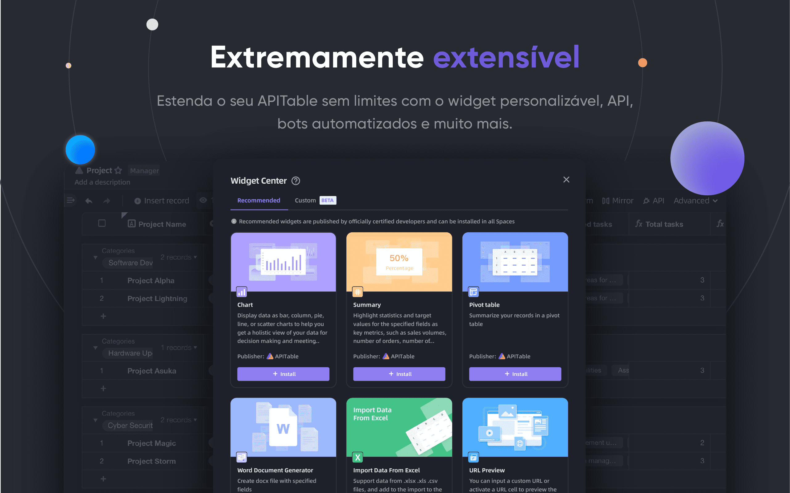
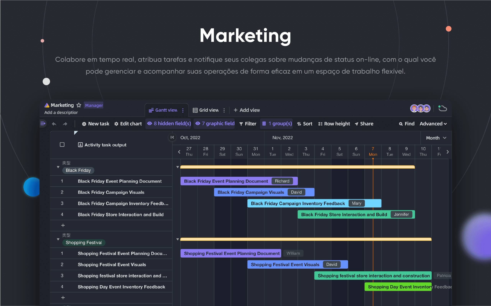
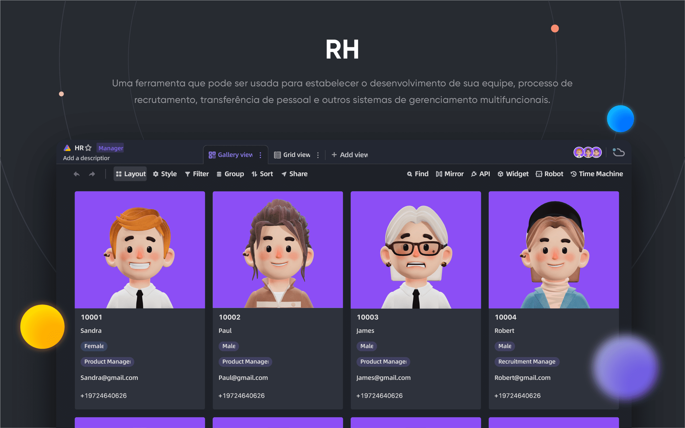
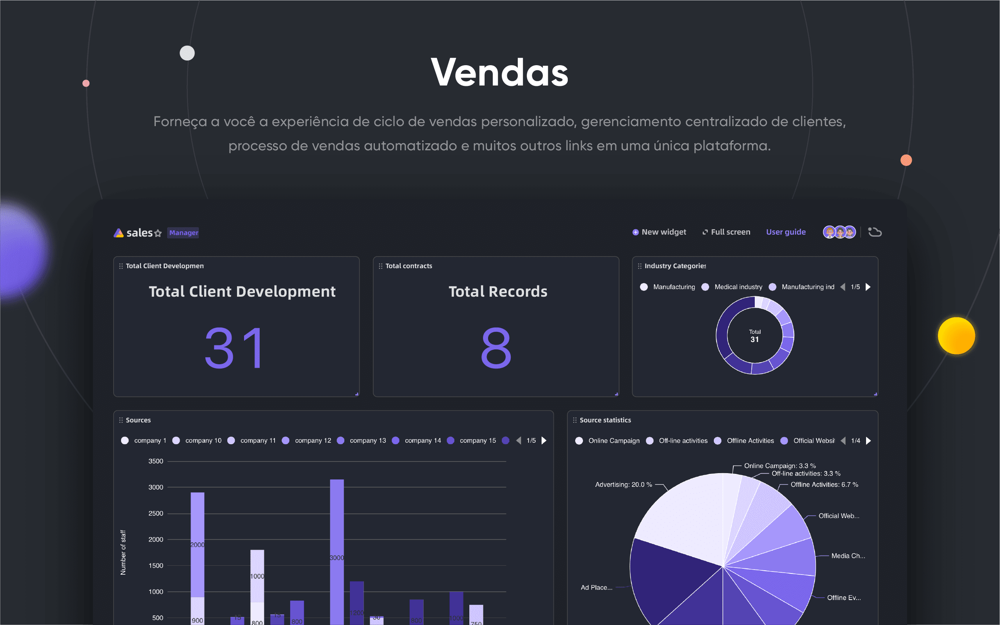

<p align="center">
    <a href="https://apitable.com" target="_blank">
        
    </a>
</p>

<p align="center">
    <!-- Gitpod -->
    <a target="_blank" href="https://gitpod.io/#https://github.com/apitable/apitable">
        
    </a>
    <!-- NodeJS -->
    
    <!-- Java -->
    
    <!-- hub.docker.com-->
    <a target="_blank" href="#Instalação">
        
    </a>
    <!-- Github Release Latest -->
    <a target="_blank" href="https://github.com/apitable/apitable/releases/latest">
        
    </a>
    <!-- Render -->
    <a target="_blank" href="https://render.com/deploy?repo=https://github.com/apitable/apitable">
        
    </a>
    <br />
    <!-- LICENSE -->
    <a target="_blank" href="https://github.com/apitable/apitable/blob/main/LICENSE">
        
    </a>
    <!-- Discord -->
    <a target="_blank" href="https://discord.gg/TwNb9nfdBU">
        
    </a>
    <!-- Twitter -->
    <a target="_blank" href="https://twitter.com/apitable_com">
        
    </a>
    <!-- Github Action Build-->
    <a target="_blank" href="https://github.com/apitable/apitable/actions/workflows/build.yaml">
        
    </a>
    <!-- Better Uptime-->
    <a target="_blank" href="https://apitable.betteruptime.com/">
        
    </a>
</p>

<p align="center">
  <a href="../../../README.md">English</a>
  | 
  <a href="../fr-FR/README.md">Français</a>
  | 
  <a href="../es-ES/README.md">Español</a>
  | 
  <a href="../de-DE/README.md">Deutsch</a>
  | 
  <a href="../zh-CN/README.md">简体中文</a>
  | 
  <a href="../zh-HK/README.md">繁體中文</a>
  | 
  <a href="../ja-JP/README.md">日本語</a>
</p>

## ✨ Início Rápido

Se você só quiser experimentar o APITable[^info], use a nossa versão hospedada na nuvem em [apitable.com](https://apitable.com).

Se você deseja testar este projeto de código aberto APITável, clique aqui para [⚡Gitpod Online Demo](https://gitpod.io/#https://github.com/apitable/apitable).

Se você deseja instalar APITable no seu ambiente de computação local ou em nuvem, veja [💾 Instalação](#Instalação)

Se quiser criar o seu ambiente de desenvolvimento local, leia o nosso [🧑‍💻 Developer Guide](./docs/contribute/developer-guide.md)

Junte-se ao [Discord](https://discord.gg/TwNb9nfdBU) ou [Twitter](https://twitter.com/apitable_com) para manter contato.
## 🔥 Funcionalidades

<table>
  
  <tr>
    <th>
      <a href="#">Colaboração em tempo real</a>
    </th>
    <th>
      <a href="#">Formulário Automático</a>
    </th>

  </tr>

   <tr>
    <td width="50%">
      <a href="#">
        
      </a>
    </td>
    <td width="50%">
        <a href="#">
            
        </a>
    </td>
  </tr>

  <tr>
    <th>
      <a href="#">Inicio de API</a>
    </th>
    <th>
      <a href="#">Links interversáveis ilimitados</a>
    </th>
</tr>

 <tr>
    <td width="50%">
        <a href="#">
            
        </a>
    </td>
    <td width="50%">
      <a href="#">
        
      </a>
    </td>
 </tr>

 <tr>
    <th>
      <a href="#">Permissões Poderosas de Linhas/Colunas</a>
    </th>
    <th>
      <a href="#">Incorporar</a>
    </th>
  </tr>

 <tr>
    <td width="50%">
        <a href="#">
            
        </a>
    </td>
    <td width="50%">
        <a href="#">
            
        </a>
    </td>
  </tr>

</table>

APITable fornece uma gama de características surpreendentes, desde o pessoal até à empresa.

- Pilha de tecnologia avançada e código aberto
  - A colaboração em tempo real permite a múltiplos utilizadores editar em conjunto em tempo real, ou simultaneamente com o Algoritmo de Transformação Operacional (OT).
  - Interface de planilha extremamente suave, fácil de usar, super rápida e rápida em `<canvas> Rendering Engine`.
  - Arquitectura nativa da base de dados: Changeet / Operação / Acção / Snapshot e assim por diante.
  - 100k+ linhas de dados com colaboração em tempo real.
  - Acesso API em pilha completa, de Dados a Metadados.
  - Ligação de uma direcção / Ligação de tabela bidireccional e ligações cruzadas infinitas
  - Linguagens e um quadro de programação amigáveis TypeScript ([NextJS](https://nextjs.org/) + [NestJS](https://nestjs.com/)) e Java ([Spring Boot](https://spring.io/projects/spring-boot)).
- Bela e rica base de dados - Folha de cálculo UI
  - `CRUD`: Criar, Ler, Actualizar, Apagar as Tabelas, Colunas, e Linhas
  - `Operações de campo`: classificar, filtrar, agrupar, esconder/desconder, definir altura.
  - `Baseado no espaço`: Utilizar espaços de trabalho separados no lugar da estrutura baseada em App/Base, tornar possível a interligação ilimitada de tabelas.
  - Modo escuro e personalização de temas disponíveis.
  - `7 Tipos de visualização`: Vista em Grelha (Ficha Técnica) / Vista em Galeria / Vista em Mindmap / Vista em Kanban / Vista em Gantt de Características Completas / Vista em Calendário
  - Painel API com um clique
- Pilhas incluídas
  - Modelos oficiais incorporados com mais de 10 modelos
  - Automação e personalização de robôs disponíveis.
  - Painel de bordo do BI
  - Forma gerada automaticamente com um clique
  - Página partilhável e encaixável
  - Suporte multilingue
  - Integração com n8n.io / Zapier / Appsmith... e muito mais.
- Excelente extensibilidade
  - Sistema Extensível de Widgets com mais de 20 widgets oficiais de código aberto
  - Gráfico & Gráfico & Painel personalizável
  - Tipos de Colunas de Dados Personalizáveis
  - Fórmulas personalizáveis
  - Acções de Robôs de Automação Personalizáveis
- Permissões de grau empresarial
  - Mirror, transformar uma Vista num espelho para implementar a Permissão de Fila
  - Activar a Permissão de Coluna através de uma operação muito simples
  - Permissão de Pastas / Sub-Pastas / Ficheiros
  - Pastas de estrutura em árvore e nó personalizável (ficheiro)
  - Gestão de Equipas e Estrutura Organizacional
- Características da empresa
  - SAML
  - Single-Sign-On (SSO)
  - Auditoria
  - Cópia de segurança automática da base de dados
  - Exportador de dados
  - Marca de água
- ....

Com widgets e plugins extensíveis, pode adicionar mais funcionalidades.

## 💥 Casos de utilização

Porque deve saber APITable para o seu próximo software?

- Como super software de gestão
  - Gestão Flexível de Projectos e Tarefas / Gestão de Questões
  - Gestão de Líderes de Marketing
  - CRM mais flexível e conectável
  - Inteligência Empresarial Flexível (BI)
  - Formulários e inquéritos amigos das pessoas
  - ERP flexível.
  - Plataforma de código baixo e sem código.
  - ...e mais, APITable coloca 1000 softwares no seu bolso.
- Como uma infra-estrutura de base de dados visual
  - Embutir APITable nas suas próprias UIs de software
  - Base de dados visual com REST API
  - Painel de administração
  - Gestão central de configuração
  - Base de dados empresarial tudo-em-um que liga todo o seu software
  - ...e mais, APITable conecta tudo
- Além disso, é de código aberto e extensível.

## 💞 orientado para API

#### Painel API UI

Clicando no botão API no canto direito irá mostrar o Painel API

#### Consulta do tipo SQL

APITable fornecerá uma Linguagem de Consulta de Ficha de Dados (DQL) para consultar o conteúdo da sua base de dados - folha de informação.

## 💝 Embedar fácil

#### Partilhar e Incorporar

Partilhe a sua tabela ou pasta de folhas de dados. Incorpore-as através de cópia e colagem de scripts HTML.

#### Embutir em empresas

[APITable.com](https://apitable.com) fornece mais funcionalidades de Corporate Embedding para títulos.

## Instalação

Antes de começar:
* Um anfitrião com [docker](https://docs.docker.com/engine/install/) e [docker-compose](https://docs.docker.com/engine/install/) v2 instalado.
* São recomendados 4 CPUs/8GB de RAM ou mais.
* Uma concha bash com utilitários básicos como o cacho instalado.
* O braço nativo64 (silício de maçã) imagens do contentor ainda não está pronto e pode causar mau desempenho.

Para instalar apitable usando o docker compose, abra o seu terminal e execute-o:

```
curl https://apitable.github.io/install.sh | bash
```

Depois abra http://localhost:80 no seu navegador para o visitar.

We also provide an all-in-one image based on [pm2](https://pm2.keymetrics.io/) for demo or testing purpose (not recommended for enterprise or production usage):

```bash
sudo docker run -d -v ${PWD}/.data:/apitable -p 80:80 --name apitable apitable/all-in-one:latest
```

Depending on your environment, you may need to wait several minutes for all the services to start. Esta imagem é apenas amd64 (x86_64), você pode encontrar um desempenho muito mau em arm64 ou silicon de maçã.

Se quiser criar o seu ambiente de desenvolvimento local, leia o nosso [🧑💻 Developer Guide](./docs/contribute/developer-guide.md)

## 💻 Contribuição

Bem-vindo, e obrigado pelo seu interesse em contribuir para a APITable!

In addition to writing code, there are many ways for you to contribute.

Pode contribuir da seguinte forma:
- Junte-se e modifique traduções no nosso Projecto de Tradução [Crowdin](https://crowdin.com/project/apitablecode/invite?h=f48bc26f9eb188dcd92d5eb4a66f2c1f1555185)
- Create [Issues](https://github.com/apitable/apitable/issues/new/choose)
- Follow our [Twitter](https://twitter.com/apitable_com)
- Create [Documentation](./docs)
- [Contributing Code](./docs/contribute/developer-guide.md)


Such as the following:
- Join [Crowdin Translation Project](https://crowdin.com/project/apitablecode/invite?h=f48bc26f9eb188dcd92d5eb4a66f2c1f1555185)
- Create [Issues](https://github.com/apitable/apitable/issues/new/choose)
- Follow our [Twitter](https://twitter.com/apitable_com)
- Create [Documentation](./docs)
- [Contributing Code](./docs/contribute/developer-guide.md)


Pode ler as Directrizes de [Contribuição](./CONTRIBUTING.md) deste repositório para aprender a contribuir.

Aqui está um guia rápido para o ajudar a contribuir para a APITable.


### Ambiente de desenvolvimento

Saiba como criar o seu ambiente local, consulte o nosso Guia do [](./docs/contribute/developer-guide.md)Desenvolvedor

### Git fluxo de trabalho básico

Aqui está um fluxo de trabalho geral APITable git:

1. Crie um problema e descreva as características que pretende -> [problemas APITable](https://github.com/apitable/apitable/issues)
2. Garfo este projecto -> [Garfo projecto APITable](https://github.com/apitable/apitable/fork)
3. Crie o seu ramo de funcionalidade (`git checkout -b my-new-feature`)
4. Comprometa as suas alterações (`git commit -am 'Add some features'`)
5. Publicar o ramo (`git push origin my-new-feature`)
6. Criar um novo Pedido de Puxar -> [Criar pedido de puxar sobre garfos](https://github.com/apitable/apitable/compare)

### Convenções de trabalho

APITable use estas convenções comuns:

- Qual é o nosso modelo de ramificação Git? [Gitflow](https://nvie.com/posts/a-successful-git-branching-model/)
- Como colaborar nos seus projectos de garfo? [Fluxo Github](https://docs.github.com/en/get-started/quickstart/github-flow)
- Como escrever uma boa mensagem de compromisso? [Compromissos Convencionais](https://www.conventionalcommits.org/)
- Qual é o nosso formato changelog? [Manter o Changelog](https://keepachangelog.com/en/1.0.0/)
- Como criar versões e etiquetar? [Versionamento semântico](https://semver.org/)
- O que é a Directriz de Codificação Java? [Guia de Codificação Java](https://google.github.io/styleguide/javaguide.html) | [Intellij IDEA Plugin](https://plugins.jetbrains.com/plugin/8527)
- O que é a TypeScript Coding Guideline? -> [TypeScript Style Guide](https://google.github.io/styleguide/tsguide.html) | [ESLint](https://www.npmjs.com/package/@typescript-eslint/eslint-plugin)
- O que é a Visão Geral da Arquitectura? -> [Compreender APITable - Visão Geral da Arquitectura](./docs/contribute/architecute-overview.md)

### Documentações

- [Centro de Ajuda](https://help.apitable.com/)
- [👩‍💻Centro de desenvolvimento](https://developers.apitable.com/)
  - [🪡 REST API Docs](https://developers.apitable.com/api/introduction/)
  - [SDK do Widget](https://developers.apitable.com/widget/introduction/)
  - [Scripting Widget](https://developers.apitable.com/script/introduction/)

## 🛣 Roteiro

Por favor, consulte o Roteiro de [de APITable](https://apitable.com/roadmap)

### Características futuras

- Construtor de interface de código pesado
- Embeddable 3rd party documentation components
- Linguagens específicas de domínio semelhantes a SQL
- Como um IdP
- Robô de automatização avançada
- Características da Web 3
- ...

### As versões hosted e Enterprise oferecem funcionalidades avançadas

- Como um IdP;
- SAML
- Single-Sign-On
- Auditoria
- Cópia de Segurança da Base de Dados
- Integrar com ChatGPT, Zapier, Slack, Google Workspace......
- Marca de água

Para mais informações, por favor contacte-nos em <support@apitable.com>.

## 👫 Envolver-se

### 🌏 Porque criamos APITable e open-source?

- Acreditamos que a Base de Dados é a pedra angular de todo o software.
- Acreditamos que fazer uma Base de Dados Visual com uma interface de utilizador rica e fácil para todos pode reduzir a dificuldade da indústria de software e aumentar a adopção da digitalização a nível mundial.
- Acreditamos que o trabalho de fonte aberta APITable pode fazer avançar o ser humano.

### Estamos a contratar à distância!

Procuramos sempre bons talentos para APITable:

- **Desenvolvedor de pilha cheia**: Tem experiência com React, NestJS, TypeScript, Spring Boot, Java, Terraform. E gosta de escrever código de alta qualidade com documentação clara e testes unitários.
- **Desenvolvedor de back-end**: Tem experiência com NestJS, TypeScript, Spring Boot, Java, SQL, Kubernetes, Terraform. E gosta de escrever código de alta qualidade com documentação clara e testes unitários.
- **Desenvolvedor de Front-end**: Tem experiência com React, NextJS, TypeScript, WebPack. E gosta de escrever código de alta qualidade com documentação clara e testes unitários.

Independentemente do tempo e das condições, se quiser envolver-se com a equipa da APITable, não hesite e envie o seu CV para <talent@apitable.com>.

## 📺 Captura de ecrã

<p align="center">
    
</p>
<p align="center">
    
</p>
<p align="center">
    
</p>
<p align="center">
    
</p>
<p align="center">
    
</p>
<p align="center">
    
</p>
<p align="center">
    
</p>
<p align="center">
    
</p>
<p align="center">
    
</p>
<p align="center">
    
</p>

## 🥰 Licença

> Este repositório contém o código fonte para a edição Open Source da APITable, lançado sob a AGPL.
> 
> Se quiser correr a sua própria cópia do APITable ou contribuir para o desenvolvimento, então este é o lugar para si.
> 
> Ver [LICENSING](./LICENSING.md) para mais detalhes.
> 
> Se quiser utilizar APITable online, então não precisa de executar este código, oferecemos uma versão hospedada do aplicativo em [APITable.com](https://apitable.com) que foi optimizada para acelerador global.

<br/>

[^info]: Licenciado com AGPL-3.0. Desenhado por [APITable Ltd.](https://apitable.com).
