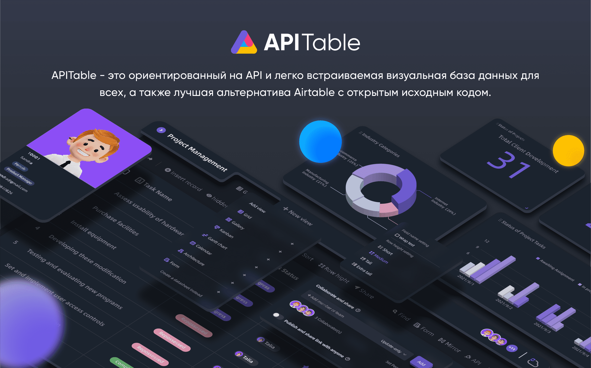
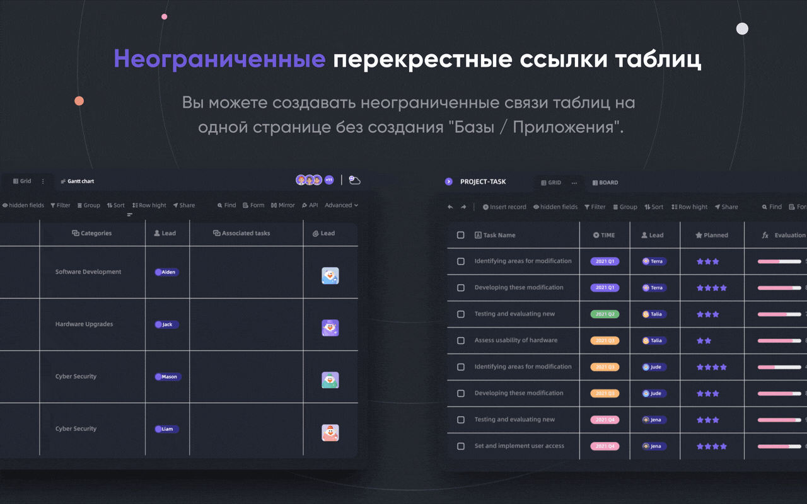
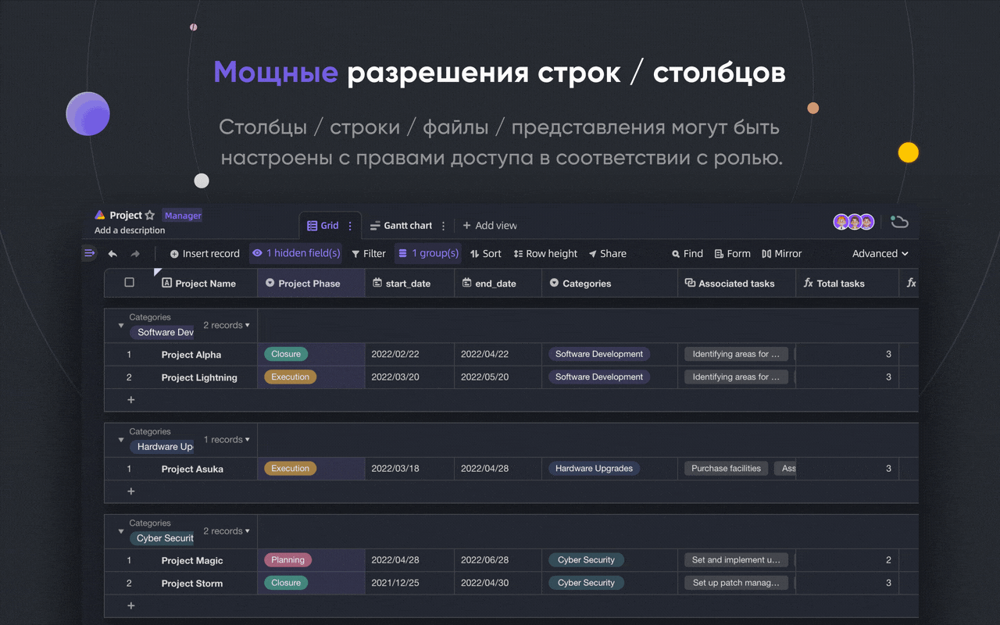
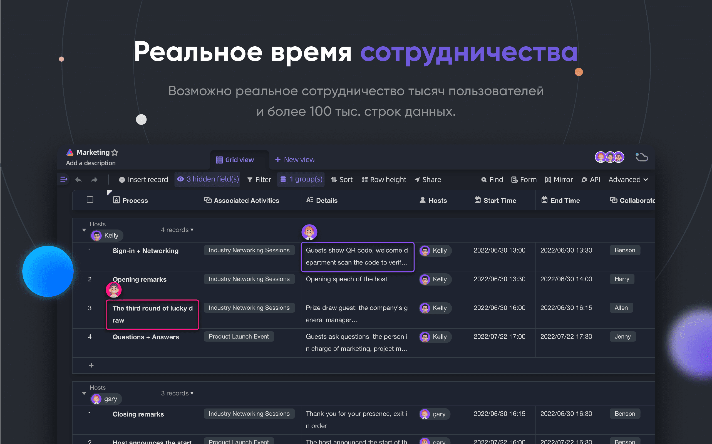
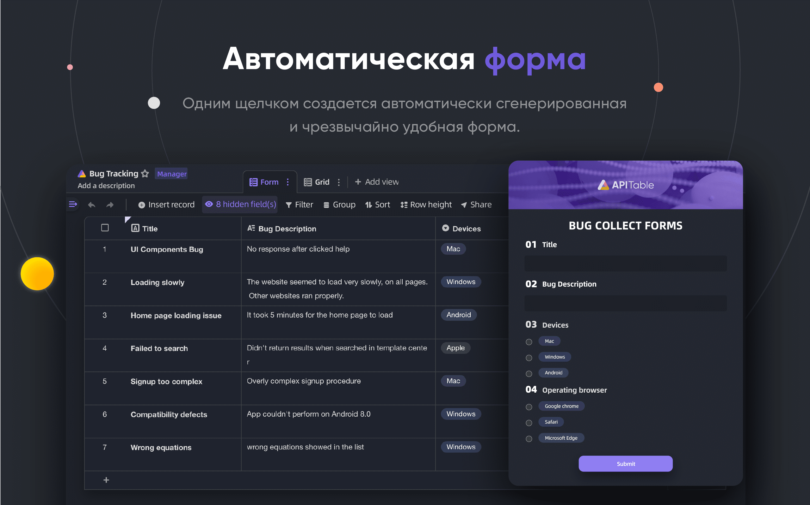
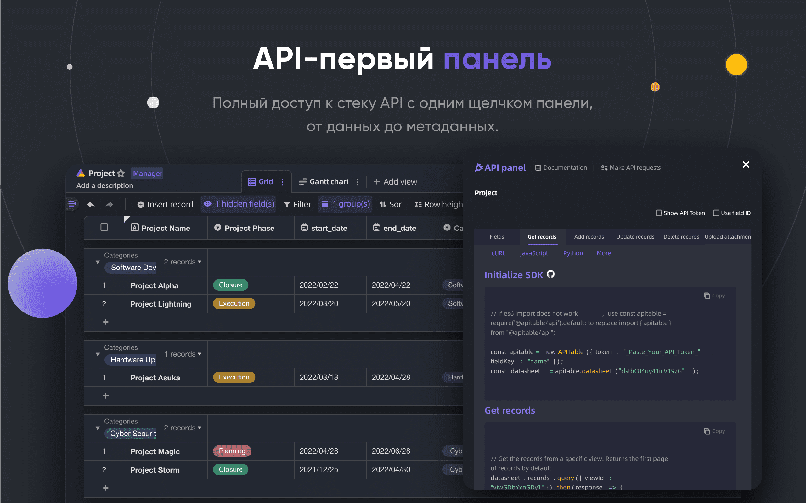
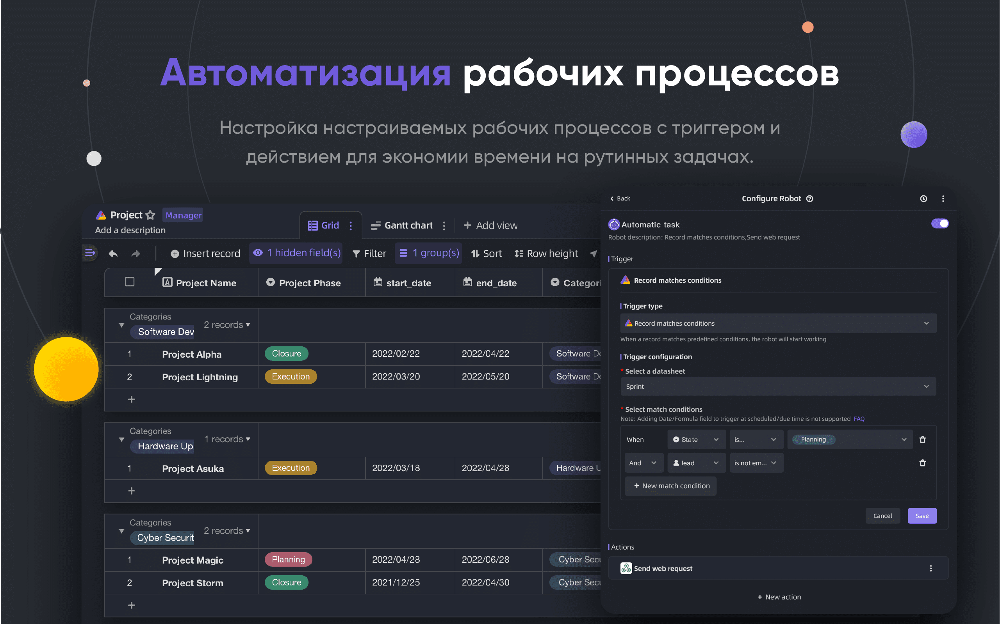
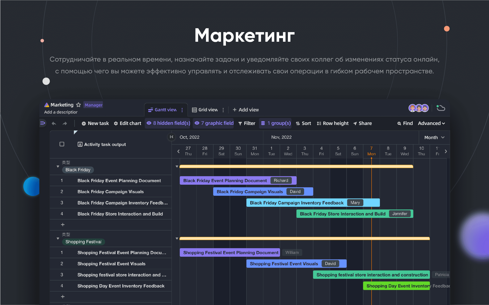
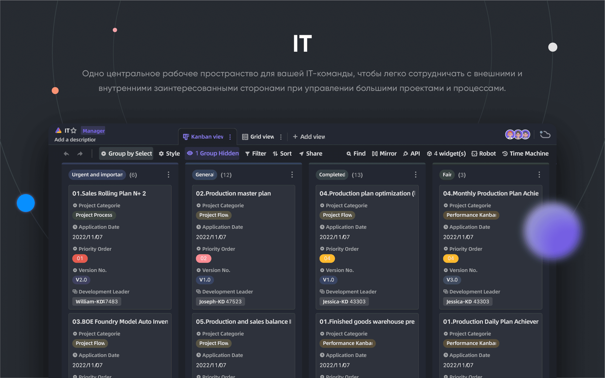
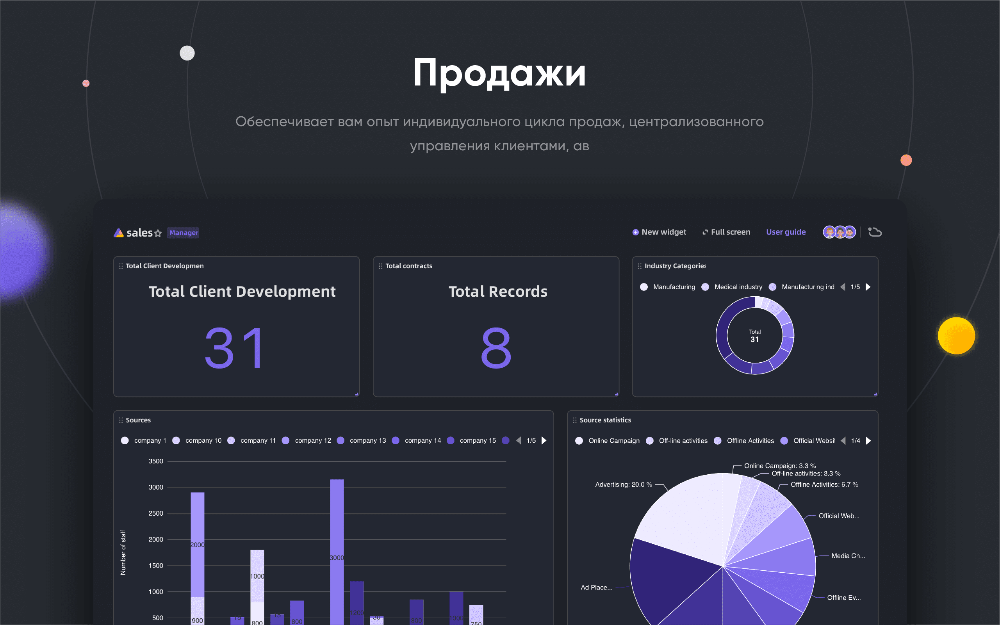

<p align="center">
    <a href="https://apitable.com" target="_blank">
        
    </a>
</p>

<p align="center">
    <!-- Gitpod -->
    <a target="_blank" href="https://gitpod.io/#https://github.com/apitable/apitable">
        
    </a>
    <!-- NodeJS -->
    
    <!-- Java -->
    
    <!-- hub.docker.com-->
    <a target="_blank" href="#Установка">
        
    </a>
    <!-- Github Release Latest -->
    <a target="_blank" href="https://github.com/apitable/apitable/releases/latest">
        
    </a>
    <!-- Render -->
    <a target="_blank" href="https://render.com/deploy?repo=https://github.com/apitable/apitable">
        
    </a>
    <br />
    <!-- LICENSE -->
    <a target="_blank" href="https://github.com/apitable/apitable/blob/main/LICENSE">
        
    </a>
    <!-- Discord -->
    <a target="_blank" href="https://discord.gg/zYWYTHXR4f">
        
    </a>
    <!-- Twitter -->
    <a target="_blank" href="https://twitter.com/apitable_com">
        
    </a>
    <!-- Github Action Build-->
    <a target="_blank" href="https://github.com/apitable/apitable/actions/workflows/build.yaml">
        
    </a>
    <!-- Better Uptime-->
    <a target="_blank" href="https://apitable.betteruptime.com/">
        
    </a>
</p>

<p align="center">
  <a href="../../../README.md">English</a>
  | 
  <a href="../fr-FR/README.md">Français</a>
  | 
  <a href="../es-ES/README.md">Español</a>
  | 
  <a href="../de-DE/README.md">Deutsch</a>
  | 
  <a href="../zh-CN/README.md">简体中文</a>
  | 
  <a href="../zh-HK/README.md">繁體中文</a>
  | 
  <a href="../ja-JP/README.md">日本語</a>
</p>

## ✨ Быстрый старт

Если вы просто хотите попробовать [^info], используйте нашу облачную версию с хостингом на [apitable.com](https://apitable.com).

Если вы хотите посмотреть этот проект с открытым исходным кодом, нажмите сюда для [⚡Gitpod Online Demo](https://gitpod.io/#https://github.com/apitable/apitable).

Если вы хотите установить APITable локально или в облаке, смотрите [💾 Установка](#Установка)

Если вы хотите установить локальную среду разработки, прочитайте наше [🧑<unk> 💻 Руководство разработчика](./docs/contribute/developer-guide.md)

Присоединяйтесь к [Discord](https://discord.gg/TwNb9nfdBU) или [Twitter](https://twitter.com/apitable_com), чтобы оставаться на связи.
## 🔥 Особенности

<table>
  
  <tr>
    <th>
      <a href="#">Сотрудничество в реальном времени</a>
    </th>
    <th>
      <a href="#">Автоматические формы</a>
    </th>

  </tr>

   <tr>
    <td width="50%">
      <a href="#">
        
      </a>
    </td>
    <td width="50%">
        <a href="#">
            
        </a>
    </td>
  </tr>

  <tr>
    <th>
      <a href="#">Первая панель API</a>
    </th>
    <th>
      <a href="#">Неограниченное число перекрестных ссылок</a>
    </th>
</tr>

 <tr>
    <td width="50%">
        <a href="#">
            
        </a>
    </td>
    <td width="50%">
      <a href="#">
        
      </a>
    </td>
 </tr>

 <tr>
    <th>
      <a href="#">Мощные Rows/Columns разрешения</a>
    </th>
    <th>
      <a href="#">Embed</a>
    </th>
  </tr>

 <tr>
    <td width="50%">
        <a href="#">
            
        </a>
    </td>
    <td width="50%">
        <a href="#">
            
        </a>
    </td>
  </tr>

</table>

APITable предоставляет целый ряд удивительных возможностей, от персональных до корпоративных.

- Передовой технологический стек и открытый исходный код
  - `В реальном времени` позволяет нескольким пользователям редактировать данные в реальном времени или одновременно с алгоритмом `Операционное преобразование (OT)` алгоритм.
  - Очень гладкий, удобный, супер-быстрый интерфейс с таблицами базы данных в `<canvas> Рендеринг-движке`.
  - Родная архитектура базы данных: Changeset / Operation / Action / Snapshot и так далее.
  - **100k+** data rows with real-time collaboration.
  - Доступ к API Full-stack, от `Data` до `метаданных`.
  - Таблица с одним направлением / двумя направлениями и `бесконечные перекрестные ссылки`
  - Community-friendly programming languages and framework, TypeScript ([NextJS](https://nextjs.org/) + [NestJS](https://nestjs.com/)) and Java ([Spring Boot](https://spring.io/projects/spring-boot)).
- пользовательский интерфейс для работы с базами данных и таблицами
  - `CRUD`: Создание, Чтение, Обновление, Удаление таблиц, столбцов и строк
  - `Операции с полями`: сортировка, фильтр, группировка, скрытие/скрытие, установка высоты.
  - `На основе пространства`: Использование разделенных рабочих пространств вместо структуры на основе приложений/базы, возможность связывать неограниченное количество таблиц.
  - Доступен темный режим и настройка темы.
  - 7 типов представления: Вид сетки (Datasheet) / Вид галереи / Вид Mindmap / Вид Kanban / Полнофункциональный вид Gantt / Вид календаря.
  - Панель API одним щелчком мыши
- Батарейки в комплекте
  - Встроенные 10+ официальных шаблонов
  - Robot Automation and customization available.
  - BI приборная панель
  - Автоматически генерируемая форма в один клик
  - Возможность поделиться и встроить страницу
  - Поддержка нескольких языков
  - Интеграция с n8n.io / Zapier / Appsmith... и многое другое
- Отличная расширяемость
  - Расширяемая система виджетов с более чем 20 официальными виджетами с открытым исходным кодом
  - Настраиваемые графики, диаграммы и приборные панели
  - Настраиваемые типы столбцов данных
  - Настраиваемые формулы
  - Настраиваемые действия роботов-автоматизаторов
- Разрешения корпоративного уровня
  - `Зеркало`, превратите представление в зеркало, чтобы реализовать разрешение на строку
  - Активируйте разрешение столбцов с помощью очень простой операции
  - Разрешение папок / вложенных папок / файлов
  - Древовидная структура папок и настраиваемый узел (файл)
  - Управление командой и организационная структура
- Функции предприятия
  - SAML
  - Единая регистрация (SSO)
  - Audit
  - Автоматическое резервное копирование базы данных
  - Экспортер данных
  - Водяной знак
- ....

С помощью расширяемых виджетов и плагинов вы можете добавлять дополнительные функции

## 💥 Примеры использования

Почему вы должны знать APITable для вашего следующего программного обеспечения?

- Как программное обеспечение для суперменеджмента
  - Гибкое управление проектами и задачами / вопросами
  - Управление маркетинговыми лидами
  - Самая гибкая и подключаемая CRM
  - Гибкая бизнес-аналитика (BI)
  - Удобные для людей формы и опросы
  - Гибкая ERP
  - Low-code и no-code платформа
  - ...и многое другое, APITable помещает 1000 программных продуктов в ваш карман
- Как визуальная инфраструктура базы данных
  - **Embed** APITable into your own software UIs.
  - Визуальная база данных с REST API
  - Приборная панель администратора
  - Центральное управление конфигурацией
  - База данных предприятия "все в одном", которая соединяет все ваше программное обеспечение
  - ...и многое другое, APITable объединяет все
- Кроме того, она имеет открытый исходный код и расширяема.

## 💞 Ориентированность на API

#### Панель пользовательского интерфейса API

Нажав на кнопку API в правом углу, вы увидите панель API.

#### SQL-подобный запрос

APITable предоставляет язык запросов Datasheet Query Language (DQL) для запроса содержимого вашей базы данных - электронной таблицы.

## 💝 Embed-friendly

#### Share and Embed

Поделитесь таблицей или папкой с данными. Встраивайте их путем копирования и вставки HTML-скриптов.

#### Enterprise-ready Embedding

[APITable.com](https://apitable.com) предоставляет больше возможностей Enterprise-ready Embedding для ценных бумаг.

## Установка

Прежде чем начать:
* Хост с установленными [docker](https://docs.docker.com/engine/install/) и [docker-compose v2](https://docs.docker.com/engine/install/).
* Рекомендуется 4 CPU/8GB RAM или более.
* Оболочка bash с установленными базовыми утилитами, такими как curl.
* Нативные образы контейнеров arm64 (apple silicon) еще не готовы и могут привести к плохой производительности.

Чтобы установить apitable с помощью docker compose, откройте терминал и выполните следующее:

```
curl https://apitable.github.io/install.sh | bash
```

Затем откройте http://localhost:80 в браузере, чтобы посетить его.

Мы также предоставляем универсальный образ на основе [pm2](https://pm2.keymetrics.io/) для демонстрации или тестирования (не рекомендуется для корпоративного или производственного использования):

```bash
sudo docker run -d -v ${PWD}/.data:/apitable -p 80:80 --name apitable apitable/all-in-one:latest
```

Depending on your environment, you may need to wait several minutes for all the services to start. Этот образ предназначен только для amd64 (x86_64), вы можете столкнуться с довольно низкой производительностью на arm64 или Apple Silicon.

Если вы хотите настроить локальную среду разработки, [прочитайте наше руководство для разработчиков 🧑‍💻](./docs/contribute/developer-guide.md).

## 🧑‍💻 Вклад

Добро пожаловать, и спасибо за ваш интерес к участию в разработке APITable!

In addition to writing code, there are many ways for you to contribute.

Вы можете внести свой вклад следующим образом:
- Присоединиться и изменять переводы в нашем проекте переводов [Crowdin](https://crowdin.com/project/apitablecode/invite?h=f48bc26f9eb188dcd92d5eb4a66f2c1f1555185).
- Create [Issues](https://github.com/apitable/apitable/issues/new/choose)
- Follow our [Twitter](https://twitter.com/apitable_com)
- Create [Documentation](./docs)
- [Contributing Code](./docs/contribute/developer-guide.md)


Such as the following:
- Join [Crowdin Translation Project](https://crowdin.com/project/apitablecom/invite?h=4a985ea532a01d973acc03f2f1c960951693577)
- Create [Issues](https://github.com/apitable/apitable/issues/new/choose)
- Follow our [Twitter](https://twitter.com/apitable_com)
- Create [Documentation](./docs)
- [Contributing Code](./docs/contribute/developer-guide.md)


Вы можете прочитать Руководство по внесению кода в этот репозиторий, чтобы узнать, как вносить свой вклад.

Вот краткое руководство, которое поможет вам внести свой вклад в APITable.


### Среда разработки

О том, как настроить локальное окружение, читайте в нашем руководстве для разработчиков.

### Основы рабочего процесса Git

Вот общая схема работы APITable с git:

1. Создайте проблему и опишите функции, которые вы хотите получить -> [Проблемы APITable](https://github.com/apitable/apitable/issues)
2. Форк этого проекта -> [Форк проекта APITable](https://github.com/apitable/apitable/fork)
3. Создайте свою ветку фич (`git checkout -b my-new-feature`)
4. Зафиксируйте свои изменения  (`git commit -am 'Add some features'`)
5. Опубликуйте ветку (`git push origin my-new-feature`)
6. Создать новый запрос на притяжение -> [Создать запрос на притяжение во всех форках](https://github.com/apitable/apitable/compare)

### Рабочие соглашения

APITable использует эти общие соглашения:

- Какова наша модель ветвления в Git? [Gitflow](https://nvie.com/posts/a-successful-git-branching-model/)
- Как сотрудничать над своими форками проектов? [Github Flow](https://docs.github.com/en/get-started/quickstart/github-flow)
- Как написать хорошее сообщение о коммите? [Обычные коммиты](https://www.conventionalcommits.org/)
- Каков формат нашего журнала изменений? [Сохранить журнал изменений](https://keepachangelog.com/en/1.0.0/)
- Как создавать версии и теги? [Семантическое версионирование](https://semver.org/)
- Что такое руководство по кодированию Java? [Руководство по кодированию Java](https://google.github.io/styleguide/javaguide.html)  | [Плагин Intellij IDEA](https://plugins.jetbrains.com/plugin/8527)
- Что такое руководство по кодированию TypeScript? -> [Руководство по стилю TypeScript](https://google.github.io/styleguide/tsguide.html) | [ESLint](https://www.npmjs.com/package/@typescript-eslint/eslint-plugin)

### Документация

- [Справочный центр](https://help.apitable.com/)
- [👩‍💻 Центр разработчиков](https://developers.apitable.com/)
  - [🪡 REST API Docs](https://developers.apitable.com/api/introduction/)
  - [Виджет SDK](https://developers.apitable.com/widget/introduction/)
  - [Scripting Widget](https://developers.apitable.com/script/introduction/)
- [Design System](https://figma.com/@apitable)

## 🛣 Дорожная карта

Обратитесь к [Дорожной карте пригодности](https://apitable.com/roadmap)

### Будущие возможности

- Конструктор интерфейсов с тяжелым кодом
- Embeddable 3rd party documentation components
- SQL-подобные языки, специфичные для домена
- В качестве IdP
- Расширенный робот автоматизации
- Особенности Web 3
- ...

### Версии Hosted и Enterprise предлагают расширенные возможности

- В качестве IdP
- SAML
- Single-Sign-On
- Audit
- Резервное копирование базы данных
- Интеграция с ChatGPT, Zapier, Slack, Google Workspace......
- Водяной знак

For more information on our product, including enterprise self-hosted license, please contact us at <support@apitable.com> or [book a demo](https://apitable.com/share/shrdaGGppsfg3pjQLXALG?fldy5ZmHYGZx2=salesteam@apitable.com).

## 👫 Принять участие

### 🌏 Почему мы создали APITable с открытым исходным кодом?

- Мы считаем, что база данных - это краеугольный камень всего программного обеспечения.
- Мы считаем, что создание визуальной базы данных с богатым и простым пользовательским интерфейсом для всех может уменьшить сложность индустрии программного обеспечения и увеличить внедрение цифровых технологий в мире.
- Мы верим, что открытая работа APITable может продвинуть человека вперед.

### Мы принимаем на работу удаленно!

Мы всегда ищем хорошие таланты для APITable:

- **Full-stack разработчик**: У вас есть опыт работы с React, NestJS, TypeScript, Spring Boot, Java, Terraform. И вам нравится писать высококачественный код с четкой документацией и модульными тестами.
- **Back-end разработчик**: У вас есть опыт работы с NestJS, TypeScript, Spring Boot, Java, SQL, Kubernetes, Terraform. И вам нравится писать высококачественный код с четкой документацией и модульными тестами.
- **Front-end разработчик**: У вас есть опыт работы с React, NextJS, TypeScript, WebPack. And you like to write high quality code with clear documentation and unit tests.

Независимо от времени и условий, если вы хотите присоединиться к команде APITable, не стесняйтесь и присылайте свое резюме на <talent@apitable.com>.

## 📺 Скриншот

<p align="center">
    
</p>
<p align="center">
    
</p>
<p align="center">
    
</p>
<p align="center">
    
</p>
<p align="center">
    
</p>
<p align="center">
    
</p>
<p align="center">
    
</p>
<p align="center">
    
</p>
<p align="center">
    
</p>
<p align="center">
    
</p>

## 🥰 Лицензия

> Этот репозиторий содержит исходный код для Open Source версии APITable, выпущенной под лицензией AGPL.
> 
> Если вы хотите запустить свою собственную копию APITable или внести вклад в разработку, то это место для вас.
> 
> See [LICENSING](./LICENSING.md) for details.
> 
> Если вы хотите использовать APITable онлайн, то вам не нужно запускать этот код, мы предлагаем размещенную версию приложения на сайте [APITable.com](https://apitable.com), оптимизированную для глобального акселератора.

<br/>

[^info]: Лицензия AGPL-3.0. Разработано компанией [APITable Ltd](https://apitable.com).
