<p align="center">
    <a href="https://apitable.com" target="_blank">
        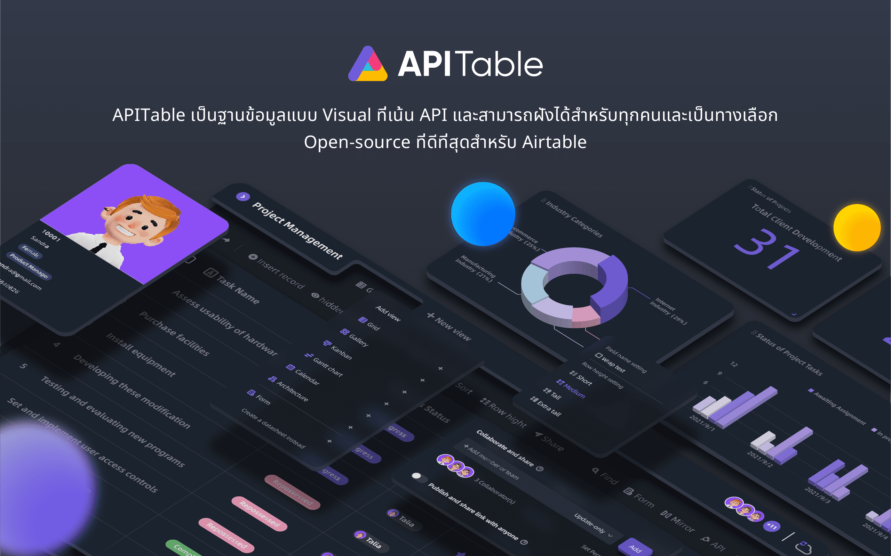
    </a>
</p>

<p align="center">
    <!-- Gitpod -->
    <a target="_blank" href="https://gitpod.io/#https://github.com/apitable/apitable">
        
    </a>
    <!-- NodeJS -->
    
    <!-- Java -->
    
    <!-- hub.docker.com-->
    <a target="_blank" href="#การติดตั้ง">
        
    </a>
    <!-- Github Release Latest -->
    <a target="_blank" href="https://github.com/apitable/apitable/releases/latest">
        
    </a>
    <!-- Render -->
    <a target="_blank" href="https://render.com/deploy?repo=https://github.com/apitable/apitable">
        
    </a>
    <br />
    <!-- LICENSE -->
    <a target="_blank" href="https://github.com/apitable/apitable/blob/main/LICENSE">
        
    </a>
    <!-- Discord -->
    <a target="_blank" href="https://discord.gg/TwNb9nfdBU">
        
    </a>
    <!-- Twitter -->
    <a target="_blank" href="https://twitter.com/apitable_com">
        
    </a>
    <!-- Github Action Build-->
    <a target="_blank" href="https://github.com/apitable/apitable/actions/workflows/build.yaml">
        
    </a>
    <!-- Better Uptime-->
    <a target="_blank" href="https://apitable.betteruptime.com/">
        
    </a>
</p>

<p align="center">
  <a href="../../../README.md">English</a>
  | 
  <a href="../fr-FR/README.md">Français</a>
  | 
  <a href="../es-ES/README.md">Español</a>
  | 
  <a href="../de-DE/README.md">Deutsch</a>
  | 
  <a href="../zh-CN/README.md">简体中文</a>
  | 
  <a href="../zh-HK/README.md">繁體中文</a>
  | 
  <a href="../ja-JP/README.md">日本語</a>
</p>

## ✨ เริ่มต้น n

หากคุณต้องการลองใช้ APITable เพียงแค่ลองใช้เวอร์ชันของเราบนคลาวด์ที่ [apitable.com](https://apitable.com).

หากคุณต้องการทดสอบโปรเจค APITable open-source นี้ คลิกที่นี่สำหรับ [⚡️Gitpod Online Demo](https://gitpod.io/#https://github.com/apitable/apitable).

หากคุณต้องการติดตั้ง APITable ในเครื่องคอมพิวเตอร์ของคุณหรือในระบบคลาวด์ โปรดดูที่  [💾 การติดตั้ง](#การติดตั้ง)

หากคุณต้องการตั้งค่าสภาพแวดล้อมการพัฒนาในเครื่องคอมพิวเตอร์ของคุณ อ่านเกี่ยวกับ  [🧑‍💻 Developer Guide](./docs/contribute/developer-guide.md)

เข้าร่วม [Discord](https://discord.gg/TwNb9nfdBU) หรือ  [Twitter](https://twitter.com/apitable_com) เพื่อเชื่อมต่อ
## 🔥 คุณสมบัติ

<table>
  
  <tr>
    <th>
      <a href="#">การทำงานร่วมกันแบบเรียลไทม์</a>
    </th>
    <th>
      <a href="#">แบบฟอร์มอัตโนมัติ</a>
    </th>

  </tr>

   <tr>
    <td width="50%">
      <a href="#">
        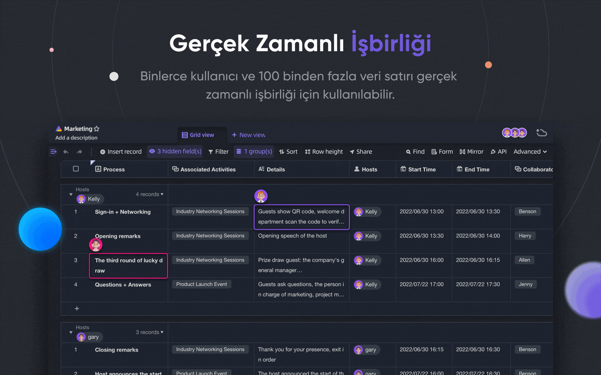
      </a>
    </td>
    <td width="50%">
        <a href="#">
            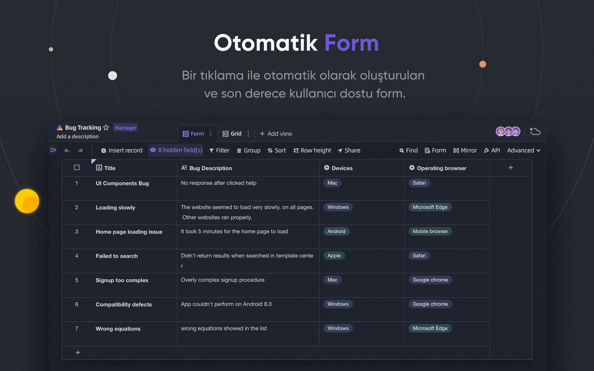
        </a>
    </td>
  </tr>

  <tr>
    <th>
      <a href="#">API แผงแรก</a>
    </th>
    <th>
      <a href="#">ลิงค์ข้ามโต๊ะไม่จำกัด</a>
    </th>
</tr>

 <tr>
    <td width="50%">
        <a href="#">
            
        </a>
    </td>
    <td width="50%">
      <a href="#">
        
      </a>
    </td>
 </tr>

 <tr>
    <th>
      <a href="#">สิทธิ์แถว/คอลัมน์ที่มีประสิทธิภาพ</a>
    </th>
    <th>
      <a href="#">ฝัง</a>
    </th>
  </tr>

 <tr>
    <td width="50%">
        <a href="#">
            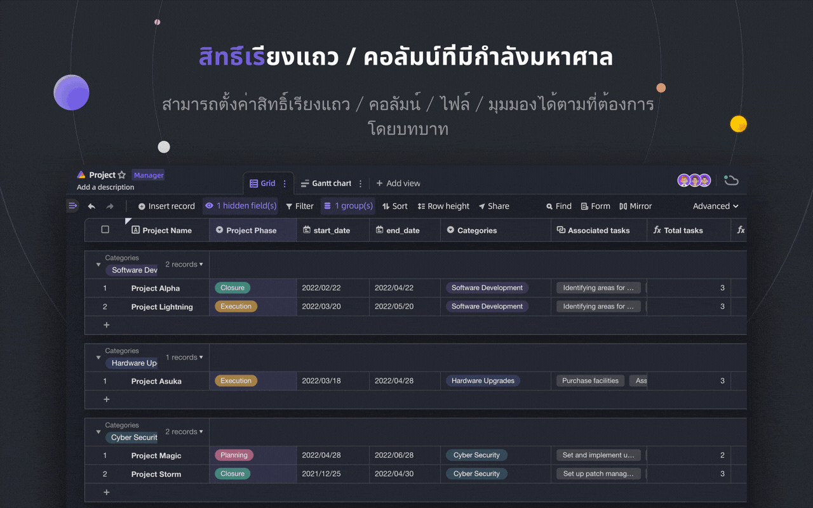
        </a>
    </td>
    <td width="50%">
        <a href="#">
            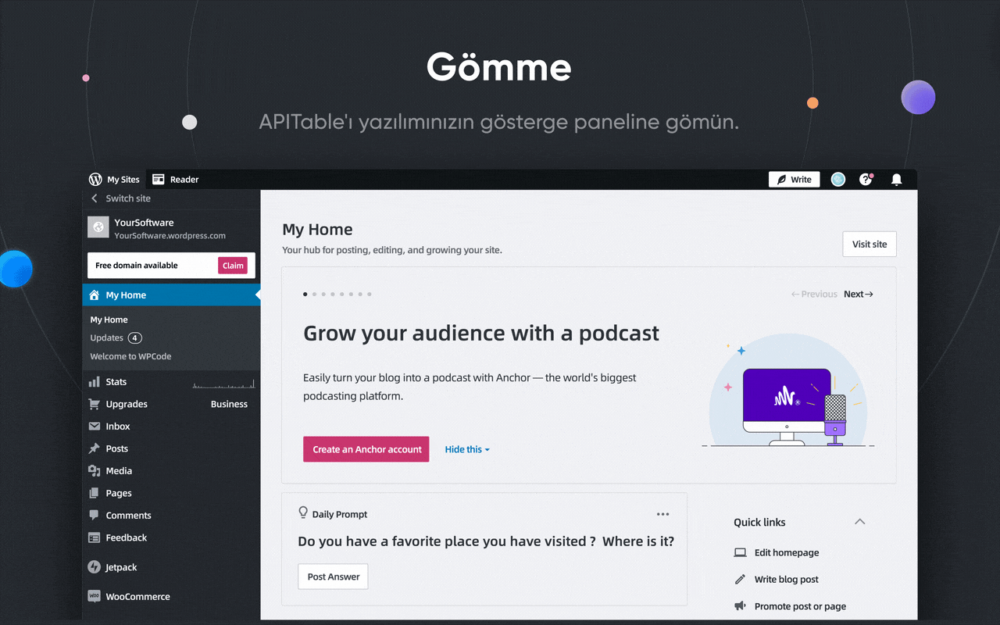
        </a>
    </td>
  </tr>

</table>

APITable มีคุณสมบัติที่น่าทึ่งตั้งแต่ส่วนบุคคลจนถึงองค์กร

- - สแต็กเทคโนโลยีขั้นสูงและโอเพอร์เซอร์สแบบ open-source
  - การทำงานร่วมกันแบบเรียลไทม์ช่วยให้ผู้ใช้หลายคนสามารถแก้ไขร่วมกันได้ในเวลาเดียวกัน หรือพร้อมกันด้วย Operational Transformation (OT) Algorithm.
  - อินเทอร์เฟซฐานข้อมูลสเปรดชีตที่เรียบร้อยและใช้งานง่าย และเร็วมากด้วย `canvas Rendering Engine`.
  - สถาปัตยกรรมฐานข้อมูลแบบ Native: Changeset / Operation / Action / Snapshot และอื่นๆ
  - รองรับข้อมูลกว่า 100,000 แถวด้วยการทำงานร่วมกันแบบเรียลไทม์
  - การเข้าถึง API แบบ Full-stack ทั้งจากข้อมูลไปจนถึงเมตาดาต้า
  - การเชื่อมตารางแบบ One-direction / Bi-direction และ Infinite Cross Links
  - ภาษาโปรแกรมและเฟรมเวิร์กที่เป็นมิตรต่อชุมชน, TypeScript ([NextJS](https://nextjs.org/) + [NestJS](https://nestjs.com/)) และ Java ([Spring Boot](https://spring.io/projects/spring-boot))
- อินเทอร์เฟซสเปรดชีตฐานข้อมูลที่สวยงามและมีความหลากหลาย
  - การ CRUD: Create, Read, Update, Delete ตาราง, คอลัมน์ และแถว
  - การดำเนินการกับฟิลด์: เรียงลำดับ, กรอง, จัดกลุ่ม, ซ่อน / แสดง, ตั้งค่าความสูง
  - ใช้พื้นที่เว้นว่าง: ใช้พื้นที่ทำงานที่แยกจากโครงสร้าง App / Base เพื่อให้สามารถเชื่อมตารางได้ไม่จำกัด
  - รองรับโหมดดาร์กและการปรับแต่งธีม
  - `มุมมอง 7 ประเภท`: มุมมองตาราง (แผ่นข้อมูล) / มุมมองแกลเลอรี / มุมมองแผนที่ความคิด / มุมมองคัมบัง / มุมมองแกนต์แบบเต็มคุณสมบัติ / มุมมองปฏิทิน
  - แผง API เพียงคลิกเดียว
- รวมแบตเตอรี่
  - เทมเพลตอย่างเป็นทางการมากกว่า 10 แบบในตัว
  - Robot Automation และปรับแต่งได้
  - แดชบอร์ด BI
  - แบบฟอร์มที่สร้างขึ้นอัตโนมัติในคลิกเดียว
  - หน้าแชร์และฝังได้
  - การสนับสนุนหลายภาษา
  - บูรณาการกับ n8n.io / Zapier / Appsmith... และอีกมากมาย
- ความสามารถในการขยายที่ยอดเยี่ยม
  - ระบบวิดเจ็ตที่ขยายได้พร้อมวิดเจ็ตโอเพ่นซอร์สอย่างเป็นทางการกว่า 20 รายการ
  - กราฟและแผนภูมิและแดชบอร์ดที่ปรับแต่งได้
  - ประเภทคอลัมน์ข้อมูลที่ปรับแต่งได้
  - สูตรที่ปรับแต่งได้
  - การกระทำของหุ่นยนต์อัตโนมัติที่ปรับแต่งได้
- สิทธิ์ระดับองค์กร
  - มิเรอร์ เปลี่ยนมุมมองเป็นมิเรอร์เพื่อใช้สิทธิ์แถว
  - เปิดใช้งานการอนุญาตคอลัมน์ผ่านการดำเนินการที่ง่ายมาก
  - โฟลเดอร์ / โฟลเดอร์ย่อย / การอนุญาตไฟล์
  - โฟลเดอร์โครงสร้างต้นไม้และโหนดที่ปรับแต่งได้ (ไฟล์);
  - การบริหารทีมและโครงสร้างองค์กร
- คุณลักษณะขององค์กร:
  - SAML
  - Single-Sign-On (SSO)
  - Audit
  - สำรองฐานข้อมูลอัตโนมัติ
  - ผู้ส่งออกข้อมูล
  - ลายน้ำ
- ....

ด้วยวิดเจ็ตและปลั๊กอินที่ขยายได้ คุณสามารถเพิ่มคุณสมบัติเพิ่มเติมได้

## 💥ใช้เคส

ทำไมคุณต้องรู้จัก APITable สำหรับซอฟต์แวร์ถัดไปของคุณ

- เป็นซอฟต์แวร์การจัดการขั้นสูง
  - การจัดการโครงการและงาน / การจัดการปัญหาที่ยืดหยุ่น
  - การจัดการลูกค้าเป้าหมายทางการตลาด
  - CRM ที่ยืดหยุ่นและเชื่อมต่อได้มากที่สุด
  - ระบบข่าวกรองธุรกิจที่ยืดหยุ่น (BI)
  - แบบฟอร์มและแบบสำรวจที่เป็นมิตรต่อผู้คน
  - ระบบ ERP ที่ยืดหยุ่น
  - แพลตฟอร์มรหัสต่ำและไม่มีรหัส
  - ...และอีกมากมาย APITable ใส่ซอฟต์แวร์ 1,000 รายการไว้ในกระเป๋าของคุณ
- เป็นโครงสร้างพื้นฐานฐานข้อมูลภาพ
  - ฝัง APITable ลงใน UI ของซอฟต์แวร์ของคุณเอง
  - ฐานข้อมูลภาพพร้อม REST API
  - แดชบอร์ดผู้ดูแลระบบ
  - การจัดการการกำหนดค่าส่วนกลาง
  - ฐานข้อมูลองค์กรแบบครบวงจรที่เชื่อมต่อซอฟต์แวร์ทั้งหมดของคุณ
  - ...และอีกมากมาย APITable เชื่อมต่อทุกอย่าง
- นอกจากนี้ยังเป็นโอเพ่นซอร์สและขยายได้

## 💞 เชิง API

#### แผง API UI

การคลิกปุ่ม  `API` ที่มุมขวาจะแสดงแผง API

#### แบบสอบถามที่เหมือน SQL

APITable จะให้ Datasheet Query Language (DQL) เพื่อสอบถามเนื้อหาสเปรดชีตฐานข้อมูลของคุณ

## 💝เป็นมิตรกับการฝังตัว

#### แบ่งปันและฝัง

แชร์ตารางหรือโฟลเดอร์แผ่นข้อมูลของคุณ. ฝังโดยการคัดลอกและวางสคริปต์ HTML

#### การฝังที่พร้อมสำหรับองค์กร

[APITable.com](https://apitable.com)  นำเสนอคุณสมบัติการฝังที่พร้อมสำหรับองค์กรมากขึ้นสำหรับหลักทรัพย์

## การติดตั้ง

ก่อนที่คุณจะเริ่มต้น:
* โฮสต์ที่ติดตั้ง [docker](https://docs.docker.com/engine/install/) และ [docker-compose](https://docs.docker.com/engine/install/)  v2
* แนะนำให้ใช้ 4 CPUs/8GB RAM หรือมากกว่า
* bash shell พร้อมยูทิลิตี้พื้นฐานเช่นการติดตั้ง curl
* อิมเมจคอนเทนเนอร์เนทีฟ arm64 (apple silicon) ยังไม่พร้อม และอาจทำให้ประสิทธิภาพไม่ดี

ในการติดตั้ง apitable โดยใช้ docker Composite ให้เปิดเทอร์มินัลแล้วรันสิ่งนี้:

```
curl https://apitable.github.io/install.sh | bash
```

จากนั้นเปิด [http://localhost:80](http://localhost:80)  ในเบราว์เซอร์ของคุณเพื่อเยี่ยมชม (ชื่อผู้ใช้เริ่มต้น admin@apitable.com และรหัสผ่าน APITable2022)

นอกจากนี้ เรายังจัดเตรียมภาพแบบครบวงจรที่ใช้ [pm2](https://pm2.keymetrics.io/) เพื่อวัตถุประสงค์ในการสาธิตหรือทดสอบ (ไม่แนะนำสำหรับการใช้งานระดับองค์กรหรือการผลิต):

```bash
sudo docker run -d -v ${PWD}/.data:/apitable -p 80:80 --name apitable apitable/all-in-one:latest
```

Depending on your environment, you may need to wait several minutes for all the services to start. รูปภาพนี้เป็น amd64 (x86_64) เท่านั้น คุณอาจพบประสิทธิภาพที่ค่อนข้างแย่ใน arm64 หรือ apple silicon.

หากคุณต้องการตั้งค่าสภาพแวดล้อมการพัฒนาในพื้นที่ โปรดอ่าน [🧑‍💻 Developer Guide](./docs/contribute/developer-guide.md)

## 🧑‍💻 มีส่วนร่วม

ยินดีต้อนรับ และขอขอบคุณที่สนใจร่วมให้ข้อมูลกับ APITable!

In addition to writing code, there are many ways for you to contribute.

คุณสามารถมีส่วนร่วมดังต่อไปนี้:
- เข้าร่วมและแก้ไขการแปลในโครงการแปล [Crowdin](https://crowdin.com/project/apitablecode/invite?h=f48bc26f9eb188dcd92d5eb4a66f2c1f1555185) ของเรา
- Create [Issues](https://github.com/apitable/apitable/issues/new/choose)
- Follow our [Twitter](https://twitter.com/apitable_com)
- Create [Documentation](./docs)
- [Contributing Code](./docs/contribute/developer-guide.md)


Such as the following:
- Join [Crowdin Translation Project](https://crowdin.com/project/apitablecode/invite?h=f48bc26f9eb188dcd92d5eb4a66f2c1f1555185)
- Create [Issues](https://github.com/apitable/apitable/issues/new/choose)
- Follow our [Twitter](https://twitter.com/apitable_com)
- Create [Documentation](./docs)
- [Contributing Code](./docs/contribute/developer-guide.md)


คุณสามารถอ่านแนวทางการมีส่วนร่วมของพื้นที่เก็บข้อมูลนี้เพื่อเรียนรู้วิธีมีส่วนร่วม

ต่อไปนี้เป็นคำแนะนำโดยย่อเพื่อช่วยให้คุณมีส่วนร่วมกับ APITable


### การพัฒนาสภาพแวดล้อม

เรียนรู้วิธีตั้งค่าสภาพแวดล้อมท้องถิ่นของคุณ ไปที่คู่มือนักพัฒนาของเรา

### Git เวิร์กโฟลว์พื้นฐาน

นี่คือเวิร์กโฟลว์คอมไพล์ APITable ทั่วไป:

1. สร้างปัญหาและอธิบายคุณสมบัติที่คุณต้องการ -> ปัญหา APITable
2. แยกโครงการนี้ -> แยกโครงการ APITable
3. สร้างสาขาคุณลักษณะของคุณ (`git checkout -b my-new-feature`)
4. ยืนยันการเปลี่ยนแปลงของคุณ (`git commit -am 'Add some features'`)
5. เผยแพร่สาขา (`git push origin my-new-feature`)
6. สร้างคำขอดึงใหม่ -> สร้างคำขอดึงข้ามส้อม

### ข้อตกลงในการทำงาน

APITable ใช้แบบแผนทั่วไปเหล่านี้:

- โมเดลการแยกย่อย Git ของเราคืออะไร โมเดลการแยกย่อย Git ของเราคืออะไร [Gitflow](https://nvie.com/posts/a-successful-git-branching-model/)
- จะทำงานร่วมกันในโครงการส้อมของคุณได้อย่างไร? [Github Flow](https://docs.github.com/en/get-started/quickstart/github-flow)
- วิธีการเขียนข้อความยืนยันที่ดี? [Conventional Commits](https://www.conventionalcommits.org/)
- รูปแบบบันทึกการเปลี่ยนแปลงของเราคืออะไร เก็บบันทึกการเปลี่ยนแปลง [ผู้ที่ต้องการให้กลับมามีประโยชน์](https://keepachangelog.com/en/1.0.0/)
- การกำหนดเวอร์ชันและการติดแท็กทำอย่างไร การกำหนดเวอร์ชันความหมาย [การกำหนดเวอร์ชันความหมาย](https://semver.org/)
- Java Coding Guideline คืออะไร? [แนวทางการเขียนโค้ด Java](https://google.github.io/styleguide/javaguide.html) | [ปลั๊กอิน Intellij IDEA](https://plugins.jetbrains.com/plugin/8527)
- ภาพรวมสถาปัตยกรรมคืออะไร? -> [ทำความเข้าใจ APITable - ภาพรวมสถาปัตยกรรม](./docs/contribute/architecute-overview.md)

### เอกสาร

- [ศูนย์ช่วยเหลือ](https://help.apitable.com/)
- [👩‍💻 ศูนย์นักพัฒนา](https://developers.apitable.com/)
  - [🪡 เอกสาร REST API](https://developers.apitable.com/api/introduction/)
  - [วิดเจ็ต SDK](https://developers.apitable.com/widget/introduction/)
  - [Scripting Widget](https://developers.apitable.com/script/introduction/)

## 🛣 แผนที่เดินทาง

โปรดดูที่ [แผนงานของ APITable](https://apitable.com/roadmap)

### คุณสมบัติในอนาคต

- ตัวสร้างส่วนต่อประสานโค้ดจำนวนมาก
- Embeddable 3rd party documentation components
- ภาษาเฉพาะโดเมนที่คล้ายกับ SQL
- ในฐานะ IDP
- หุ่นยนต์อัตโนมัติขั้นสูง
- คุณสมบัติเว็บ 3
- ...

### รุ่นโฮสต์และรุ่นองค์กรมีคุณสมบัติขั้นสูง

- ในฐานะ IdP;
- SAML
- Single-Sign-On
- Audit
- การสำรองฐานข้อมูล
- ผสานรวมกับ ChatGPT, Zapier, Slack, Google Workspace……
- ลายน้ำ

สำหรับข้อมูลเพิ่มเติม โปรดติดต่อเราที่ <support@apitable.com>

## 👫 มีส่วนร่วม

### 🌏 ทำไมเราถึงสร้าง APITable และโอเพ่นซอร์ส

- เราเชื่อว่าฐานข้อมูลเป็นรากฐานที่สำคัญของซอฟต์แวร์ทั้งหมด
- เราเชื่อว่าการสร้าง Visual Database ที่มีส่วนต่อประสานกับผู้ใช้ที่หลากหลายและใช้งานง่ายสำหรับทุกคนสามารถลดความยุ่งยากของอุตสาหกรรมซอฟต์แวร์และเพิ่มการยอมรับการปรับให้เป็นดิจิทัลของโลก
- เราเชื่อว่างาน APITable แบบโอเพ่นซอร์สสามารถผลักดันมนุษย์ไปข้างหน้าได้

### เรากำลังจ้างงานทางไกล!

เรามักจะค้นหาความสามารถที่ดีสำหรับ APITable:

- Full-stack Developer: คุณมีประสบการณ์กับ React, NestJS, TypeScript, Spring Boot, Java, Terraform และคุณชอบเขียนโค้ดคุณภาพสูงพร้อมเอกสารประกอบที่ชัดเจนและการทดสอบหน่วย
- นักพัฒนาส่วนหลัง: คุณมีประสบการณ์กับ NestJS, TypeScript, Spring Boot, Java, SQL, Kubernetes, Terraform และคุณชอบเขียนโค้ดคุณภาพสูงพร้อมเอกสารประกอบที่ชัดเจนและการทดสอบหน่วย
- นักพัฒนาส่วนหน้า: คุณมีประสบการณ์กับ React, NextJS, TypeScript, WebPack และคุณชอบเขียนโค้ดคุณภาพสูงพร้อมเอกสารประกอบที่ชัดเจนและการทดสอบหน่วย

โดยไม่คำนึงถึงเวลาและเงื่อนไข หากคุณต้องการมีส่วนร่วมกับทีม APITable อย่าลังเล และส่ง CV ของคุณไปที่ <talent@apitable.com>

## 📺 ภาพหน้าจอ

<p align="center">
    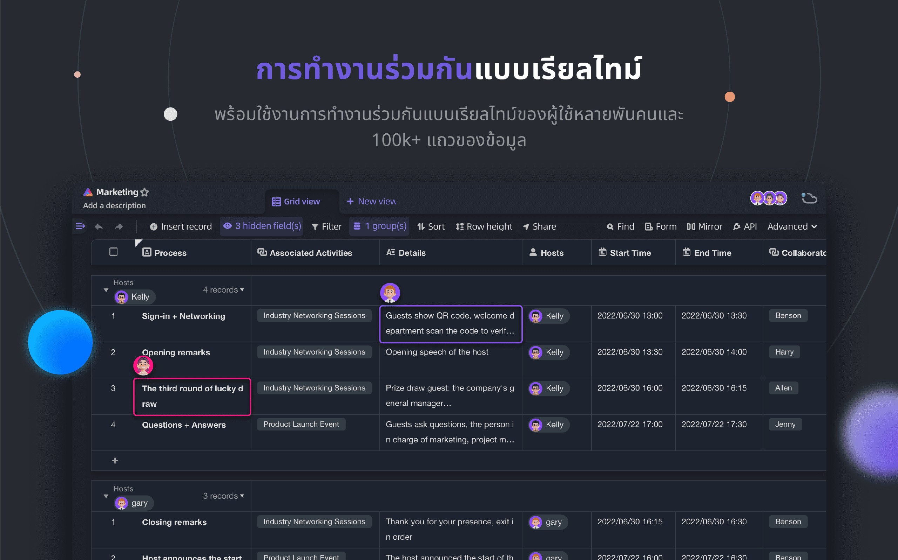
</p>
<p align="center">
    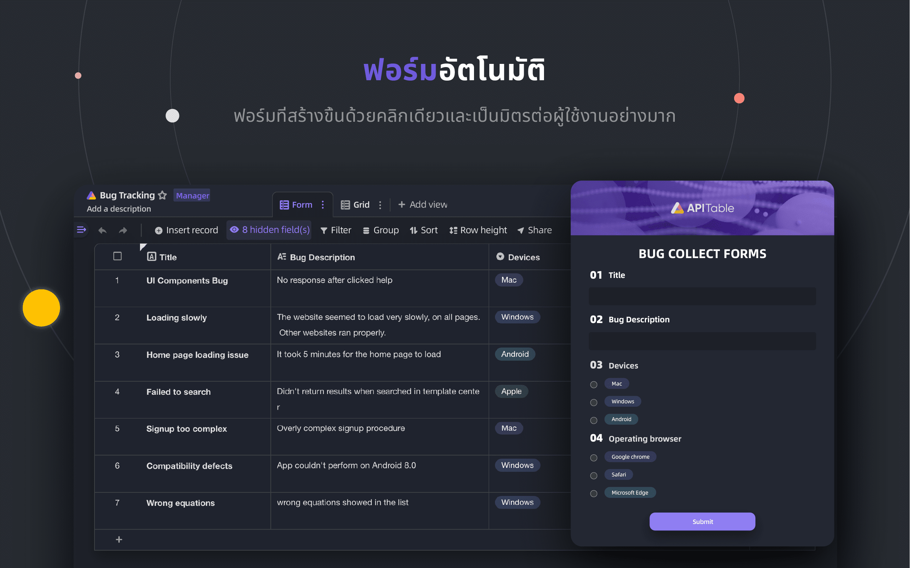
</p>
<p align="center">
    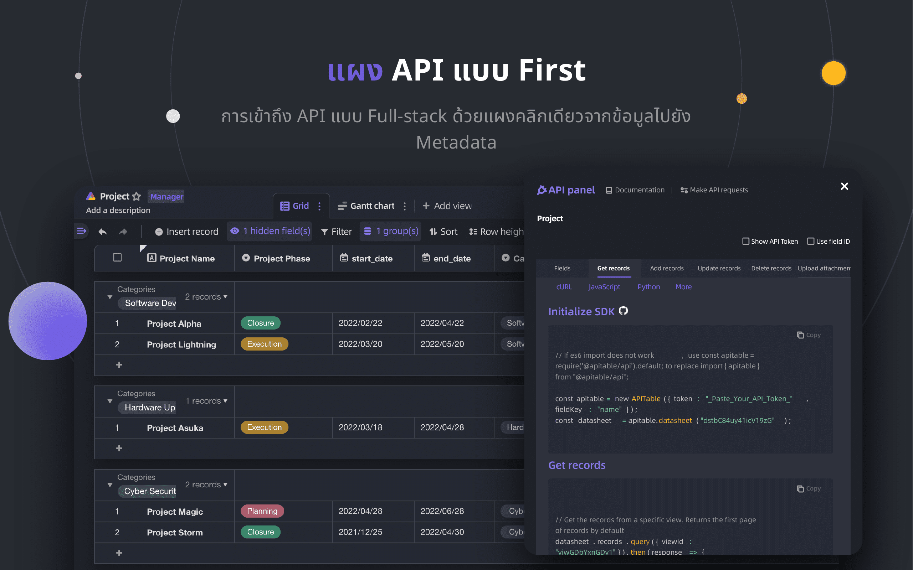
</p>
<p align="center">
    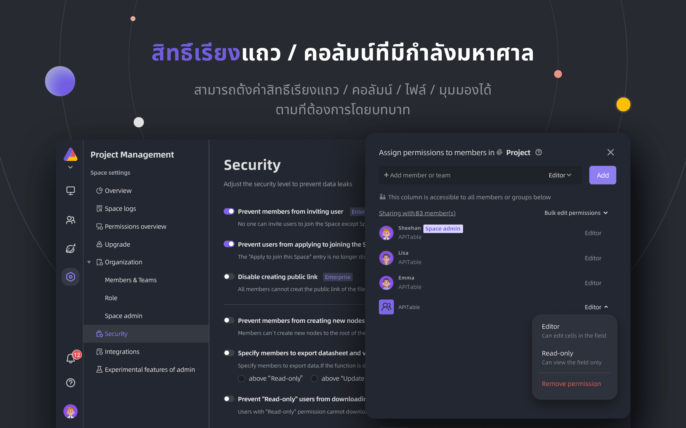
</p>
<p align="center">
    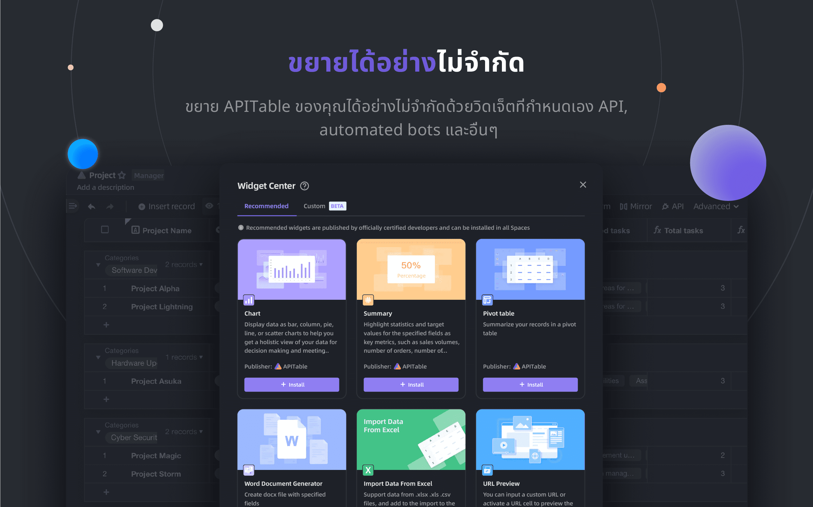
</p>
<p align="center">
    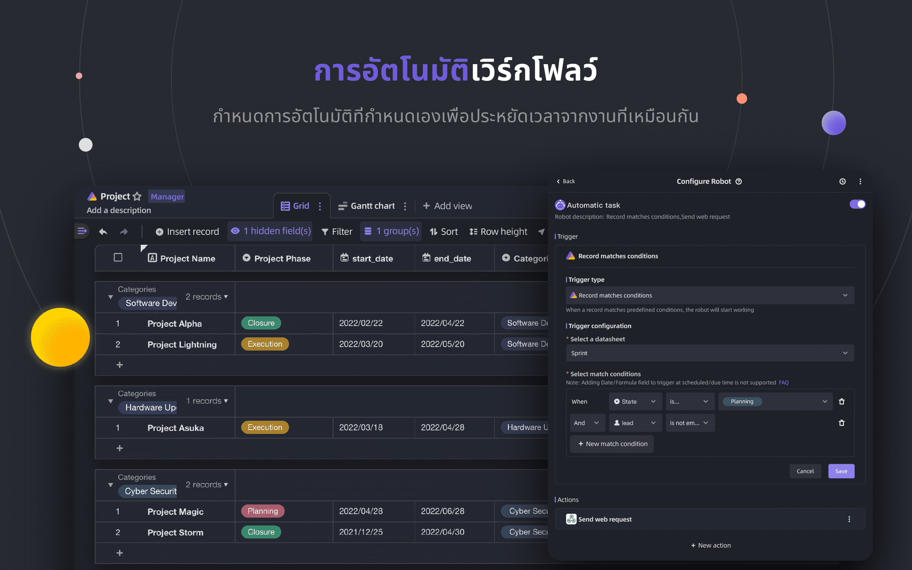
</p>
<p align="center">
    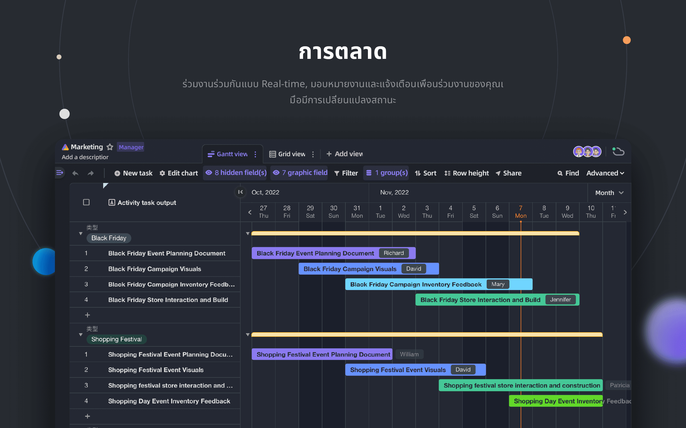
</p>
<p align="center">
    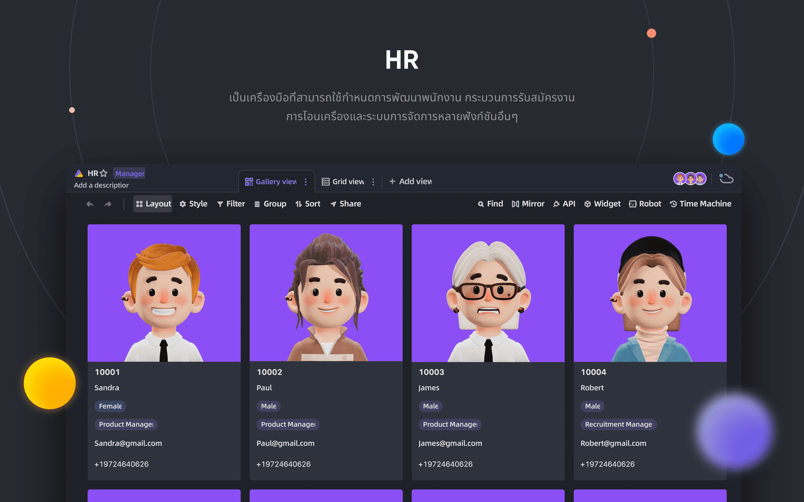
</p>
<p align="center">
    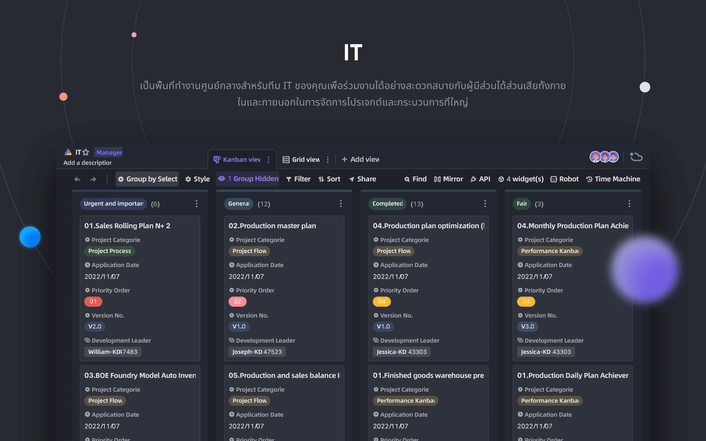
</p>
<p align="center">
    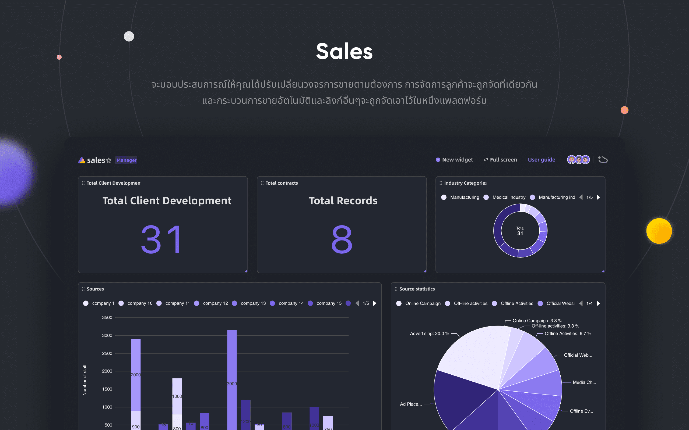
</p>

## 🥰ใบอนุญาติ

> ที่เก็บนี้มีซอร์สโค้ดสำหรับ APITable รุ่น Open Source ซึ่งเผยแพร่ภายใต้ AGPL
> 
> หากคุณต้องการเรียกใช้สำเนา APITable ของคุณเองหรือมีส่วนร่วมในการพัฒนา นี่คือที่สำหรับคุณ
> 
> ดูการให้สิทธิ์การใช้งานสำหรับรายละเอียด
> 
> หากคุณต้องการใช้ APITable ออนไลน์ คุณไม่จำเป็นต้องเรียกใช้โค้ดนี้ เรามีแอปเวอร์ชันโฮสต์ที่ APITable.com ซึ่งปรับให้เหมาะกับตัวเร่งความเร็วทั่วโลก

<br/>

[^info]: ได้รับอนุญาตจาก AGPL-3.0 ออกแบบโดย [APITable Ltd](https://apitable.com)
