<p align="center">
    <a href="https://apitable.com" target="_blank">
        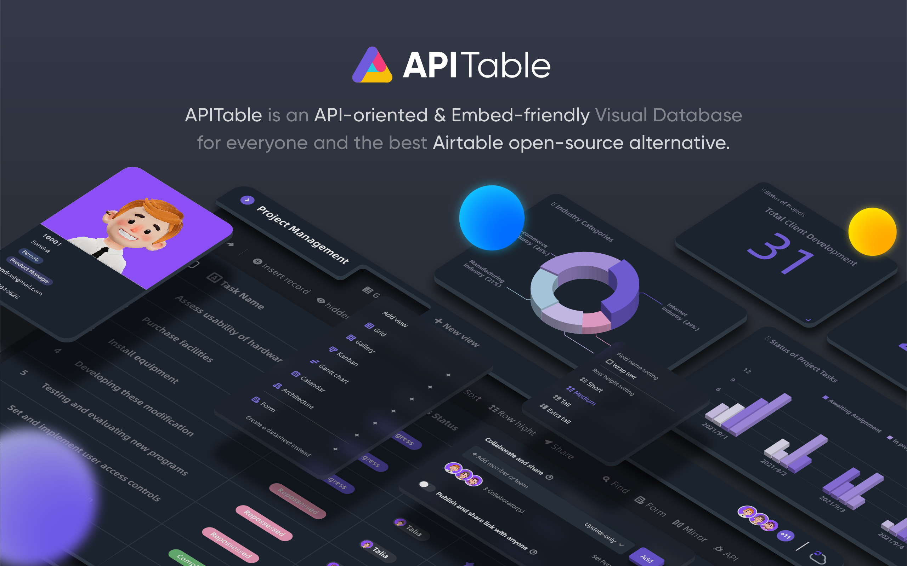
    </a>
</p>

<p align="center">
    <!-- Gitpod -->
    <a target="_blank" href="https://gitpod.io/#https://github.com/apitable/apitable">
        
    </a>
    <!-- NodeJS -->
    
    <!-- Java -->
    
    <!-- hub.docker.com-->
    <a target="_blank" href="#Kurulum">
        
    </a>
    <!-- Github Release Latest -->
    <a target="_blank" href="https://github.com/apitable/apitable/releases/latest">
        
    </a>
    <!-- Render -->
    <a target="_blank" href="https://render.com/deploy?repo=https://github.com/apitable/apitable">
        
    </a>
    <br />
    <!-- LICENSE -->
    <a target="_blank" href="https://github.com/apitable/apitable/blob/main/LICENSE">
        
    </a>
    <!-- Discord -->
    <a target="_blank" href="https://discord.gg/TwNb9nfdBU">
        
    </a>
    <!-- Twitter -->
    <a target="_blank" href="https://twitter.com/apitable_com">
        
    </a>
    <!-- Github Action Build-->
    <a target="_blank" href="https://github.com/apitable/apitable/actions/workflows/build.yaml">
        
    </a>
    <!-- Better Uptime-->
    <a target="_blank" href="https://apitable.betteruptime.com/">
        
    </a>
</p>

<p align="center">
  <a href="../../../README.md">English</a>
  | 
  <a href="../fr-FR/README.md">Français</a>
  | 
  <a href="../es-ES/README.md">Español</a>
  | 
  <a href="../de-DE/README.md">Deutsch</a>
  | 
  <a href="../zh-CN/README.md">简体中文</a>
  | 
  <a href="../zh-HK/README.md">繁體中文</a>
  | 
  <a href="../ja-JP/README.md">日本語</a>
</p>

## ✨ Hızlı Başlangıç

Sadece APITable[^info]'i denemek istiyorsanız, [apitable.com](https://apitable.com) adresinde bulutta barındırılan sürümümüzü kullanın.

Bu APITable açık kaynak projesinin demosunu yapmak istiyorsanız, [⚡️Gitpod Online Demo](https://gitpod.io/#https://github.com/apitable/apitable) için buraya tıklayın.

APITable'ı yerel veya bulut bilişim ortamınıza kurmak istiyorsanız, bkz. 💾 [Kurulum](#Kurulum)

Yerel geliştirme ortamınızı kurmak istiyorsanız 🧑‍💻 [Geliştirici Kılavuzumuzu okuyun](./docs/contribute/developer-guide.md)

İletişimde kalmak için [Discord](https://discord.gg/TwNb9nfdBU) veya [>Twitter](https://twitter.com/apitable_com)'a katılın.
## 🔥 Özellikler

<table>
  
  <tr>
    <th>
      <a href="#">Gerçek Zamanlı İşbirliği</a>
    </th>
    <th>
      <a href="#">Otomatik Form</a>
    </th>

  </tr>

   <tr>
    <td width="50%">
      <a href="#">
        
      </a>
    </td>
    <td width="50%">
        <a href="#">
            
        </a>
    </td>
  </tr>

  <tr>
    <th>
      <a href="#">API öncelikli Panel</a>
    </th>
    <th>
      <a href="#">Sınırsız çapraz tablo bağlantıları</a>
    </th>
</tr>

 <tr>
    <td width="50%">
        <a href="#">
            
        </a>
    </td>
    <td width="50%">
      <a href="#">
        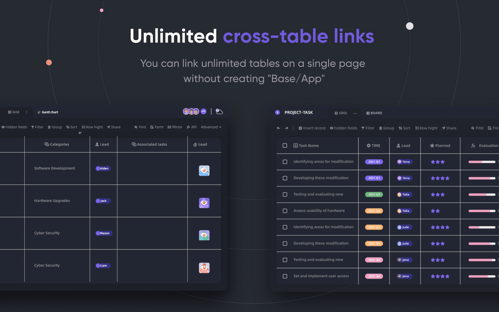
      </a>
    </td>
 </tr>

 <tr>
    <th>
      <a href="#">Güçlü Satır/Sütun</a>
    </th>
    <th>
      <a href="#">Denetim</a>
    </th>
  </tr>

 <tr>
    <td width="50%">
        <a href="#">
            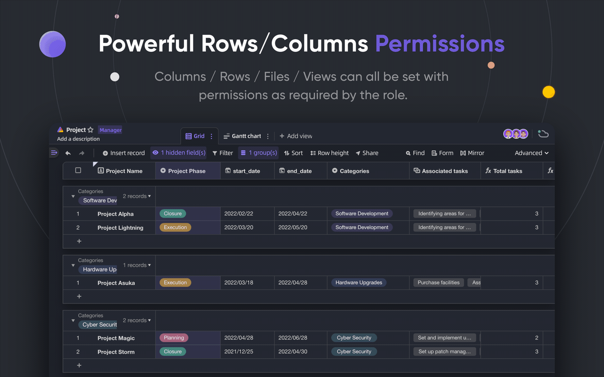
        </a>
    </td>
    <td width="50%">
        <a href="#">
            
        </a>
    </td>
  </tr>

</table>

APITable, kişiselden işletmeye kadar bir dizi şaşırtıcı özellik sunar.

- Gelişmiş teknoloji yığını ve açık kaynak
  - Gerçek zamanlı işbirliği, birden fazla kullanıcının gerçek zamanlı olarak veya Operasyonel Dönüşüm (OT) Algoritması ile aynı anda birlikte düzenleme yapmasına olanak tanır.
  - canvas Rendering Engine'de son derece akıcı, kullanıcı dostu, süper hızlı veritabanı-spreadsheet arayüzü.
  - Veritabanı yerel mimarisi: Değişiklik kümesi / İşlem / Eylem / Anlık görüntü vb.
  - Gerçek zamanlı işbirliği ile 100k+ veri satırı.
  - Verilerden Meta Verilere kadar tam yığın API erişimi.
  - Tek Yönlü / Çift Yönlü Tablo Bağlantısı ve Sonsuz Çapraz Bağlantılar
  - Community-friendly programming languages and framework, TypeScript ([NextJS](https://nextjs.org/) + [NestJS](https://nestjs.com/)) and Java ([Spring Boot](https://spring.io/projects/spring-boot)).
- Güzel ve Zengin Veritabanı-Ekran Tablosu Kullanıcı Arayüzü
  - `CRUD`: Tabloları, Sütunları ve Satırları Oluşturma, Okuma, Güncelleme, Silme
  - `Alan İşlemleri`: sıralama, filtreleme, gruplama, gizleme/gösterme, yükseklik ayarı.
  - `Alan tabanlı`: Uygulama/Taban tabanlı yapı yerine ayrılmış çalışma alanları kullanın, sınırsız tablonun birbirine bağlanmasını mümkün kılın.
  - Karanlık mod ve tema özelleştirmesi mevcut.
  - `7 Görünüm Türü`: Izgara Görünümü (Veri Sayfası) / Galeri Görünümü / Mindmap Görünümü / Kanban Görünümü / Tam Özellikli Gantt Görünümü / Takvim Görünümü
  - Tek tıklamayla API Paneli
- Piller dahil
  - Yerleşik 10'dan fazla resmi şablon
  - Robot Otomasyonu ve özelleştirme mevcuttur.
  - BI gösterge tablosu
  - Tek tıkla otomatik oluşturulan form
  - Paylaşılabilir ve gömülebilir sayfa
  - Çoklu dil desteği
  - n8n.io / Zapier / Appsmith... ve daha fazlası ile entegrasyon
- Mükemmel genişletilebilirlik
  - 20'den fazla resmi açık kaynaklı widget ile Genişletilebilir Widget Sistemi
  - Özelleştirilebilir Grafik & Çizelge & Gösterge Tablosu
  - Özelleştirilebilir Veri Sütunu Türleri
  - Özelleştirilebilir Formüller
  - Özelleştirilebilir Otomasyon Robotu Eylemleri
- Kurumsal düzeyde izinler
  - `Ayna`, Satır İznini uygulamak için bir Görünümü aynaya dönüştürün
  - Çok basit bir işlemle Sütun İznini etkinleştirin
  - Klasörler / Alt Klasörler / Dosyalar İzni
  - Ağaç yapısı klasörleri ve özelleştirilebilir düğüm (dosya)
  - Ekip Yönetimi ve Organizasyon Yapısı
- Kurumsal özellikler:
  - SAML
  - Tek Oturum Açma (SSO)
  - Denetim
  - Veritabanı Otomatik Yedekleme
  - Veri İhracatçısı
  - Filigran
- ....

Genişletilebilir widget'lar ve eklentiler ile daha fazla özellik ekleyebilirsiniz.

## 💥 Kullanım Örnekleri

Bir sonraki yazılımınız için neden APITable'ı bilmelisiniz?

- Süper yönetim yazılımı olarak
  - Esnek Proje Yönetimi ve Görevler / Sorun Yönetimi
  - Pazarlama Potansiyel Müşteri Yönetimi
  - En esnek ve bağlanabilir CRM
  - Esnek İş Zekası (BI)
  - İnsan Dostu Formlar ve Anketler
  - Esnek ERP
  - Low-code ve no-code platform
  - ...ve daha fazlası, APITable 1000 yazılımı cebinize koyar
- Görsel bir veritabanı altyapısı olarak
  - APITable'ı kendi yazılım kullanıcı arayüzlerinize gömün
  - REST API ile Görsel Veritabanı
  - Yönetici kontrol paneli
  - Merkezi yapılandırma yönetimi
  - Tüm yazılımlarınızı birbirine bağlayan hepsi bir arada kurumsal veritabanı
  - ...ve daha fazlası, APITable her şeyi birbirine bağlar
- Ayrıca, açık kaynak kodlu ve genişletilebilir

## 💞 API odaklı

#### API UI Paneli

Sağ köşedeki API düğmesine tıklamak API Panelini gösterecektir

#### SQL benzeri sorgu

APITable, veritabanı-spreadsheet içeriklerinizi sorgulamak için bir Veri Sayfası Sorgu Dili (DQL) sağlayacaktır

## 💝 Gömme dostu

#### Paylaş ve Yerleştir

Veri sayfası tablonuzu veya klasörünüzü paylaşın. HTML komut dosyalarını kopyalayıp yapıştırarak gömün.

#### Kurumsal kullanıma hazır Gömme

[APITable.com](https://apitable.com), menkul kıymetler için daha fazla Kurumsal kullanıma hazır Yerleştirme özelliği sağlar

## Kurulum

Başlamadan önce:
* [Docker](https://docs.docker.com/engine/install/)  ve [docker-compose v2](https://docs.docker.com/engine/install/) yüklü bir ana bilgisayar.
* 4 CPU/8GB RAM veya daha fazlası önerilir.
* Curl gibi temel yardımcı programların yüklü olduğu bir bash kabuğu.
* Native arm64 (apple silicon) konteyner imajları henüz hazır değildir ve kötü performansa neden olabilir.

Docker compose kullanarak apitable yüklemek için terminalinizi açın ve bunu çalıştırın:

```
curl https://apitable.github.io/install.sh | bash
```

Ardından ziyaret etmek için tarayıcınızda http://localhost:80 adresini açın.

Ayrıca demo veya test amacıyla [pm2](https://pm2.keymetrics.io/) tabanlı hepsi bir arada bir görüntü sağlıyoruz (kurumsal veya üretim amaçlı kullanım için önerilmez):

```bash
sudo docker run -d -v ${PWD}/.data:/apitable -p 80:80 --name apitable apitable/all-in-one:latest
```

Depending on your environment, you may need to wait several minutes for all the services to start. Bu görüntü yalnızca amd64 (x86_64) içindir, arm64 veya apple silikonda oldukça kötü performansla karşılaşabilirsiniz.

Yerel geliştirme ortamınızı kurmak istiyorsanız [🧑‍💻 Geliştirici Kılavuzumuzu okuyun](./docs/contribute/developer-guide.md)

## 🧑‍💻 Katkıda Bulunanlar

Hoş geldiniz ve APITable'a katkıda bulunmaya gösterdiğiniz ilgi için teşekkür ederiz!

In addition to writing code, there are many ways for you to contribute.

Aşağıdaki şekilde katkıda bulunabilirsiniz:
- [Crowdin](https://crowdin.com/project/apitablecode/invite?h=f48bc26f9eb188dcd92d5eb4a66f2c1f1555185) Çeviri Projemize katılın ve çevirileri değiştirin
- Create [Issues](https://github.com/apitable/apitable/issues/new/choose)
- Follow our [Twitter](https://twitter.com/apitable_com)
- Create [Documentation](./docs)
- [Contributing Code](./docs/contribute/developer-guide.md)


Such as the following:
- Join [Crowdin Translation Project](https://crowdin.com/project/apitablecode/invite?h=f48bc26f9eb188dcd92d5eb4a66f2c1f1555185)
- Create [Issues](https://github.com/apitable/apitable/issues/new/choose)
- Follow our [Twitter](https://twitter.com/apitable_com)
- Create [Documentation](./docs)
- [Contributing Code](./docs/contribute/developer-guide.md)


Nasıl katkıda bulunacağınızı öğrenmek için bu deponun Katkıda Bulunma Yönergelerini okuyabilirsiniz.

İşte APITable'a katkıda bulunmanıza yardımcı olacak hızlı bir kılavuz.


### Geliştirme ortamı

Yerel ortamınızı nasıl kuracağınızı öğrenmek için Geliştirici Kılavuzumuza gidin.

### Git iş akışı temel

İşte genel bir APITable git iş akışı:

1. Bir sorun oluşturun ve istediğiniz özellikleri tanımlayın -> [APITable sorunları](https://github.com/apitable/apitable/issues)
2. Bu projeyi çatalla -> [APITable projesini çatalla](https://github.com/apitable/apitable/fork)
3. Özellik dalınızı oluşturun (`git checkout -b my-new-feature`)
4. Değişikliklerinizi işleyin (`git commit -am 'Add some features'`)
5. Dalı yayınlayın (`git push origin my-new-feature`)
6. Yeni bir Çekme İsteği Oluştur -> [Çatallar arasında çekme isteği oluştur](https://github.com/apitable/apitable/compare)

### İş sözleşmeleri

APITable bu ortak kuralları kullanır:

- Git dallanma modelimiz nedir? [Gitflow](https://nvie.com/posts/a-successful-git-branching-model/)
- Çatal projelerinizde nasıl işbirliği yapabilirsiniz? [Github Flow](https://docs.github.com/en/get-started/quickstart/github-flow)
- İyi bir commit mesajı nasıl yazılır? [Geleneksel Komiteler](https://www.conventionalcommits.org/)
- Değişiklik günlüğü formatımız nedir? [Değişiklik Günlüğünü Tut](https://keepachangelog.com/en/1.0.0/)
- Versiyonlama ve etiketleme nasıl yapılır? [Anlamsal Versiyonlama](https://semver.org/)
- Java Kodlama Kılavuzu nedir? [Java Kodlama Kılavuzu](https://google.github.io/styleguide/javaguide.html) | [Intellij IDEA Eklentisi](https://plugins.jetbrains.com/plugin/8527)
- TypeScript Kodlama Kılavuzu nedir? [-> TypeScript Stil Kılavuzu](https://google.github.io/styleguide/tsguide.html) | [ESLint](https://www.npmjs.com/package/@typescript-eslint/eslint-plugin)
- Mimariye Genel Bakış nedir? -> [APITable'ı Anlayın - Mimariye Genel Bakış](./docs/contribute/architecute-overview.md)

### Belgeler

- [Yardım Merkezi](https://help.apitable.com/)
- [👩‍💻 Geliştirici Merkezi](https://developers.apitable.com/)
  - [🪡 REST API Dokümanları](https://developers.apitable.com/api/introduction/)
  - [Widget SDK'sı](https://developers.apitable.com/widget/introduction/)
  - [Scripting Widget](https://developers.apitable.com/script/introduction/)

## 🛣 Yol Haritası

Lütfen [APITable Yol Haritasına](https://apitable.com/roadmap) bakın

### Geleceğin Özellikleri

- Ağır Kodlu Arayüz Oluşturucu
- Embeddable 3rd party documentation components
- SQL benzeri Alana Özgü Diller
- Bir IdP olarak
- Gelişmiş otomasyon robotu
- Web 3 özellikleri
- ...

### Hosted ve Enterprise sürümleri gelişmiş özellikler sunar

- Bir IdP olarak
- SAML
- Tek Oturum Açma
- Denetim
- Veritabanı Yedekleme
- ChatGPT, Zapier, Slack, Google Workspace ile entegre edin......
- Filigran

Daha fazla bilgi için lütfen <support@apitable.com> adresinden bizimle iletişime geçin.

## 👫 Katılın

### 🌏 Neden APITable ve açık kaynak oluşturuyoruz?

- Veritabanının tüm yazılımların temel taşı olduğuna inanıyoruz.
- Herkes için zengin ve kolay kullanıcı arayüzüne sahip bir Görsel Veritabanı yapmanın yazılım endüstrisinin zorluğunu azaltabileceğine ve dünyanın dijitalleşmeyi benimsemesini artırabileceğine inanıyoruz.
- Açık kaynak kodlu APITable çalışmalarının İnsanoğlunu İleriye Taşıyabileceğine inanıyoruz.

### Uzaktan işe alım yapıyoruz!

APITable için her zaman iyi yetenekler arıyoruz:

- **Tam yığın geliştirici**: React, NestJS, TypeScript, Spring Boot, Java, Terraform ile ilgili deneyiminiz var. Ve açık dokümantasyon ve birim testleri ile yüksek kaliteli kod yazmayı seviyorsunuz.
- **Arka uç geliştiricisi**: NestJS, TypeScript, Spring Boot, Java, SQL, Kubernetes, Terraform ile ilgili deneyiminiz var. Ve açık dokümantasyon ve birim testleri ile yüksek kaliteli kod yazmayı seviyorsunuz.
- **Ön uç geliştirici**: React, NextJS, TypeScript, WebPack ile deneyiminiz var. Ve açık dokümantasyon ve birim testleri ile yüksek kaliteli kod yazmayı seviyorsunuz.

Zaman ve koşullar ne olursa olsun, APITable ekibine dahil olmak istiyorsanız, tereddüt etmeyin ve CV'nizi <talent@apitable.com> adresine gönderin.

## 📺 Ekran Görüntüsü

<p align="center">
    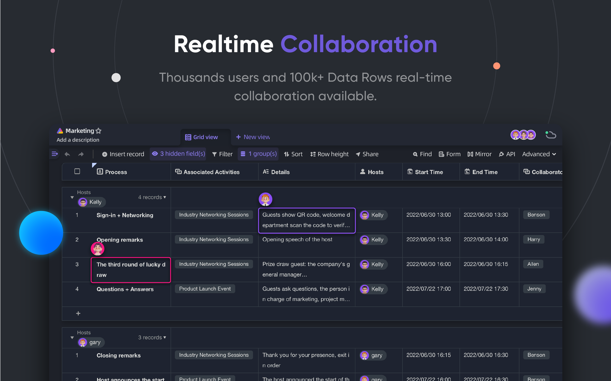
</p>
<p align="center">
    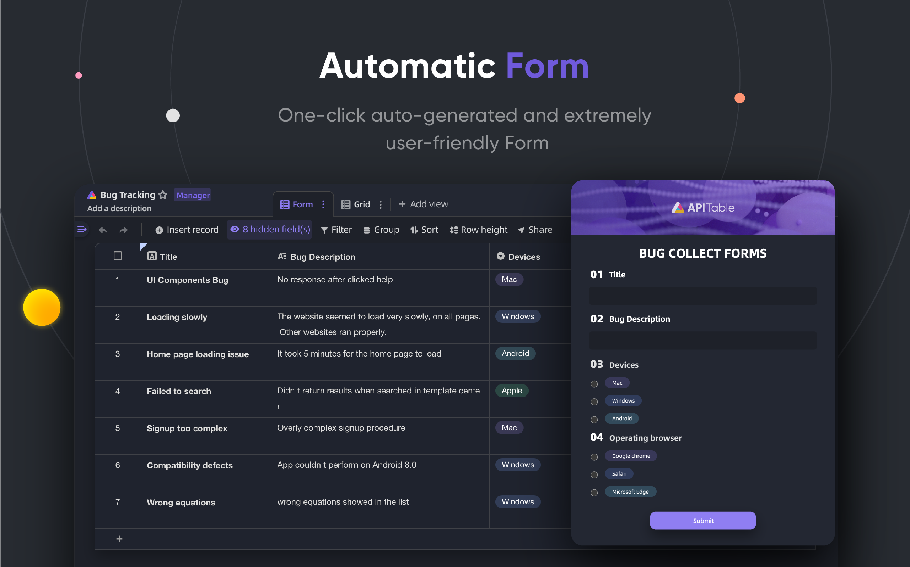
</p>
<p align="center">
    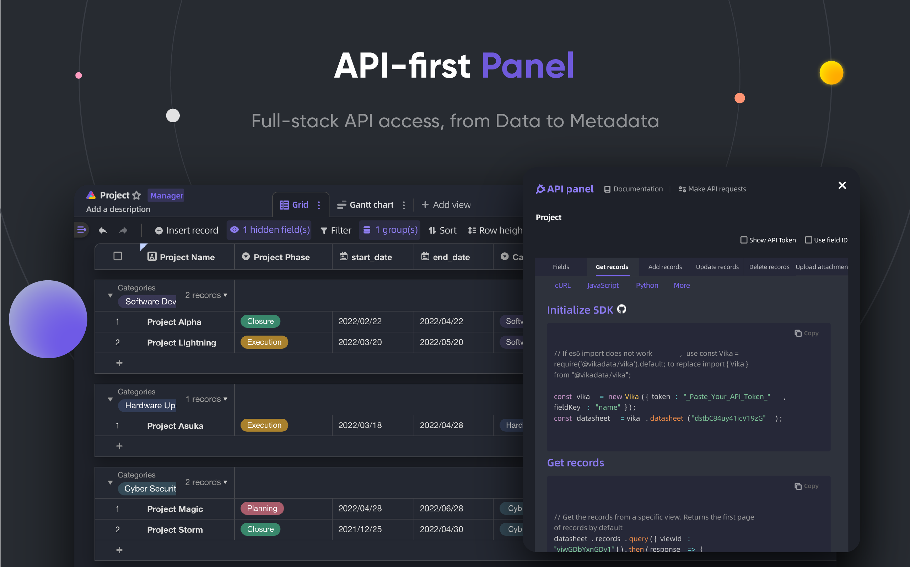
</p>
<p align="center">
    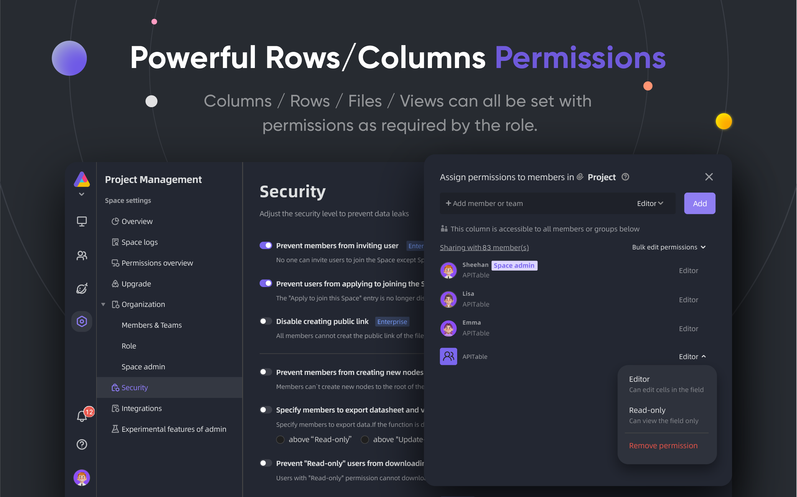
</p>
<p align="center">
    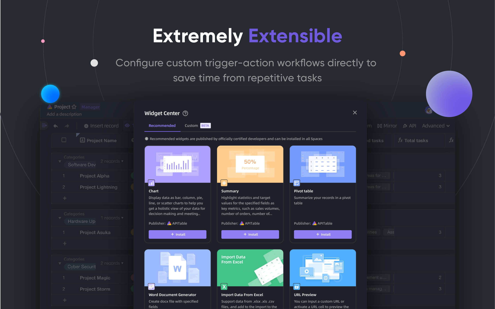
</p>
<p align="center">
    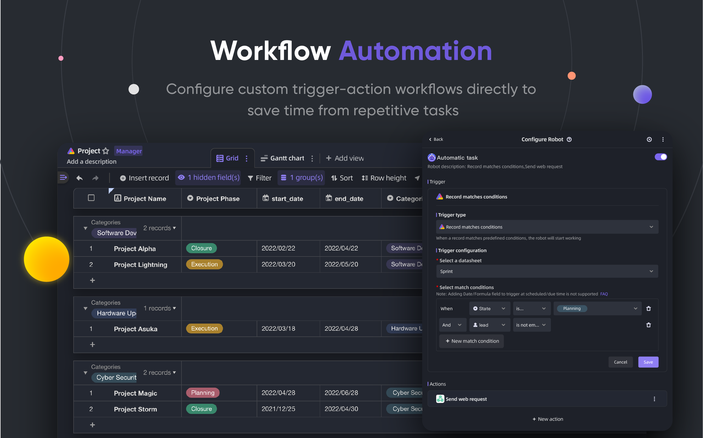
</p>
<p align="center">
    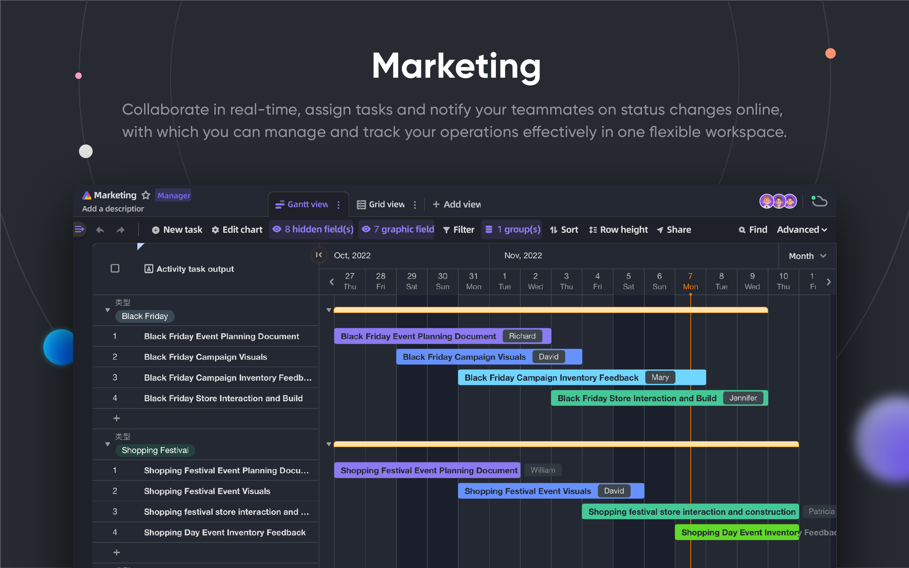
</p>
<p align="center">
    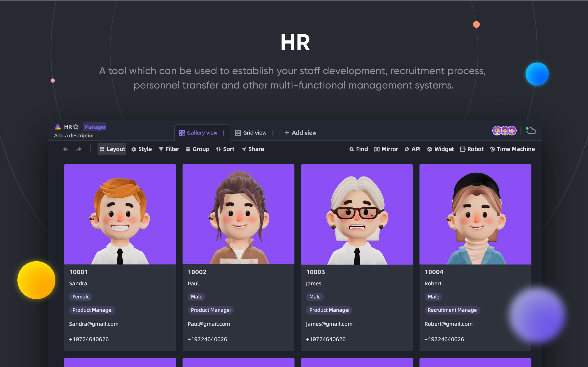
</p>
<p align="center">
    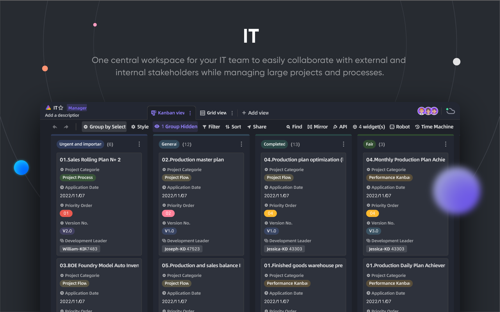
</p>
<p align="center">
    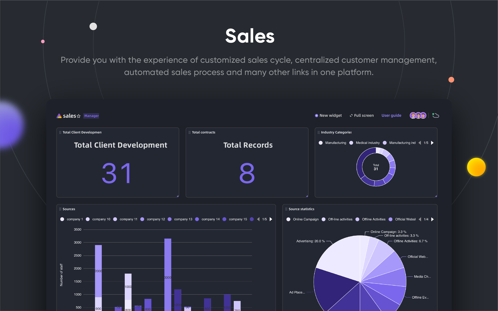
</p>

## 🥰 Lisans

> Bu depo, AGPL altında yayınlanan APITable'ın Açık Kaynak sürümü için kaynak kodunu içerir.
> 
> Kendi APITable kopyanızı çalıştırmak veya geliştirmeye katkıda bulunmak istiyorsanız, burası tam size göre.
> 
> Ayrıntılar için [LİSANSLAMA](./LICENSING.md) bölümüne bakınız.
> 
> APITable'ı çevrimiçi kullanmak istiyorsanız, bu kodu çalıştırmanıza gerek yoktur, uygulamanın küresel hızlandırıcı için optimize edilmiş [APITable.com](https://apitable.com) adresinde barındırılan bir sürümünü sunuyoruz.

<br/>

[^info]: AGPL-3.0 ile lisanslanmıştır. APITable Ltd. tarafından tasarlanmıştır.
