<p align="center">
    <a href="https://apitable.com" target="_blank">
        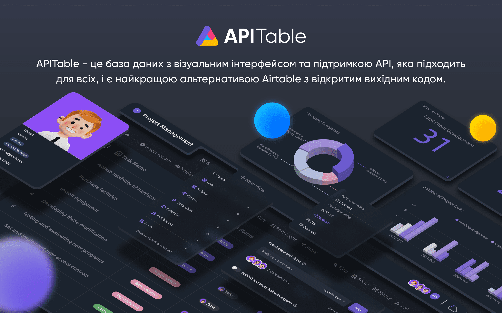
    </a>
</p>

<p align="center">
    <!-- Gitpod -->
    <a target="_blank" href="https://gitpod.io/#https://github.com/apitable/apitable">
        
    </a>
    <!-- NodeJS -->
    
    <!-- Java -->
    
    <!-- hub.docker.com-->
    <a target="_blank" href="#Встановлення">
        
    </a>
    <!-- Github Release Latest -->
    <a target="_blank" href="https://github.com/apitable/apitable/releases/latest">
        
    </a>
    <!-- Render -->
    <a target="_blank" href="https://render.com/deploy?repo=https://github.com/apitable/apitable">
        
    </a>
    <br />
    <!-- LICENSE -->
    <a target="_blank" href="https://github.com/apitable/apitable/blob/main/LICENSE">
        
    </a>
    <!-- Discord -->
    <a target="_blank" href="https://discord.gg/TwNb9nfdBU">
        
    </a>
    <!-- Twitter -->
    <a target="_blank" href="https://twitter.com/apitable_com">
        
    </a>
    <!-- Github Action Build-->
    <a target="_blank" href="https://github.com/apitable/apitable/actions/workflows/build.yaml">
        
    </a>
    <!-- Better Uptime-->
    <a target="_blank" href="https://apitable.betteruptime.com/">
        
    </a>
</p>

<p align="center">
  <a href="../../../README.md">English</a>
  | 
  <a href="../fr-FR/README.md">Français</a>
  | 
  <a href="../es-ES/README.md">Español</a>
  | 
  <a href="../de-DE/README.md">Deutsch</a>
  | 
  <a href="../zh-CN/README.md">简体中文</a>
  | 
  <a href="../zh-HK/README.md">繁體中文</a>
  | 
  <a href="../ja-JP/README.md">日本語</a>
</p>

## ✨ Швидкий старт

Якщо ви просто хочете спробувати APITable[^info], використовуйте нашу хмарну версію на [apitable.com](https://apitable.com).

Якщо ви хочете продемонструвати цей проект з відкритим вихідним кодом APITable, натисніть тут для [⚡️Gitpod Онлайн-демонстрації](https://gitpod.io/#https://github.com/apitable/apitable).

Якщо ви хочете встановити APITable у вашому локальному або хмарному середовищі, див. [💾 Встановлення](#Встановлення)

Якщо ви хочете налаштувати своє локальне середовище розробки, прочитайте наш [🧑‍💻 Посібник розробника](./docs/contribute/developer-guide.md).

Приєднуйтесь до [Discord](https://discord.gg/TwNb9nfdBU) або <0>Twitter</0>, щоб залишатися на зв'язку.
## 🔥 Особливості

<table>
  
  <tr>
    <th>
      <a href="#">Співпраця в режимі реального часу</a>
    </th>
    <th>
      <a href="#">Автоматична форма</a>
    </th>

  </tr>

   <tr>
    <td width="50%">
      <a href="#">
        
      </a>
    </td>
    <td width="50%">
        <a href="#">
            
        </a>
    </td>
  </tr>

  <tr>
    <th>
      <a href="#">Перша панель з API</a>
    </th>
    <th>
      <a href="#">Необмежена кількість перехресних посилань</a>
    </th>
</tr>

 <tr>
    <td width="50%">
        <a href="#">
            
        </a>
    </td>
    <td width="50%">
      <a href="#">
        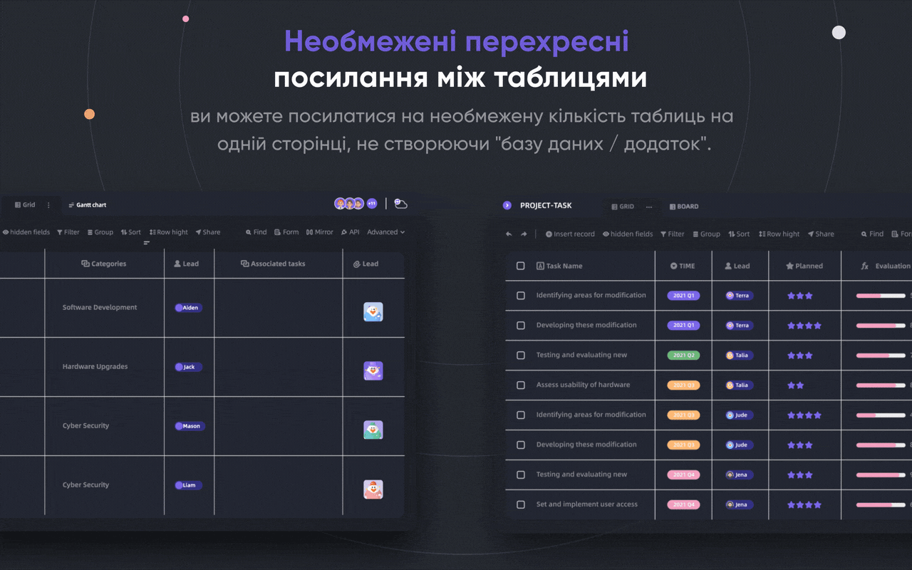
      </a>
    </td>
 </tr>

 <tr>
    <th>
      <a href="#">Потужні рядки/стовпці Вбудовування</a>
    </th>
    <th>
      <a href="#">дозволів</a>
    </th>
  </tr>

 <tr>
    <td width="50%">
        <a href="#">
            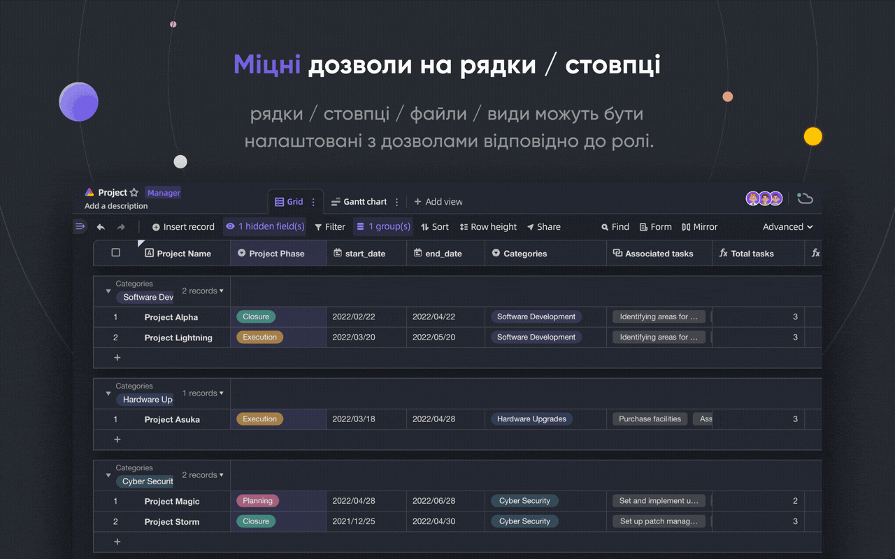
        </a>
    </td>
    <td width="50%">
        <a href="#">
            
        </a>
    </td>
  </tr>

</table>

APITable надає ряд дивовижних функцій, від особистих до корпоративних.

- Передові технології та відкритий вихідний код
  - Співпраця в режимі реального часу дозволяє декільком користувачам редагувати разом в режимі реального часу або одночасно за допомогою алгоритму оперативного перетворення (OT).
  - Надзвичайно плавний, зручний, надшвидкий інтерфейс між базою даних і електронними таблицями в canvas Rendering Engine.
  - Нативна архітектура бази даних: Набір змін / Операція / Дія / Знімок і так далі.
  - 100k+ рядків даних з можливістю співпраці в реальному часі.
  - Доступ до повного стеку API, від даних до метаданих.
  - Односпрямовані / двоспрямовані табличні посилання та нескінченні перехресні посилання
  - Community-friendly programming languages and framework, TypeScript ([NextJS](https://nextjs.org/) + [NestJS](https://nestjs.com/)) and Java ([Spring Boot](https://spring.io/projects/spring-boot)).
- Красивий і багатий інтерфейс для роботи з базами даних і електронними таблицями
  - `CRUD`: Створення, читання, оновлення, видалення таблиць, стовпців і рядків
  - `Операції з полями`: сортування, фільтрація, групування, приховування/відображення, налаштування висоти.
  - `Просторовий підхід`: Використовуйте окремі робочі області замість структури на основі додатків/баз даних, створюйте необмежену кількість зв'язків між таблицями.
  - Доступний темний режим і налаштування теми.
  - `7 типів подання`: Подання сітки (таблиця даних) / Подання галереї / Подання ментальної карти / Подання канбану / Повнофункціональне подання Ганта / Подання календаря
  - Панель API в один клік
- Батареї в комплекті
  - Вбудовані 10+ офіційних шаблонів
  - Доступна автоматизація та налаштування роботів
  - Інформаційна панель BI
  - Автоматична форма, що генерується в один клік
  - Сторінка для спільного доступу та вбудовування
  - Багатомовна підтримка
  - Інтеграція з n8n.io / Zapier / Appsmith... та іншими
- Відмінна розширюваність
  - Розширювана система віджетів з понад 20 офіційними віджетами з відкритим кодом
  - Налаштовувані графіки, діаграми та інформаційні панелі
  - Настроювані типи стовпців даних
  - Настроювані формули
  - Налаштовувані автоматичні дії роботів
- Дозволи корпоративного рівня
  - `Дзеркальне відображення` - перетворіть подання на дзеркальне, щоб застосувати дозволи на рядки.
  - Активуйте дозвіл на стовпці за допомогою дуже простої операції.
  - Дозволи на папки/підпапки/файли
  - Деревоподібна структура папок і настроюваний вузол (файл)
  - Управління командою та організаційна структура
- Функції підприємства:
  - SAML
  - Єдиний вхід (SSO)
  - Аудит
  - баАвтоматичне резервне копіювання зи даних
  - Експортер даних
  - Водяний знак
- ....

За допомогою розширюваних віджетів та плагінів ви можете додати більше функцій.

## 💥Приклади використання

Чому ви повинні знати APITable для вашого наступного програмного забезпечення?

- Як програмне забезпечення для управління
  - Гнучке управління проектами та управління завданнями / проблемами
  - Управління маркетинговими лідами
  - Найбільш гнучка і підключається CRM
  - Гнучка бізнес-аналітика (BI)
  - Зручні форми та опитування
  - Гнучка ERP
  - Платформа з низьким рівнем коду та без коду
  - ...і багато іншого, APITable кладе 1000 програмних продуктів у вашу кишеню.
- Як візуальна інфраструктура баз даних
  - Вбудовуйте APITable в інтерфейс вашого власного програмного забезпечення.
  - Візуальна база даних з REST API
  - Інформаційна панель адміністратора
  - Централізоване управління конфігурацією
  - Все-в-одному корпоративна база даних, яка з'єднує все ваше програмне забезпечення
  - ...і багато іншого, APITable з'єднує все
- Крім того, він має відкритий вихідний код і розширюється

## 💞 API-орієнтований

#### Панель інтерфейсу API

Натиснувши кнопку API в правому куті, ви побачите панель API

#### SQL-подібний запит

APITable надасть мову запитів до електронних таблиць (DQL) для запиту вмісту вашої бази даних-таблиці

## 💝Зручний для вбудовування

#### Поширення та вбудовування

Поділіться таблицею або папкою з таблицями даних. Вбудовуйте їх, копіюючи та вставляючи HTML-скрипти.

#### Вбудовування для підприємств

[APITable.com](https://apitable.com) надає більше можливостей вбудовування для цінних паперів, готових до роботи з підприємствами.

## Встановлення

Перш ніж почати:
* Хост зі встановленими [docker](https://docs.docker.com/engine/install/) і [docker-compose v2](https://docs.docker.com/engine/install/).
* Рекомендується 4 процесори/8 ГБ оперативної пам'яті або більше.
* Встановлена оболонка bash з базовими утилітами, такими як curl.
* Рідні образи контейнерів arm64 (apple silicon) ще не готові і можуть спричинити погану продуктивність.

допомогою docker compose, відкрийте ваш термінал і виконайте це:

```
curl https://apitable.github.io/install.sh | bash
```

Потім відкрийте [http://localhost:80](http://localhost:80) у вашому браузері, щоб відвідати його.

Ми також надаємо комплексне зображення на основі [pm2](https://pm2.keymetrics.io/) для демонстрації чи тестування (не рекомендовано для корпоративного чи виробничого використання):

```bash
sudo docker run -d -v ${PWD}/.data:/apitable -p 80:80 --name apitable apitable/all-in-one:latest
```

Залежно від вашого середовища, може знадобитися зачекати кілька хвилин, щоб всі послуги почалися. Це зображення amd64 (x86_64). Ви можете зіткнутися з досить поганою продуктивністю для arm64 або яблука кремнію.

Якщо ви хочете налаштувати своє локальне середовище розробки, прочитайте наш [🧑‍💻 Посібник розробника](./docs/contribute/developer-guide.md)

## 🧑‍💻 Внесок

Ласкаво просимо і дякуємо за вашу зацікавленість у сприянні APITable!

In addition to writing code, there are many ways for you to contribute.

Ви можете зробити свій внесок наступним чином:
- Приєднатися та змінювати переклади у нашому проекті перекладу [Crowdin](https://crowdin.com/project/apitablecode/invite?h=f48bc26f9eb188dcd92d5eb4a66f2c1f1555185)
- Create [Issues](https://github.com/apitable/apitable/issues/new/choose)
- Follow our [Twitter](https://twitter.com/apitable_com)
- Create [Documentation](./docs)
- [Contributing Code](./docs/contribute/developer-guide.md)


Such as the following:
- Join [Crowdin Translation Project](https://crowdin.com/project/apitablecode/invite?h=f48bc26f9eb188dcd92d5eb4a66f2c1f1555185)
- Create [Issues](https://github.com/apitable/apitable/issues/new/choose)
- Follow our [Twitter](https://twitter.com/apitable_com)
- Create [Documentation](./docs)
- [Contributing Code](./docs/contribute/developer-guide.md)


Щоб дізнатися, як зробити свій внесок, ви можете ознайомитися з Настановами для учасників цього сховища.

Ось короткий посібник, який допоможе вам зробити внесок у APITable.


### Середовище розробки

Щоб дізнатися, як налаштувати локальне середовище, [перейдіть до нашого Посібника для розробників](./docs/contribute/developer-guide.md).

### Основи роботи з Git'ом

Ось загальний робочий процес git'а APITable:

1. Створіть проблему та опишіть функції, які вам потрібні -> [Проблеми APITable](https://github.com/apitable/apitable/issues)
2. Виділіть цей проект у форк -> [Виділити проект APITable](https://github.com/apitable/apitable/fork)
3. Створіть гілку вашої фічі (git checkout -b my-new-feature)
4. Зафіксуйте ваші зміни (git commit -am 'Add some features')
5. Опублікуйте гілку (git push origin my-new-feature)
6. Створіть новий Pull-запит -> [Створіть pull-запит між форками](https://github.com/apitable/apitable/compare)

### Угоди про роботу

APITable використовує ці загальні домовленості:

- Яка наша модель розгалуження Git'а?  [Gitflow](https://nvie.com/posts/a-successful-git-branching-model/)
- Як співпрацювати над проектами у форках? [Github Flow](https://docs.github.com/en/get-started/quickstart/github-flow)
- Як написати гарне повідомлення про комміти? [Звичайні комміти](https://www.conventionalcommits.org/)
- Який формат нашого журналу змін?  [Ведення журналу змін](https://keepachangelog.com/en/1.0.0/)
- Як працювати з версіями та тегами? [Семантичне керування версіями](https://semver.org/)
- Що таке Java Coding Guideline? [Java Coding Guideline](https://google.github.io/styleguide/javaguide.html) | [Плагін Intellij IDEA](https://plugins.jetbrains.com/plugin/8527)
- Що таке настанова з кодування TypeScript? -> [Посібник зі стилів TypeScript](https://google.github.io/styleguide/tsguide.html) | [ESLint](https://www.npmjs.com/package/@typescript-eslint/eslint-plugin)
- Що таке огляд архітектури? -> [Розуміння APITable - огляд архітектури](./docs/contribute/architecute-overview.md)

### Документація

- [Центр допомоги](https://help.apitable.com/)
- [👩‍💻 Центр для розробників](https://developers.apitable.com/)
  - [🪡 Документація по REST API](https://developers.apitable.com/api/introduction/)
  - [SDK віджетів](https://developers.apitable.com/widget/introduction/)
  - [Scripting Widget](https://developers.apitable.com/script/introduction/)

## 🛣 Дорожня карта

Будь ласка, зверніться до [Дорожньої карти API](https://apitable.com/roadmap)

### Майбутні функції

- Конструктор інтерфейсів з важким кодом
- Embeddable 3rd party documentation components
- SQL-подібні мови для конкретних доменів
- Як IdP
- Розширений робот для автоматизації
- Функції Web 3
- ...

### Розміщені та корпоративні версії пропонують розширені функції

- Як індивідуальний користувач
- SAML
- Єдиний вхід
- Аудит
- Резервне копіювання бази даних
- Інтеграція з ChatGPT, Zapier, Slack, Google Workspace......
- Водяний знак

Для отримання додаткової інформації, будь ласка, зв'яжіться з нами за адресою <support@apitable.com>.

## 👫 Долучайтеся

### Чому ми створюємо APITable з відкритим вихідним кодом?

- Ми віримо, що база даних є наріжним каменем всього програмного забезпечення.
- Ми віримо, що створення візуальної бази даних з багатим і простим користувацьким інтерфейсом для кожного може зменшити складність програмної індустрії та збільшити впровадження цифровізації у світі.
- Ми віримо, що робота з відкритим вихідним кодом APITable може підштовхнути людей вперед.

### Ми наймаємо віддалено!

Ми завжди шукаємо хороші таланти для APITable:

- **Full-stack розробник**: Ви маєте досвід роботи з React, NestJS, TypeScript, Spring Boot, Java, Terraform. І вам подобається писати якісний код з чіткою документацією та юніт-тестами.
- **Back-end розробник**: У вас є досвід роботи з NestJS, TypeScript, Spring Boot, Java, SQL, Kubernetes, Terraform. І вам подобається писати якісний код з чіткою документацією та юніт-тестами.
- **Front-end розробник**: У вас є досвід роботи з React, NextJS, TypeScript, WebPack. І вам подобається писати якісний код з чіткою документацією та юніт-тестами.

Незалежно від часу та умов, якщо ви хочете приєднатися до команди APITable, не зволікайте та надсилайте своє резюме на <talent@apitable.com>.

## 📺Скріншот

<p align="center">
    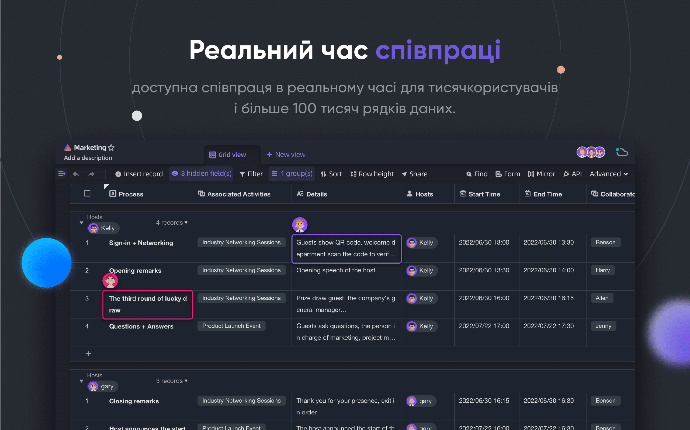
</p>
<p align="center">
    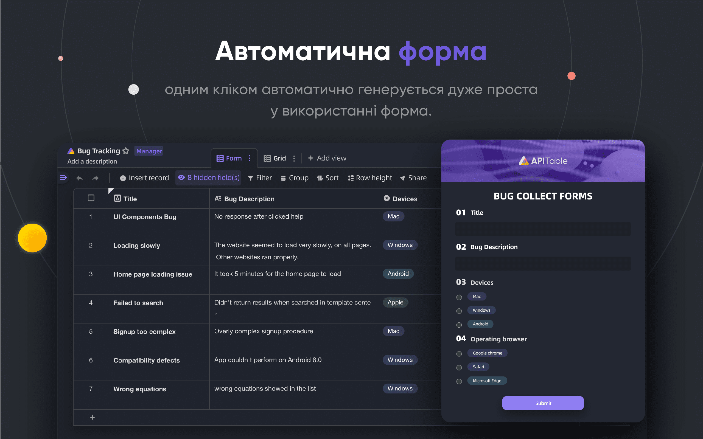
</p>
<p align="center">
    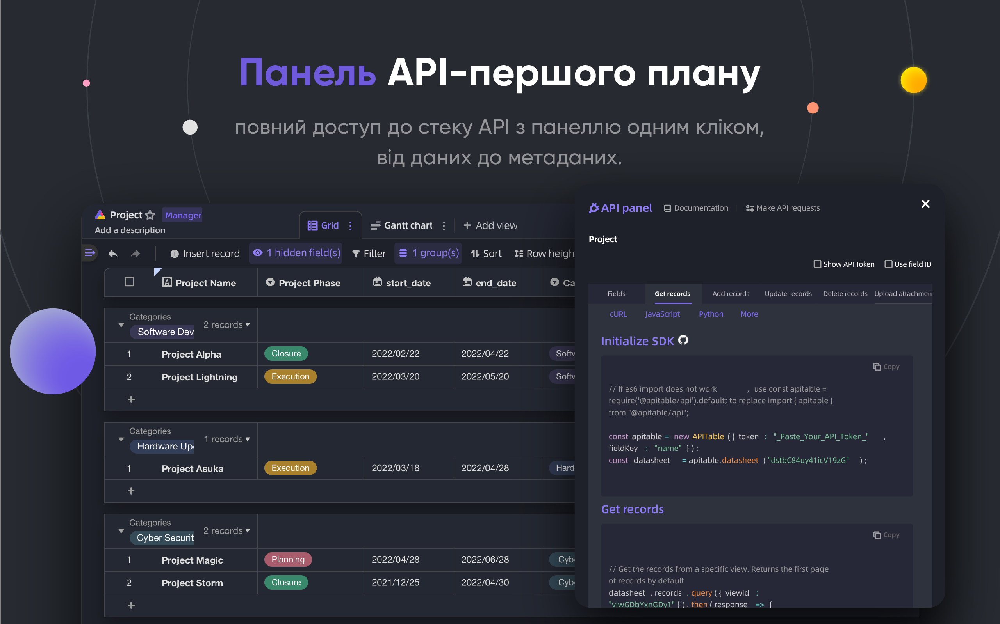
</p>
<p align="center">
    
</p>
<p align="center">
    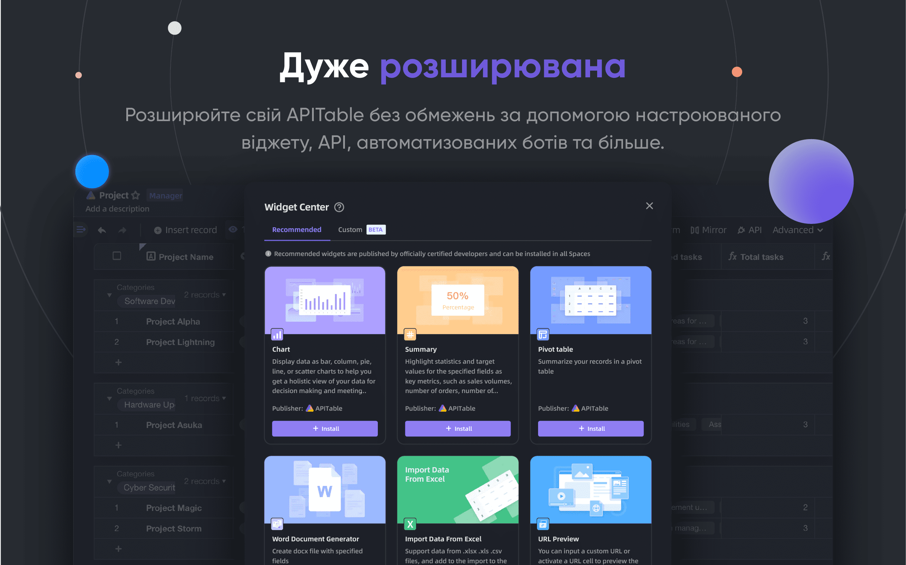
</p>
<p align="center">
    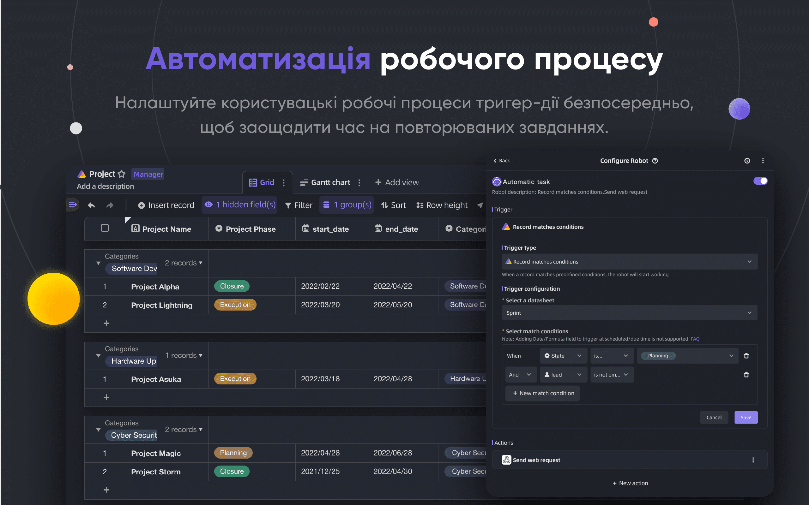
</p>
<p align="center">
    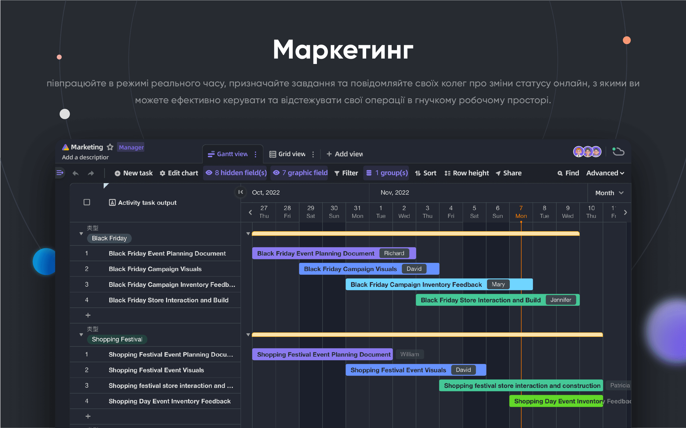
</p>
<p align="center">
    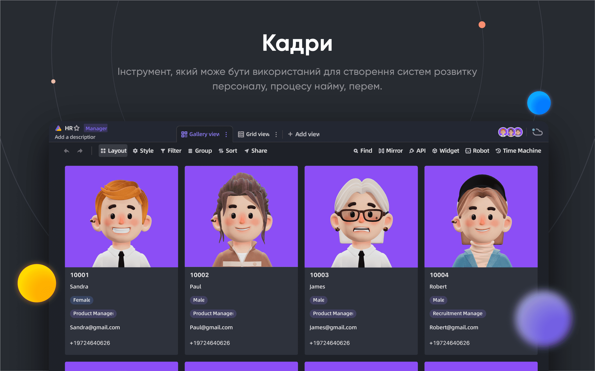
</p>
<p align="center">
    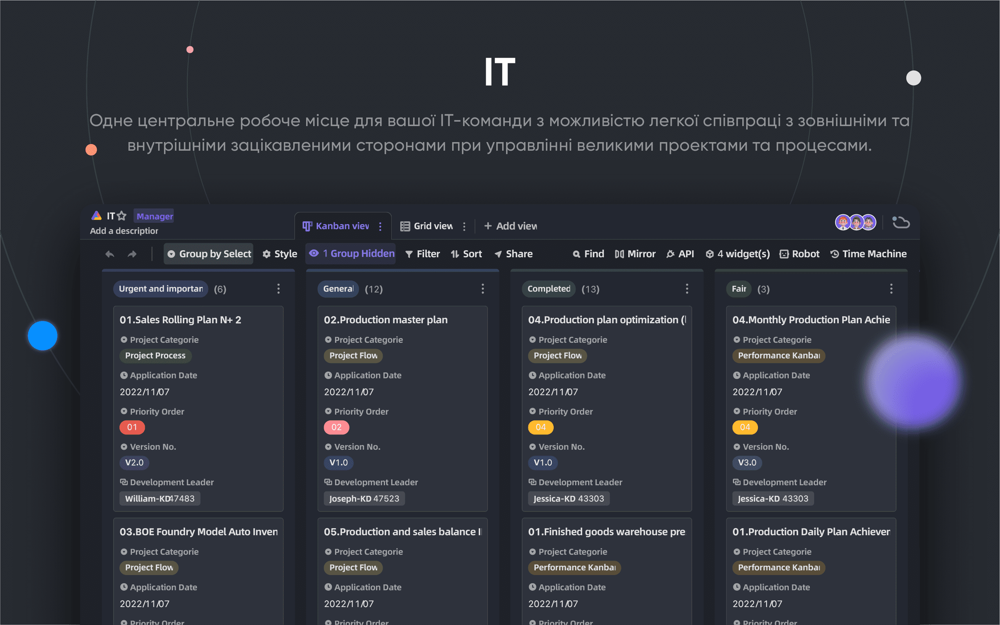
</p>
<p align="center">
    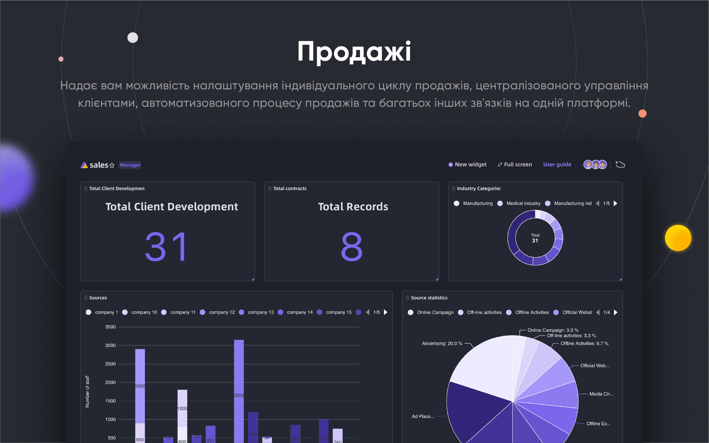
</p>

## 🥰Ліцензія

> Цей репозиторій містить вихідний код версії APITable з відкритим вихідним кодом, випущеної під ліцензією AGPL.
> 
> Якщо ви хочете запустити свою власну копію APITable або зробити внесок у розробку, то це місце саме для вас.
> 
> [Дивіться розділ ЛІЦЕНЗУВАННЯ для більш детальної інформації](./LICENSING.md).
> 
> Якщо ви хочете використовувати APITable онлайн, вам не потрібно запускати цей код, ми пропонуємо розміщену версію програми на [APITable.com](https://apitable.com), яка оптимізована для глобального прискорювача.

<br/>

[^info]: Ліцензія AGPL-3.0. Розроблено [APITable Ltd.](https://apitable.com).
