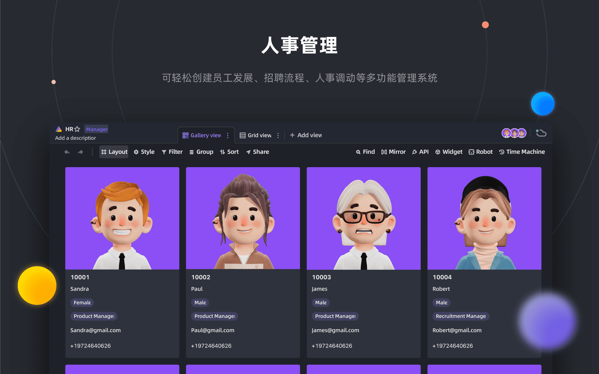

<p align="center">
    <a href="https://apitable.com" target="_blank">
        
    </a>
</p>

<p align="center">
    <!-- Gitpod -->
    <a target="_blank" href="https://gitpod.io/#https://github.com/apitable/apitable">
        
    </a>
    <!-- NodeJS -->
    
    <!-- Java -->
    
    <!-- hub.docker.com-->
    <a target="_blank" href="#installation">
        
    </a>
    <!-- Github Release Latest -->
    <a target="_blank" href="https://github.com/apitable/apitable/releases/latest">
        
    </a>
    <!-- Render -->
    <a target="_blank" href="https://render.com/deploy?repo=https://github.com/apitable/apitable">
        
    </a>
    <br />
    <!-- LICENSE -->
    <a target="_blank" href="https://github.com/apitable/apitable/blob/main/LICENSE">
        
    </a>
    <!-- Discord -->
    <a target="_blank" href="https://discord.gg/TwNb9nfdBU">
        
    </a>
    <!-- Twitter -->
    <a target="_blank" href="https://twitter.com/apitable_com">
        
    </a>
    <!-- Github Action Build-->
    <a target="_blank" href="https://github.com/apitable/apitable/actions/workflows/build.yaml">
        
    </a>
</p>

<p align="center">
  English
  | 
  <a href="docs/readme/fr-FR/README.md">Français</a>
  | 
  <a href="docs/readme/es-ES/README.md">Español</a>
  | 
  <a href="docs/readme/de-DE/README.md">Deutsch</a>
  | 
  <a href="docs/readme/zh-CN/README.md">简体中文</a>
  | 
  <a href="docs/readme/zh-HK/README.md">繁體中文</a>
  | 
  <a href="docs/readme/ja-JP/README.md">日本語</a>
</p>

## ✨ 快速启动

> APITable 目前是 `正在进行中的工作`。
> 
> 我们将在2023年1月下旬公布第一份版本。
> 
> 加入 [Discord](https://discord.gg/TwNb9nfdBU) 或 [Twitter](https://twitter.com/apitable_com) 保持联系。<!-- If you just want try out APITable\[^info], using our hosted version at [apitable.com\](https://apitable.com). -->如果您只是想尝试APITable[^info], 点击这里 [⚡️Gitpod 在线 Demo](https://gitpod.io/#https://github.com/apitable/apitable).

如果您想要在本地或云端计算环境中安装 APITable ，请参阅 [💾 安装](#installation)

如果你想要设置你的本地开发环境，请阅读我们的 [🧑‍💻 开发者指南 ](./docs/contribute/developer-guide.md)

## 🔥 功能特性

<table>
  
  <tr>
    <th>
      <a href="#">实时协同</a>
    </th>
    <th>
      <a href="#">神奇表单</a>
    </th>

  </tr>

   <tr>
    <td width="50%">
      <a href="#">
        
      </a>
    </td>
    <td width="50%">
        <a href="#">
            
        </a>
    </td>
  </tr>

  <tr>
    <th>
      <a href="#">API-第一面板</a>
    </th>
    <th>
      <a href="#">无限跨表关联</a>
    </th>
</tr>

 <tr>
    <td width="50%">
        <a href="#">
            
        </a>
    </td>
    <td width="50%">
      <a href="#">
        
      </a>
    </td>
 </tr>

 <tr>
    <th>
      <a href="#">强大的行/列权限</a>
    </th>
    <th>
      <a href="#">内嵌</a>
    </th>
  </tr>

 <tr>
    <td width="50%">
        <a href="#">
            
        </a>
    </td>
    <td width="50%">
        <a href="#">
            
        </a>
    </td>
  </tr>

</table>

APITable 提供了一系列令人惊奇的功能，从个人到企业。

- 先进技术栈
  - `实时合作` 允许多个用户实时或与 `操作转换(OT)` 算法同时进行编辑。
  - 在 `中极其顺畅、方便用户、超快的数据库电子表格接口<canvas> 渲染引擎`
  - 数据库本地架构：变更集/操作/动作/快照等等。
  - **100k+** 数据行与实时合作。
  - 全堆栈访问 API ，从 `数据` 到 `元数据`。
  - 单向/双向表链接和 `无限交叉链接`
  - 社区友好的编程语言和框架，TypeScript ([下一步JS](https://nextjs.org/) + [NestJS](https://nestjs.com/)) 和 Java ([Spring 启动](https://spring.io/projects/spring-boot))
- 美观和齐全的多维表格UI界面
  - `CRUD`: 创建、阅读、更新、删除表、列和行
  - `字段操作`: 排序、过滤、分组、隐藏/取消隐藏、高度设置。
  - `基于`的空格：使用分开的工作区取代基于App/Base-的结构，使无限制的表格链接成为可能。
  - `可用的暗色模式` 和主题定制.
  - `7 种视图类型`: 网格视图(Dataseet) / 图库视图/ Mindmap 视图/ Kanban 视图/全功能网格视图/日历视图
  - 单击API面板
- 装备齐全
  - 内置的 10 + 官方模板。
  - 机器人自动化和自定义可用.
  - BI 仪表板
  - 单击自动生成的表单
  - 可共享和嵌入的页面。
  - 多语言支持
  - 与 n8n.io / Zapier / Appsmith... 及更多。
- 卓越的扩展性
  - 可扩展的 `部件系统` 有超过 20 个官员开源部件。
  - 自定义图表 & 图表 & 仪表板
  - 可自定义数据列类型
  - 可自定义公式：
  - 可自定义自动机器人操作。
- 企业级权限
  - `镜像`, 将视图变成镜像以实现行权限。
  - 通过非常简单的操作激活 `列权限`。
  - 文件夹/子文件夹/文件权限
  - 树结构文件夹和可自定义的节点(文件)；
  - 团队管理 & 组织结构
- 企业级应用功能
  - SAML
  - 单点登录（SSO）
  - 审计
  - 数据库自动备份
  - 数据导出器
  - 水标
- ....

使用可扩展的部件和插件，您可以添加更多功能。

## 💥 应用场景

为什么你必须知道APITable并作为你的下一个软件？

- 作为超级管理软件
  - 灵活的项目管理 & 任务/问题管理
  - 营销潜在客户管理。
  - 最灵活和可连接的CRM。
  - 灵活的BI图表系统
  - 有利于人民的形式和调查
  - 弹性企业资源规划系统。
  - 低代码和无代码平台。
  - ...及更多, APITable 将 1000 个软件放入您的口袋中。
- 作为一个可视化数据库基础设施
  - **嵌入** 个应用到您自己的软件界面。
  - 带有REST API的视觉数据库。
  - 管理仪表板
  - 中央配置管理。
  - **连接您所有的** 个软件的全部企业数据库。
  - ...及更多, APITable 连接到一切。
- 此外，它是开源和可扩展的

## :argriving_hearts: API-oried

#### API 面板

点击右角的 `API` 按钮将显示 API 面板

#### SQL式查询

APITable 将提供一个数据表查询语言(DQL)来查询您的数据库电子表格内容。

## :hear_with_ribbon: Embed-friendly

#### 分享和嵌入

分享您的数据表或文件夹。 通过复制和粘贴HTML脚本嵌入它们。

#### 企业准备嵌入

[APITable.com](https://apitable.com) 为证券提供更多准备好企业嵌入功能。

## 安装

请确保您已在本地安装 `docker` & `curl` 。

如果您的计算机安装了 Docker ，打开您的终端并这样运行：

```
curl https://apitable.github.io/install.sh | bash
```

然后在您的浏览器中打开 [https://localhost:80](https://localhost:80) 访问它。 (默认用户名 `admin@apitable.com` 和密码 `Apitable2022`)

如果你想要设置你的本地开发环境，请阅读我们的 [🧑‍💻 开发者指南 ](./docs/contribute/developer-guide.md)

## 🧑digh:laptop_compute: contribution

欢迎并感谢您有兴趣为APITable作出贡献！

除了编写代码，您还有许多方法可以做出贡献。

你可以阅读这个仓库的 [贡献指南](./CONTRIBUTING.md) 来学习如何贡献.

这是一个快速指南来帮助您为API做出贡献。

### 发展环境

在我们的 [开发者指南](./docs/contribute/developer-guide.md) 中学习如何设置您的本地环境。

### Git 工作流基础

下面是一般的 APITit 工作流：

1. 创建一个问题并描述您想要的功能 -> [APITable 问题](https://github.com/apitable/apitable/issues)
2. 派生此项目 -> [Fork APIable 项目](https://github.com/apitable/apitable/fork)
3. 创建您的功能分支(`git 结帐-b 我-新功能`)
4. 提交您的更改(`git commit-am '添加一些功能'`)
5. 发布分支 (`git 推送源自我的新功能`)
6. 创建新的拉取请求 -> [跨叉创建拉取请求](https://github.com/apitable/apitable/compare)

### 工作公约

2. 可适用这些共同公约：

- 我们的 Git 分支模型是什么？ [Gitflow](https://nvie.com/posts/a-successful-git-branching-model/)
- 如何在派生项目上进行合作？ [Github Flow](https://docs.github.com/en/get-started/quickstart/github-flow)
- 如何写入好的提交消息？ [常规承诺](https://www.conventionalcommits.org/)
- 我们的更新日志格式是什么？ [保留更新日志](https://keepachangelog.com/en/1.0.0/)
- 如何进行版本控制和标记？ [语义版](https://semver.org/)
- Java 编码准则是什么？ [Java 编码准则](https://github.com/alibaba/Alibaba-Java-Coding-Guidelines) | [Intellij IDEA 插件](https://plugins.jetbrains.com/plugin/10046-alibaba-java-coding-guidelines)
- 什么是 TypeScript 编码准则？ -> [TypeScript 样式指南](https://google.github.io/styleguide/tsguide.html) | [ESLint](https://www.npmjs.com/package/@typescript-eslint/eslint-plugin)

### 文件

- [帮助中心](https://help.apitable.com/)
- [👩‍💻 开发者中心](https://developers.apitable.com/)
  - [SST API 文档](https://developers.apitable.com/api/introduction/)
  - 小部件 SDK (即将到来...)
  - 脚本(即将到来...)

## :mobway: Roadmap

### 未来的功能

- 重代码接口构建器
- 可嵌入第三方文件部分
- SQL类域特定语言
- IdP
- Web 3 功能
- ...

### 托管版本和企业版本提供高级功能

- IdP；
- SAML
- 单点登录
- 审计
- 数据库备份
- 水标

欲了解更多信息，请通过 <support@apitable.com> 联系我们。

## 👫 获得参与

### :glube_showing_Asia-Australia：我们为什么要创建 APITable 和 open-source？

- 我们认为 `数据库是所有软件` 的基石。
- We believe that making a `Visual Database with rich and easy user interface for everyone` can reduce the difficulty of software industry and increase the world's digitalization adoption.
- 我们认为开放源码 `APITable` 工作可以 `将人类推向前进`

### 我们正在远程雇用！

我们总是为APITable寻找优秀人才：

- **前端开发者**: 你有React, NextJS, TypeScript, WebPack的体验。 你想要写高质量的代码，带有清晰的文档和单元测试。
- **后端开发者**: 你有经验使用 NestJS, TypeScript, Spring Boot, Java, SQL, Kubernetes, Terraform. 你想要写高质量的代码，带有清晰的文档和单元测试。 你想要写高质量的代码，带有清晰的文档和单元测试。
- **前端开发者**: 你有React, NextJS, TypeScript, WebPack的体验。 你想要写高质量的代码，带有清晰的文档和单元测试。

无论时间和条件如何，如果你想要加入APITable团队， 请毫不犹豫地将您的 CV 发送到

talent@apitable。</p> 


## 📺 截图

<p align="center">
    
</p>
<p align="center">
    
</p>
<p align="center">
    
</p>
<p align="center">
    
</p>
<p align="center">
    
</p>
<p align="center">
    
</p>
<p align="center">
    
</p>
<p align="center">
    
</p>
<p align="center">
    
</p>
<p align="center">
    
</p>

## 🥰 许可协议


> 此仓库包含在 AGPL 下发布的 Open Source 版本的 APITable源代码。
> 
> 如果你想运行你自己的 APITable 副本或对发展作出贡献，那就是你的地方。
> 
> 详情请参阅 [LICENSING](./LICENSING.md)
> 
> 如果您想要在线使用 APITable ，那么您不需要运行此代码。 我们在 [APITable 上提供一个托管的应用版本。 om](https://apitable.com) 适合全局加速器。

<br/>


[^info]:    
    使用AGPL-3.0授权。 由 [APITable Ltd](https://apitable.com)设计。
