<p align="center">
    <a href="https://apitable.com" target="_blank">
        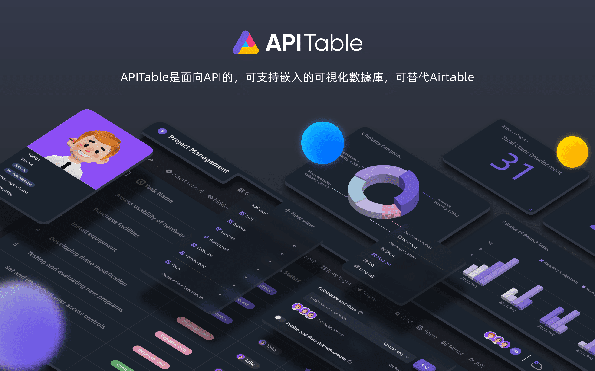
    </a>
</p>

<p align="center">
    <!-- Gitpod -->
    <a target="_blank" href="https://gitpod.io/#https://github.com/apitable/apitable">
        
    </a>
    <!-- NodeJS -->
    
    <!-- Java -->
    
    <!-- hub.docker.com-->
    <a target="_blank" href="#安裝">
        
    </a>
    <!-- Github Release Latest -->
    <a target="_blank" href="https://github.com/apitable/apitable/releases/latest">
        
    </a>
    <!-- Render -->
    <a target="_blank" href="https://render.com/deploy?repo=https://github.com/apitable/apitable">
        
    </a>
    <br />
    <!-- LICENSE -->
    <a target="_blank" href="https://github.com/apitable/apitable/blob/main/LICENSE">
        
    </a>
    <!-- Discord -->
    <a target="_blank" href="https://discord.gg/zYWYTHXR4f">
        
    </a>
    <!-- Twitter -->
    <a target="_blank" href="https://twitter.com/apitable_com">
        
    </a>
    <!-- Github Action Build-->
    <a target="_blank" href="https://github.com/apitable/apitable/actions/workflows/build.yaml">
        
    </a>
    <!-- Better Uptime-->
    <a target="_blank" href="https://apitable.betteruptime.com/">
        
    </a>
</p>

<p align="center">
  <a href="../../../README.md">English</a>
  | 
  <a href="../fr-FR/README.md">Français</a>
  | 
  <a href="../es-ES/README.md">Español</a>
  | 
  <a href="../de-DE/README.md">Deutsch</a>
  | 
  <a href="../zh-CN/README.md">简体中文</a>
  | 
  繁體中文
  | 
  <a href="../ja-JP/README.md">日本語</a>
</p>

## ✨ 快速開始

如果您想馬上嘗試 APITable[^info]，歡迎前往 [apitable.com](https://apitable.com) 使用我們的線上版本。

如果您想演示 APITable 開源項目，可使用 [⚡️Gitpod Online Demo](https://gitpod.io/#https://github.com/apitable/apitable)。

如果您想要在本地或雲端計算環境中安裝 APITable ，請參閱 [💾 安裝](#安裝)

如果您想要配置本地開發環境，請參考我們的 [🧑‍💻開發者指南](./docs/contribute/developer-guide.md)

加入 [Discord](https://discord.gg/TwNb9nfdBU) 或 [Twitter](https://twitter.com/apitable_com) 以獲取我們的最新消息。
## 🔥 主要功能

<table>
  
  <tr>
    <th>
      <a href="#">Realtime Collaboration</a>
    </th>
    <th>
      <a href="#">自動生成表單</a>
    </th>

  </tr>

   <tr>
    <td width="50%">
      <a href="#">
        
      </a>
    </td>
    <td width="50%">
        <a href="#">
            
        </a>
    </td>
  </tr>

  <tr>
    <th>
      <a href="#">API-first Panel</a>
    </th>
    <th>
      <a href="#">無限跨表關聯</a>
    </th>
</tr>

 <tr>
    <td width="50%">
        <a href="#">
            
        </a>
    </td>
    <td width="50%">
      <a href="#">
        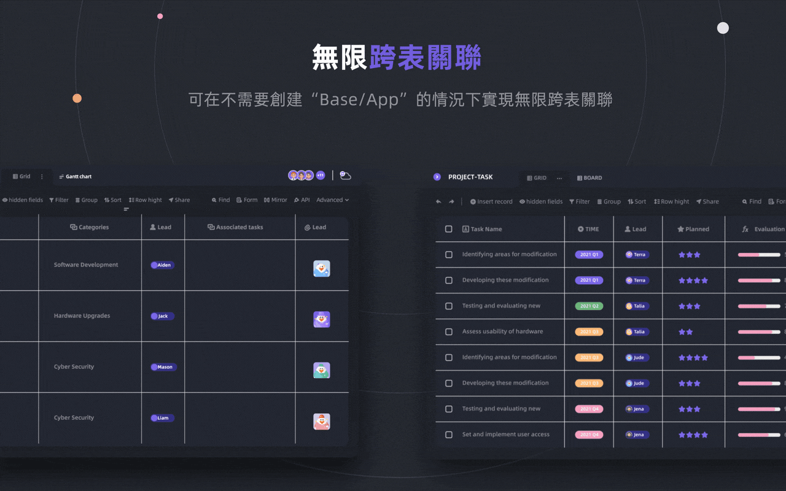
      </a>
    </td>
 </tr>

 <tr>
    <th>
      <a href="#">強大的行/列權限</a>
    </th>
    <th>
      <a href="#">Embed</a>
    </th>
  </tr>

 <tr>
    <td width="50%">
        <a href="#">
            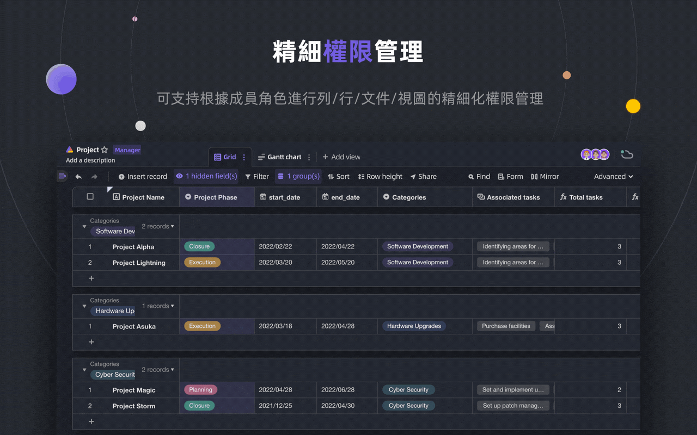
        </a>
    </td>
    <td width="50%">
        <a href="#">
            
        </a>
    </td>
  </tr>

</table>

無論個人還是企業，APITable 都提供了一系列令人驚喜的功能。

- 先進技術與開源
  - `實時合作` 允許多個用戶實時或與 `操作轉換(OT)` 算法同時進行編輯
  - 在 `中極其順暢、方便用戶、超快的數據庫電子表格接口<canvas> 渲染引擎`
  - Database native architecture: Changeset / Operation / Action / Snapshot and so on.
  - **100k+** 資料列數和實時協作
  - 完全 API 訪問，包括 `數據` 甚至 `元數據`
  - 單向/雙向表連結和 `無限交叉連結`
  - 社區友好的程式設計語言和框架，TypeScript ([NextJS](https://nextjs.org/) + [NestJS](https://nestjs.com/)) 和 Java ([Spring Boot](https://spring.io/projects/spring-boot))
- 美觀和齊全的多維表格UI界面
  - `CRUD`: 創建、閱讀、更新、刪除表、列和行
  - `字段操作`: 排序、過濾、分組、隱藏/取消隱藏、高度設置
  - `基於空間`：使用單獨的工作區代替基於應用/基礎的結構，使無限的表連結在一起成為可能
  - `黑暗模式` 和個性化主題定製
  - `7 種視圖類型`: 網格（數據表）/圖片庫/思維導圖/看板/全功能甘特圖/日曆等
  - 一鍵生成 API 界面
- Batteries included
  - 內置的 10 + 官方模板
  - Robot Automation and customization available.
  - BI 商業儀表板
  - One-click auto-generated form
  - 可共享和嵌入頁面
  - 支持多語言
  - 與 n8n.io / Zapier / Appsmith... 和更多集成
- 卓越的擴展性
  - 可擴展的 `小部件系統` ，包含超過 20 個官方開源部件
  - Customizable Graph & Chart & Dashboard
  - 可自定義數據列類型
  - Customizable Formulas
  - 可定製自動機器人操作
- 企業級權限
  - `鏡像`，將視圖鏡像化以實現權限至每列
  - 通過非常簡單的操作激活 `列權限`
  - 文件夾/子文件夾/文件權限
  - 樹結構文件夾和自定義節點(文件)
  - 團隊管理 & 組織結構
- 企業級功能
  - SAML
  - 單點登錄（SSO）
  - 審計
  - 數據庫自動備份
  - Data Exporter
  - 水印
- ....

可擴展的部件和插件，您可以自由添加更多功能。

## 💥 用例

為什麼您必須知道 APITable 並作為你的下一個軟件？

- 作為超級管理軟件
  - Flexible Project Management & Tasks / Issues Management.
  - 市場領先的管理軟件
  - 最靈活和可連接CRM
  - 最靈活的商業智能 (BI)
  - People-Friendly Forms and Surveys
  - Flexible ERP.
  - 低代碼甚至無代碼平台
  - ...及更多，APITable 將 1000 個軟件放入您的口袋中
- As a visual database infrastructure
  - **嵌入** APITable 圖表到您自己的軟件中
  - 使用 REST API 可視化數據庫
  - 管理員儀表板
  - 中央配置管理
  - 作為多用途的企業數據庫並 **連接您所有的** 軟件
  - ...及更多，APITable 連接到一切
- 此外，它是開源和可擴展的

## 💞 API 導向

#### API 面板

點擊右角的 `API` 按鈕將顯示 API 面板

#### SQL式查詢

APITable 將提供一個數據表查詢語言(DQL)來查詢您的數據庫電子表格內容。

## 💝 Embed-friendly

#### 分享和嵌入

分享您的數據表或文件夾。 通過複製和粘貼HTML腳本嵌入它們。

#### Enterprise-ready Embedding

[APITable.com](https://apitable.com) 為商業化用户提供更多嵌入功能。

## 安裝

開始之前，您需要準備：
* 已安裝 [docker](https://docs.docker.com/engine/install/) 和 [docker-compose v2](https://docs.docker.com/engine/install/) 的環境
* 推薦硬體配備 4 CPUs/8GB RAM 或更多
* A bash shell with basic utilities like curl installed.
* 本項目尚未對原生 arm64 (apple silicon) 進行最佳化，可能存在效能問題

如要使用 docker compose 安裝 APITable，打開命令行界面程式，並運行：

```
curl https://apitable.github.io/install.sh | bash
```

然後在您的瀏覽器中打開 [http://localhost:80](http://localhost:80) 訪問它。

我們還提供了一個基於 [pm2](https://pm2.keymetrics.io/) 的一體化鏡像，用於演示或測試目的（不推薦用於企業或生產用途）：

```bash
sudo docker run -d -v ${PWD}/.data:/apitable -p 80:80 --name apitable apitable/all-in-one:latest
```

根據您的環境，您可能需要等待幾分鐘才能啟動所有服務。 此映像僅適用於 amd64 (x86_64)，您可能會在 arm64 或 apple silicon 上遇到非常糟糕的性能。

如果您想要配置本地開發環境，請參考我們的 [🧑‍💻開發者指南](./docs/contribute/developer-guide.md)

## 🧑‍💻 作出貢獻

歡迎並感謝您有興趣為APITable作出貢獻！

In addition to writing code, there are many ways for you to contribute.

您可以：
- 加入 [Crowdin Translation Project](https://crowdin.com/project/apitablecode/invite?h=f48bc26f9eb188dcd92d5eb4a66f2c1f1555185) 並協助翻譯
- 創建 [Issues](https://github.com/apitable/apitable/issues/new/choose)
- 關注我們的 [Twitter](https://twitter.com/apitable_com)
- 創建 [文檔](./docs)
- [Contributing Code](./docs/contribute/developer-guide.md)


比如下面的：
- Join [Crowdin Translation Project](https://crowdin.com/project/apitablecom/invite?h=4a985ea532a01d973acc03f2f1c960951693577)
- 創建 [Issues](https://github.com/apitable/apitable/issues/new/choose)
- 關注我們的 [Twitter](https://twitter.com/apitable_com)
- 創建 [文檔](./docs)
- [Contributing Code](./docs/contribute/developer-guide.md)


你可以閱讀這個存儲庫的 [貢獻指南](./CONTRIBUTING.md) 來學習如何貢獻。

這是一個快速指南來幫助您為API做出貢獻。


### 開發環境

學習配置您的本地開發環境，請參考我們的 [🧑‍💻開發者指南](./docs/contribute/developer-guide.md) 。

### Git workflow 簡介

這是 APITable 的 git workflow：

1. 創建一個 Issue 並描述您想要的功能 -> [APITable Issue](https://github.com/apitable/apitable/issues)
2. 克隆此項目 -> [Fork APIable project](https://github.com/apitable/apitable/fork)
3. 創建您的功能分支(`git checkout -b my-new-feature`)
4. 提交您的更改(`git commit -am 'Add some features'`)
5. 發佈分支 (`git push origin my-new-feature`)
6. 創建新的拉取請求 -> [創建跨分支的拉取請求](https://github.com/apitable/apitable/compare)

### 工作約定

APITable 使用以下常見約定：

- 我們的 Git 分支模型是什麼？ [Gitflow](https://nvie.com/posts/a-successful-git-branching-model/)
- 如何在克隆項目上進行協作？ [Github Flow](https://docs.github.com/en/get-started/quickstart/github-flow)
- 如何寫出好的提交消息？ [Conventional Commits](https://www.conventionalcommits.org/)
- 我們的更新日誌格式是什麼？ [Keep Changelog](https://keepachangelog.com/en/1.0.0/)
- 如何進行版本控制和標記？ [Semantic Versioning](https://semver.org/)
- 我們的 Java 編碼規範是什麼？ [Java 編碼準則](https://github.com/alibaba/Alibaba-Java-Coding-Guidelines) | [Intellij IDEA 插件](https://plugins.jetbrains.com/plugin/10046-alibaba-java-coding-guidelines)
- 我們的 TypeScript 編碼規範是什麼？ -> [TypeScript 樣式指南](https://google.github.io/styleguide/tsguide.html) | [ESLint](https://www.npmjs.com/package/@typescript-eslint/eslint-plugin)

### Documentations

- [幫助中心](https://help.apitable.com/)
- [👩‍💻 開發者中心](https://developers.apitable.com/)
  - [🪡 REST API](https://developers.apitable.com/api/introduction/)
  - [小程序 SDK](https://developers.apitable.com/widget/introduction/)
  - [Scripting Widget](https://developers.apitable.com/script/introduction/)
- [Design System](https://figma.com/@apitable)

## 🛣 Roadmap

可參考[路線圖](https://apitable.com/roadmap)

### 未來的功能

- 重碼生成器介面
- Embeddable 3rd party documentation components
- SQL-like Domain-Specific Languages
- As an IdP
- 進階自動化機器人
- Web 3 功能
- ...

### 託管版本和企業版本提供高級功能

- As an IdP;
- SAML
- Single-Sign-On
- 審計
- 數據庫備份
- 與 ChatGPT, Zapier, Slack, Google Workspace…… 整合
- 水印

For more information on our product, including enterprise self-hosted license, please contact us at <support@apitable.com> or [book a demo](https://apitable.com/share/shrdaGGppsfg3pjQLXALG?fldy5ZmHYGZx2=salesteam@apitable.com).

## 👫 獲得參與

### 🌏 我們為什麼要創建 APITable 和 開源？

- 我們認為 `數據庫是所有軟件` 的基石
- 我們相信，`為每個人製作一個具有豐富易用使用者介面的可視化資料庫`可以降低軟體行業的難度並提高全球數位化的採用率
- 我們認為開放 `APITable` 的源碼可以 `推動人類發展`

### 我們正在招聘遠程開發者！

我們總是為APITable尋找優秀人才：

- **後端開發者**: 擁有 NestJS, TypeScript, Spring Boot, Java, SQL, Kubernetes, Terraform 的經驗。 熱衷於編寫高質量的程式碼，並喜歡清晰的文檔和單元測試。
- **前端開發者**: 擁有 React, NextJS, TypeScript, WebPack 的經驗。 熱衷於編寫高質量的程式碼，並喜歡清晰的文檔和單元測試。
- **全棧開發者**: 擁有 React, NextJS, TypeScript, WebPack 的經驗。 And you like to write high quality code with clear documentation and unit tests.

不論任何時間或條件，如果您想加入 APITable 的團隊，請傳送您的個人 CV 到 <talent@apitable.com>。

## 📺 Screenshot

<p align="center">
    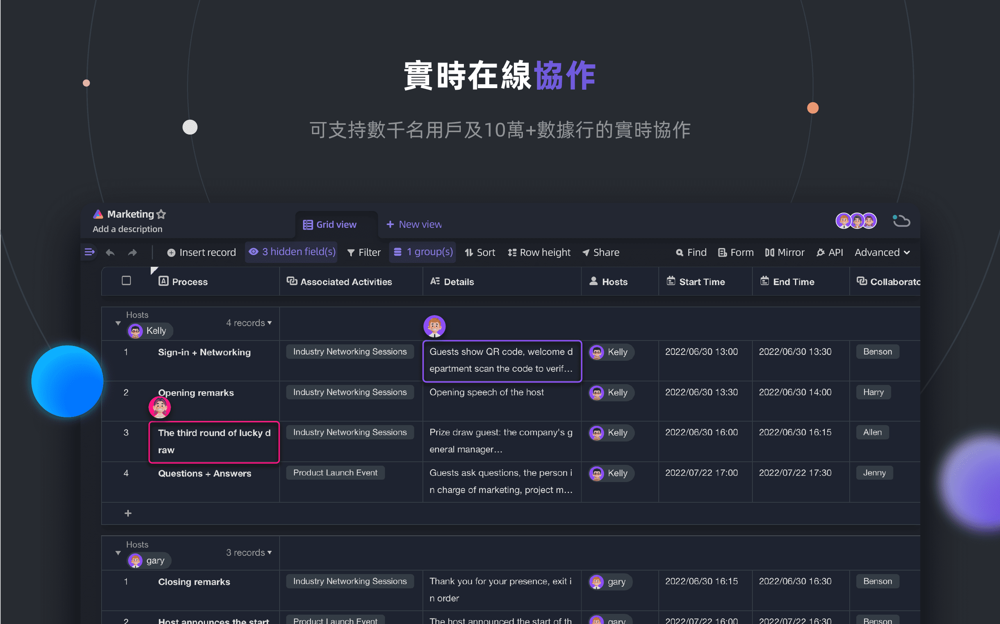
</p>
<p align="center">
    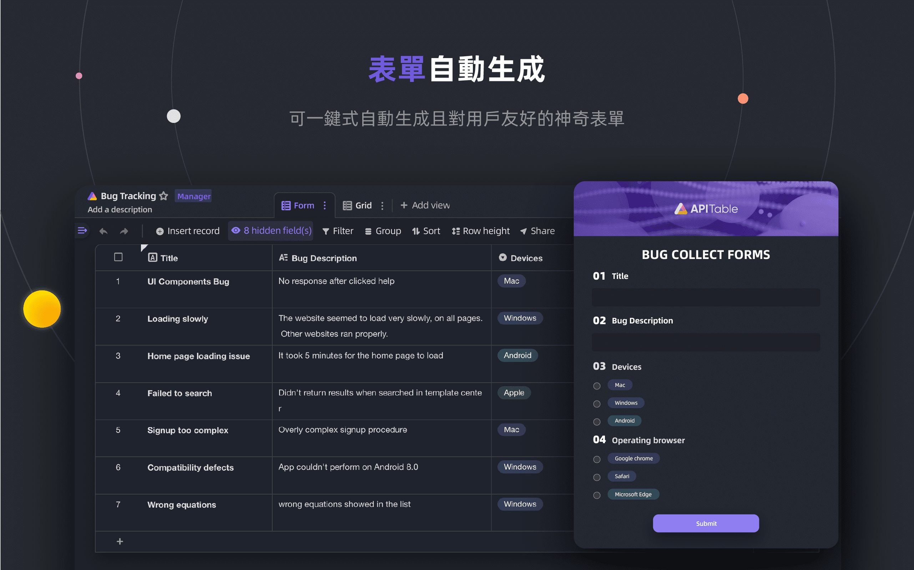
</p>
<p align="center">
    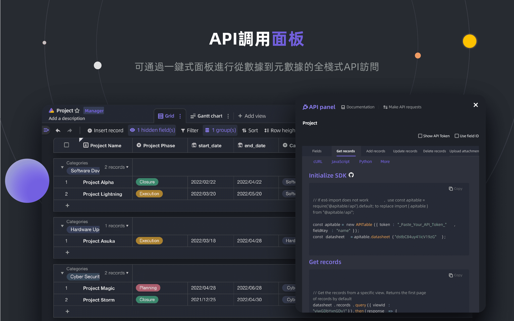
</p>
<p align="center">
    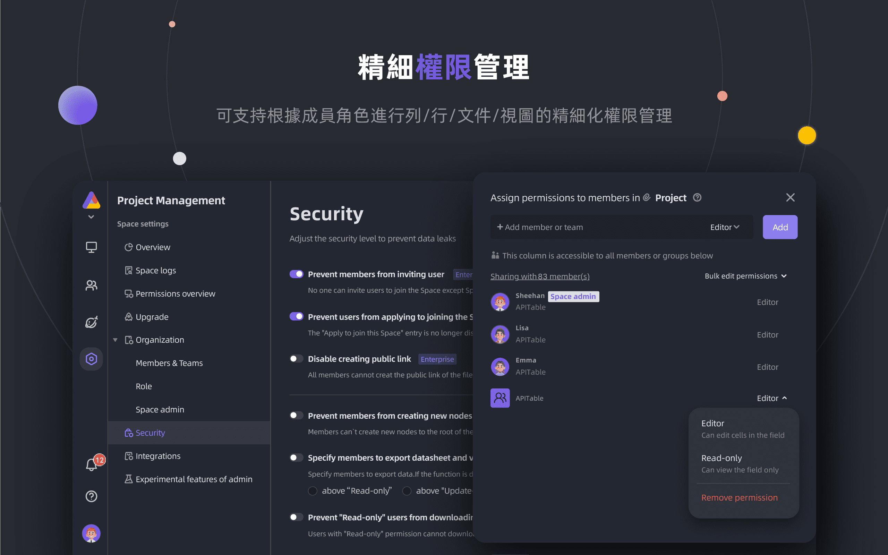
</p>
<p align="center">
    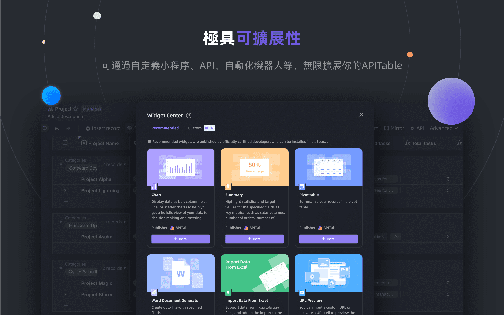
</p>
<p align="center">
    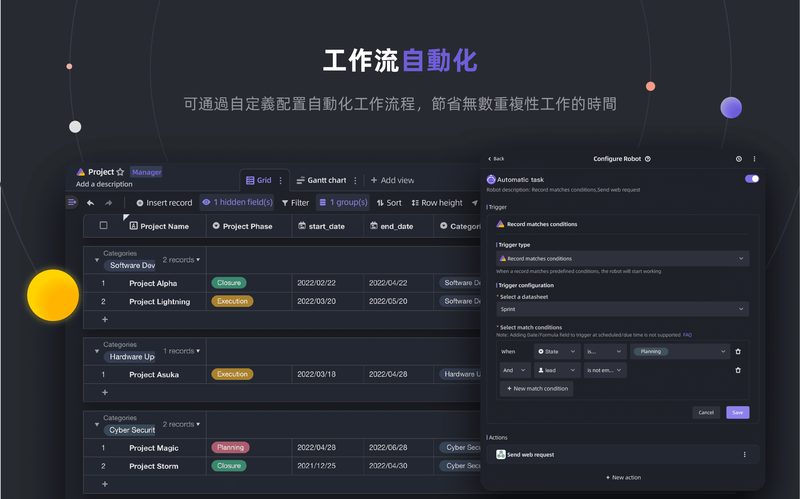
</p>
<p align="center">
    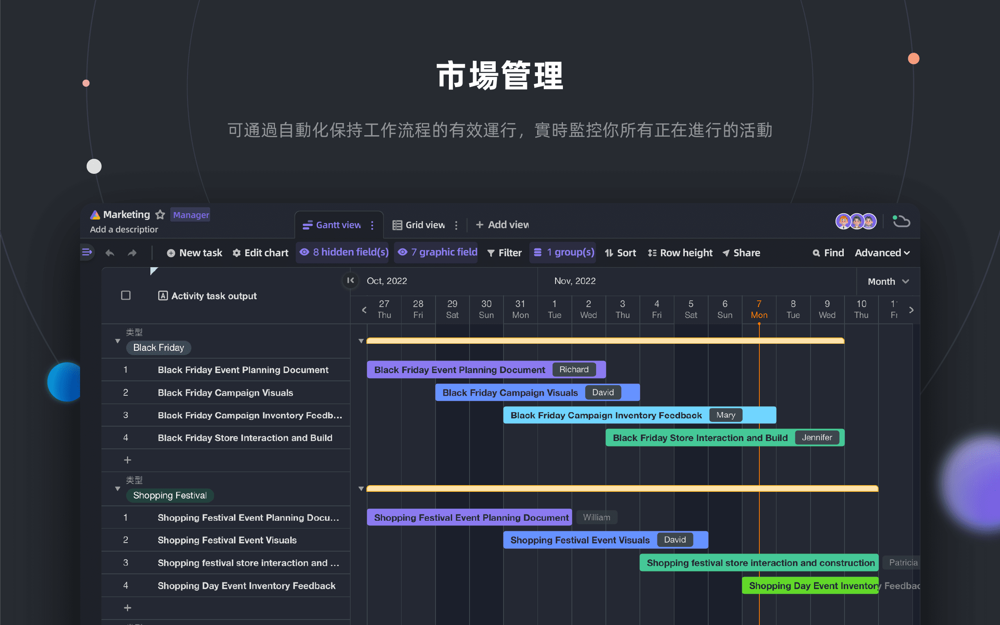
</p>
<p align="center">
    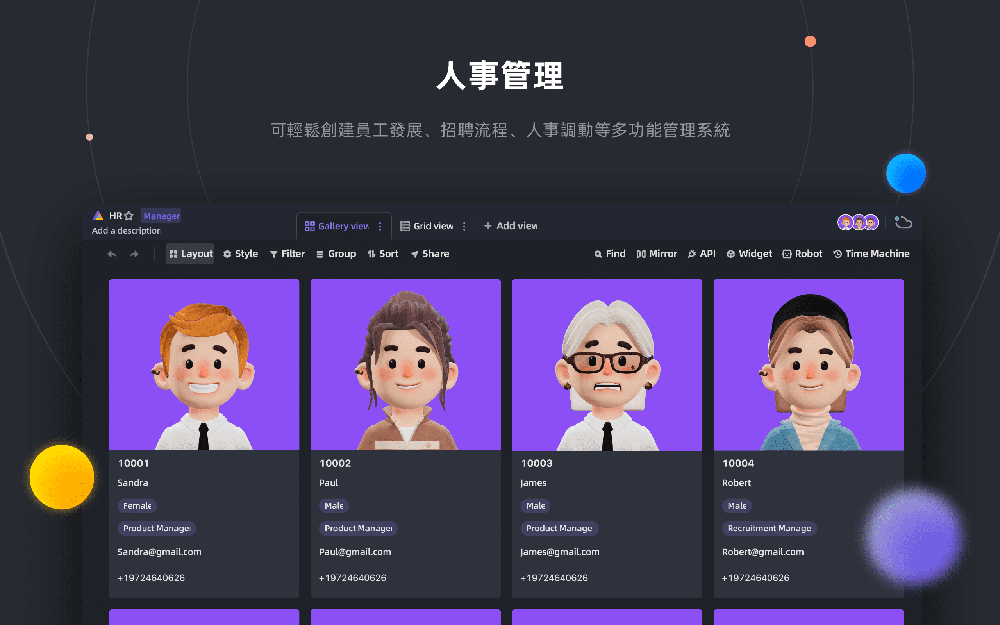
</p>
<p align="center">
    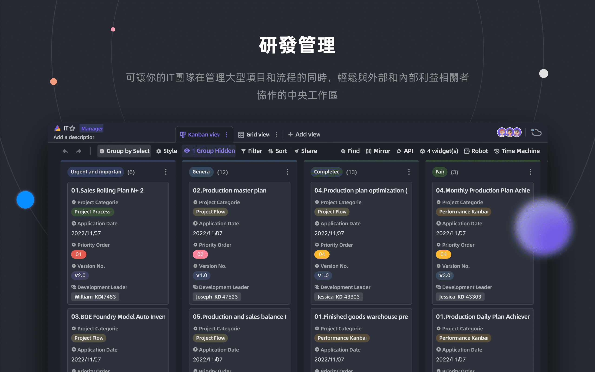
</p>
<p align="center">
    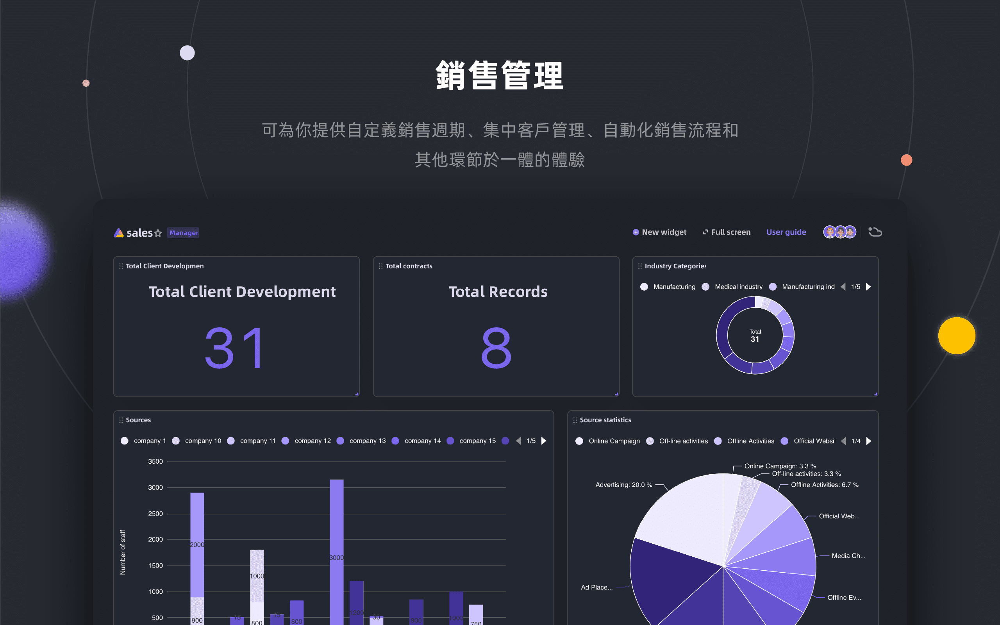
</p>

## 🥰 許可證

> 此存儲庫包含 APITable 開源版本的原始程式碼，該版本在 AGPL 下發布。
> 
> 如果您想運行自己的 APITable 或為開發做出貢獻，那麼這裡就是您的最佳選擇。
> 
> 詳情請參閱 [開源許可證](./LICENSING.md)
> 
> 如果您想在線使用 APITable，則無需運行此代碼，我們在 [APITable.com](https://apitable.com) 提供 APITable 的雲端託管版本，該版本針對全域加速器進行了最佳化。

<br/>

[^info]: 使用 AGPL-3.0 許可證。 由 [APITable Ltd](https://apitable.com) 設計。
