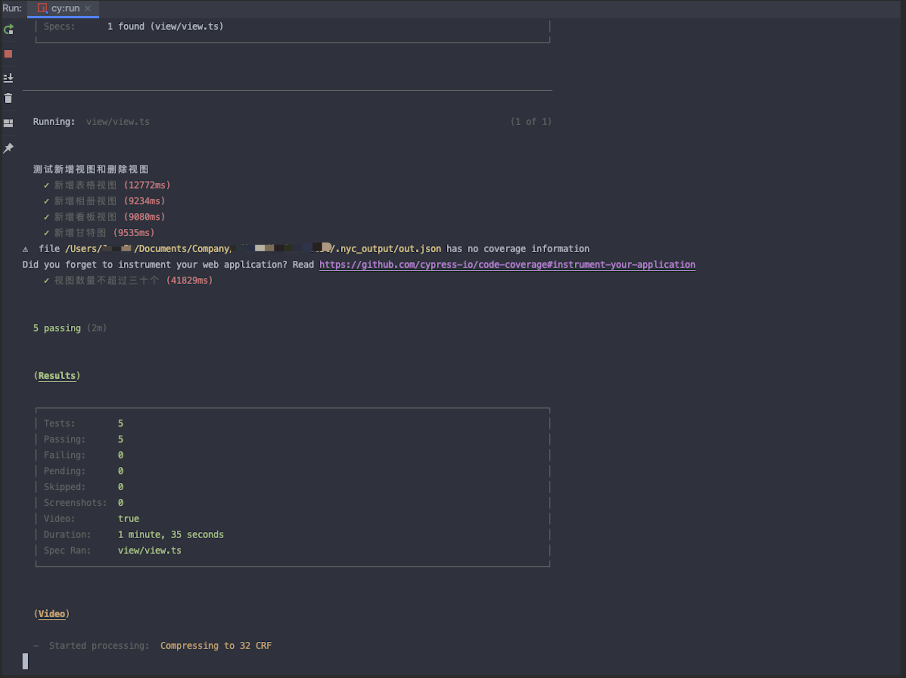
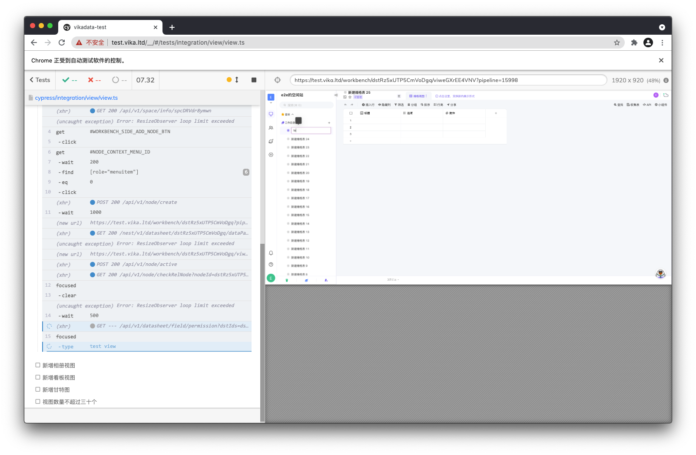

# datasheet-test

This project is an automation test project, providing automation test services for the main project. The project is built based on Cypress, for the use of Cypress can refer to the official documentation, here do not repeat.

## Project Structure

- Coverage code coverage test results can be viewed by opening the HTML file directly

- cypress The master file for writing tests
    - The integration is a folder for test cases, the file supports typescript, it is recommended to have one folder for each functional module. For example, for test view related, the folder name is view and other test cases are written in this folder.
    - plugin Cypress supports a variety of plugins, both official and from third-party developers, see [here](https://docs.cypress.io/plugins/directory)
    - support stores extensions and tool files
        - It is recommended to write the test files in integration and put the dom anchors and common functions used in the test cases under utils file to facilitate the maintenance of the test cases later. It is recommended to create a new file with the same name as the test module
        - For example, if our test cases require login operation to get a cookie, we can encapsulate this operation into a global command, such as The instruction is login, you can use cy.login() directly when you use it. For details, please refer to the official documentation, or the examples already written
        - common stores some of the common functions, and later consider putting them in command to manage
  
## How to start a project
    - yarn cypress:open can start the browser locally, and it is recommended to use the command when writing test cases
    - yarn cy:run runs in headless mode and generates a report at the end of the command, which can be used with CI

