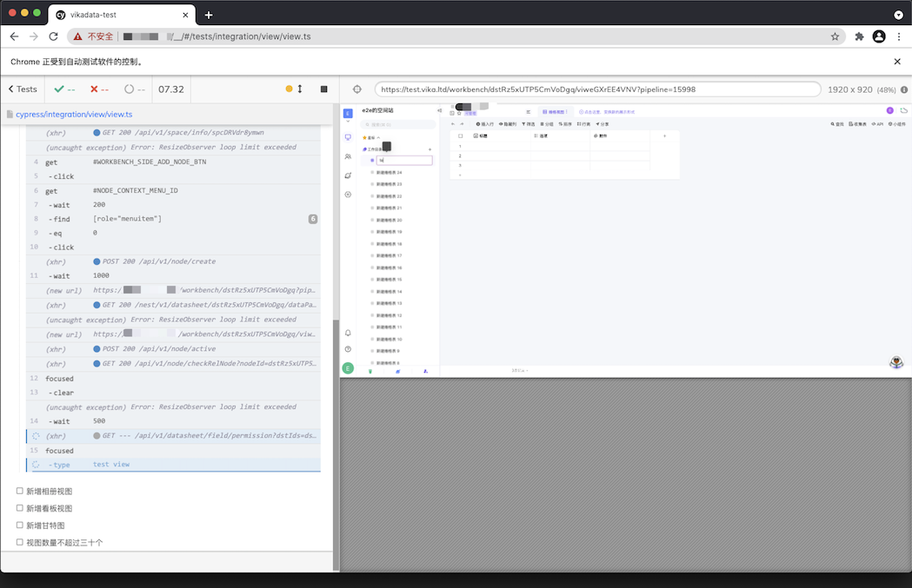

# datasheet-test

本项目为自动化测试项目，为主项目提供自动化测试服务。项目基于 Cypress 搭建，对于 Cypress 的使用可以参考官方文档，这里不做赘述。

## 项目结构

- coverage 代码覆盖率的测试结果，可以通过 HTML 文件直接打开查看

- cypress 编写测试的主文件
    - integration 存放测试用例的文件夹，文件支持 typescript，建议一个功能模块一个文件夹。比如测试视图相关，文件夹名称为 view，在这个文件夹下编写其他的测试用例。
    - plugin Cypress 支持多种插件，有官方提供的，也有第三方开发者提供的，具体可以参考[这里](https://docs.cypress.io/plugins/directory)
    - support 存放的为扩展文件和工具文件
        - utils 建议在 integration 中编写测试文件时，把测试用例中需要用到的 dom 锚点，公用的函数等放到 utils 文件下，方便后期对测试用例的维护。新建的文件建议和测试模块同名
        - commands Cypress 除了提供官方的全局 API，还可以在这里配置自己常用的 API。比如我们的测试用例都需要进行登录操作，获取到 Cookie，对于这个操作就可以封装成一个全局指令，比如
            该指令为 login，使用的时候就可以直接用 cy.login()。具体写法可以看官方文档，或者已经写好的例子
        - common 存放了部分公用的函数，后期考虑放进 command 里管理
  
## 如何启动项目
    - yarn cypress:open 可以在本地启动浏览器，建议在写测试用例时用命令
    - yarn cy:run 采用无头模式运行，命令结束后会生成报告，可以配合 CI 使用

## TODO 
- 集成到 CI 
- 测试覆盖率报告

