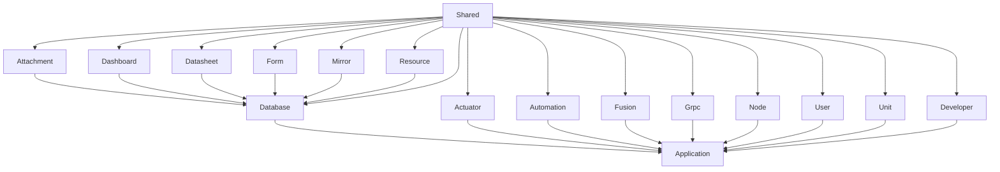

# Room Server

## Structure


`shared module` is a shared and global module that other modules depend on in default.
## Description

TypeScript server project based on [Nest](https://github.com/nestjs/nest) framework

## Learning Materials

> * [awesome-nestjs](https://github.com/juliandavidmr/awesome-nestjs)

## Dependencies
> * [mysql](https://github.com/mysqljs/mysql) mysql client
> * [typeorm](https://github.com/typeorm/typeorm) database object storage framework
> * [redis](https://github.com/luin/ioredis) redis client
> * [redis-lock](https://github.com/errorception/redis-lock) redis key lock
> * [rxjs](https://github.com/ReactiveX/RxJS) JavaScript responsive programming
> * [socket.io-client](https://github.com/socketio/socket.io) socket.io for nodejs client
> * [socket.io-redis](https://github.com/socketio/socket.io-redis) socket.io for redis client
> * [class-transformer](https://github.com/typestack/class-transformer) JSON to object, used with reflect-metadata
> * [class-validator](https://github.com/typestack/class-validator) validation framework
> * [rimraf](https://github.com/isaacs/rimraf) The UNIX command rm -rf for nodejs
> * [winston](https://github.com/winstonjs/winston) log framework for nodejs

## Installation

```bash
yarn install
```

## Running the app

```bash
# basic mode
$ yarn start

# watch mode
$ yarn start:dev

# debug/watch mode
$ yarn start:debug

# production mode, remember to execute `yarn build` before running
$ yarn start:prod
```

## Test

```bash
# you can use `pnpm` or `npx`, the examples below use `pnpm`.
# unit tests
$ yarn run test

# e2e tests
$ yarn run test:e2e

# test coverage
$ yarn run test:cov
```
## Environment variables
See [env/.env.defaults](./env/.env.defaults) for more details

### Define local variables for local development
You can create a `.env.development.local` file in the `env` folder to define environment variables for local development. This file is typically ignored by  `Git`, so you can use it to store sensitive or environment-specific information that you don't want to commit to your repository.

If a variable is defined in both the `.env.development.local` file and the `.env.defaults` file, the value in the `.env.development.local` file will take precedence. This allows you to override the default values for certain variables when developing locally, while still maintaining a set of default values that can be used in other environments.

### Deployment environment:
`process.env.NODE_ENV`
enum: 'development' | 'production'

### backend-server(JAVA) service api address
`process.env.BACKEND_BASE_URL`
default: <http://localhost:8081/api/v1/>

### redis configuration
redis host
`process.env.REDIS_HOST`

redis port
`process.env.REDIS_PORT`

redis password
`process.env.REDIS_PASSWORD`

redis db
`process.env.REDIS_DB`

### Service exposed port

`process.env.PORT`
default: 3333

## Logging Framework

> * [winston](https://github.com/winstonjs/winston)
> * [bunyan](https://github.com/trentm/node-bunyan)
> * [log4js](https://github.com/log4js-node/log4js-node)
> * [nestjs-Logger](https://docs.nestjs.com/techniques/logger)
