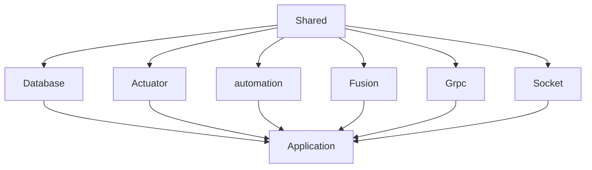

# Room Server

## Structure


TODO(Troy): split `Database module` into multiple submodules.
`shared module` is a shared and global module that other modules depend on in default.
## Description

TypeScript server project based on [Nest](https://github.com/nestjs/nest) framework

## Learning Materials

> * [awesome-nestjs](https://github.com/juliandavidmr/awesome-nestjs)

## Dependencies
> * [mysql](https://github.com/mysqljs/mysql) mysql client
> * [typeorm](https://github.com/typeorm/typeorm) database object storage framework
> * [redis](https://github.com/luin/ioredis) redis client
> * [redis-lock](https://github.com/errorception/redis-lock) redis key lock
> * [rxjs](https://github.com/ReactiveX/RxJS) JavaScript responsive programming
> * [socket.io-client](https://github.com/socketio/socket.io) socket.io for nodejs client
> * [socket.io-redis](https://github.com/socketio/socket.io-redis) socket.io for redis client
> * [class-transformer](https://github.com/typestack/class-transformer) JSON to object, used with reflect-metadata
> * [class-validator](https://github.com/typestack/class-validator) validation framework
> * [rimraf](https://github.com/isaacs/rimraf) The UNIX command rm -rf for nodejs
> * [winston](https://github.com/winstonjs/winston) log framework for nodejs

## Installation

```bash
yarn install
```

## Running the app

```bash

# watch mode
$ yarn start:room-server

# production mode
$ yarn start:prod
```

## Test

```bash
# unit tests
$ npm run test

# e2e tests
$ npm run test:e2e

# test coverage
$ npm run test:cov
```
## Environment variables

Deployment environment:
`process.env.NODE_ENV`
enum: 'development' | 'production'

## JAVA service api address

`process.env.HTTP_SERVER_HOST`
default: <http://integration.apitable.com/>

## redis configuration

redis port
`process.env.REDIS_PORT`

redis password
`process.env.REDIS_PASS`

redis db
`process.env.REDIS_DB`

## Service exposed port

`process.env.ROOM_PORT`
default: 3333

## Logging Framework

> * [winston](https://github.com/winstonjs/winston)
> * [bunyan](https://github.com/trentm/node-bunyan)
> * [log4js](https://github.com/log4js-node/log4js-node)
> * [nestjs-Logger](https://docs.nestjs.com/techniques/logger)
